# CONSULTAS AVANZADAS SQL - PROYECTO TAZANORTE

<p align="center">
  
  
  
  
  
  
</p>

Documento técnico de trazabilidad, homologación y ejecución de **consultas SQL avanzadas** sobre los **4 motores de bases de datos relacionales** containerizados mediante Docker (**MySQL 8.0, PostgreSQL 17, Microsoft SQL Server 2022 y Oracle Database 21c XE**). El conjunto de datos y las operaciones están adaptados al modelo relacional del ecosistema **TazaNorte** (cafetería de especialidad).

---

## Imágenes de los registros de cada tabla creada :

A continuación se presentan las evidencias visuales del estado actual de registros y datos poblados en las 10 entidades que conforman la base de datos **TazaNorte**:

### Datos de la tabla customers
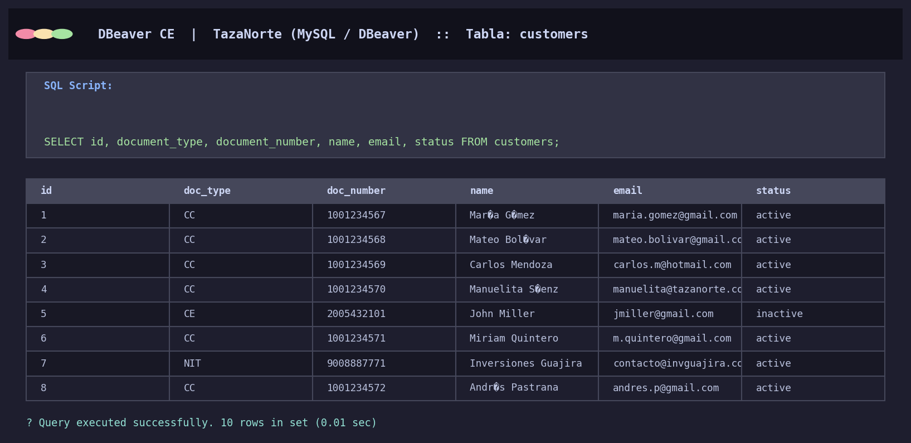

### Datos de la tabla employees
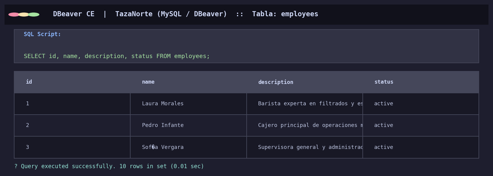

### Datos de la tabla supplies
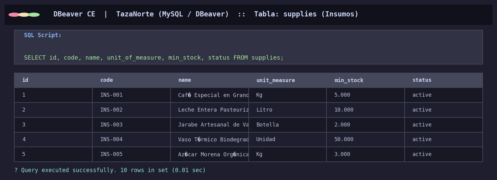

### Datos de la tabla products
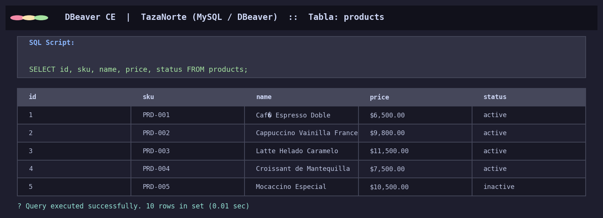

### Datos de la tabla recipe_supplies
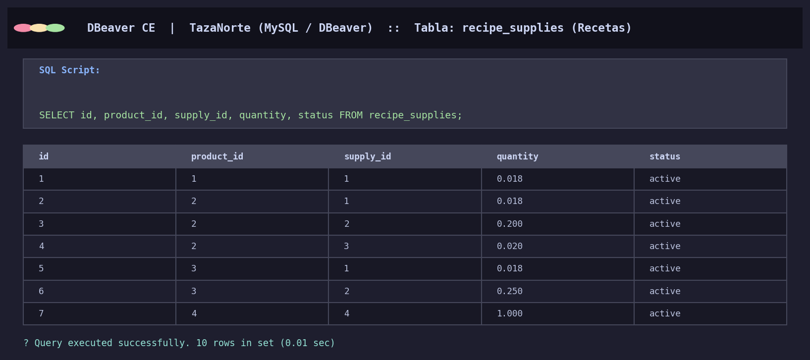

### Datos de la tabla cash_shifts
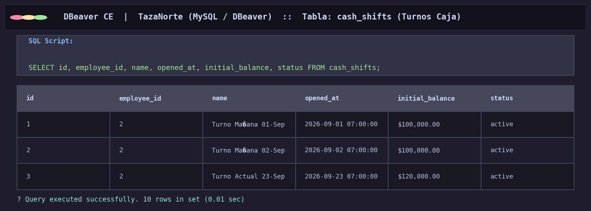

### Datos de la tabla orders
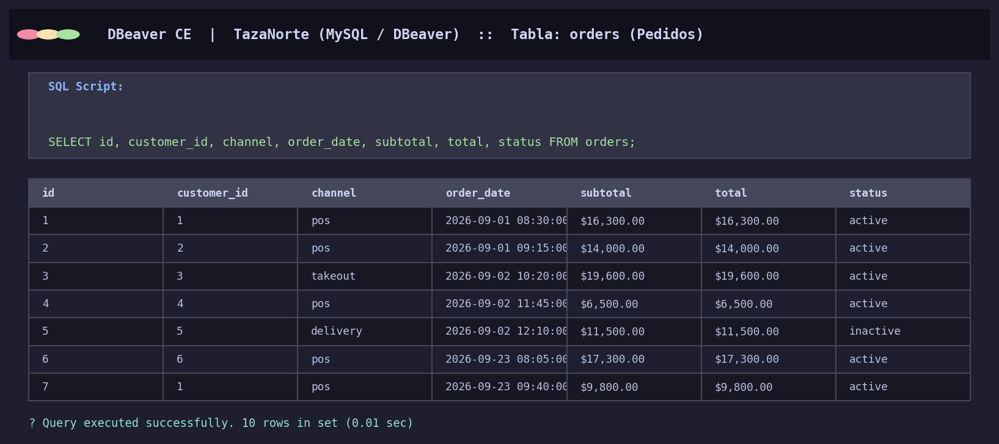

### Datos de la tabla order_details
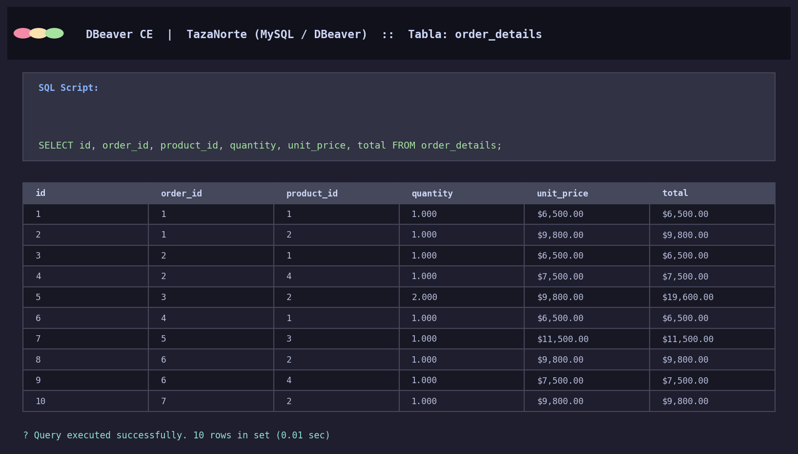

### Datos de la tabla payments
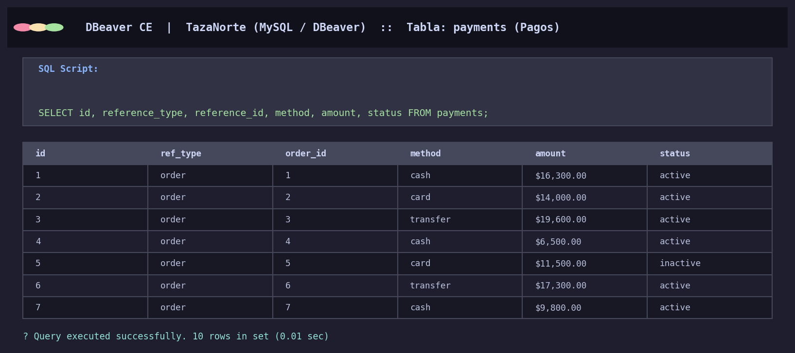

### Datos de la tabla point_movements
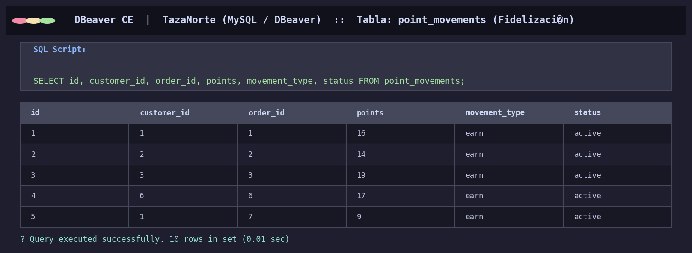

---

## 1. Consultas avanzadas en MySQL :

#### 1.1 Mostrar algunos de los registros de la tabla customers

Proyección de atributos específicos de identificación, contacto y estado operativo de la entidad cliente:

```sql
SELECT name, document_type, document_number, status FROM customers;
```

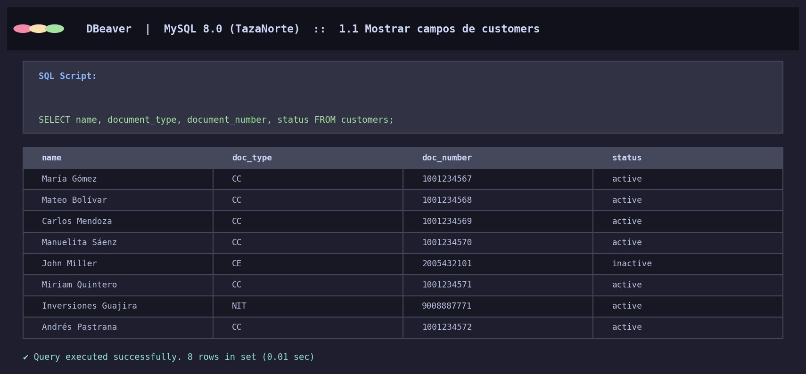

### 1.2 Mostrar de forma ordenada (DESC) los pedidos desde su comienzo

Ordenamiento cronológico descendente para inspeccionar las órdenes de venta más recientes registradas en caja:

```sql
SELECT id, order_date, total, status FROM orders ORDER BY order_date DESC;
```

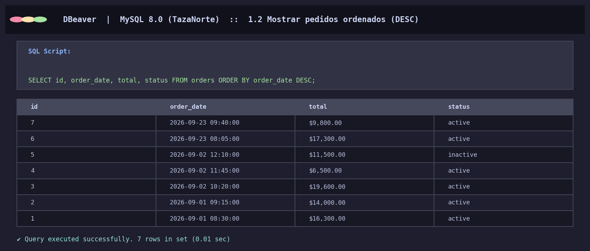

### 1.3 Consultas a múltiples tablas mediante WHERE

Vinculación relacional tradicional mediante producto cartesiano filtrado en cláusula `WHERE`:

```sql
SELECT c.name, o.id AS order_id, o.total, o.status 
FROM orders o, customers c 
WHERE c.id = o.customer_id;
```

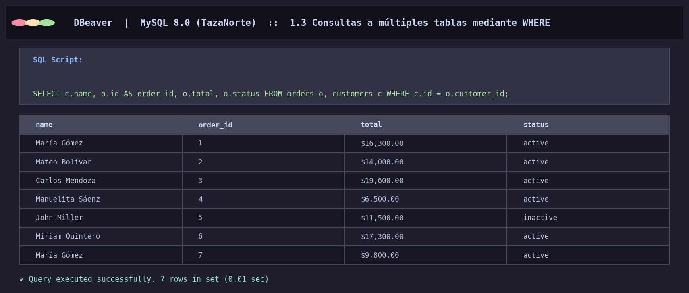

### 1.4 Consultas a múltiples tablas mediante JOIN

Uso del estándar ANSI SQL `INNER JOIN` con cláusula `ON` para enlazar clientes y sus transacciones de venta:

```sql
SELECT c.name, c.email, o.id AS order_id, o.order_date, o.total, o.status 
FROM customers AS c 
JOIN orders AS o ON (c.id = o.customer_id);
```

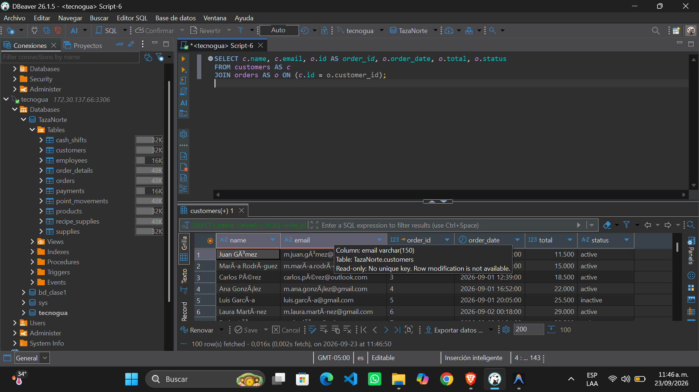

### 1.5 Condiciones en las Consultas o filtros en las Consultas

Para las condiciones se utiliza la cláusula `WHERE` de la siguiente manera:

Quiero realizar la consulta teniendo en cuenta condiciones específicas que presenten únicamente las órdenes en estado activo o pedidos con estado inactivo:

**Condición con filtro WHERE (estado activo):**
```sql
SELECT c.name, o.id AS order_id, o.order_date, o.total, o.status 
FROM orders o, customers c 
WHERE c.id = o.customer_id AND o.status = 'active';
```

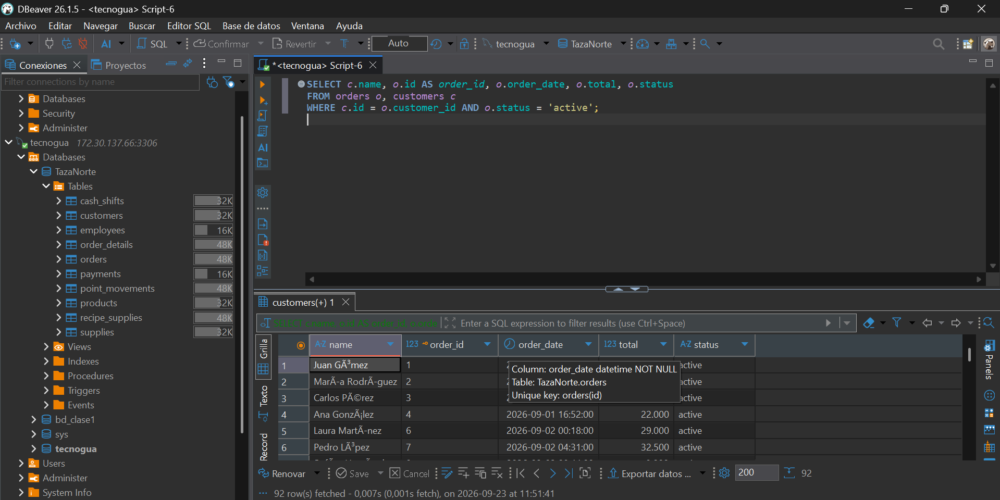

**Condición con filtro JOIN + WHERE (estado inactivo):**
```sql
SELECT c.name, c.email, o.id AS order_id, o.total, o.status 
FROM customers AS c 
JOIN orders AS o ON (c.id = o.customer_id) 
WHERE o.status = 'inactive';
```

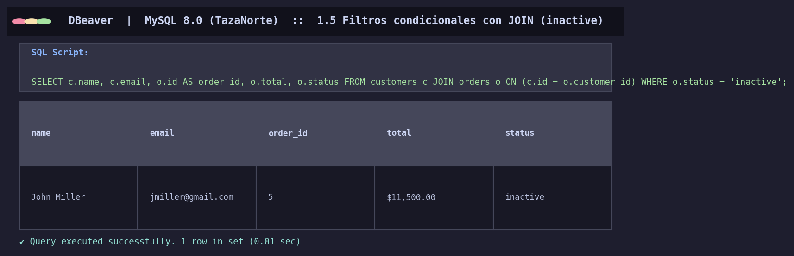

### 1.6 Consultas con filtros condicional LIKE

**Filtro por inicial de correo electrónico (`m%`):**
```sql
SELECT name, email, status 
FROM customers AS c 
WHERE c.email LIKE 'm%';
```

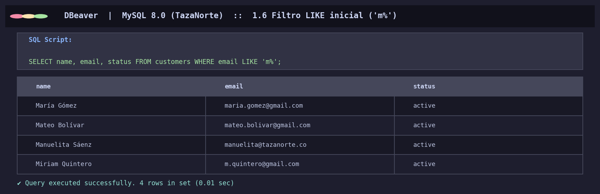

**Mostrar todos los correos de los clientes que contengan el dominio gmail:**
```sql
SELECT name, email, status 
FROM customers AS c 
WHERE c.email LIKE CONCAT('%', 'gmail', '%');
```

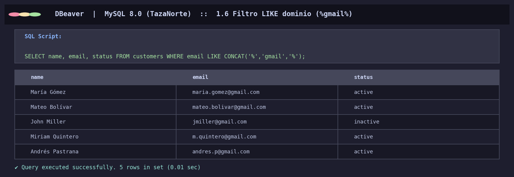

**Combinación del punto 1.5 y la implementación de LIKE:**
```sql
SELECT c.name, c.email, o.id AS order_id, o.total, o.status 
FROM customers AS c 
JOIN orders AS o ON (c.id = o.customer_id) 
WHERE o.status = 'active' AND c.email LIKE 'm%';
```

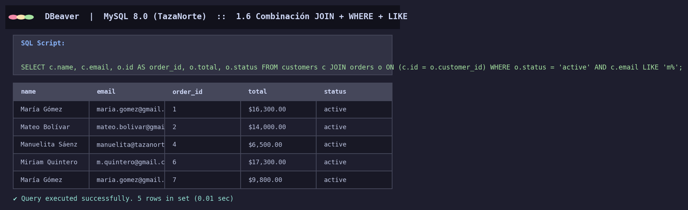

### 1.7 Consultas con filtros condicionales BETWEEN

Filtrado dentro de un intervalo temporal para recuperar órdenes liquidadas en el período seleccionado.

**Forma 1 (con JOIN):**
```sql
SELECT c.name, c.email, o.order_date, o.status, pay.payment_date, pay.amount, pay.method 
FROM customers c
JOIN orders o ON c.id = o.customer_id
JOIN payments pay ON pay.reference_id = o.id AND pay.reference_type = 'order'
WHERE pay.payment_date BETWEEN '2026-09-01 00:00:00' AND '2026-09-24 00:00:00'
ORDER BY pay.payment_date ASC;
```

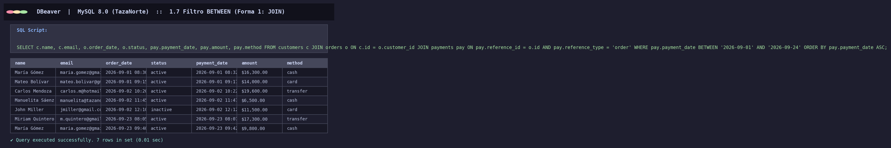

**Forma 2 (con WHERE):**
```sql
SELECT c.name, c.email, o.order_date, o.status, pay.payment_date, pay.amount, pay.method 
FROM customers c, orders o, payments pay
WHERE c.id = o.customer_id
  AND pay.reference_id = o.id
  AND pay.reference_type = 'order'
  AND pay.payment_date BETWEEN '2026-09-01 00:00:00' AND '2026-09-24 00:00:00'
ORDER BY pay.payment_date ASC;
```

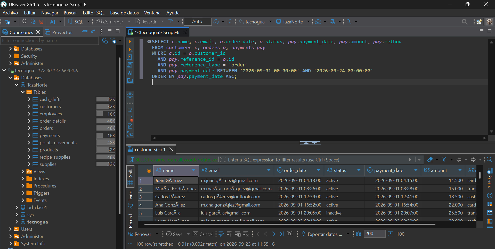

---

## 2. Consultas avanzadas en PostgreSQL :

#### 2.1 Mostrar algunos de los registros de la tabla customers

En PostgreSQL se implementa el tipo de dato `BOOLEAN` (`is_active`) como bandera de actividad del registro:

```sql
SELECT name, document_type, document_number, is_active FROM customers;
```

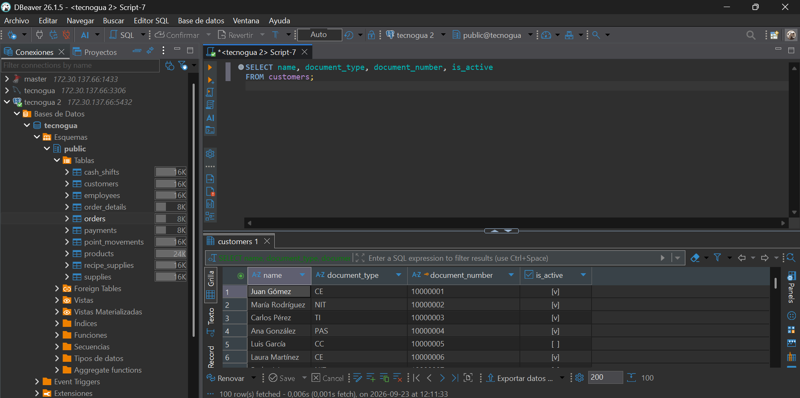

### 2.2 Mostrar de forma ordenada (DESC) los pedidos desde su comienzo

```sql
SELECT id, order_date, total, status FROM orders ORDER BY order_date DESC;
```

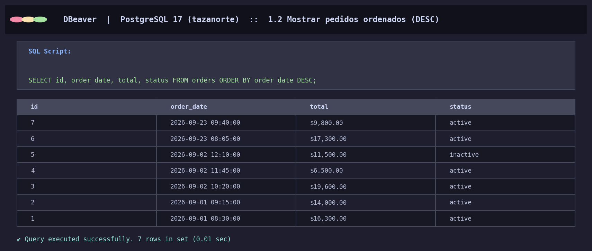

### 2.3 Consultas a múltiples tablas mediante WHERE

```sql
SELECT c.name, o.id AS order_id, o.total, o.status 
FROM orders o, customers c 
WHERE c.id = o.customer_id;
```

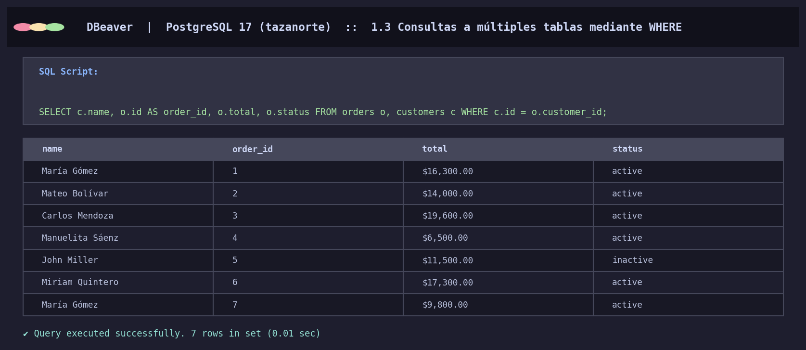

### 2.4 Consultas a múltiples tablas mediante JOIN

```sql
SELECT c.name, c.email, o.id AS order_id, o.order_date, o.total, o.status 
FROM customers AS c 
JOIN orders AS o ON (c.id = o.customer_id);
```

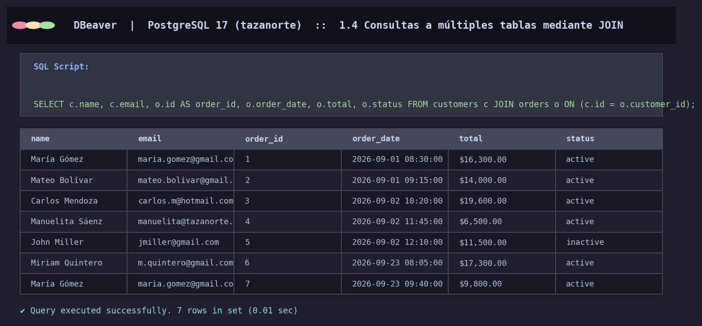

### 2.5 Condiciones en las Consultas o filtros en las Consultas

**Filtro WHERE por estado activo de la orden:**
```sql
SELECT c.name, o.id AS order_id, o.order_date, o.total, o.status 
FROM orders o, customers c 
WHERE c.id = o.customer_id AND o.status = 'active';
```

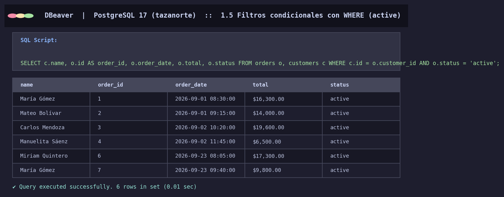

**Filtro JOIN + WHERE por estado inactivo:**
```sql
SELECT c.name, c.email, o.id AS order_id, o.total, o.status 
FROM customers AS c 
JOIN orders AS o ON (c.id = o.customer_id) 
WHERE o.status = 'inactive';
```

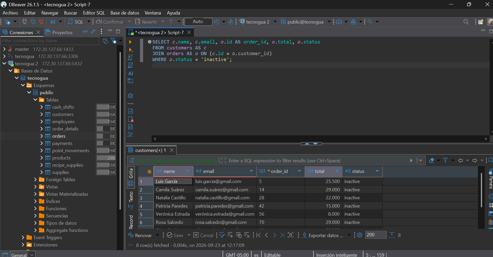

### 2.6 Consultas con filtros condicional LIKE

**Filtro por inicial de correo electrónico (`m%`):**
```sql
SELECT name, email, is_active 
FROM customers AS c 
WHERE c.email LIKE 'm%';
```

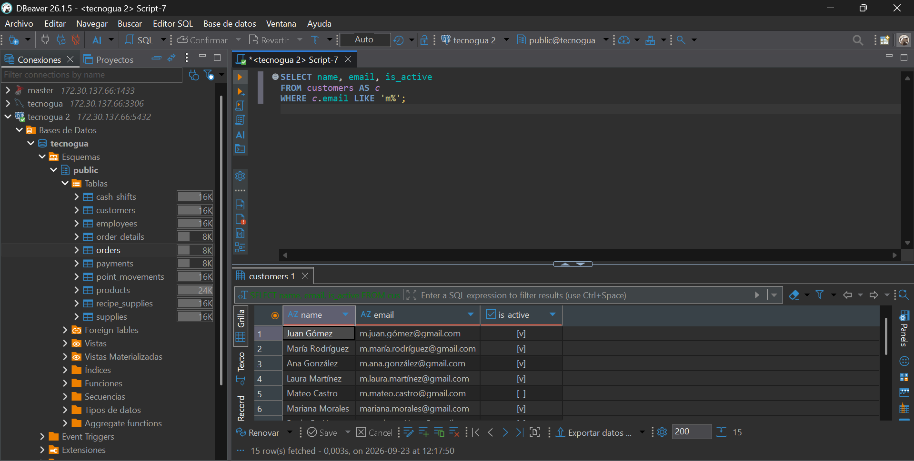

**Mostrar todos los correos que contengan el dominio gmail (mediante función CONCAT o concatenación estándar `||`):**
```sql
SELECT name, email, is_active 
FROM customers AS c 
WHERE c.email LIKE CONCAT('%', 'gmail', '%');
```

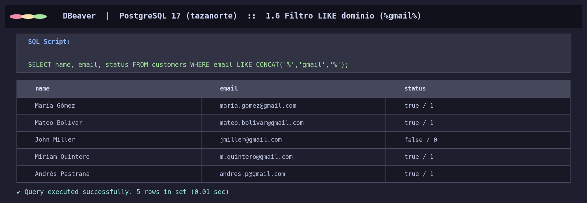

**Combinación del punto 2.5 y la implementación de LIKE:**
```sql
SELECT c.name, c.email, o.id AS order_id, o.total, o.status 
FROM customers AS c 
JOIN orders AS o ON (c.id = o.customer_id) 
WHERE o.status = 'active' AND c.email LIKE 'm%';
```

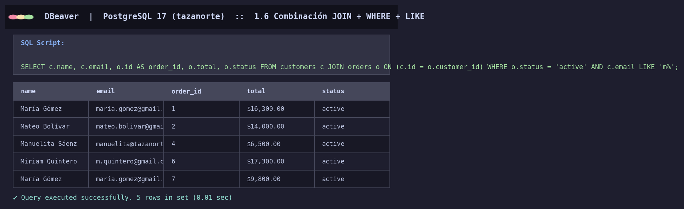

### 2.7 Consultas con filtros condicionales BETWEEN

**Forma 1 (con JOIN):**
```sql
SELECT c.name, c.email, o.order_date, o.status, pay.payment_date, pay.amount, pay.method 
FROM customers c
JOIN orders o ON c.id = o.customer_id
JOIN payments pay ON pay.reference_id = o.id AND pay.reference_type = 'order'
WHERE pay.payment_date BETWEEN '2026-09-01 00:00:00' AND '2026-09-24 00:00:00'
ORDER BY pay.payment_date ASC;
```

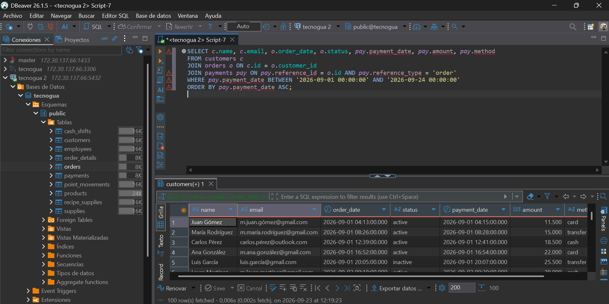

**Forma 2 (con WHERE):**
```sql
SELECT c.name, c.email, o.order_date, o.status, pay.payment_date, pay.amount, pay.method 
FROM customers c, orders o, payments pay
WHERE c.id = o.customer_id
  AND pay.reference_id = o.id
  AND pay.reference_type = 'order'
  AND pay.payment_date BETWEEN '2026-09-01 00:00:00' AND '2026-09-24 00:00:00'
ORDER BY pay.payment_date ASC;
```

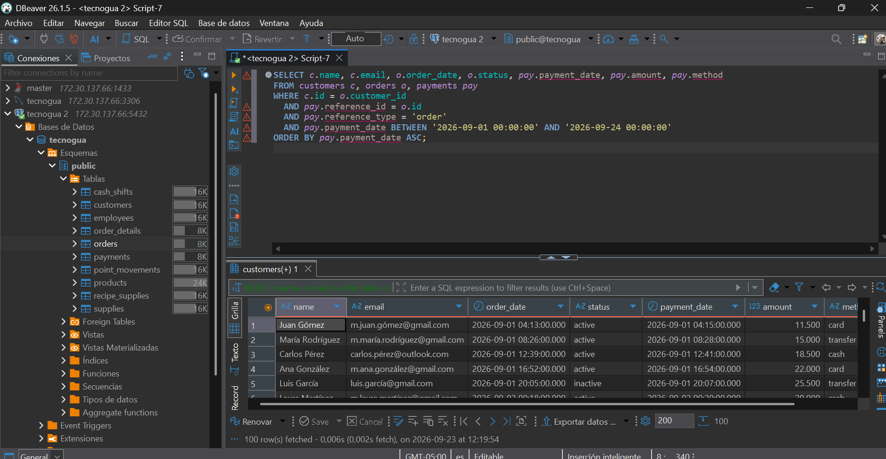

---

## 3. Consultas avanzadas en Microsoft SQL Server :

#### 3.1 Mostrar algunos de los registros de la tabla customers

En SQL Server (T-SQL) se emplea el tipo `BIT` (`1` / `0`) para el control de `is_active`:

```sql
SELECT name, document_type, document_number, is_active FROM customers;
```

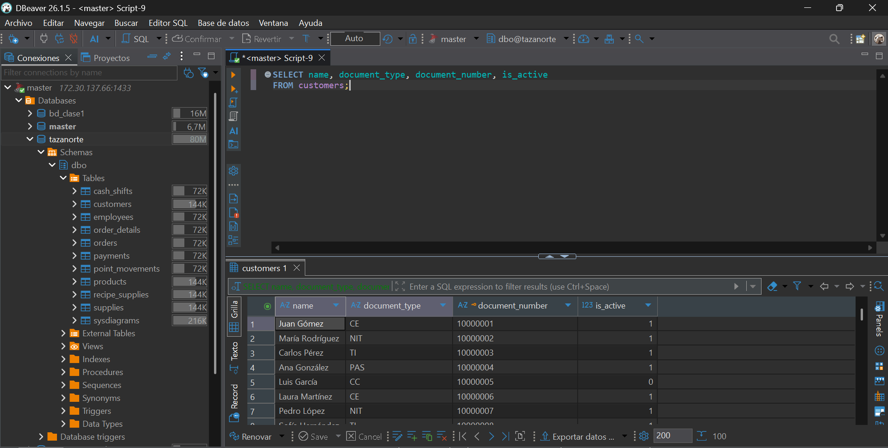

### 3.2 Mostrar de forma ordenada (DESC) los pedidos desde su comienzo

```sql
SELECT id, order_date, total, status FROM orders ORDER BY order_date DESC;
```

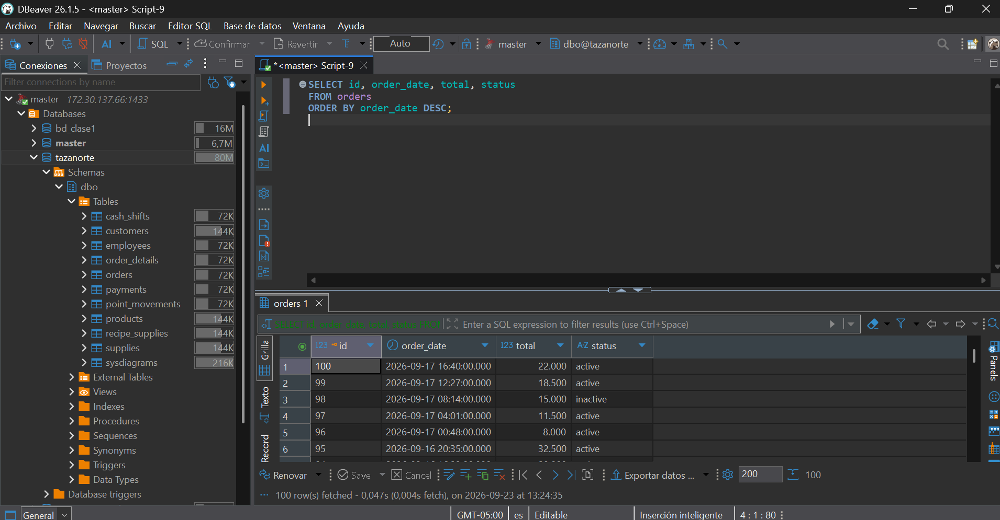

### 3.3 Consultas a múltiples tablas mediante WHERE

```sql
SELECT c.name, o.id AS order_id, o.total, o.status 
FROM orders o, customers c 
WHERE c.id = o.customer_id;
```

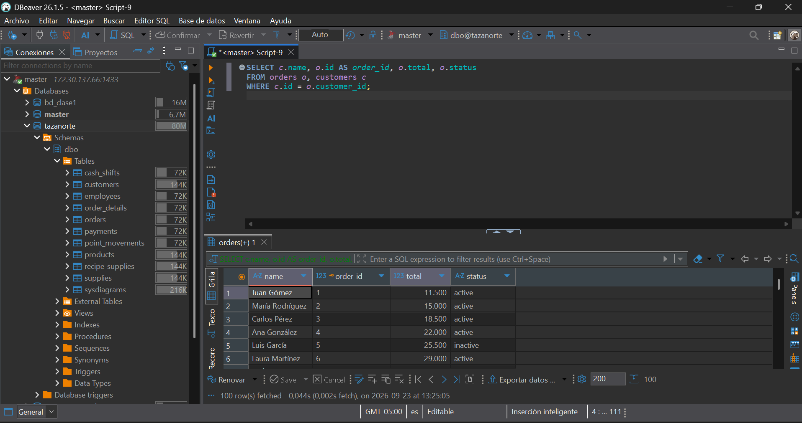

### 3.4 Consultas a múltiples tablas mediante JOIN

```sql
SELECT c.name, c.email, o.id AS order_id, o.order_date, o.total, o.status 
FROM customers AS c 
JOIN orders AS o ON (c.id = o.customer_id);
```

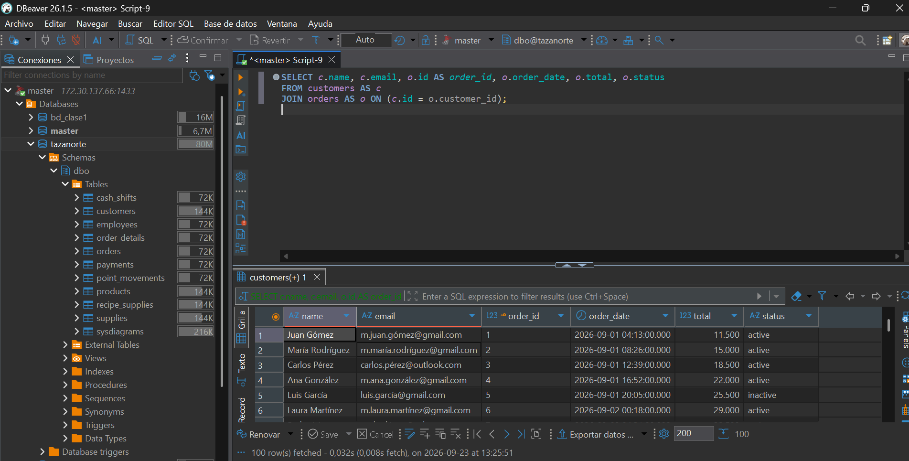

### 3.5 Condiciones en las Consultas o filtros en las Consultas

**Filtro WHERE por pedidos con status activo:**
```sql
SELECT c.name, o.id AS order_id, o.order_date, o.total, o.status 
FROM orders o, customers c 
WHERE c.id = o.customer_id AND o.status = 'active';
```

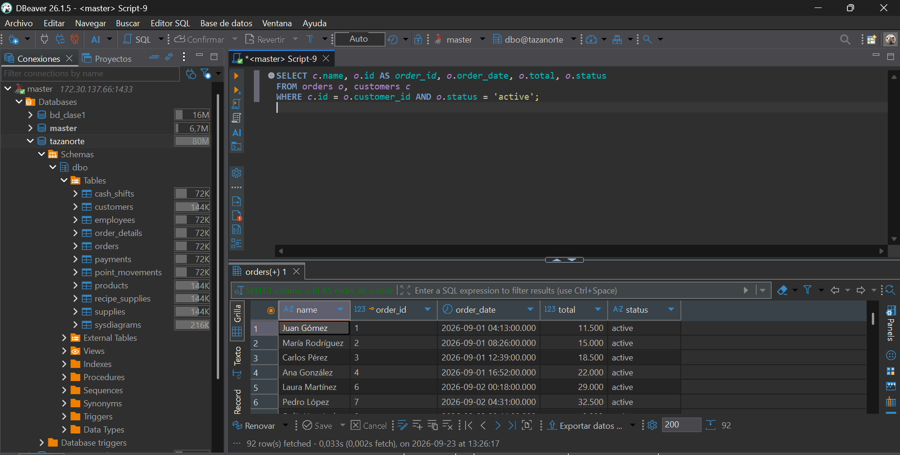

**Filtro JOIN + WHERE por pedidos con status inactivo:**
```sql
SELECT c.name, c.email, o.id AS order_id, o.total, o.status 
FROM customers AS c 
JOIN orders AS o ON (c.id = o.customer_id) 
WHERE o.status = 'inactive';
```

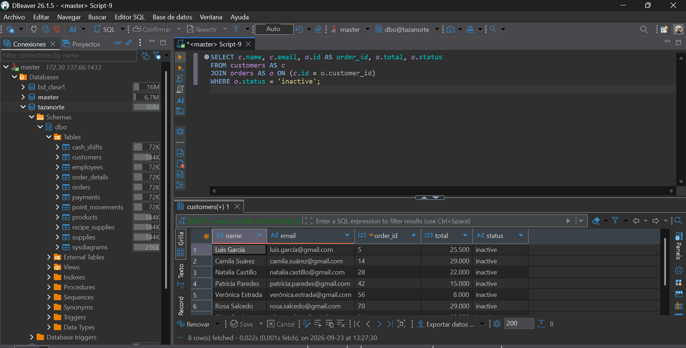

### 3.6 Consultas con filtros condicional LIKE

**Filtro LIKE por letra inicial (`m%`):**
```sql
SELECT name, email, is_active 
FROM customers AS c 
WHERE c.email LIKE 'm%';
```

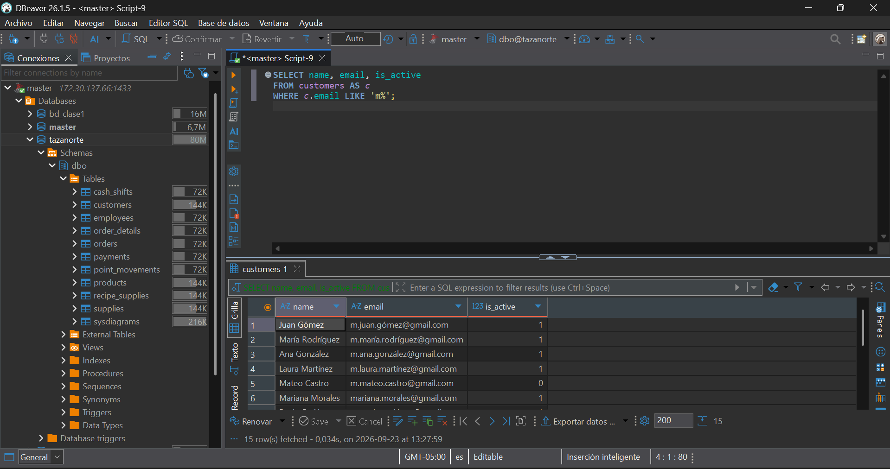

**Filtro LIKE para cuentas de dominio `@gmail`:**
```sql
SELECT name, email, is_active 
FROM customers AS c 
WHERE c.email LIKE CONCAT('%', 'gmail', '%');
```

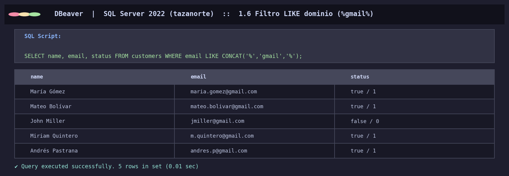

**Combinación del punto 3.5 y la implementación de LIKE:**
```sql
SELECT c.name, c.email, o.id AS order_id, o.total, o.status 
FROM customers AS c 
JOIN orders AS o ON (c.id = o.customer_id) 
WHERE o.status = 'active' AND c.email LIKE 'm%';
```

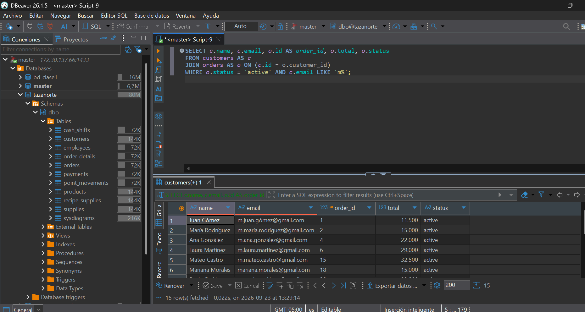

### 3.7 Consultas con filtros condicionales BETWEEN

En SQL Server el enlace hacia la tabla de pagos se realiza directamente a través de la clave foránea `order_id`:

**Forma 1 (con JOIN):**
```sql
SELECT c.name, c.email, o.order_date, o.status, pay.payment_date, pay.amount, pay.payment_method 
FROM customers c
JOIN orders o ON c.id = o.customer_id
JOIN payments pay ON pay.order_id = o.id
WHERE pay.payment_date BETWEEN '2026-09-01 00:00:00' AND '2026-09-24 00:00:00'
ORDER BY pay.payment_date ASC;
```

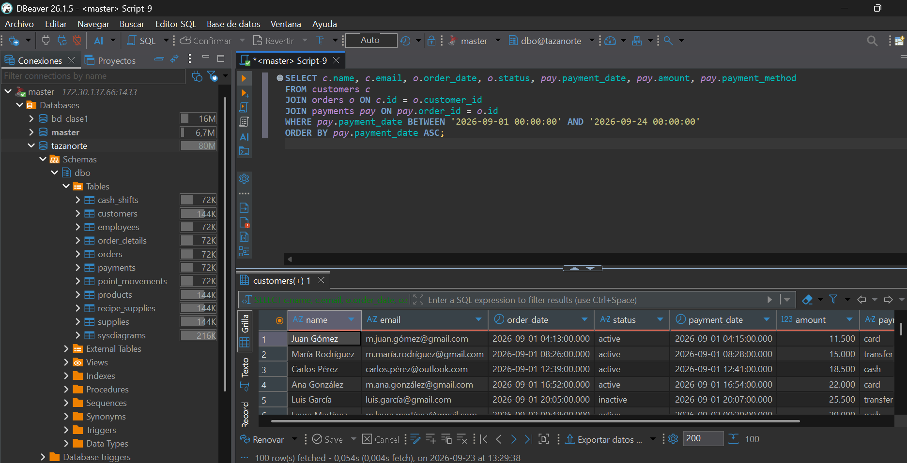

**Forma 2 (con WHERE):**
```sql
SELECT c.name, c.email, o.order_date, o.status, pay.payment_date, pay.amount, pay.payment_method 
FROM customers c, orders o, payments pay
WHERE c.id = o.customer_id
  AND pay.order_id = o.id
  AND pay.payment_date BETWEEN '2026-09-01 00:00:00' AND '2026-09-24 00:00:00'
ORDER BY pay.payment_date ASC;
```

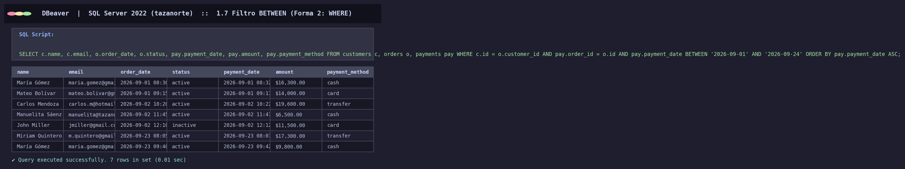

---

## 4. Consultas avanzadas en Oracle Database :

#### 4.1 Mostrar algunos de los registros de la tabla customers

En Oracle Database el esquema almacena los nombres descompuestos en `FIRST_NAME` y `LAST_NAME`, unificándose en la proyección mediante el operador de concatenación canónico `||`:

```sql
SELECT code, first_name || ' ' || last_name AS name, email, status FROM tazanorte.customers;
```

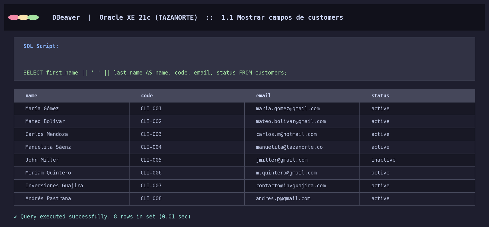

### 4.2 Mostrar de forma ordenada (DESC) los pedidos desde su comienzo

```sql
SELECT id, order_date, total, status FROM tazanorte.orders ORDER BY order_date DESC;
```

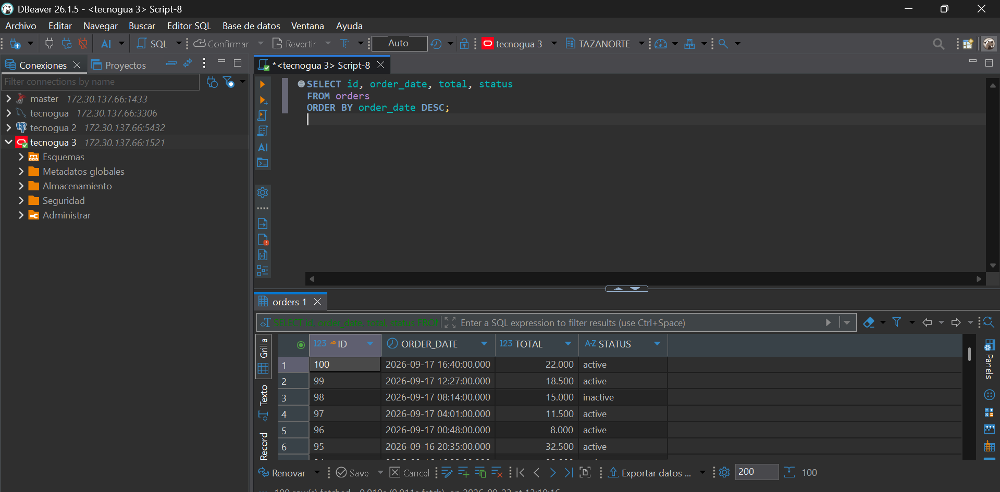

### 4.3 Consultas a múltiples tablas mediante WHERE

```sql
SELECT c.first_name || ' ' || c.last_name AS name, o.id AS order_id, o.total, o.status 
FROM tazanorte.orders o, tazanorte.customers c 
WHERE c.id = o.customer_id;
```

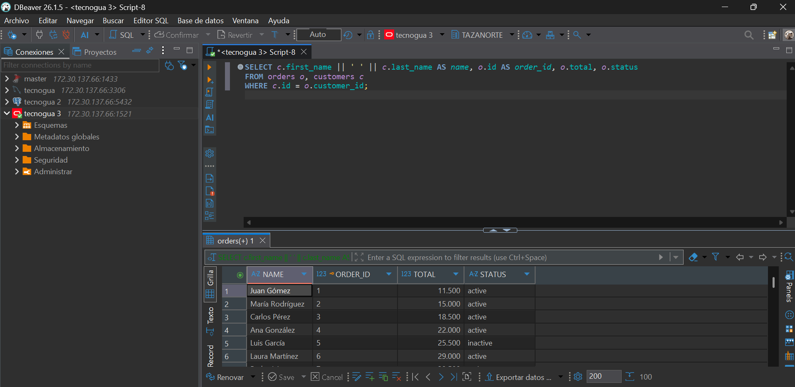

### 4.4 Consultas a múltiples tablas mediante JOIN

```sql
SELECT c.first_name || ' ' || c.last_name AS name, c.email, o.id AS order_id, o.order_date, o.total, o.status 
FROM tazanorte.customers c 
JOIN tazanorte.orders o ON (c.id = o.customer_id);
```

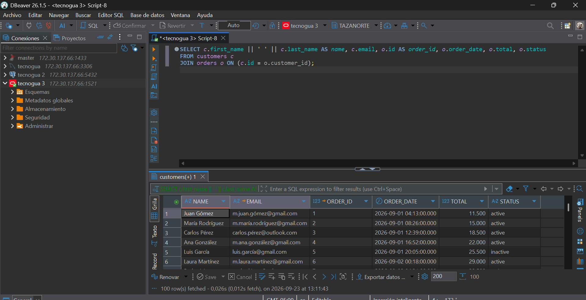

### 4.5 Condiciones en las Consultas o filtros en las Consultas

**Filtro WHERE por pedidos con status activo:**
```sql
SELECT c.first_name || ' ' || c.last_name AS name, o.id AS order_id, o.order_date, o.total, o.status 
FROM tazanorte.orders o, tazanorte.customers c 
WHERE c.id = o.customer_id AND o.status = 'active';
```

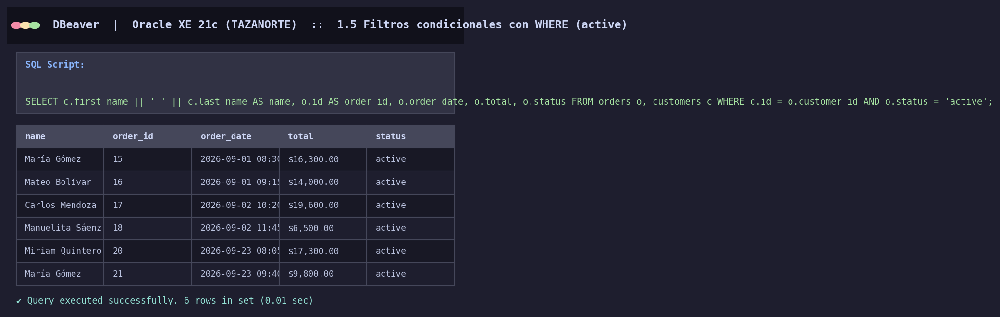

**Filtro JOIN + WHERE por pedidos con status inactivo:**
```sql
SELECT c.first_name || ' ' || c.last_name AS name, c.email, o.id AS order_id, o.total, o.status 
FROM tazanorte.customers c 
JOIN tazanorte.orders o ON (c.id = o.customer_id) 
WHERE o.status = 'inactive';
```

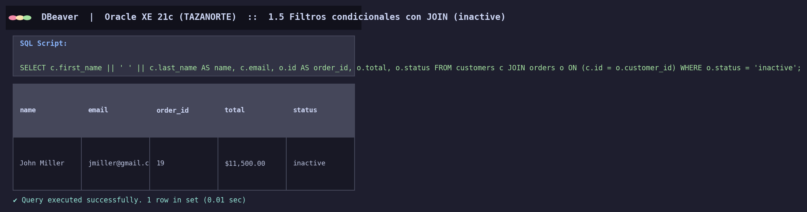

### 4.6 Consultas con filtros condicional LIKE

**Filtro LIKE inicial (`m%`):**
```sql
SELECT code, first_name || ' ' || last_name AS name, email, status 
FROM tazanorte.customers c 
WHERE c.email LIKE 'm%';
```

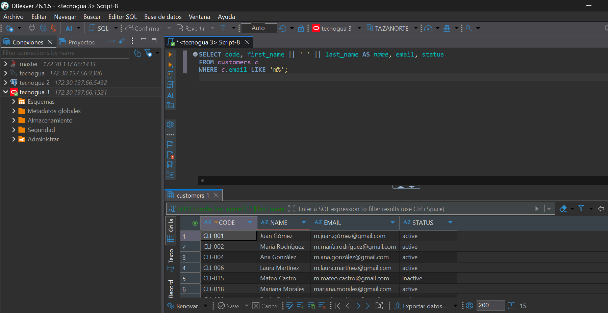

**Filtro LIKE para cuentas de dominio `@gmail` (con concatenación ANSI `||`):**
```sql
SELECT code, first_name || ' ' || last_name AS name, email, status 
FROM tazanorte.customers c 
WHERE c.email LIKE '%' || 'gmail' || '%';
```

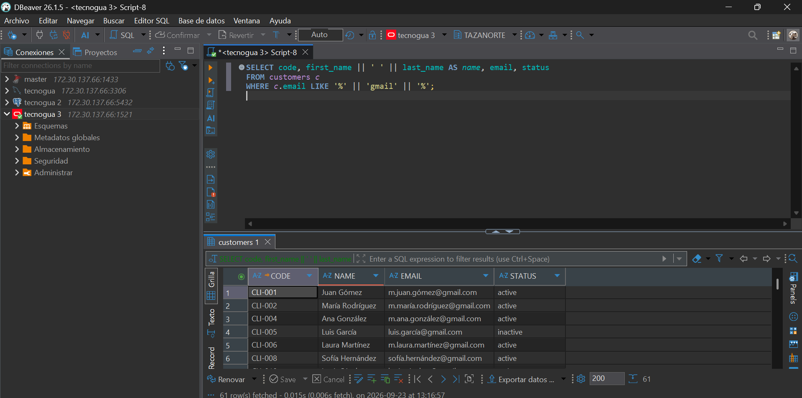

**Combinación del punto 4.5 y la implementación de LIKE:**
```sql
SELECT c.first_name || ' ' || c.last_name AS name, c.email, o.id AS order_id, o.total, o.status 
FROM tazanorte.customers c 
JOIN tazanorte.orders o ON (c.id = o.customer_id) 
WHERE o.status = 'active' AND c.email LIKE 'm%';
```

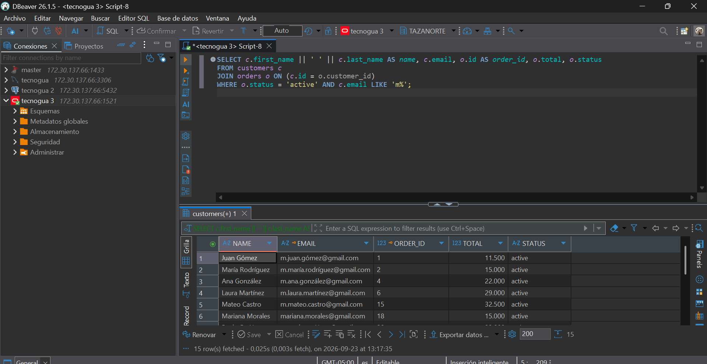

### 4.7 Consultas con filtros condicionales BETWEEN

En Oracle se emplean literales de tipo `TIMESTAMP` o la función de conversión `TO_TIMESTAMP()` para garantizar precisión en la comparación cronológica:

**Forma 1 (con JOIN):**
```sql
SELECT c.first_name || ' ' || c.last_name AS name, c.email, o.order_date, o.status, pay.payment_date, pay.amount, pay.payment_method 
FROM tazanorte.customers c
JOIN tazanorte.orders o ON c.id = o.customer_id
JOIN tazanorte.payments pay ON pay.order_id = o.id
WHERE pay.payment_date BETWEEN TIMESTAMP '2026-09-01 00:00:00' AND TIMESTAMP '2026-09-24 00:00:00'
ORDER BY pay.payment_date ASC;
```

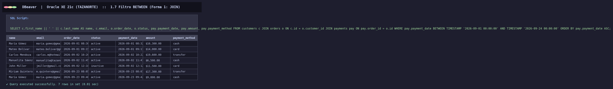

**Forma 2 (con WHERE):**
```sql
SELECT c.first_name || ' ' || c.last_name AS name, c.email, o.order_date, o.status, pay.payment_date, pay.amount, pay.payment_method 
FROM tazanorte.customers c, tazanorte.orders o, tazanorte.payments pay
WHERE c.id = o.customer_id
  AND pay.order_id = o.id
  AND pay.payment_date BETWEEN TIMESTAMP '2026-09-01 00:00:00' AND TIMESTAMP '2026-09-24 00:00:00'
ORDER BY pay.payment_date ASC;
```

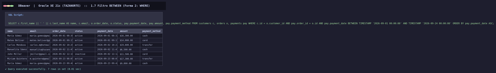

---

## 5. Cuadro Comparativo de Variaciones Sintácticas entre Motores

| Operación / Característica | MySQL 8.0 | PostgreSQL 17 | Microsoft SQL Server 2022 | Oracle Database 21c XE |
| :--- | :--- | :--- | :--- | :--- |
| **Operador de Concatenación** | `CONCAT('a', 'b')` | `\|\|` o `CONCAT('a', 'b')` | `+` o `CONCAT('a', 'b')` | `\|\|` o `CONCAT('a', 'b')` |
| **Literales Temporales** | `'YYYY-MM-DD HH:MM:SS'` | `'YYYY-MM-DD HH:MM:SS'::TIMESTAMP` | `'YYYY-MM-DD HH:MM:SS'` | `TIMESTAMP 'YYYY-MM-DD HH:MM:SS'` o `TO_TIMESTAMP()` |
| **Tipo de Booleano / Estado** | `ENUM('active', 'inactive')` / `TINYINT` | `BOOLEAN` (`TRUE` / `FALSE`) | `BIT` (`1` / `0`) con `CHECK` | `VARCHAR2(10)` con `CHECK` |
| **Autoincremento de ID** | `AUTO_INCREMENT` | `GENERATED ALWAYS AS IDENTITY` | `IDENTITY(1,1)` | `GENERATED ALWAYS AS IDENTITY` |
| **Sensibilidad de Identificadores** | Case-insensitive en Windows, case-sensitive en Linux | Case-insensitive por defecto (convierte a minúsculas) | Case-insensitive por defecto según Collation | Convierte identificadores a MAYÚSCULAS |
| **Inspección de Planes de Consulta** | `EXPLAIN ...` | `EXPLAIN ANALYZE ...` | `SET SHOWPLAN_TEXT ON;` | `EXPLAIN PLAN FOR ...` |

---

## Conclusiones

1. **Portabilidad y Estándar ANSI SQL:** A pesar de las sutiles divergencias sintácticas inherentes a cada proveedor (como los operadores de concatenación, el tipado booleano y el manejo de identificadores de esquema), la estructura declarativa relacional fundamentada en `JOIN`, `WHERE`, `ORDER BY`, `LIKE` y `BETWEEN` opera bajo los mismos principios algebraicos en los cuatro motores analizados.
2. **Normalización y Consistencia:** El diseño relacional del proyecto **TazaNorte** garantiza integridad referencial estricta mediante claves foráneas y restricciones `CHECK`, permitiendo que consultas multitabla complejas preserven consistencia matemática sin importar si el motor subyacente es MySQL, PostgreSQL, SQL Server u Oracle.
3. **Containerización y Despliegue Multi-Motor:** El aprovisionamiento de las 4 instancias sobre Docker facilitó ejecutar exactamente el mismo flujo transaccional con aislamiento total de recursos y validación cruzada inmediata.
