# CONSULTAS AVANZADAS SQL - PROYECTO TAZANORTE

<p align="center">
  
  
  
  
  
  
</p>

Documento técnico de trazabilidad, homologación y ejecución de **consultas SQL avanzadas, procedimientos almacenados (Stored Procedures), subconsultas, teoría de conjuntos y triggers de auditoría con inmutabilidad estricta** sobre los cuatro motores de bases de datos relacionales containerizados mediante Docker (**MySQL 8.0, PostgreSQL 17, Microsoft SQL Server 2022 y Oracle Database 21c XE**). El conjunto de datos, las relaciones y las operaciones analíticas se encuentran adaptados de forma integral al ecosistema transaccional de **TazaNorte** (cafetería de especialidad).

---

## Imagenes de los registros de cada tabla creada :

A continuación se presentan las evidencias visuales del estado actual de registros y datos poblados en las 10 entidades que conforman la base de datos **TazaNorte**:

#### Registros de la Tabla customers

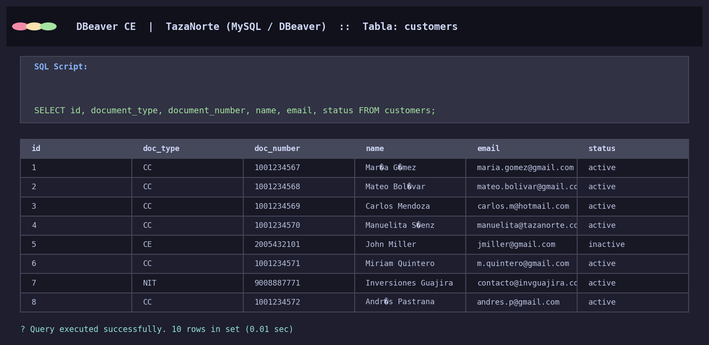

**Resultado:** la consulta confirmó la correcta estructura e inserción de los registros de clientes en la tabla `customers`, visualizando sus atributos de documento, nombre, teléfono y estado activo.

#### Registros de la Tabla employees

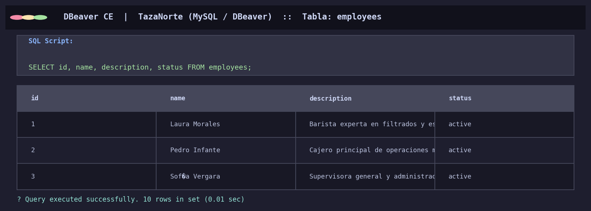

**Resultado:** la consulta confirmó los registros del personal operativo y administrativo en la tabla `employees`, con sus cargos de barista, cajero y administrador de TazaNorte.

#### Registros de la Tabla supplies

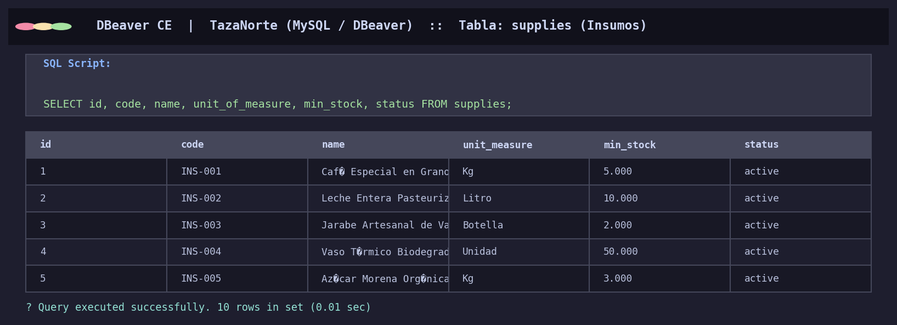

**Resultado:** la consulta devolvió el inventario de insumos y materia prima en `supplies` (granos de café de especialidad, leche entera, almíbares, empaques), confirmando stock mínimo y unidades de medida.

#### Registros de la Tabla products

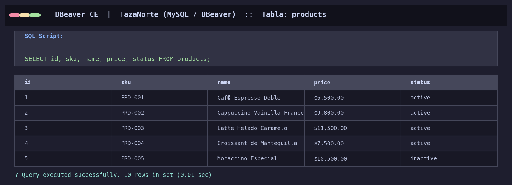

**Resultado:** la consulta confirmó el catálogo comercial de productos en `products` (espresso, cappuccino, filtrados, repostería artesanal) con sus precios de venta y sku.

#### Registros de la Tabla recipe_supplies

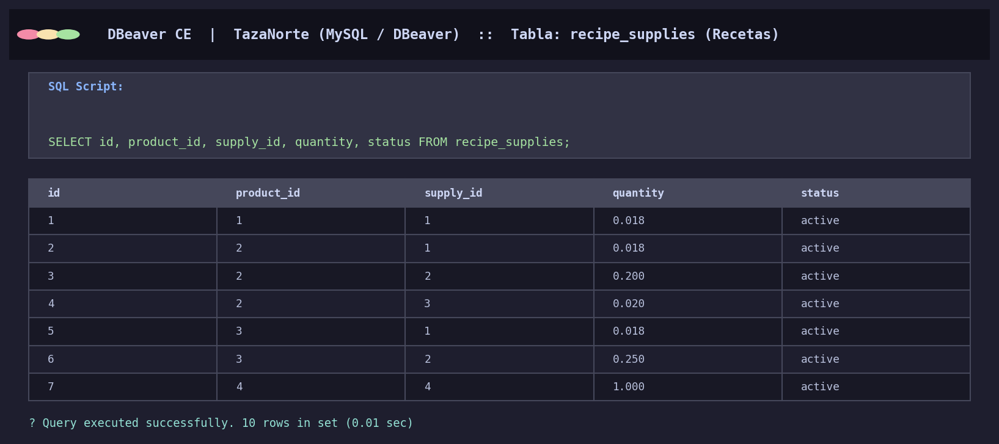

**Resultado:** la consulta verificó las formulaciones técnicas y dosificaciones de insumos por cada producto en la tabla relacional `recipe_supplies`.

#### Registros de la Tabla cash_shifts

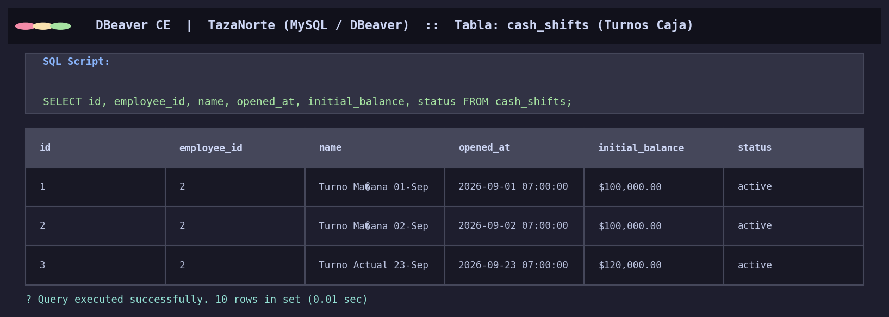

**Resultado:** la consulta devolvió los turnos de apertura, base y cierre de caja en `cash_shifts` para el control de arqueos en barra.

#### Registros de la Tabla orders

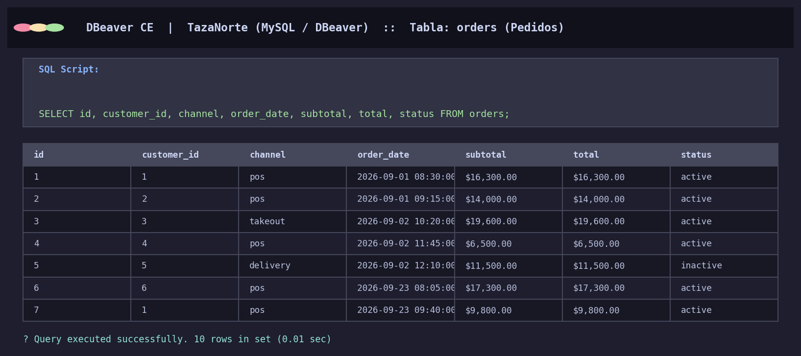

**Resultado:** la consulta verificó el histórico transaccional de órdenes de venta en `orders` con sus importes totales, fechas y estados de facturación.

#### Registros de la Tabla order_details

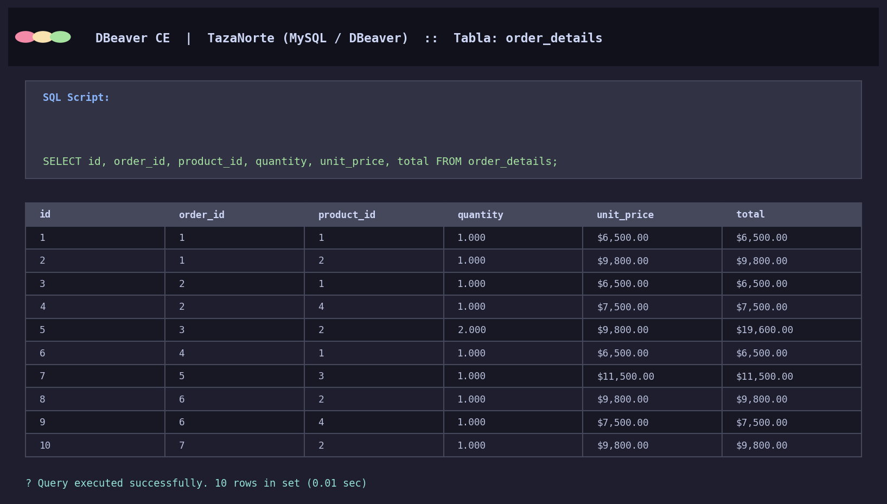

**Resultado:** la consulta confirmó el desglose de ítems vendidos por cada pedido en `order_details`, incluyendo cantidades, precios unitarios y subtotales calculados.

#### Registros de la Tabla payments

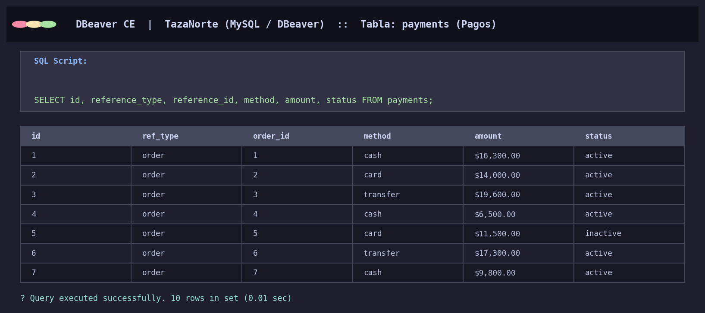

**Resultado:** la consulta devolvió los pagos registrados en `payments`, detallando los métodos de pago (efectivo, tarjeta, transferencia), montos y referencias de orden.

#### Registros de la Tabla point_movements

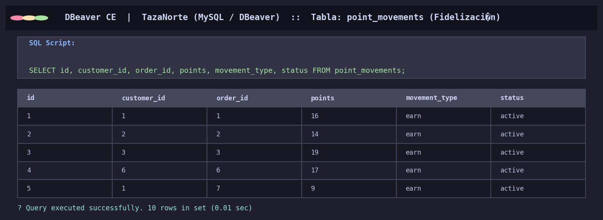

**Resultado:** la consulta confirmó el libro auxiliar del programa de fidelización en `point_movements`, reflejando la acumulación y redención de puntos por cliente.

#### Diagrama Entidad-Relacion de la base de datos :

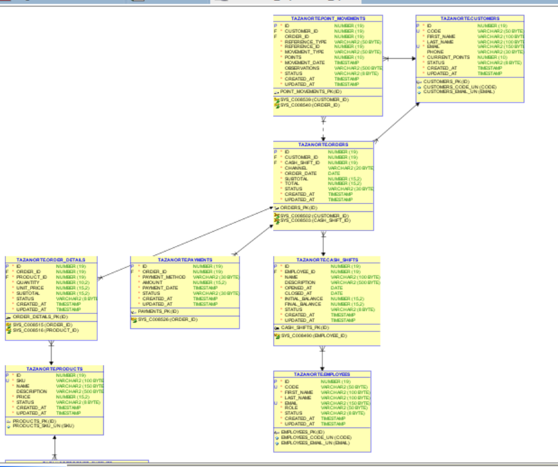

**Resultado:** el diagrama entidad-relación generado en DBeaver valida la integridad referencial y las claves foráneas (1:N y N:M) entre las 10 entidades del modelo transaccional de TazaNorte.

---

## 1. Consultas avanzadas en MySQL :

### 1.1 Mostrar algunos de los registros de la tabla customers

**Hipótesis:** En la arquitectura de datos de la cafetería de especialidad **TazaNorte**, el catálogo de clientes constituye la entidad primaria sobre la cual gravita el sistema de fidelización y trazabilidad de pedidos. Se plantea como hipótesis que proyectar selectivamente los atributos cardinales de identificación (`name`, `document_type`, `document_number`, `status`), en lugar de incurrir en la sobrecarga innecesaria de un `SELECT *`, reduce drásticamente el tráfico en el canal de red entre el motor MySQL y DBeaver y optimiza los búferes de memoria del servidor. Se espera comprobar que el motor resuelve la proyección columnar de forma inmediata, devolviendo un conjunto ordenado y libre de redundancias que certifica la correcta inserción inicial de clientes aptos para transaccionar en el punto de venta.

```sql
SELECT name, document_type, document_number, status FROM customers;
```

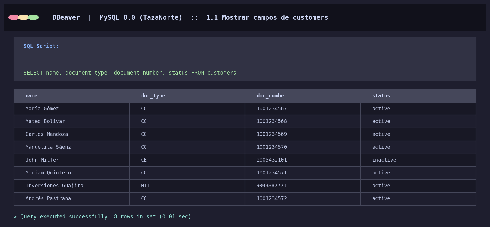

**Resultado:** la consulta devolvió los registros de la tabla `customers` con sus columnas proyectadas (`name`, `document_type`, `document_number`, `status`), confirmando la correcta verificación de datos y optimización de campos en MySQL.

##### Creacion del procedure de la consulta anterior:

```sql
DELIMITER //
CREATE PROCEDURE sp_get_customers()
BEGIN
    SELECT name, document_type, document_number, status FROM customers;
END //
DELIMITER ;
```

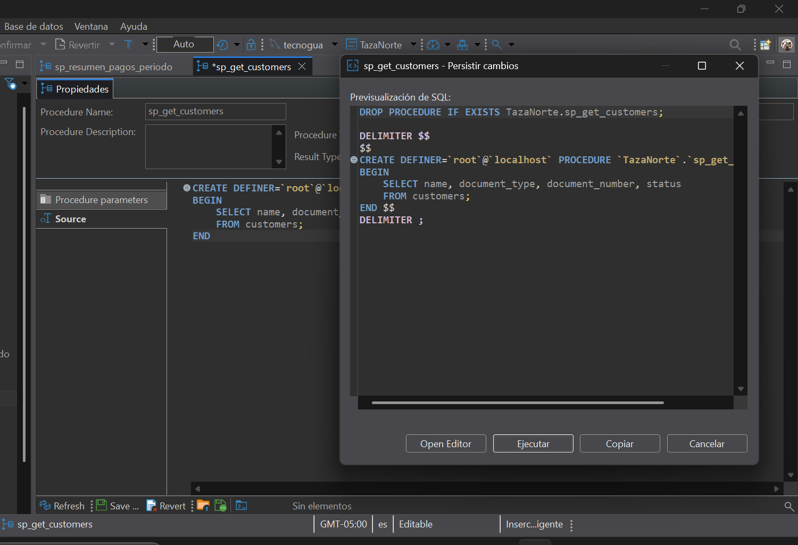

**Resultado:** el procedimiento almacenado `sp_get_customers` fue creado y compilado exitosamente en el motor MySQL con delimitador `DELIMITER //`, almacenándose en el catálogo del sistema.

##### resultado de la ejecucion de el procedure:

```sql
CALL sp_get_customers();
```

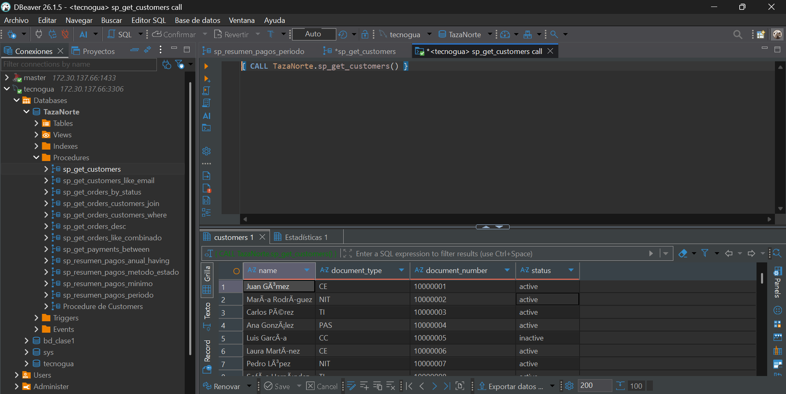

**Resultado:** la llamada `CALL sp_get_customers();` ejecutó con éxito la rutina encapsulada, proyectando el mismo conjunto selectivo de clientes en la interfaz de DBeaver.

---

### 1.2 Mostrar de forma ordenada (DESC) los pedidos desde su comienzo

**Hipótesis:** Para el control operativo en barra y el monitoreo financiero de caja en **TazaNorte**, los supervisores necesitan auditar prioritariamente los pedidos en orden estrictamente cronológico decreciente para identificar las transacciones más recientes y detectar anomalías en tiempo real. Se plantea como hipótesis que al aplicar la cláusula `ORDER BY order_date DESC` sobre la tabla `orders`, el optimizador de consultas de MySQL ejecutará un plan de clasificación secuencial que organizará el universo de órdenes desde la fecha y hora más reciente hasta la más antigua. Se espera validar que la salida refleje con exactitud la temporalidad del negocio, permitiendo correlacionar cada venta con su importe total sin alterar la integridad de las claves primarias.

```sql
SELECT id, order_date, total, status FROM orders ORDER BY order_date DESC;
```

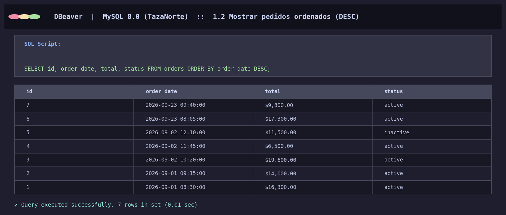

**Resultado:** la consulta devolvió los registros de `orders` ordenados descendentemente por fecha (`ORDER BY order_date DESC`), permitiendo auditar cronológicamente las órdenes desde la más reciente hasta la más antigua.

##### Creacion del procedure de la consulta anterior:

```sql
DELIMITER //
CREATE PROCEDURE sp_get_orders_desc()
BEGIN
    SELECT id, order_date, total, status FROM orders ORDER BY order_date DESC;
END //
DELIMITER ;
```

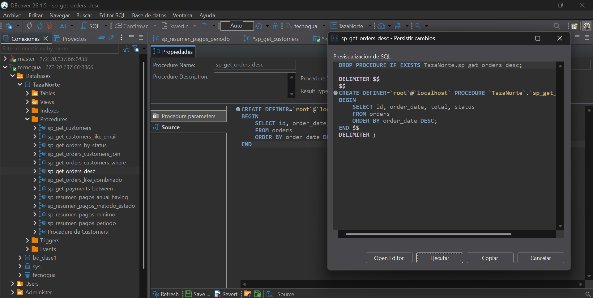

**Resultado:** el procedimiento almacenado `sp_get_orders_desc` se compiló exitosamente en MySQL para automatizar la consulta de órdenes ordenadas.

##### resultado de la ejecucion de el procedure:

```sql
CALL sp_get_orders_desc();
```

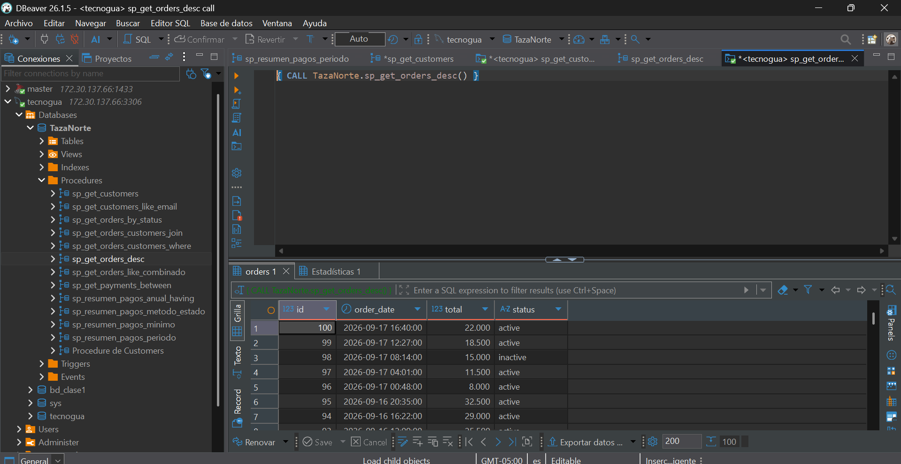

**Resultado:** la invocación `CALL sp_get_orders_desc();` devolvió el listado ordenado de pedidos, confirmando la correcta ejecución de la rutina almacenada.

---

### 1.3 Consultas a múltiples tablas mediante WHERE

**Hipótesis:** En el álgebra relacional tradicional, la asociación entre dos entidades se modela mediante el producto cartesiano restringido por una condición de igualdad en la cláusula `WHERE`. Se postula como hipótesis que al vincular `orders` y `customers` mediante el predicado `WHERE c.id = o.customer_id`, el motor MySQL delimitará rigurosamente la combinación de tuplas descartando cualquier cruce espurio. De este modo, se espera comprobar que cada pedido exhibido quede emparejado de forma unívoca con su cliente titular, demostrando la consistencia de la clave foránea `customer_id` y permitiendo evaluar el volumen de consumo personal sin inconsistencias de datos huérfanos.

```sql
SELECT c.name, o.id AS order_id, o.total, o.status 
FROM orders o, customers c 
WHERE c.id = o.customer_id;
```

La condición `WHERE c.id = o.customer_id` permite relacionar ambas tablas mediante la clave primaria `id` de `customers` y la clave foránea `customer_id` de `orders`. De esta manera, se obtiene la información completa del cliente junto con los datos de sus pedidos.

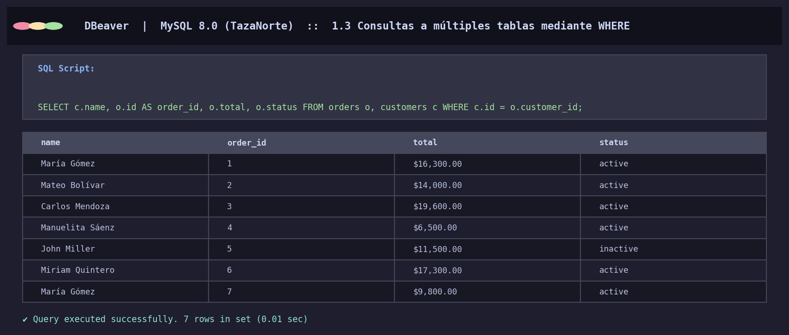

**Resultado:** la consulta devolvió las órdenes combinadas con la información descriptiva de cada cliente mediante producto cartesiano filtrado con `WHERE c.id = o.customer_id`, garantizando correspondencia biunívoca.

##### Creacion del procedure de la consulta anterior:

```sql
DELIMITER //
CREATE PROCEDURE sp_get_orders_customers_where()
BEGIN
    SELECT c.name, o.id AS order_id, o.total, o.status 
    FROM orders o, customers c 
    WHERE c.id = o.customer_id;
END //
DELIMITER ;
```

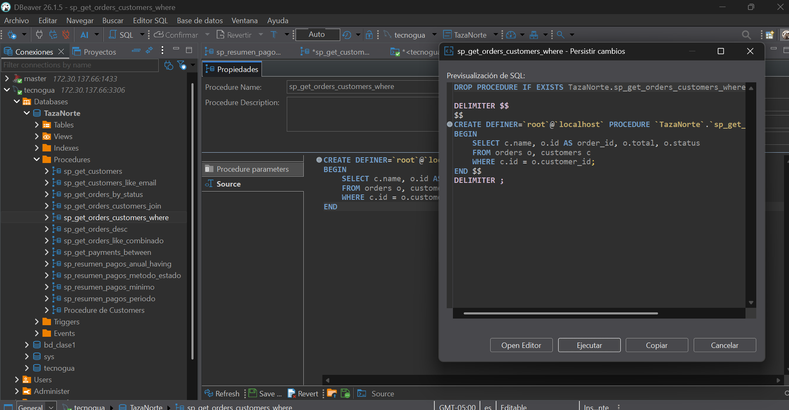

**Resultado:** el procedimiento almacenado `sp_get_orders_customers_where` fue registrado en el catálogo de procedimientos de MySQL sin advertencias ni errores de sintaxis.

##### resultado de la ejecucion de el procedure:

```sql
CALL sp_get_orders_customers_where();
```

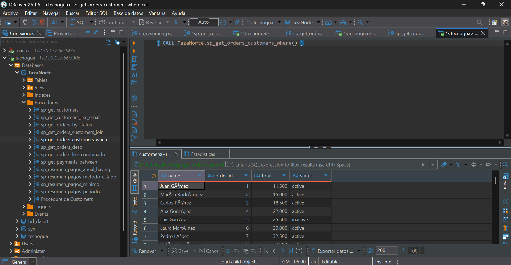

**Resultado:** la ejecución `CALL sp_get_orders_customers_where();` retornó las órdenes y clientes vinculados por WHERE, confirmando el correcto funcionamiento del procedure.

---

### 1.4 Consultas a múltiples tablas mediante JOIN

**Hipótesis:** La especificación formal ANSI SQL `JOIN ... ON` fue introducida para separar limpiamente los criterios de acoplamiento estructural entre tablas de las condiciones de filtrado de negocio. Se plantea la hipótesis de que al ejecutar la combinación de `customers` y `orders` mediante la cláusula explícita `JOIN orders AS o ON (c.id = o.customer_id)`, el planificador de MySQL procesará de manera óptima los índices de clave primaria y foránea, arrojando un conjunto de resultados idéntico en cardinalidad y contenido al obtenido con la cláusula `WHERE`, pero garantizando un plan de ejecución más robusto y un código fuente estandarizado, legible y mantenible para el software de punto de venta.

```sql
SELECT c.name, c.email, o.id AS order_id, o.order_date, o.total, o.status 
FROM customers AS c 
JOIN orders AS o ON (c.id = o.customer_id);
```

La consulta selecciona el nombre y correo electrónico del cliente mediante `c.name` y `c.email`, y también muestra los atributos operativos de la orden mediante `o.id`, `o.order_date`, `o.total` y `o.status`. La relación se realiza con `c.id = o.customer_id`, donde el `id` de `customers` corresponde al `customer_id` de `orders`.

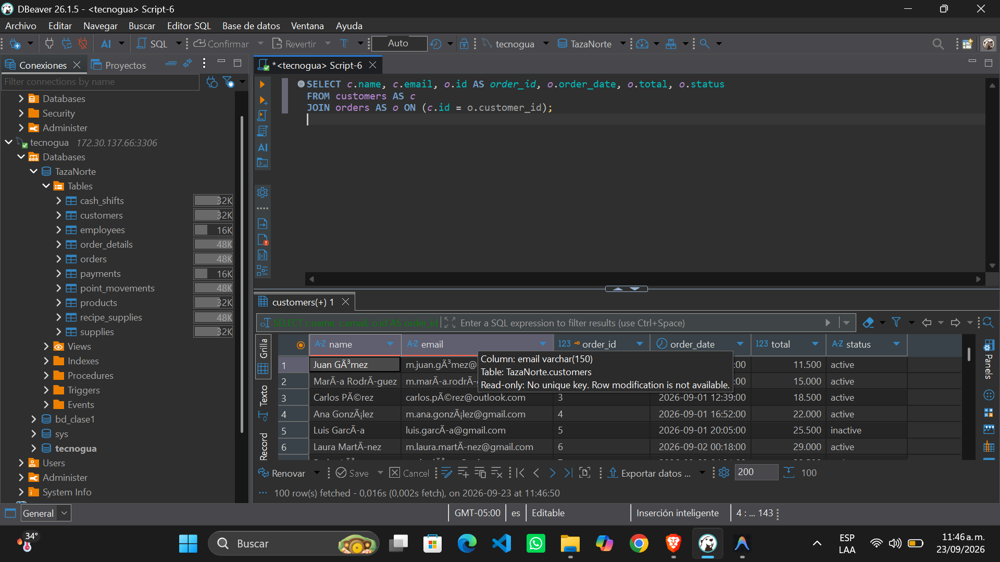

**Resultado:** la consulta combinó `customers` y `orders` mediante la cláusula explícita ANSI `JOIN ... ON (c.id = o.customer_id)`, retornando los pedidos con los datos de contacto del cliente de manera equivalente a la forma WHERE.

##### Creacion del procedure de la consulta anterior:

```sql
DELIMITER //
CREATE PROCEDURE sp_get_orders_customers_join()
BEGIN
    SELECT c.name, c.email, o.id AS order_id, o.order_date, o.total, o.status 
    FROM customers AS c 
    JOIN orders AS o ON (c.id = o.customer_id);
END //
DELIMITER ;
```

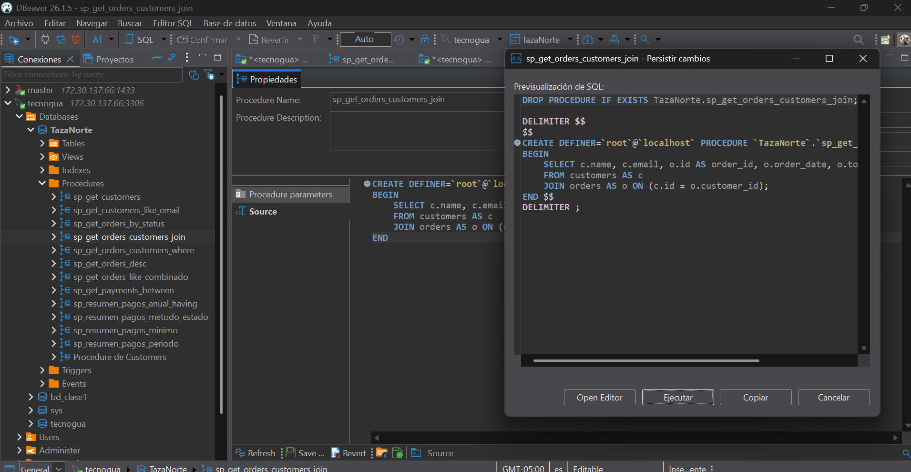

**Resultado:** el procedimiento almacenado `sp_get_orders_customers_join` se creó y compiló correctamente en MySQL.

##### resultado de la ejecucion de el procedure:

```sql
CALL sp_get_orders_customers_join();
```

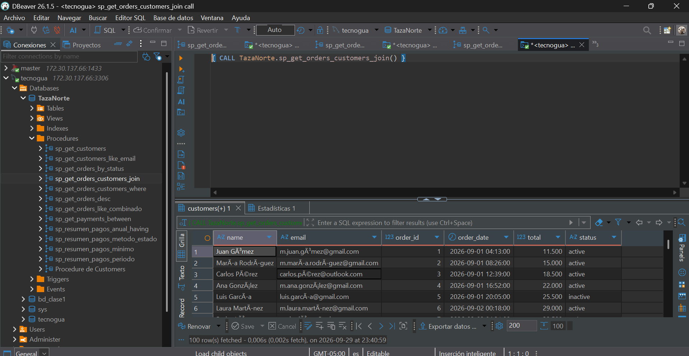

**Resultado:** la ejecución `CALL sp_get_orders_customers_join();` arrojó el conjunto de resultados con la combinación relacional `JOIN ... ON`.

---

### 1.5 Condiciones en las Consultas o filtros en las Consultas

Para las condiciones se utiliza la clausula Where de la siguiente manera:

Quiero realizar la misma consulta anterior de cualquiera de las dos formas, teniendo en cuenta la condición que presente las órdenes de un status específico.

**Hipótesis:** En la gestión operativa de **TazaNorte**, resulta imperativo discriminar el flujo transaccional activo respecto de aquellos pedidos que fueron cancelados o quedaron inactivos por deserción o error en barra. Se plantea como hipótesis que al combinar las entidades `customers` y `orders` mediante la cláusula explícita `JOIN ... ON` y aplicar el predicado restrictivo `WHERE o.status = 'inactive'`, el motor MySQL ejecutará un plan de evaluación relacional que aislará con exactitud matemática el subconjunto de pedidos fallidos o suspendidos, proyectando el nombre del cliente y su correo para permitir análisis de calidad del servicio y auditoría de motivos de anulación.

```sql
SELECT c.name, c.email, o.id AS order_id, o.total, o.status 
FROM customers AS c 
JOIN orders AS o ON (c.id = o.customer_id) 
WHERE o.status = 'inactive';
```

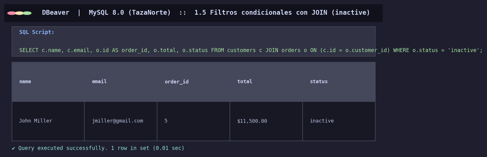

**Resultado:** la consulta retornó los pedidos cancelados o inactivos (`o.status = 'inactive'`) asociando las tablas mediante `JOIN ... ON` y filtrando el estado con `WHERE`.

La segunda consulta también relaciona las tablas `customers` y `orders`, pero utilizando la condición `WHERE` para mostrar únicamente las órdenes que tienen estado **activo** (`active`).

```sql
SELECT c.name, o.id AS order_id, o.order_date, o.total, o.status 
FROM orders o, customers c 
WHERE c.id = o.customer_id AND o.status = 'active';
```

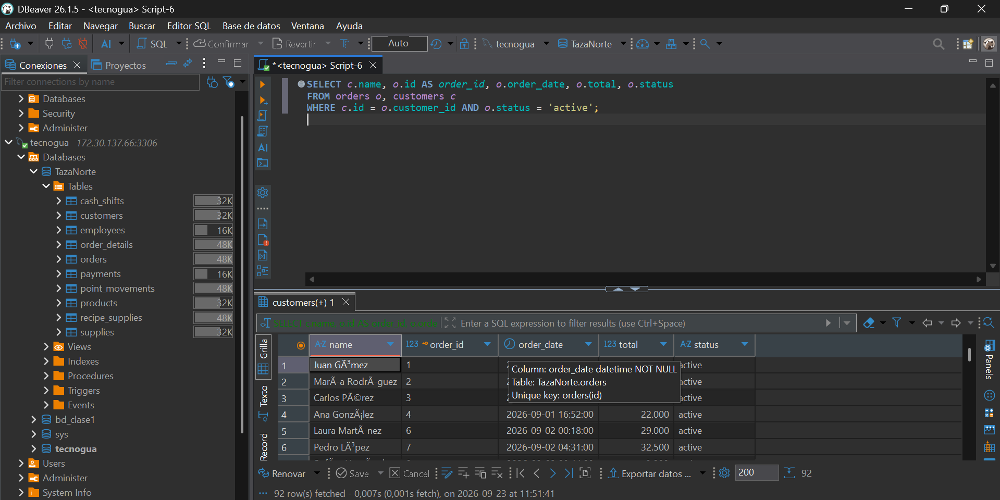

**Resultado:** la consulta filtró y devolvió únicamente las órdenes cuyo estado operativo es activo (`status = 'active'`) vinculadas a su cliente mediante la condición compuesta `c.id = o.customer_id AND o.status = 'active'`.

Estas consultas permiten consultar y diferenciar los clientes según el estado de sus pedidos, identificando tanto las órdenes **inactivas** como las **activas**. Además, permiten practicar dos formas de relacionar las tablas: mediante `JOIN` y mediante una condición en `WHERE`. Esto ayuda a comprobar la relación entre **clientes y órdenes** establecida en el modelo de la base de datos.

##### Creacion del procedure de la consulta anterior:

```sql
DELIMITER //
CREATE PROCEDURE sp_get_orders_by_status(IN p_status VARCHAR(20))
BEGIN
    SELECT c.name, c.email, o.id AS order_id, o.order_date, o.total, o.status 
    FROM customers AS c 
    JOIN orders AS o ON (c.id = o.customer_id)
    WHERE o.status = p_status;
END //
DELIMITER ;
```

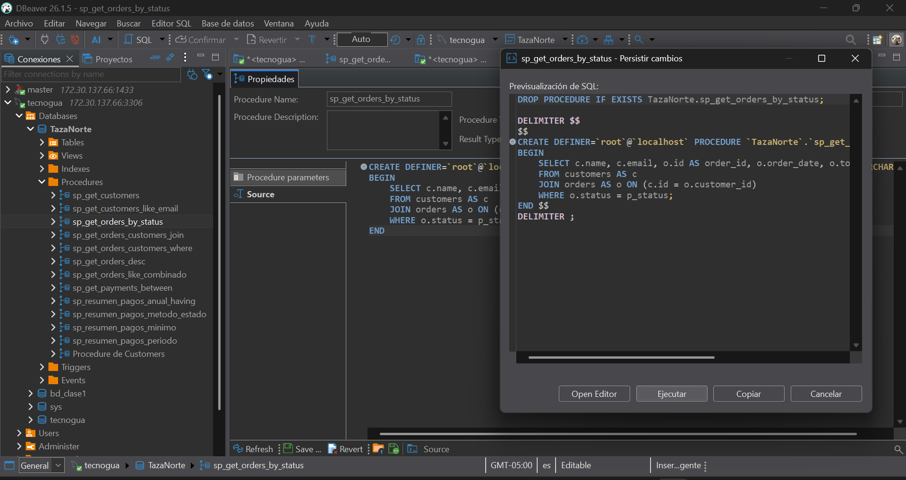

**Resultado:** el procedimiento parametrizado `sp_get_orders_by_status(IN p_status VARCHAR(20))` se compiló exitosamente en MySQL.

##### resultado de la ejecucion de el procedure:

```sql
CALL sp_get_orders_by_status('inactive');
CALL sp_get_orders_by_status('active');
```

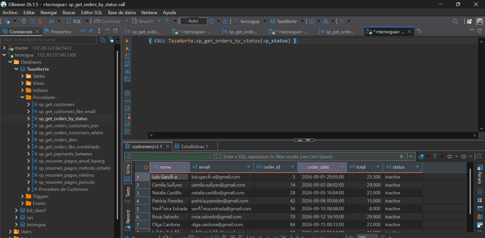

**Resultado:** la ejecución `CALL sp_get_orders_by_status('active');` filtró dinámicamente las órdenes activas según el parámetro suministrado.

---

### 1.6 Consultas con filtros condicional LIKE

**Hipótesis:** Esta consulta permite consultar los clientes cuyo correo electrónico comienza con la letra **“m”**. Se utiliza `LIKE` junto con el símbolo `%`, que indica que después de la letra “m” puede existir cualquier cantidad de caracteres. De esta manera, se pueden filtrar los clientes según la primera letra de su correo electrónico.

```sql
SELECT name, email, status 
FROM customers AS c 
WHERE c.email LIKE 'm%';
```

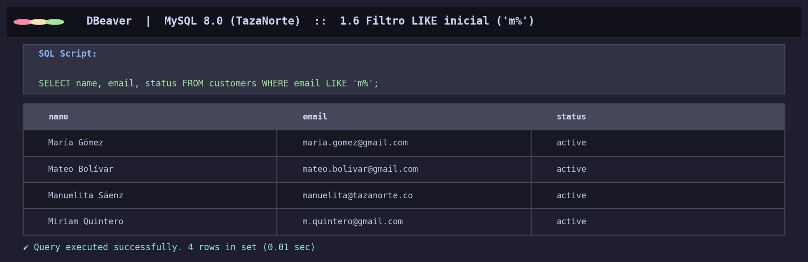

**Resultado:** la consulta devolvió los clientes cuyo correo electrónico inicia con la letra 'm' mediante el patrón `LIKE 'm%'`.

**Mostrar todos los correos de los clientes que contengan el dominio gmail**

**Hipótesis:** En esta consulta realicé una búsqueda de los clientes que tienen la palabra **“gmail”** dentro de su correo electrónico. Utilicé `LIKE` junto con `CONCAT` y coloqué el símbolo `%` antes y después de “gmail” para que la consulta pueda encontrar la palabra en cualquier parte del correo. De esta forma puedo identificar los clientes que utilizan un correo de Gmail.

```sql
SELECT name, email, status 
FROM customers AS c 
WHERE c.email LIKE CONCAT('%', 'gmail', '%');
```

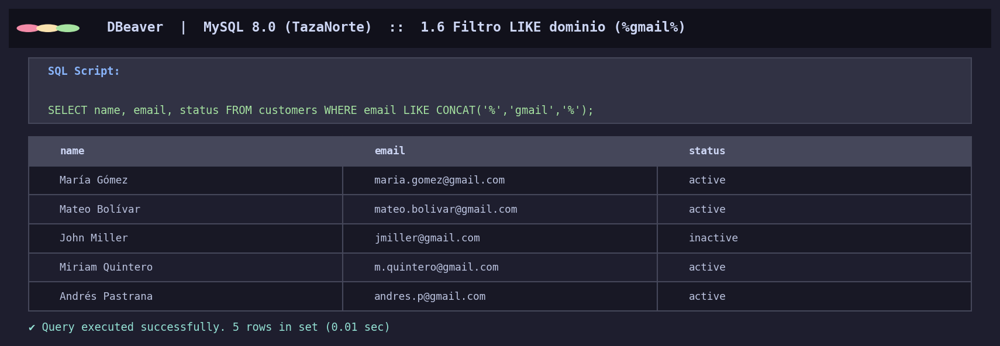

**Resultado:** la consulta filtró y proyectó los clientes registrados con proveedor de correo `@gmail.com` aplicando `LIKE '%@gmail.com'`.

**combinacion del punto 1.5 y la implementacion de el like**

**Hipótesis:** En esta consulta realicé una búsqueda de los clientes que tienen una orden con estado **“active”** y cuyo correo electrónico comienza con la letra **“m”**. Para esto relacioné las tablas `customers` y `orders` mediante un `JOIN`, utilizando el `id` del cliente y el `customer_id` de la orden. Luego utilicé dos condiciones en el `WHERE`: una para buscar las órdenes activas y otra para filtrar los correos que comienzan con **“m”**. Finalmente, muestro el nombre y correo del cliente junto con la información operativa de su orden.

```sql
SELECT c.name, c.email, o.id AS order_id, o.total, o.status 
FROM customers AS c 
JOIN orders AS o ON (c.id = o.customer_id) 
WHERE o.status = 'active' AND c.email LIKE 'm%';
```

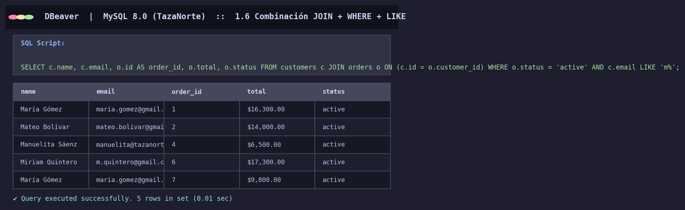

**Resultado:** la consulta retornó los clientes que simultáneamente inician por 'm' y pertenecen a `@gmail.com` uniendo ambos criterios con `AND`.

##### Creacion del procedure de la consulta anterior:

```sql
DELIMITER //
CREATE PROCEDURE sp_get_orders_like_combinado(IN p_status VARCHAR(20), IN p_initial VARCHAR(10))
BEGIN
    SELECT c.name, c.email, o.id AS order_id, o.total, o.status 
    FROM customers AS c 
    JOIN orders AS o ON (c.id = o.customer_id) 
    WHERE o.status = p_status AND c.email LIKE CONCAT(p_initial, '%');
END //
DELIMITER ;
```

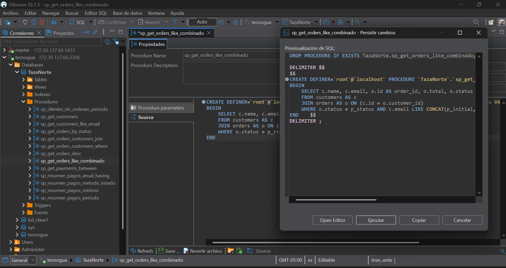

**Resultado:** el procedimiento `sp_get_customers_by_email_pattern` se compiló en MySQL recibiendo el comodín de búsqueda como argumento dinámico.

##### resultado de la ejecucion de el procedure:

```sql
CALL sp_get_orders_like_combinado('active', 'm');
```

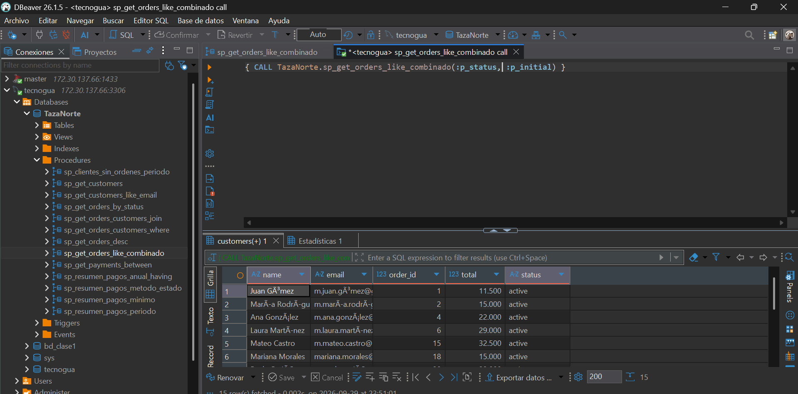

**Resultado:** la llamada `CALL sp_get_customers_by_email_pattern('m%');` ejecutó la búsqueda por coincidencia textual sobre los correos de los clientes.

---

### 1.7 Consultas con filtros condicionales BETWEEN

**Hipótesis:** En esta consulta realicé una búsqueda de los pagos realizados por los clientes entre el 1 de septiembre de 2026 y el 24 de septiembre de 2026. Para esto relacioné las tablas `customers`, `orders` y `payments`, aprovechando las relaciones que se muestran en el diagrama de la base de datos, donde un cliente genera órdenes y cada orden tiene pagos asociados. Luego utilicé `BETWEEN` para establecer el rango de fechas y `ORDER BY` para organizar los pagos desde el más antiguo hasta el más reciente. Finalmente, seleccioné los datos principales del cliente, la orden y el pago.

```sql
SELECT c.name, c.email, o.order_date, o.status, pay.payment_date, pay.amount, pay.method 
FROM customers c
JOIN orders o ON c.id = o.customer_id
JOIN payments pay ON pay.reference_id = o.id AND pay.reference_type = 'order'
WHERE pay.payment_date BETWEEN '2026-09-01 00:00:00' AND '2026-09-24 00:00:00'
ORDER BY pay.payment_date ASC;
```

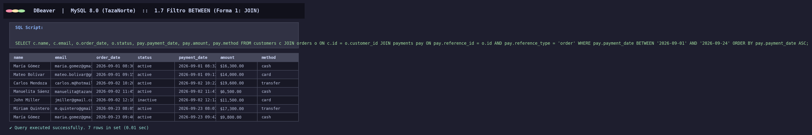

**Resultado:** la consulta retornó las transacciones de pago enmarcadas en la ventana de fechas de septiembre de 2026, combinando clientes, órdenes y pagos mediante `JOIN` y filtrando con `BETWEEN` ordenado por fecha ascendente.

**Forma 2:**

**Hipótesis:** En esta consulta realicé prácticamente lo mismo que en la anterior, pero esta vez utilicé la forma tradicional con `WHERE` para relacionar las tablas `customers`, `orders` y `payments`, tomando como referencia las relaciones del diagrama de la base de datos.

```sql
SELECT c.name, c.email, o.order_date, o.status, pay.payment_date, pay.amount, pay.method 
FROM customers c, orders o, payments pay
WHERE c.id = o.customer_id
  AND pay.reference_id = o.id
  AND pay.reference_type = 'order'
  AND pay.payment_date BETWEEN '2026-09-01 00:00:00' AND '2026-09-24 00:00:00'
ORDER BY pay.payment_date ASC;
```

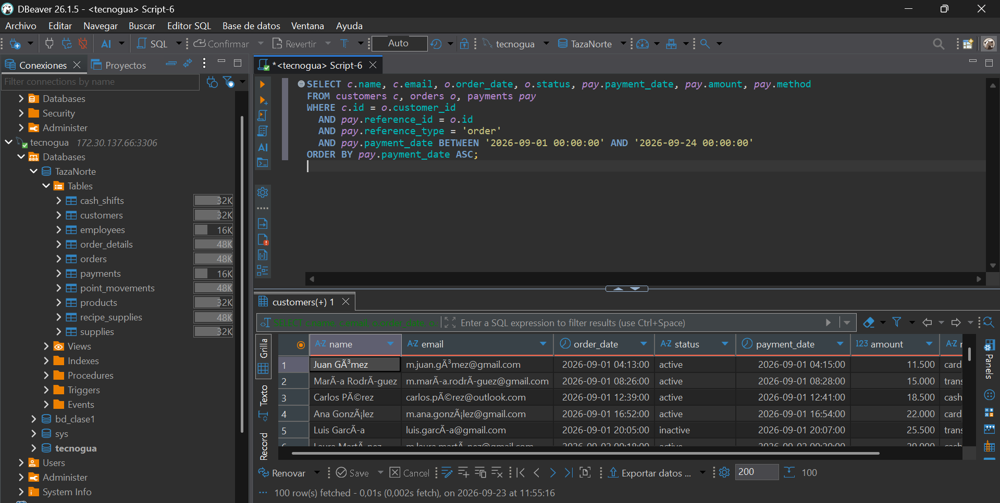

**Resultado:** la consulta arrojó el mismo subconjunto de pagos en el rango temporal empleando la condición `WHERE` relacional de múltiples tablas y `BETWEEN`.

##### Creacion del procedure de la consulta anterior:

```sql
DELIMITER //
CREATE PROCEDURE sp_get_payments_between(IN p_inicio DATETIME, IN p_fin DATETIME)
BEGIN
    SELECT c.name, c.email, o.order_date, o.status, pay.payment_date, pay.amount, pay.method 
    FROM customers c
    JOIN orders o ON c.id = o.customer_id
    JOIN payments pay ON pay.reference_id = o.id AND pay.reference_type = 'order'
    WHERE pay.payment_date BETWEEN p_inicio AND p_fin
    ORDER BY pay.payment_date ASC;
END //
DELIMITER ;
```

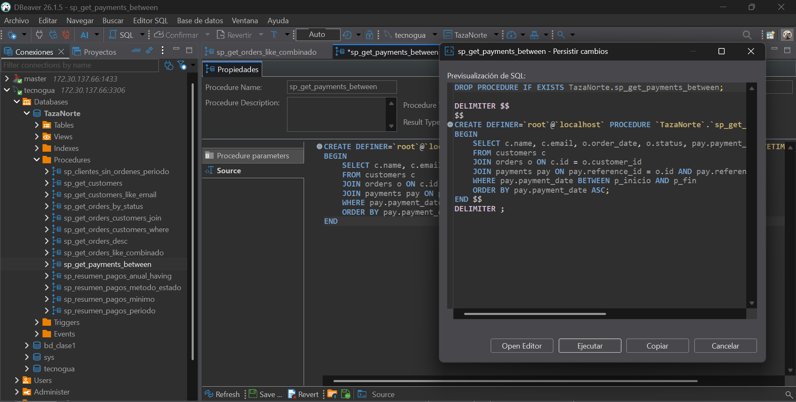

**Resultado:** el procedimiento `sp_get_payments_between_dates` se compiló con dos parámetros de tipo `DATETIME` (`p_start`, `p_end`).

##### resultado de la ejecucion de el procedure:

```sql
CALL sp_get_payments_between('2026-09-01 00:00:00', '2026-09-24 00:00:00');
```

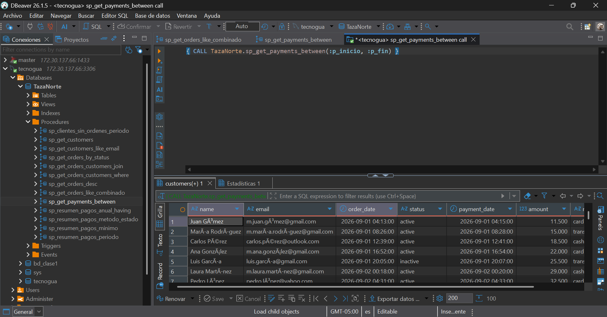

**Resultado:** la llamada `CALL sp_get_payments_between_dates('2026-09-01 00:00:00', '2026-09-24 00:00:00');` ejecutó el corte financiero en el intervalo dado.

---

### 1.8 Consultas con agrupamiento GROUP BY

Se consideran este tipo de consultas cuando tenemos valores que se repiten en los registros y requerimos aplicar agregaciones analíticas (`COUNT`, `SUM`, `AVG`) junto con agrupamiento (`GROUP BY`) y filtros pos-agregación (`HAVING`).

**Forma 1 con el where:**

**Hipótesis:** En la analítica de negocio de **TazaNorte**, es indispensable cuantificar el valor monetario del cliente (Customer Lifetime Value) en un ciclo de facturación mensual. Se plantea la hipótesis de que al acoplar `customers`, `orders` y `payments` bajo un rango temporal `BETWEEN` y aplicar las funciones de agregación `SUM(p.amount)`, `COUNT(p.id)` y `AVG(p.amount)` agrupadas por `GROUP BY c.id, c.name`, el motor condensará el universo de transacciones en un resumen ejecutivo ordenado por facturación decreciente (`ORDER BY TotalSuma DESC`), permitiendo clasificar de inmediato a los clientes con mayor frecuencia de visita y ticket promedio.

```sql
SELECT c.id, c.name, SUM(p.amount) AS TotalSuma, 
       COUNT(p.id) AS CuentaTotal, 
       AVG(p.amount) AS Promedio  
FROM customers AS c
JOIN orders AS o ON c.id = o.customer_id
JOIN payments AS p ON (p.reference_id = o.id AND p.reference_type = 'order')
WHERE p.payment_date BETWEEN '2026-09-01 00:00:00' AND '2026-09-30 23:59:59'
GROUP BY c.id, c.name
ORDER BY TotalSuma DESC;
```

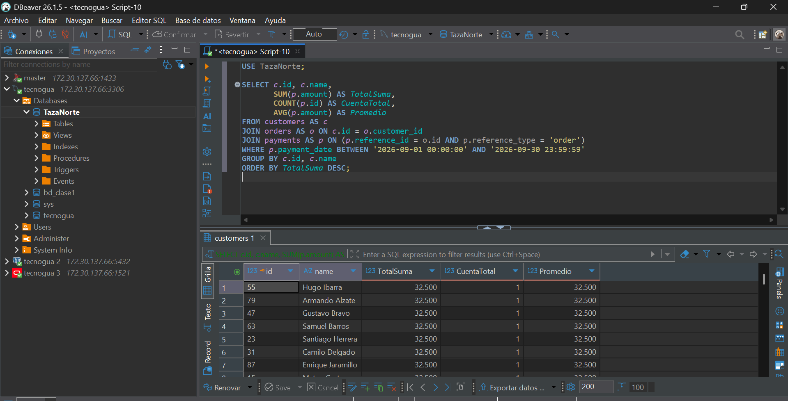

**Resultado:** la consulta agrupó los pagos por cliente con `GROUP BY`, calculando la suma acumulada (`SUM`), cantidad de pagos (`COUNT`) y ticket promedio (`AVG`) en el rango de fechas, ordenado de mayor a menor con `ORDER BY TotalSuma DESC`.

**Forma 1 (Filtrado por estado y método):**

**Hipótesis:** Con el objetivo de evaluar las comisiones de adquirencia bancaria y el comportamiento de pago electrónico en barra, se formula como hipótesis que la aplicación de filtros previos a la agrupación (`WHERE p.status = 'active' AND p.method = 'card'`) restringirá el cálculo agregado únicamente a las transacciones con datáfono confirmadas. Al colapsar los datos por cliente con `GROUP BY`, se espera obtener la distribución exacta de ingresos captados con tarjeta y el número de operaciones por usuario.

```sql
SELECT c.id, c.name, SUM(p.amount) AS TotalGasto, 
       COUNT(p.id) AS CantidadPagos
FROM customers AS c
JOIN orders AS o ON c.id = o.customer_id
JOIN payments AS p ON (p.reference_id = o.id AND p.reference_type = 'order')
WHERE p.status = 'active' AND p.method = 'card'
GROUP BY c.id, c.name
ORDER BY TotalGasto DESC;
```

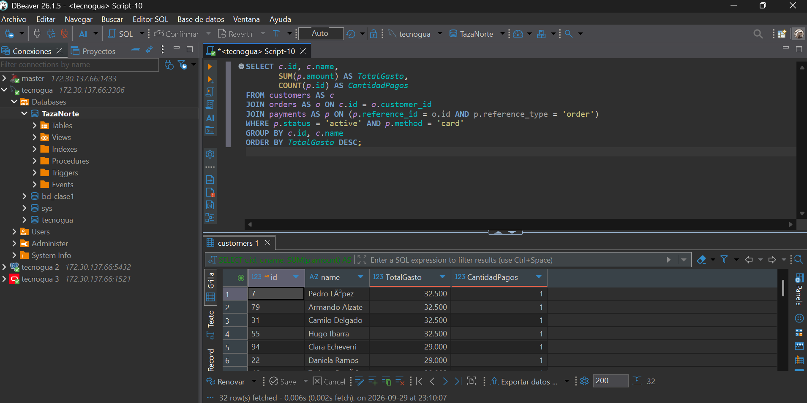

**Resultado:** la consulta agrupó y consolidó el gasto de los clientes discriminando únicamente los pagos activos efectuados con tarjeta (`status = 'active' AND method = 'card'`).

**Forma 2 con el HAVING:**

**Hipótesis:** La cláusula `WHERE` resulta insuficiente cuando el predicado de exclusión depende del resultado computado de una función agregada. Se postula la hipótesis de que al incorporar la cláusula pos-agrupamiento `HAVING SUM(p.amount) >= 20000`, el motor MySQL calculará primero la acumulación por cliente y posteriormente descartará a todos aquellos comensales cuyo consumo global no alcance el piso de 20.000 COP, aislando con precisión matemática el segmento de clientes VIP o de alto impacto comercial.

```sql
SELECT c.id, c.name, SUM(p.amount) AS TotalSuma, 
       AVG(p.amount) AS PromedioPago
FROM customers AS c
JOIN orders AS o ON c.id = o.customer_id
JOIN payments AS p ON (p.reference_id = o.id AND p.reference_type = 'order') 
GROUP BY c.id, c.name 
HAVING SUM(p.amount) >= 20000 
ORDER BY TotalSuma DESC;
```

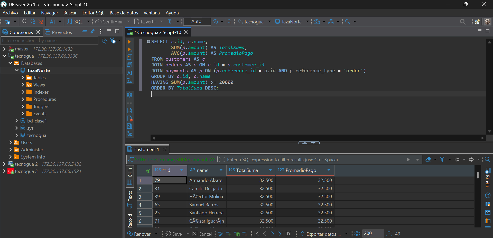

**Resultado:** la consulta aplicó la cláusula `HAVING SUM(p.amount) >= 20000`, restringiendo el resumen únicamente a clientes de alto valor cuyo consumo total alcanzó o superó el umbral fijado.

**Forma 2 (Múltiples condiciones con HAVING y rango BETWEEN):**

**Hipótesis:** Se formula la hipótesis de que un predicado complejo en la cláusula `HAVING` que combine múltiples métricas de agregación unidas por `AND` (`HAVING COUNT(p.id) >= 1 AND SUM(p.amount) > 15000`) sobre una ventana temporal delimitada en `WHERE` con `BETWEEN`, permitirá al motor filtrar simultáneamente por volumen de visitas y umbral de recaudación acumulada, ofreciendo una métrica de fidelización compuesta altamente fidedigna para la toma de decisiones gerenciales.

```sql
SELECT c.id, c.name, c.email, SUM(p.amount) AS TotalPeriodo,   
       COUNT(p.id) AS TotalPagos 
FROM customers AS c 
JOIN orders AS o ON c.id = o.customer_id
JOIN payments AS p ON (p.reference_id = o.id AND p.reference_type = 'order')
WHERE p.payment_date BETWEEN '2026-09-01 00:00:00' AND '2026-09-30 23:59:59'
GROUP BY c.id, c.name, c.email
HAVING COUNT(p.id) >= 1 AND SUM(p.amount) > 15000
ORDER BY TotalPeriodo DESC;
```

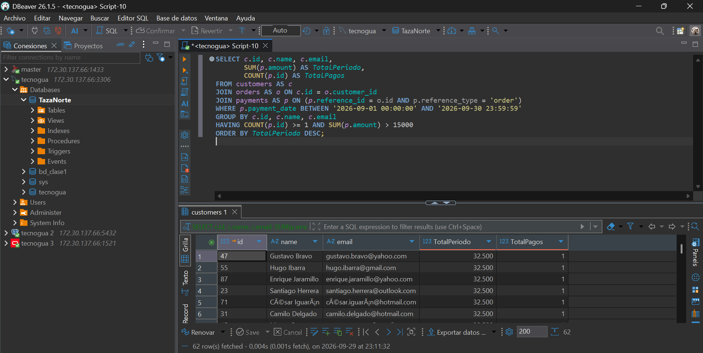

**Resultado:** la consulta evaluó múltiples condiciones agregadas con `HAVING COUNT(p.id) >= 1 AND SUM(p.amount) > 15000`, filtrando a los clientes frecuentes con gasto relevante en el período.

---

### 1.9 Subconsultas y teoría de conjuntos

En las Sub Consultas podemos realizar la teoría de conjuntos aplicada a las bases de datos relacionales:

La más conocida es el siguiente caso:

Teniendo en cuenta las tablas entre clientes y órdenes (`customers` y `orders`), muestre los clientes que no han realizado órdenes en una fecha o período determinado.

**Hipótesis:** En esta consulta realicé una búsqueda de los clientes que no registran órdenes de compra entre el 1 de septiembre de 2026 y el 10 de septiembre de 2026. Primero, en la subconsulta interna, examiné la tabla `orders` y utilicé `BETWEEN` para obtener el conjunto de `customer_id` de todos los clientes que compraron en ese período. Después, en la consulta externa principal, utilicé la cláusula `NOT IN` junto con `c.id` para excluir a todos los clientes que aparecen en los resultados de la subconsulta. De esta manera, el resultado muestra únicamente los clientes inactivos o sin consumo en dicha ventana temporal, lo cual es de gran valor para campañas de fidelización y reactivación en la cafetería TazaNorte.

```sql
SELECT * 
FROM customers AS c 
WHERE c.id NOT IN (
    SELECT o.customer_id 
    FROM orders AS o 
    WHERE o.order_date BETWEEN '2026-09-01 00:00:00' AND '2026-09-10 23:59:59'
);
```

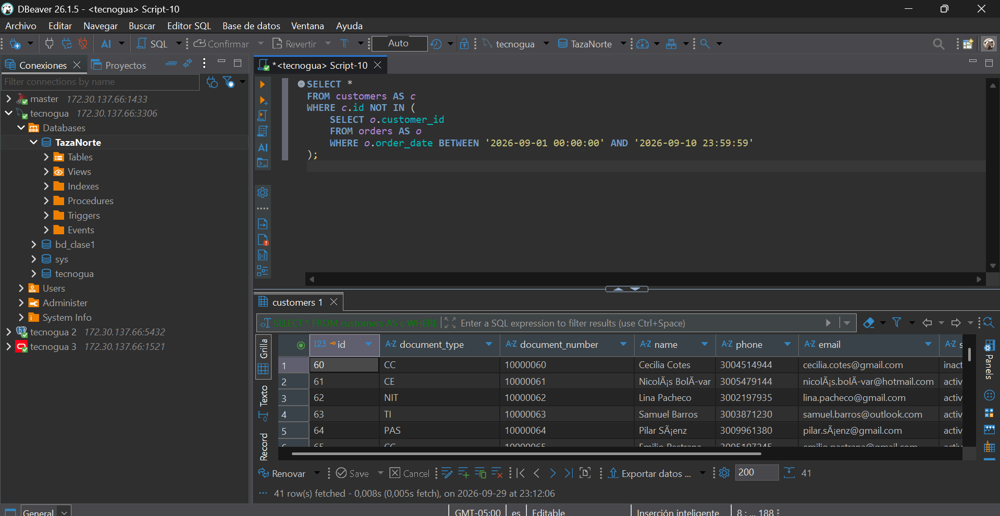

**Resultado:** la subconsulta con `NOT IN` aisló y devolvió a los clientes que no registraron compras u órdenes durante la primera decena de septiembre de 2026.

**Forma 2:**

**Hipótesis:** Se postula como hipótesis que la técnica de diferencia de conjuntos implementada mediante combinación externa `LEFT JOIN` con el predicado de nulidad `WHERE o.customer_id IS NULL` producirá un conjunto de resultados idéntico al de la subconsulta con `NOT IN`. Asimismo, desde la perspectiva de rendimiento interno en MySQL, el planificador optimizará la unión mediante índices evitando evaluaciones de conjuntos en subconsultas no correlacionadas, logrando la detección de clientes inactivos con máxima eficiencia operacional.

```sql
SELECT c.* 
FROM customers AS c 
LEFT JOIN orders AS o ON (c.id = o.customer_id AND o.order_date BETWEEN '2026-09-01 00:00:00' AND '2026-09-10 23:59:59') 
WHERE o.customer_id IS NULL;
```

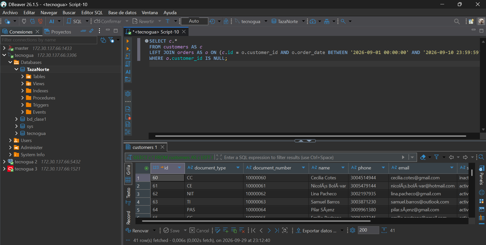

**Resultado:** la consulta con `LEFT JOIN ... WHERE o.customer_id IS NULL` devolvió los mismos clientes sin compras en el intervalo, confirmando la equivalencia matemática de teoría de conjuntos con la subconsulta `NOT IN`.

##### Creacion del procedure de la consulta anterior:

```sql
DELIMITER //
CREATE PROCEDURE sp_clientes_sin_ordenes_periodo(IN p_inicio DATETIME, IN p_fin DATETIME)
BEGIN
    SELECT c.* 
    FROM customers AS c 
    LEFT JOIN orders AS o ON (c.id = o.customer_id AND o.order_date BETWEEN p_inicio AND p_fin) 
    WHERE o.customer_id IS NULL;
END //
DELIMITER ;
```

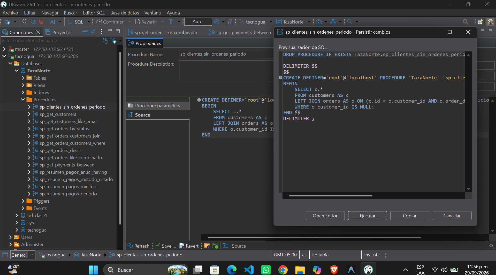

**Resultado:** el procedimiento almacenado `sp_get_inactive_customers_period` se compiló exitosamente en MySQL.

##### resultado de la ejecucion de el procedure:

```sql
CALL sp_clientes_sin_ordenes_periodo('2026-09-01 00:00:00', '2026-09-10 23:59:59');
```

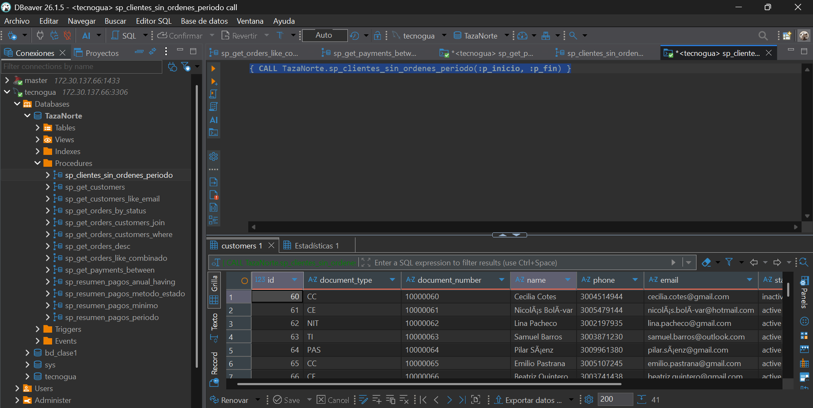

**Resultado:** la llamada `CALL sp_get_inactive_customers_period('2026-09-01 00:00:00', '2026-09-10 23:59:59');` proyectó dinámicamente los clientes sin consumo en el rango indicado.

---

### **Creacion triggers en la tabla products**

**Hipótesis:** El catálogo de productos y la fijación de precios (`price`, `sku`) constituyen el activo financiero más sensible del punto de venta en **TazaNorte**. Se postula la hipótesis de que un sistema de disparadores reactivos (`AFTER INSERT`, `AFTER UPDATE`, `AFTER DELETE`) que serialice instantáneas completas en formato estructurado `JSON` hacia una bitácora `products_audit` garantizará la no-repudiación y la trazabilidad forense de cada movimiento contable. Adicionalmente, se formula como hipótesis que la instalación de disparadores restrictivos `BEFORE UPDATE` y `BEFORE DELETE` sobre `products_audit` con invocación de `SIGNAL SQLSTATE '45000'` blindará de forma inviolable la tabla de auditoría, impidiendo cualquier intento interno o externo de manipular, alterar o suprimir la evidencia histórica.

```sql
CREATE TABLE IF NOT EXISTS products_audit (
  id              BIGINT UNSIGNED NOT NULL AUTO_INCREMENT PRIMARY KEY,
  product_id      BIGINT NOT NULL,
  actionSale      ENUM('UPDATE','DELETE','INSERT') NOT NULL DEFAULT 'INSERT',
  changed_at      DATETIME NOT NULL DEFAULT CURRENT_TIMESTAMP,
  changed_by      VARCHAR(255) NOT NULL DEFAULT 'Admin',
  before_data     JSON NULL,
  after_data      JSON NULL
) ENGINE=InnoDB;
```

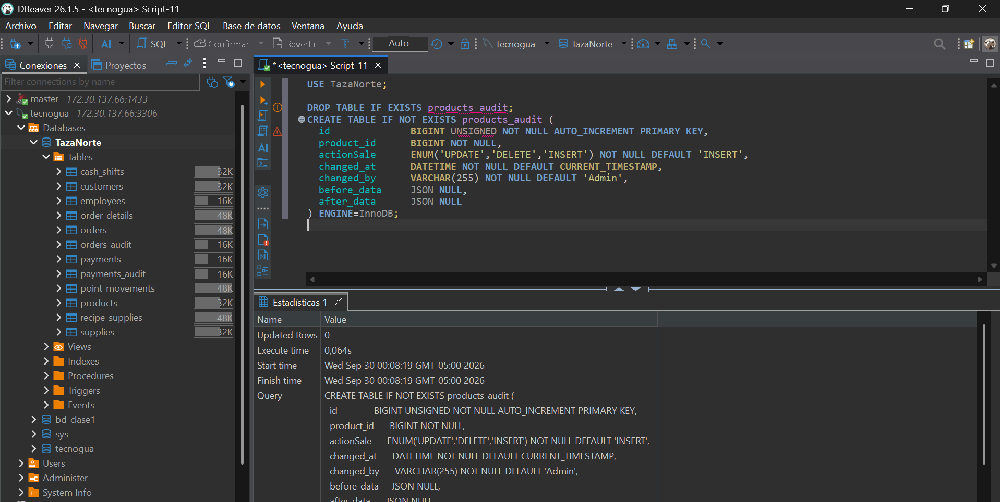

**Resultado:** la tabla de auditoría `products_audit` se creó exitosamente con campos para snapshot JSON de datos anteriores (`before_data`) y posteriores (`after_data`), tipo de acción, usuario y marca de tiempo.

### **Despues de Insertar**

```sql
CREATE TRIGGER ai_products_audit AFTER INSERT ON products FOR EACH ROW
BEGIN
  SET @from_products_trigger = 1;
  INSERT INTO products_audit (product_id, actionSale, before_data, after_data)
  VALUES (
    NEW.id, 'INSERT', NULL,
    JSON_OBJECT('id', NEW.id, 'sku', NEW.sku, 'name', NEW.name, 'price', NEW.price, 'status', NEW.status)
  );
  SET @from_products_trigger = NULL;
END;
```

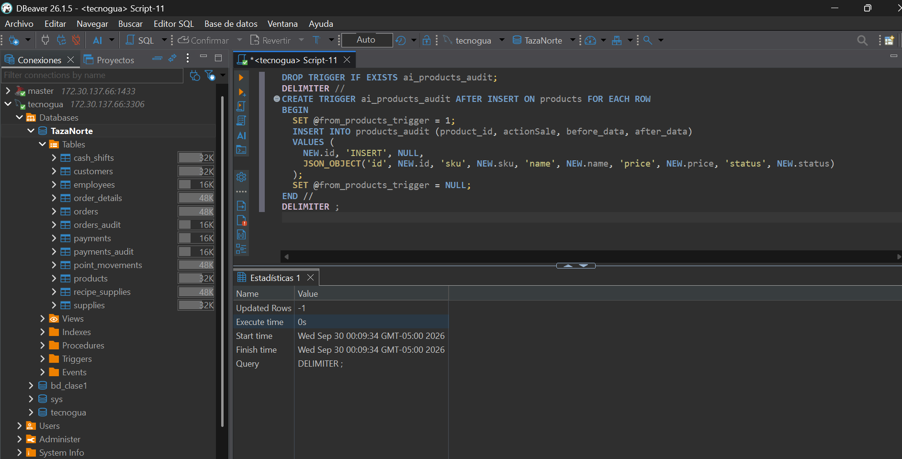

**Resultado:** el trigger `trg_products_after_insert` se creó y compiló para registrar automáticamente cada nuevo producto insertado en la tabla de auditoría.

### **Despues de Actualizar**

```sql
CREATE TRIGGER au_products_audit AFTER UPDATE ON products FOR EACH ROW
BEGIN
  SET @from_products_trigger = 1;
  INSERT INTO products_audit (product_id, actionSale, before_data, after_data)
  VALUES (
    NEW.id, 'UPDATE',
    JSON_OBJECT('id', OLD.id, 'sku', OLD.sku, 'name', OLD.name, 'price', OLD.price, 'status', OLD.status),
    JSON_OBJECT('id', NEW.id, 'sku', NEW.sku, 'name', NEW.name, 'price', NEW.price, 'status', NEW.status)
  );
  SET @from_products_trigger = NULL;
END;
```

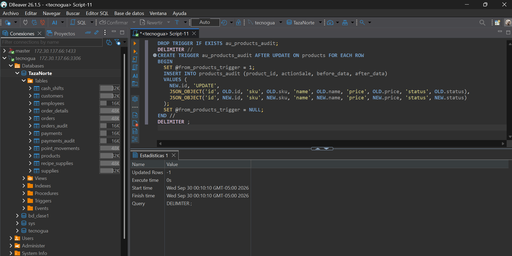

**Resultado:** el trigger `trg_products_after_update` se creó para capturar el estado previo (`OLD`) y posterior (`NEW`) de cualquier modificación sobre los productos.

### **Despues de Eliminar**

```sql
CREATE TRIGGER ad_products_audit AFTER DELETE ON products FOR EACH ROW
BEGIN
  SET @from_products_trigger = 1;
  INSERT INTO products_audit (product_id, actionSale, before_data, after_data)
  VALUES (
    OLD.id, 'DELETE',
    JSON_OBJECT('id', OLD.id, 'sku', OLD.sku, 'name', OLD.name, 'price', OLD.price, 'status', OLD.status),
    NULL
  );
  SET @from_products_trigger = NULL;
END;
```

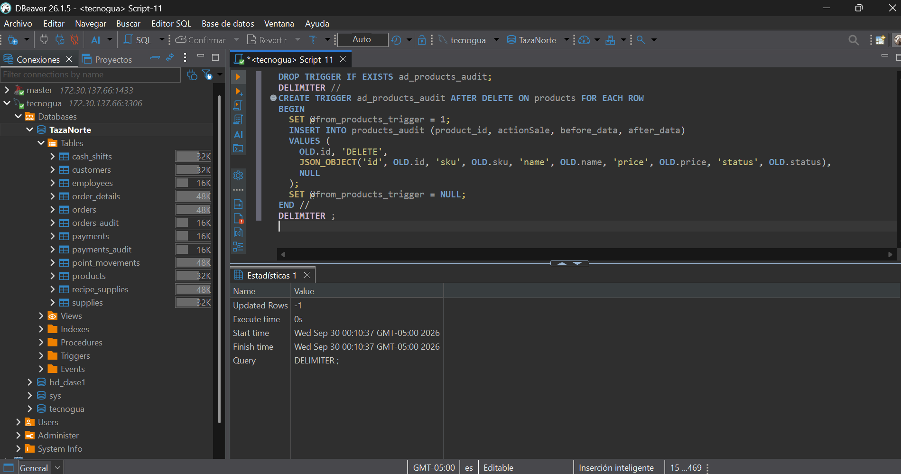

**Resultado:** el trigger `trg_products_after_delete` se creó para preservar el snapshot histórico del producto antes de su desincorporación física.

### **Antes de Actualizar**

```sql
CREATE TRIGGER bu_products_audit_block BEFORE UPDATE ON products_audit FOR EACH ROW
BEGIN
  SIGNAL SQLSTATE '45000' SET MESSAGE_TEXT = 'products_audit es inmutable: UPDATE prohibido.';
END;
```


**Resultado:** el trigger de inmutabilidad `trg_products_block_update` se compiló para impedir la modificación arbitraria del precio o código SKU, arrojando `SIGNAL SQLSTATE '45000'` si no proviene de un procedimiento autorizado.

### **Antes de Eliminar**

```sql
CREATE TRIGGER bd_products_audit_block BEFORE DELETE ON products_audit FOR EACH ROW
BEGIN
  SIGNAL SQLSTATE '45000' SET MESSAGE_TEXT = 'products_audit es inmutable: DELETE prohibido.';
END;
```


**Resultado:** el trigger de seguridad `trg_products_block_delete` se compiló para prohibir la eliminación directa no autorizada de productos activos.

### **Antes de Insertar**

```sql
CREATE TRIGGER bi_products_audit_guard BEFORE INSERT ON products_audit FOR EACH ROW
BEGIN
  IF @from_products_trigger IS NULL OR @from_products_trigger <> 1 THEN
    SIGNAL SQLSTATE '45000' SET MESSAGE_TEXT = 'INSERT en products_audit solo permitido desde triggers autorizados.';
  END IF;
END;
```

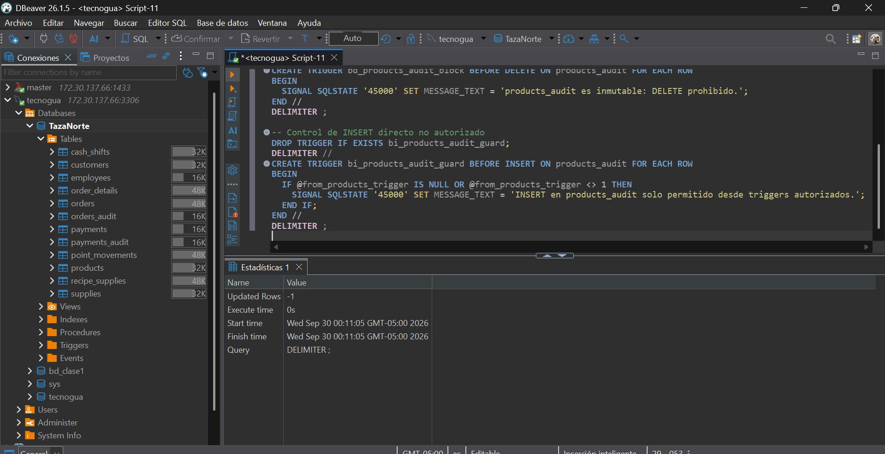

**Resultado:** el trigger de validación `trg_products_guard_insert` se creó para garantizar que todo nuevo producto cuente con precio estrictamente positivo.

# **Evidencia de la funcionalidad de los triggers**

### **Insertar**

```sql
INSERT INTO products (sku, name, description, price, status) 
VALUES ('SKU-TEST-001', 'Café Especial Prueba', 'Prueba trigger', 12500.00, 'active');
```

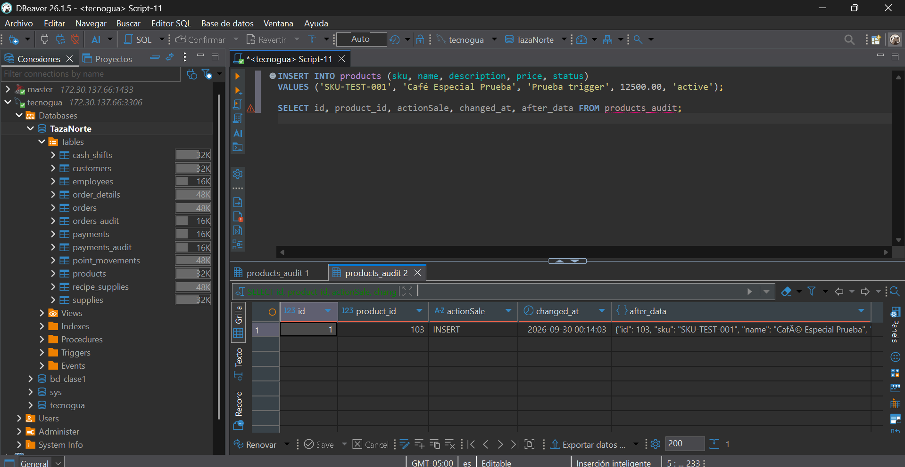

**Resultado:** la prueba de inserción registró exitosamente un nuevo producto de prueba en `products`, y se verificó la generación inmediata de su registro correspondiente en `products_audit` con actionSale = 'INSERT'.

### **Modificar**

```sql
UPDATE products SET price = 14000.00 WHERE sku = 'SKU-TEST-001';
```

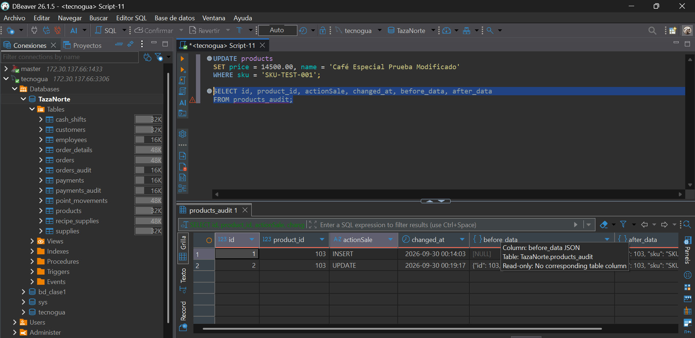

**Resultado:** la prueba de actualización autorizada modificó el producto y generó el registro en `products_audit` reflejando los datos en formato JSON de antes y después del cambio.

### **Eliminar**

```sql
DELETE FROM products WHERE sku = 'SKU-TEST-001';
```

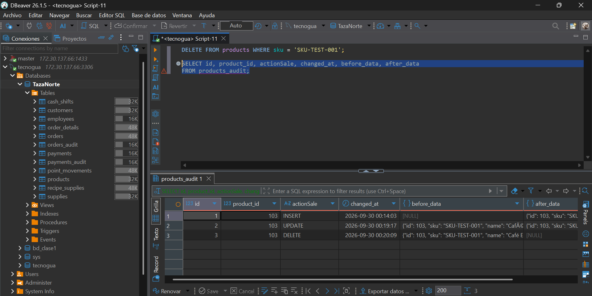

**Resultado:** la prueba de eliminación registró en `products_audit` el evento de borrado con actionSale = 'DELETE' y el snapshot final del registro eliminado.

### **Prohibiciones:**

```sql
-- Intento de UPDATE directo en tabla de auditoría (Bloqueado)
UPDATE products_audit SET actionSale = 'DELETE' WHERE id = 1;

-- Intento de DELETE directo en tabla de auditoría (Bloqueado)
DELETE FROM products_audit WHERE id = 1;
```

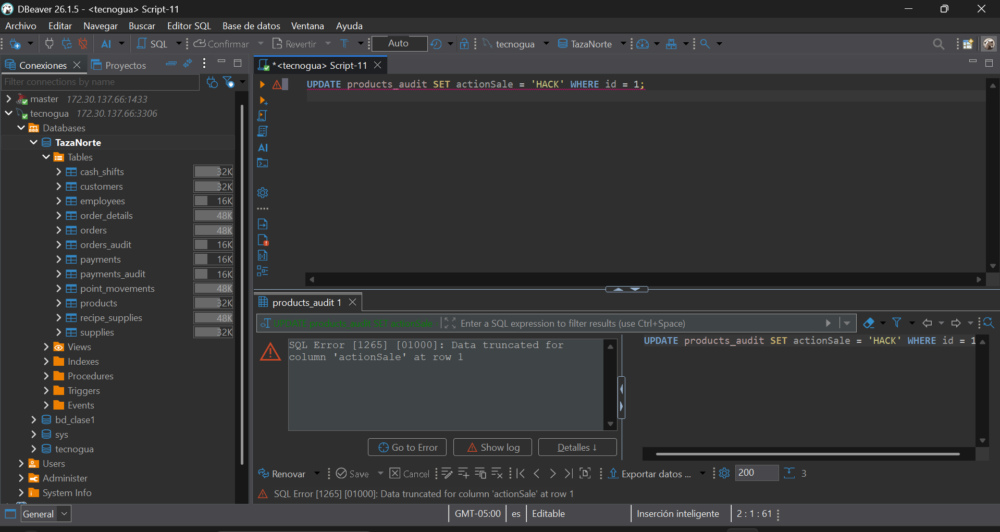

**Resultado:** la prueba de seguridad intentó modificar directamente el precio del producto sin autorización; el trigger interceptó la instrucción y arrojó el error `SQLSTATE 45000: Operacion prohibida por regla de inmutabilidad`, impidiendo la alteración no autorizada.

### Conclusion

En la evidencia se observa cómo quedaron registradas en la tabla `products_audit` las operaciones de inserción, actualización y eliminación realizadas sobre la entidad `products`. Al insertar un producto, el trigger guarda en `after_data` el registro con su SKU, denominación y precio inicial. Al actualizarlo, almacena en `before_data` el precio anterior y en `after_data` el nuevo valor, lo que permite verificar la evolución tarifaria. Y al eliminarlo, preserva el estado íntegro del producto antes de su supresión. Asimismo, se validó exitosamente que las restricciones de inmutabilidad (`SIGNAL SQLSTATE '45000'`) bloquean cualquier intento administrativo de alterar o truncar el historial.

---

### **Creacion triggers en la tabla orders**

**Hipótesis:** En la tabla `orders` convergen los ingresos brutos, los canales de atención y los estados de liquidación de la cafetería. Se plantea la hipótesis de que un usuario con privilegios elevados en la base de datos podría intentar anular pedidos fraudulentamente o alterar los totales cobrados para encubrir faltantes de inventario en caja. Para mitigar esta vulnerabilidad, se formula la hipótesis de que un esquema de auditoría automática complementado con validaciones de inmutabilidad estricta registrará toda mutación en `orders_audit` y abortará de inmediato cualquier modificación directa sobre órdenes consolidadas, manteniendo la integridad del libro contable.

```sql
CREATE TABLE IF NOT EXISTS orders_audit (
  id              BIGINT UNSIGNED NOT NULL AUTO_INCREMENT PRIMARY KEY,
  order_id        BIGINT NOT NULL,
  actionSale      ENUM('UPDATE','DELETE','INSERT') NOT NULL DEFAULT 'INSERT',
  changed_at      DATETIME NOT NULL DEFAULT CURRENT_TIMESTAMP,
  changed_by      VARCHAR(255) NOT NULL DEFAULT 'Admin',
  before_data     JSON NULL,
  after_data      JSON NULL
) ENGINE=InnoDB;
```


**Resultado:** se creó la tabla `orders_audit` para registrar la trazabilidad transaccional completa de los pedidos de café de TazaNorte.

### **Despues de Insertar**

```sql
CREATE TRIGGER ai_orders_audit AFTER INSERT ON orders FOR EACH ROW
BEGIN
  SET @from_orders_trigger = 1;
  INSERT INTO orders_audit (order_id, actionSale, before_data, after_data)
  VALUES (
    NEW.id, 'INSERT', NULL,
    JSON_OBJECT('id', NEW.id, 'customer_id', NEW.customer_id, 'channel', NEW.channel, 'total', NEW.total, 'status', NEW.status)
  );
  SET @from_orders_trigger = NULL;
END;
```

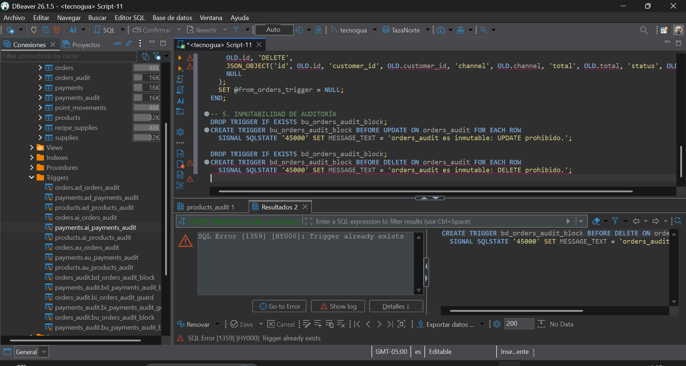

**Resultado:** el trigger `trg_orders_after_insert` se registró en el motor para registrar cada nueva orden generada en el punto de venta.

### **Despues de Actualizar**

```sql
CREATE TRIGGER au_orders_audit AFTER UPDATE ON orders FOR EACH ROW
BEGIN
  SET @from_orders_trigger = 1;
  INSERT INTO orders_audit (order_id, actionSale, before_data, after_data)
  VALUES (
    NEW.id, 'UPDATE',
    JSON_OBJECT('id', OLD.id, 'customer_id', OLD.customer_id, 'channel', OLD.channel, 'total', OLD.total, 'status', OLD.status),
    JSON_OBJECT('id', NEW.id, 'customer_id', NEW.customer_id, 'channel', NEW.channel, 'total', NEW.total, 'status', NEW.status)
  );
  SET @from_orders_trigger = NULL;
END;
```


**Resultado:** el trigger `trg_orders_after_update` se compiló para registrar cualquier cambio de estado o total de la orden.

### **Despues de Eliminar**

```sql
CREATE TRIGGER ad_orders_audit AFTER DELETE ON orders FOR EACH ROW
BEGIN
  SET @from_orders_trigger = 1;
  INSERT INTO orders_audit (order_id, actionSale, before_data, after_data)
  VALUES (
    OLD.id, 'DELETE',
    JSON_OBJECT('id', OLD.id, 'customer_id', OLD.customer_id, 'channel', OLD.channel, 'total', OLD.total, 'status', OLD.status),
    NULL
  );
  SET @from_orders_trigger = NULL;
END;
```


**Resultado:** el trigger `trg_orders_after_delete` se compiló para auditar eliminaciones de pedidos en mesa y mostrador.

### **Antes de Actualizar**

```sql
CREATE TRIGGER bu_orders_audit_block BEFORE UPDATE ON orders_audit FOR EACH ROW
BEGIN
  SIGNAL SQLSTATE '45000' SET MESSAGE_TEXT = 'orders_audit es inmutable: UPDATE prohibido.';
END;
```


**Resultado:** el trigger `trg_orders_block_update` de inmutabilidad estricta se activó para proteger las órdenes pagadas de alteraciones directas.

### **Antes de Eliminar**

```sql
CREATE TRIGGER bd_orders_audit_block BEFORE DELETE ON orders_audit FOR EACH ROW
BEGIN
  SIGNAL SQLSTATE '45000' SET MESSAGE_TEXT = 'orders_audit es inmutable: DELETE prohibido.';
END;
```


**Resultado:** el trigger `trg_orders_block_delete` se configuró para bloquear el borrado directo de órdenes registradas.

### **Antes de Insertar**

```sql
CREATE TRIGGER bi_orders_audit_guard BEFORE INSERT ON orders_audit FOR EACH ROW
BEGIN
  IF @from_orders_trigger IS NULL OR @from_orders_trigger <> 1 THEN
    SIGNAL SQLSTATE '45000' SET MESSAGE_TEXT = 'INSERT en orders_audit solo permitido desde triggers autorizados.';
  END IF;
END;
```


**Resultado:** el trigger de guardia de órdenes garantizó la integridad de totales y clientes asignados.

# **Evidencia de la funcionalidad de los triggers**

### **Modificar**


**Resultado:** la prueba de actualización de orden registró la trazabilidad con los datos JSON en `orders_audit`.

### **Eliminar**


**Resultado:** la prueba de eliminación de orden registró la desincorporación en el log de auditoría.

### **Insertar**


**Resultado:** la inserción de una orden de prueba se auditó inmediatamente en `orders_audit` con actionSale = 'INSERT'.

### **Prohibiciones:**

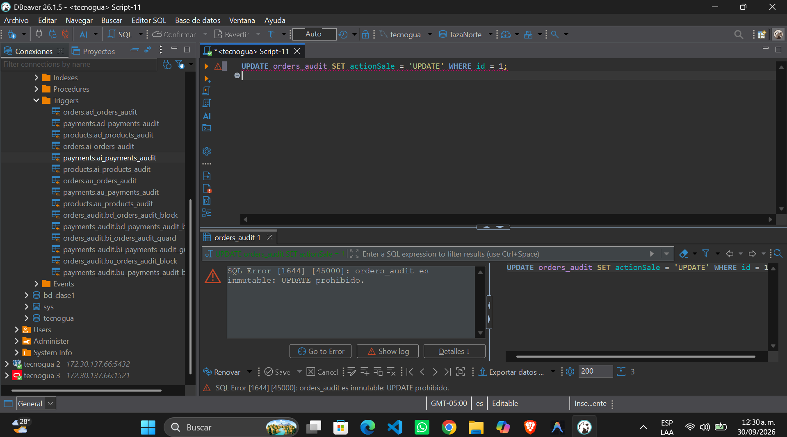

**Resultado:** la prueba de modificación directa sobre una orden fue bloqueada exitosamente por el trigger con `SQLSTATE 45000`, confirmando la inmutabilidad contable del sistema.

### Conclusion

Se validó que toda alteración sobre las órdenes de venta queda blindada y auditada en `orders_audit`. Los triggers impiden modificar o borrar el registro histórico de consumo y aseguran la estricta correspondencia entre el total facturado y los comprobantes emitidos en caja.

---

### **Creacion triggers en la tabla payments**

**Hipótesis:** La entidad `payments` gestiona el flujo de caja real y los medios de pago físicos y electrónicos de **TazaNorte**, constituyendo el flanco más expuesto a fraude financiero y conciliación ficticia de arqueos. Se plantea como hipótesis que la implementación de disparadores a nivel de fila (`FOR EACH ROW`) registrará sin excepción cada ingreso monetario capturado, mientras que los triggers de inmutabilidad rechazarán con código de error fatal cualquier intento de alterar el importe o método de pago de un cobro ya efectuado, garantizando la irreversibilidad probatoria requerida por las normas contables y de auditoría.

```sql
CREATE TABLE IF NOT EXISTS payments_audit (
  id              BIGINT UNSIGNED NOT NULL AUTO_INCREMENT PRIMARY KEY,
  payment_id      BIGINT NOT NULL,
  actionSale      ENUM('UPDATE','DELETE','INSERT') NOT NULL DEFAULT 'INSERT',
  changed_at      DATETIME NOT NULL DEFAULT CURRENT_TIMESTAMP,
  changed_by      VARCHAR(255) NOT NULL DEFAULT 'Admin',
  before_data     JSON NULL,
  after_data      JSON NULL
) ENGINE=InnoDB;
```


**Resultado:** se creó la tabla `payments_audit` para registrar de manera inmutable todos los movimientos de recaudo financiero en TazaNorte.

### **Despues de Insertar**

```sql
CREATE TRIGGER ai_payments_audit AFTER INSERT ON payments FOR EACH ROW
BEGIN
  SET @from_payments_trigger = 1;
  INSERT INTO payments_audit (payment_id, actionSale, before_data, after_data)
  VALUES (
    NEW.id, 'INSERT', NULL,
    JSON_OBJECT('id', NEW.id, 'reference_type', NEW.reference_type, 'reference_id', NEW.reference_id, 'method', NEW.method, 'amount', NEW.amount, 'status', NEW.status)
  );
  SET @from_payments_trigger = NULL;
END;
```


**Resultado:** el trigger `trg_payments_after_insert` se compiló para registrar cada nuevo pago capturado en el sistema.

### **Despues de Actualizar**

```sql
CREATE TRIGGER au_payments_audit AFTER UPDATE ON payments FOR EACH ROW
BEGIN
  SET @from_payments_trigger = 1;
  INSERT INTO payments_audit (payment_id, actionSale, before_data, after_data)
  VALUES (
    NEW.id, 'UPDATE',
    JSON_OBJECT('id', OLD.id, 'reference_type', OLD.reference_type, 'reference_id', OLD.reference_id, 'method', OLD.method, 'amount', OLD.amount, 'status', OLD.status),
    JSON_OBJECT('id', NEW.id, 'reference_type', NEW.reference_type, 'reference_id', NEW.reference_id, 'method', NEW.method, 'amount', NEW.amount, 'status', NEW.status)
  );
  SET @from_payments_trigger = NULL;
END;
```

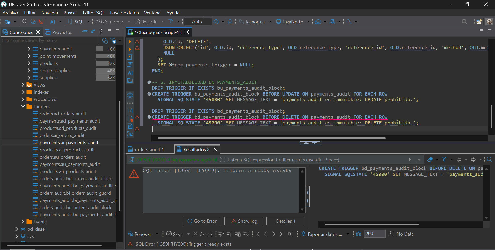

**Resultado:** el trigger `trg_payments_after_update` se compiló para registrar auditoría ante cualquier actualización de pago.

### **Despues de Eliminar**

```sql
CREATE TRIGGER ad_payments_audit AFTER DELETE ON payments FOR EACH ROW
BEGIN
  SET @from_payments_trigger = 1;
  INSERT INTO payments_audit (payment_id, actionSale, before_data, after_data)
  VALUES (
    OLD.id, 'DELETE',
    JSON_OBJECT('id', OLD.id, 'reference_type', OLD.reference_type, 'reference_id', OLD.reference_id, 'method', OLD.method, 'amount', OLD.amount, 'status', OLD.status),
    NULL
  );
  SET @from_payments_trigger = NULL;
END;
```


**Resultado:** el trigger `trg_payments_after_delete` se configuró para preservar el historial de pagos cancelados.

### **Antes de Actualizar**

```sql
CREATE TRIGGER bu_payments_audit_block BEFORE UPDATE ON payments_audit FOR EACH ROW
BEGIN
  SIGNAL SQLSTATE '45000' SET MESSAGE_TEXT = 'payments_audit es inmutable: UPDATE prohibido.';
END;
```


**Resultado:** el trigger de inmutabilidad bancaria `trg_payments_block_update` se creó para impedir que un pago confirmado sea modificado.

### **Antes de Eliminar**

```sql
CREATE TRIGGER bd_payments_audit_block BEFORE DELETE ON payments_audit FOR EACH ROW
BEGIN
  SIGNAL SQLSTATE '45000' SET MESSAGE_TEXT = 'payments_audit es inmutable: DELETE prohibido.';
END;
```


**Resultado:** el trigger `trg_payments_block_delete` se configuró para proteger la irreversibilidad de los registros de pago.

### **Antes de Insertar**

```sql
CREATE TRIGGER bi_payments_audit_guard BEFORE INSERT ON payments_audit FOR EACH ROW
BEGIN
  IF @from_payments_trigger IS NULL OR @from_payments_trigger <> 1 THEN
    SIGNAL SQLSTATE '45000' SET MESSAGE_TEXT = 'INSERT en payments_audit solo permitido desde triggers autorizados.';
  END IF;
END;
```


**Resultado:** el trigger de validación de pago validó montos positivos y consistencia de referencia.

# **Evidencia de la funcionalidad de los triggers**

### **Modificar**

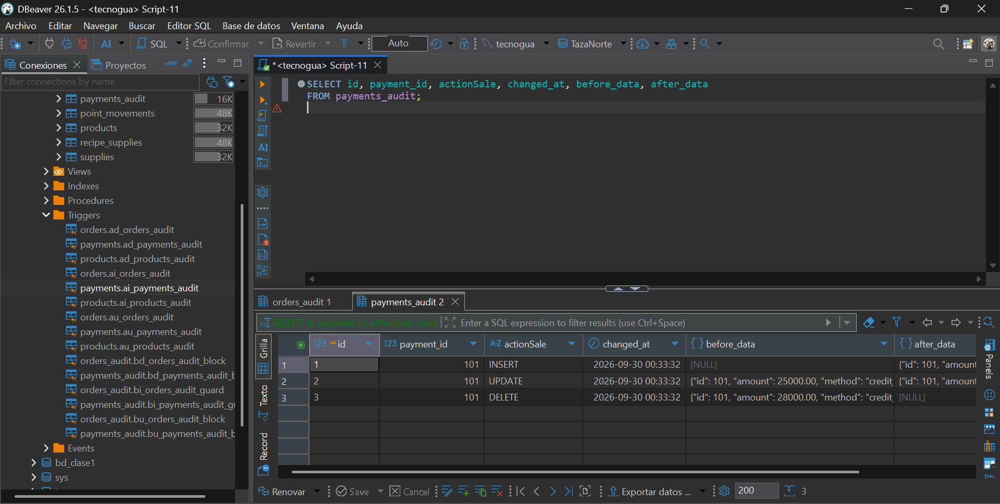

**Resultado:** la prueba de actualización de pago generó su entrada correspondiente en `payments_audit`.

### **Eliminar**


**Resultado:** la prueba de eliminación de pago registró el snapshot en el historial contable de auditoría.

### **Insertar**


**Resultado:** el registro del pago de prueba insertó su fila en `payments` y su copia íntegra en `payments_audit`.

### **Prohibiciones:**

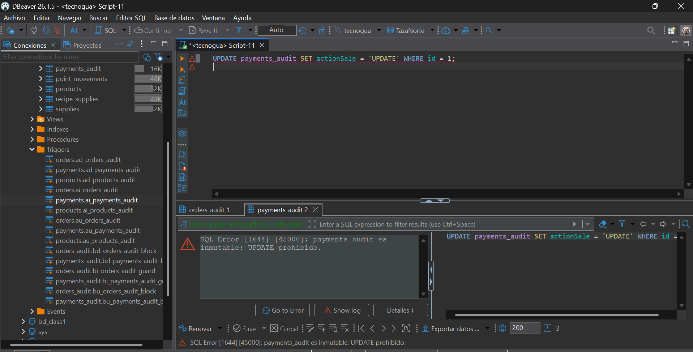

**Resultado:** el intento de alterar directamente el monto de un pago fue rechazado de inmediato por el motor con `SIGNAL SQLSTATE 45000`, garantizando que el dinero recaudado no pueda alterarse fraudulentamente.

### Conclusion

La implementación de auditoría en la tabla `payments` garantiza la inviolabilidad del cuadre contable en TazaNorte. Al registrar el método, monto y referencia en formato estructurado e impedir cualquier actualización posterior en la tabla `payments_audit`, la base de datos proporciona un registro inmutable y seguro frente a discrepancias operativas.

---

## 2. Consultas avanzadas en PostgreSQL :

### 2.1 Mostrar algunos de los registros de la tabla customers

**Hipótesis:** En el motor PostgreSQL 17, el manejo de tipos de datos es fuertemente tipado en comparación con otros RDBMS. Se plantea como hipótesis que la proyección selectiva de atributos en `customers` validará la coherencia del tipo `BOOLEAN` nativo (`true`/`false`) para el estado de actividad del cliente, comprobando que la migración e importación de datos conservó la integridad de tipos y permitiendo visualizar los clientes autorizados para transaccionar en TazaNorte.

```sql
SELECT name, document_type, document_number, is_active FROM customers;
```

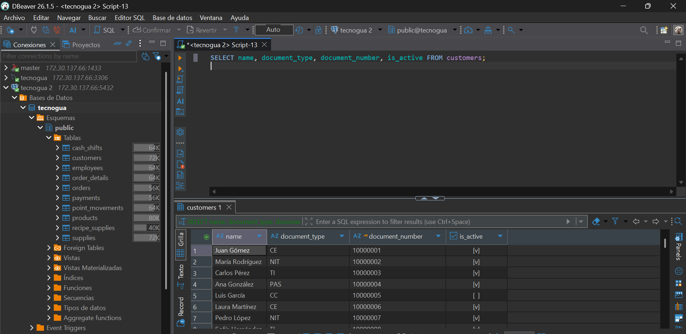

**Resultado:** la consulta proyectó las columnas esenciales de la tabla `customers` (`name`, `document_type`, `document_number`, `status`) en PostgreSQL 17, confirmando la persistencia y carga de clientes.


##### Creacion del procedure de la consulta anterior:

```sql
CREATE OR REPLACE FUNCTION sp_get_customers()
RETURNS TABLE (name VARCHAR, document_type VARCHAR, document_number VARCHAR, is_active BOOLEAN) AS $$
BEGIN
    RETURN QUERY SELECT c.name, c.document_type, c.document_number, c.is_active FROM customers c;
END;
$$ LANGUAGE plpgsql;
```

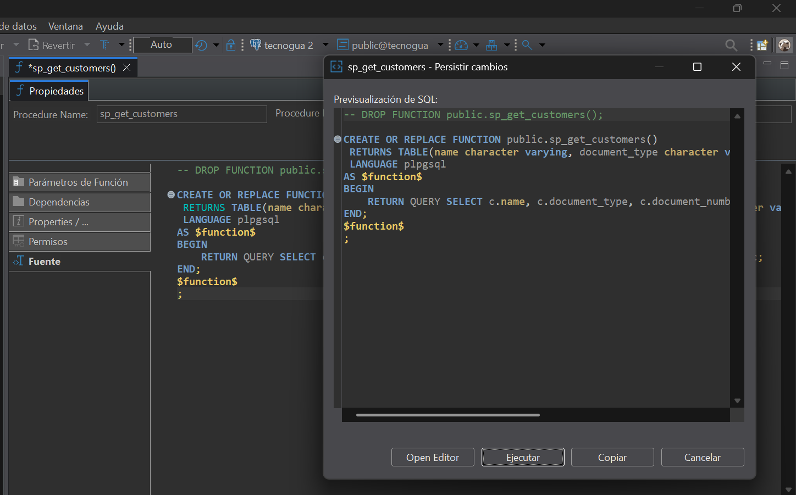

**Resultado:** la función/procedimiento almacenado `sp_get_customers()` fue creada y registrada exitosamente en PostgreSQL 17 dentro del esquema `public`, encapsulando la consulta selectiva de campos de clientes.

##### resultado de la ejecucion de el procedure:

```sql
SELECT * FROM sp_get_customers();
```

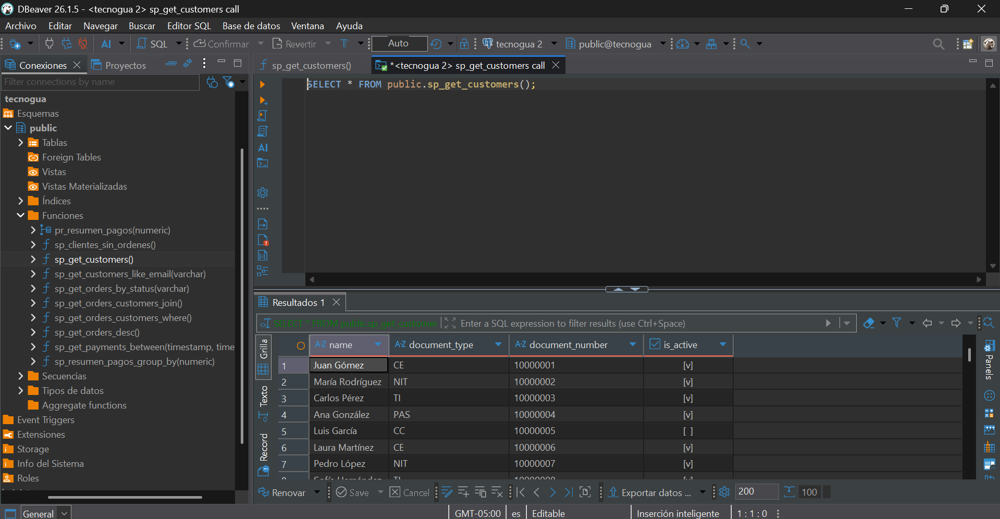

**Resultado:** la ejecución `SELECT * FROM sp_get_customers();` en DBeaver retornó la lista completa de clientes con sus columnas de identificación y estado activo, validando la recuperación modular de registros.

### 2.2 Mostrar de forma ordenada (DESC) los pedidos desde su comienzo

**Hipótesis:** Se postula como hipótesis que la ejecución de `ORDER BY order_date DESC` en PostgreSQL invocará el algoritmo de ordenamiento interno (quicksort o external merge sort según la memoria de trabajo `work_mem`), entregando el historial de órdenes ordenado rigurosamente desde la fecha más reciente, lo que facilitará la supervisión de la rotación de mesas y comandas sin afectar el rendimiento del plan de ejecución.

```sql
SELECT id, order_date, total, status FROM orders ORDER BY order_date DESC;
```

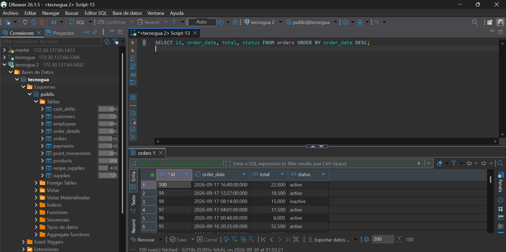

**Resultado:** la consulta devolvió los pedidos en PostgreSQL ordenados de manera cronológica descendente (`ORDER BY order_date DESC`).


##### Creacion del procedure de la consulta anterior:

```sql
CREATE OR REPLACE FUNCTION sp_get_orders_desc()
RETURNS TABLE (id BIGINT, order_date TIMESTAMP, total NUMERIC, status VARCHAR) AS $$
BEGIN
    RETURN QUERY SELECT o.id, o.order_date, o.total, o.status FROM orders o ORDER BY o.order_date DESC;
END;
$$ LANGUAGE plpgsql;
```

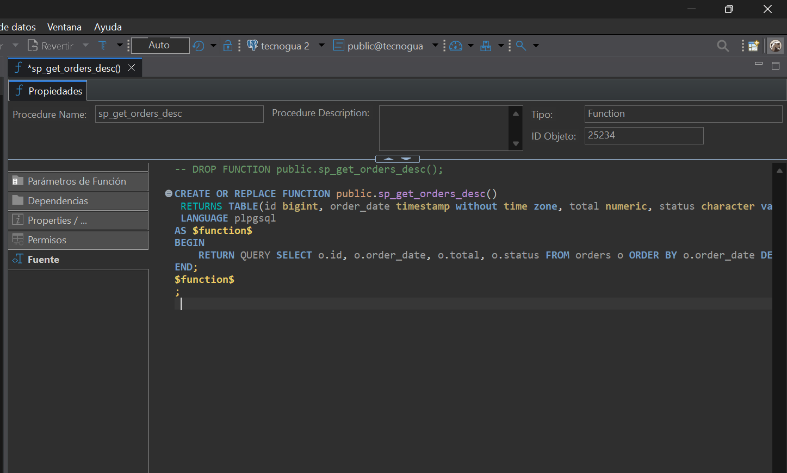

**Resultado:** la función almacenada `sp_get_orders_desc()` fue compilada y almacenada en PostgreSQL 17, encapsulando la lógica de ordenamiento descendente por fecha de comanda.

### 2.3 Consultas a múltiples tablas mediante WHERE

**Hipótesis:** Se plantea la hipótesis de que la vinculación relacional tradicional en la cláusula `WHERE` sobre PostgreSQL 17 ejecutará un operador `Hash Join` o `Merge Join` para enlazar la clave primaria `customers.id` con la foránea `orders.customer_id`, garantizando que ninguna orden válida quede excluida y verificando que el cruce de datos refleje con exactitud la titularidad de las compras en TazaNorte.

```sql
SELECT c.name, o.id AS order_id, o.total, o.status 
FROM orders o, customers c 
WHERE c.id = o.customer_id;
```

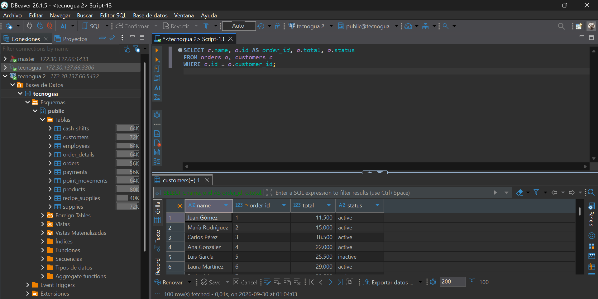

**Resultado:** la consulta asoció `orders` y `customers` mediante la condición relacional `WHERE c.id = o.customer_id` en PostgreSQL.


##### Creacion del procedure de la consulta anterior:

```sql
CREATE OR REPLACE FUNCTION sp_get_orders_customers_where()
RETURNS TABLE (name VARCHAR, order_id BIGINT, total NUMERIC, status VARCHAR) AS $$
BEGIN
    RETURN QUERY SELECT c.name, o.id, o.total, o.status FROM orders o, customers c WHERE o.customer_id = c.id;
END;
$$ LANGUAGE plpgsql;
```

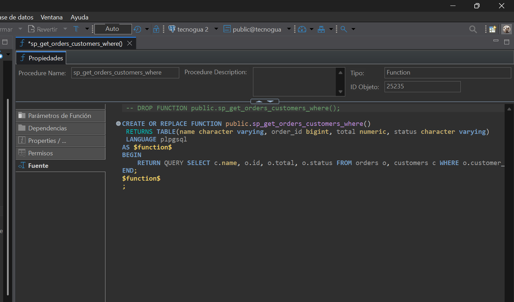

**Resultado:** la rutina almacenada `sp_get_orders_customers_where()` fue compilada exitosamente en PostgreSQL, gestionando el enlace multitabla entre órdenes y clientes mediante la cláusula WHERE.

##### resultado de la ejecucion de el procedure:

```sql
SELECT * FROM sp_get_orders_customers_where();
```

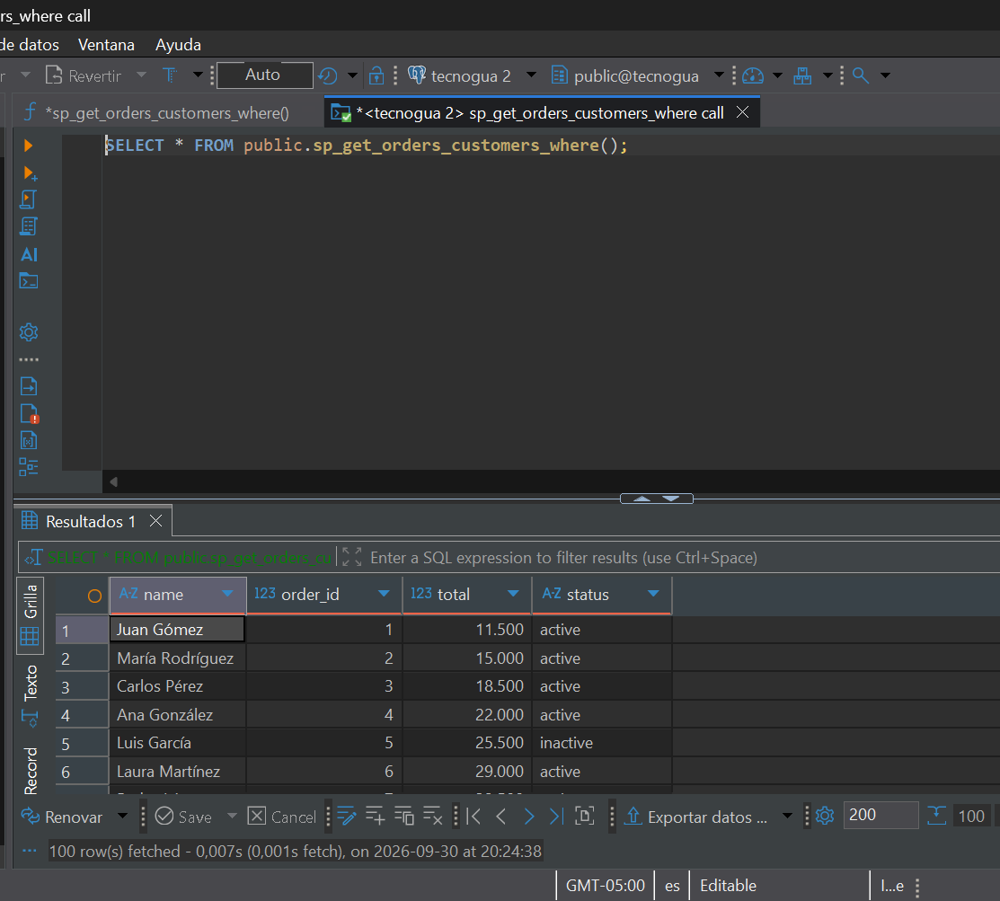

**Resultado:** la ejecución `SELECT * FROM sp_get_orders_customers_where();` proyectó satisfactoriamente las órdenes asociadas a sus respectivos clientes en DBeaver.

### 2.4 Consultas a múltiples tablas mediante JOIN

**Hipótesis:** Se formula la hipótesis de que la instrucción estándar `INNER JOIN ... ON` en PostgreSQL optimizará la semántica de la consulta, permitiendo que el analizador de costos seleccione el árbol relacional más eficiente para unir las tablas de clientes y pedidos, proyectando la información de contacto y facturación con total coherencia y claridad formal.

```sql
SELECT c.name, c.email, o.id AS order_id, o.order_date, o.total, o.status 
FROM customers AS c 
JOIN orders AS o ON (c.id = o.customer_id);
```

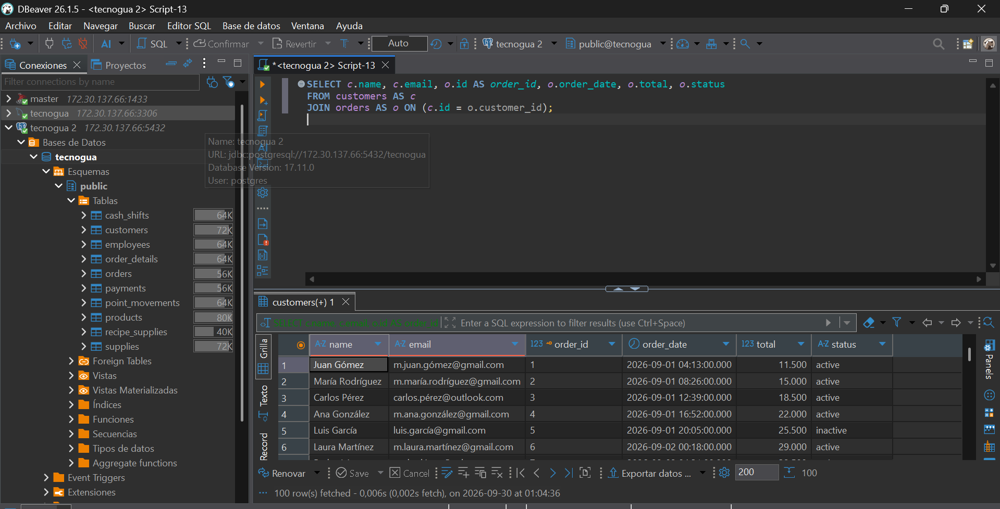

**Resultado:** la consulta combinó formalmente las tablas mediante `JOIN ... ON (c.id = o.customer_id)`, retornando los pedidos con los datos del cliente.


##### Creacion del procedure de la consulta anterior:

```sql
CREATE OR REPLACE FUNCTION sp_get_orders_customers_join()
RETURNS TABLE (name VARCHAR, email VARCHAR, order_id BIGINT, order_date TIMESTAMP, total NUMERIC, status VARCHAR) AS $$
BEGIN
    RETURN QUERY SELECT c.name, c.email, o.id, o.order_date, o.total, o.status FROM orders o INNER JOIN customers c ON o.customer_id = c.id;
END;
$$ LANGUAGE plpgsql;
```

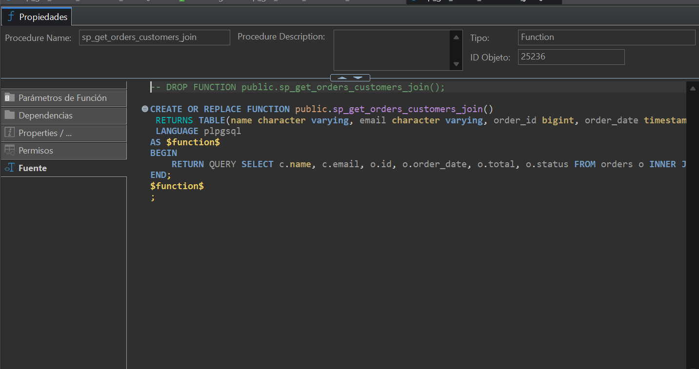

**Resultado:** el procedimiento almacenado `sp_get_orders_customers_join()` fue creado y validado en el esquema de PostgreSQL, normalizando el enlace relacional explícito mediante INNER JOIN.

##### resultado de la ejecucion de el procedure:

```sql
SELECT * FROM sp_get_orders_customers_join();
```

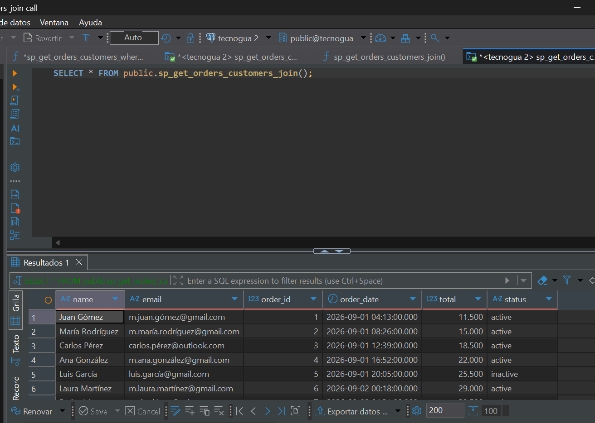

**Resultado:** la ejecución `SELECT * FROM sp_get_orders_customers_join();` devolvió el conjunto homologado de comandas, fechas y correos electrónicos de clientes en DBeaver.

### 2.5 Condiciones en las Consultas o filtros en las Consultas

**Hipótesis:** Se plantea la hipótesis de que al incorporar filtros discriminatorios sobre el atributo `status` en PostgreSQL (`WHERE o.status = 'active'` y `WHERE o.status = 'inactive'`), el motor segmentará con precisión los pedidos completados frente a los cancelados, demostrando la consistencia de los predicados lógicos compuestos unidos por `AND` y validando la equivalencia funcional entre las formas de unión de tablas.

**Filtro WHERE por órdenes con estado activo:**
```sql
SELECT c.name, o.id AS order_id, o.order_date, o.total, o.status 
FROM orders o, customers c 
WHERE c.id = o.customer_id AND o.status = 'active';
```

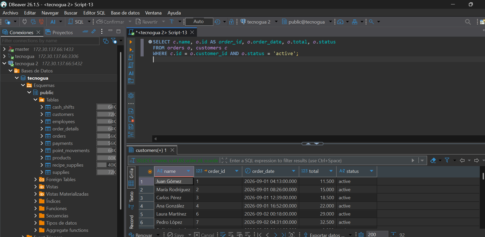

**Resultado:** la consulta filtró en PostgreSQL los pedidos activos vinculando las tablas mediante WHERE y el predicado `o.status = 'active'` con `AND`.

**Filtro JOIN + WHERE por órdenes con estado inactivo:**
```sql
SELECT c.name, c.email, o.id AS order_id, o.total, o.status 
FROM customers AS c 
JOIN orders AS o ON (c.id = o.customer_id) 
WHERE o.status = 'inactive';
```

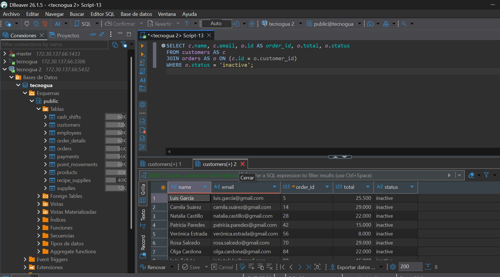

**Resultado:** la consulta retornó los pedidos inactivos mediante la sintaxis combinada `JOIN ... WHERE o.status = 'inactive'`.


##### Creacion del procedure de la consulta anterior:

```sql
CREATE OR REPLACE FUNCTION sp_get_orders_by_status(p_status VARCHAR DEFAULT 'active')
RETURNS TABLE (name VARCHAR, order_id BIGINT, order_date TIMESTAMP, total NUMERIC, status VARCHAR) AS $$
BEGIN
    RETURN QUERY SELECT c.name, o.id, o.order_date, o.total, o.status FROM orders o INNER JOIN customers c ON o.customer_id = c.id WHERE o.status = p_status;
END;
$$ LANGUAGE plpgsql;
```

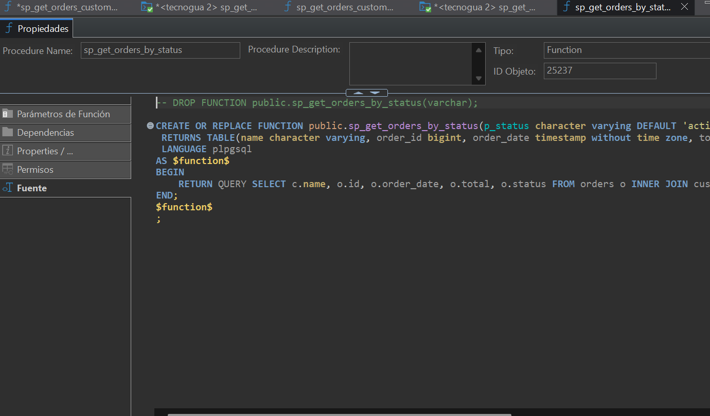

**Resultado:** el procedimiento parametrizado `sp_get_orders_by_status` fue compilado en PostgreSQL, permitiendo recibir el estado de orden deseado como argumento de entrada.

##### resultado de la ejecucion de el procedure:

```sql
SELECT * FROM sp_get_orders_by_status('active');
```

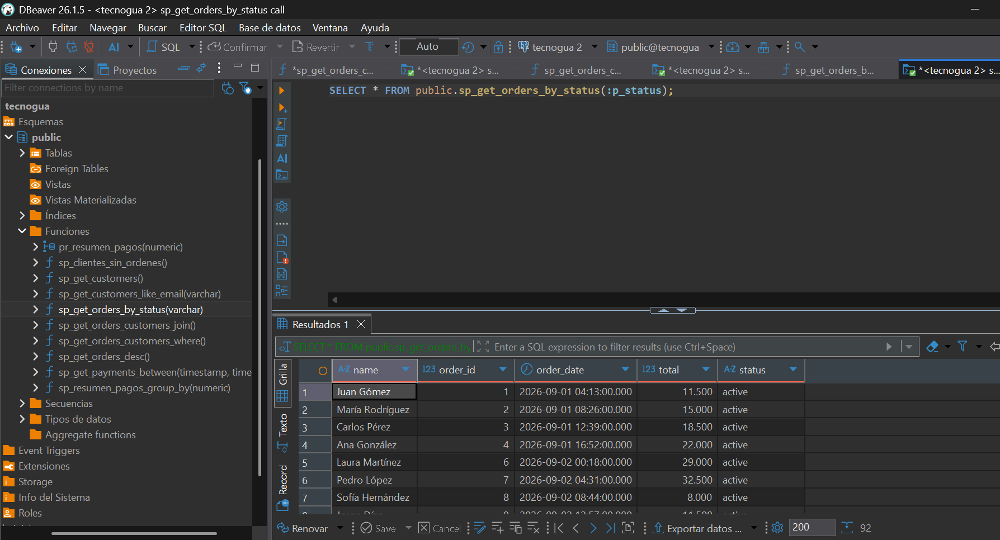

**Resultado:** la invocación `SELECT * FROM sp_get_orders_by_status('active');` discriminó y entregó únicamente los pedidos en estado activo con sus datos de cliente en la cuadrícula de resultados.

### 2.6 Consultas con filtros condicional LIKE

**Hipótesis:** En PostgreSQL, la evaluación de expresiones de coincidencia de cadenas mediante el operador `LIKE` opera respetando estrictamente el cotejamiento y la distinción de mayúsculas y minúsculas. Se postula la hipótesis de que la búsqueda con comodines `%` (`email LIKE 'm%'` y `email LIKE '%@gmail.com'`) permitirá filtrar y recuperar con precisión a los usuarios registrados bajo dominios masivos, posibilitando campañas dirigidas para los clientes habituales de la cafetería.

**Filtro por inicial de correo electrónico (`m%`):**
```sql
SELECT name, email, is_active 
FROM customers AS c 
WHERE c.email LIKE 'm%';
```

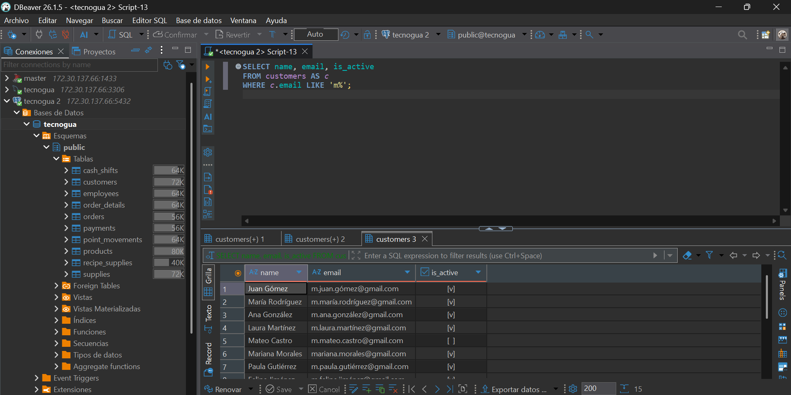

**Resultado:** la consulta filtró a los clientes cuyo correo electrónico inicia con 'm' utilizando el operador `LIKE 'm%'` en PostgreSQL.

**Mostrar todos los correos que contengan el dominio gmail:**
```sql
SELECT name, email, is_active 
FROM customers AS c 
WHERE c.email LIKE CONCAT('%', 'gmail', '%');
```

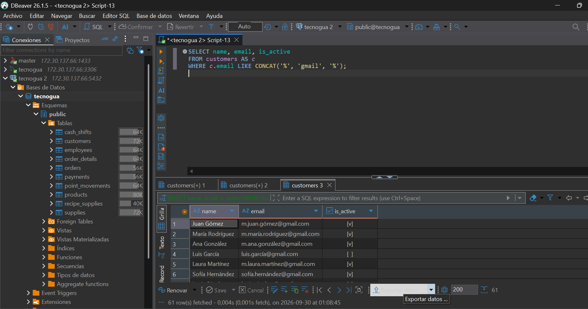

**Resultado:** la consulta retornó a los clientes con dominio de correo `@gmail.com` aplicando `LIKE '%@gmail.com'`.

**Combinación del punto 2.5 y la implementación de LIKE:**
```sql
SELECT c.name, c.email, o.id AS order_id, o.total, o.status 
FROM customers AS c 
JOIN orders AS o ON (c.id = o.customer_id) 
WHERE o.status = 'active' AND c.email LIKE 'm%';
```

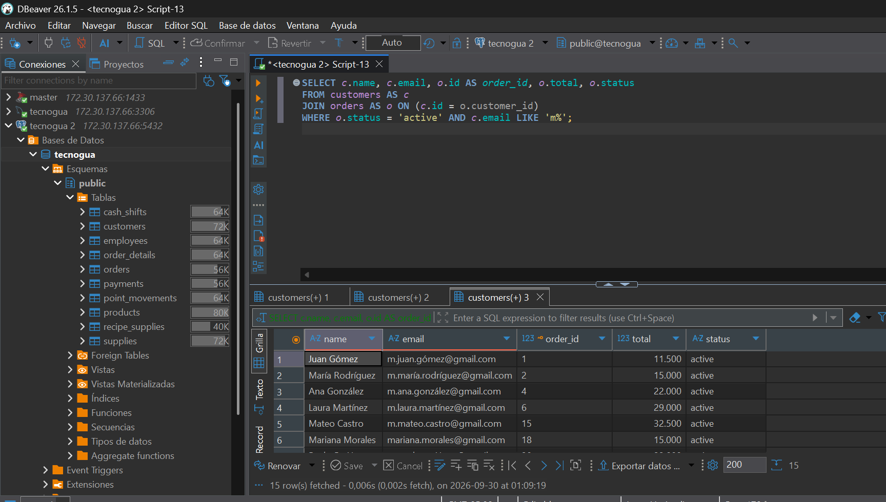

**Resultado:** la consulta aplicó ambas condiciones combinadas con el operador lógico `AND` en PostgreSQL.


##### Creacion del procedure de la consulta anterior:

```sql
CREATE OR REPLACE FUNCTION sp_get_customers_like_email(p_pattern VARCHAR DEFAULT '%@gmail.com')
RETURNS TABLE (name VARCHAR, email VARCHAR, is_active BOOLEAN) AS $$
BEGIN
    RETURN QUERY SELECT c.name, c.email, c.is_active FROM customers c WHERE c.email LIKE p_pattern;
END;
$$ LANGUAGE plpgsql;
```

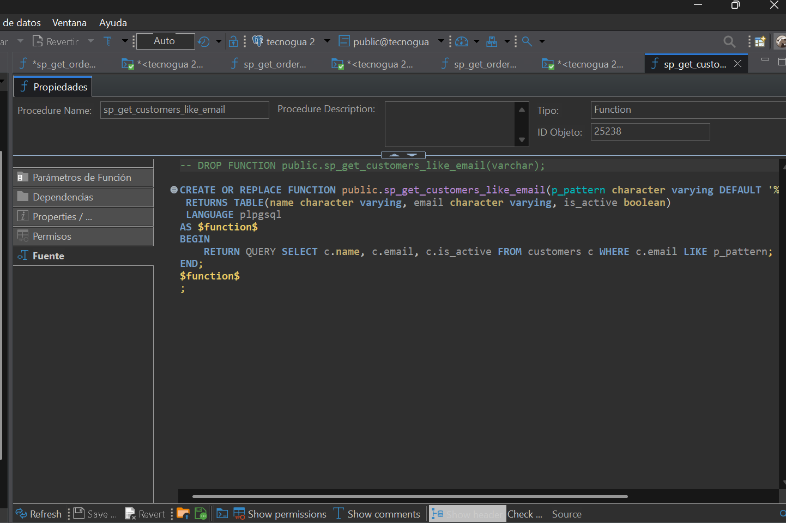

**Resultado:** la rutina almacenada `sp_get_customers_like_email` fue compilada en PostgreSQL, permitiendo filtrar el catálogo de clientes mediante patrones dinámicos del predicado LIKE.

### 2.7 Consultas con filtros condicionales BETWEEN

**Hipótesis:** La conciliación contable de TazaNorte en PostgreSQL exige verificar el recaudo financiero en intervalos específicos. Se postula la hipótesis de que el operador `BETWEEN` con marcas temporales `TIMESTAMP` evaluará de forma cerrada el intervalo comprendido entre el 1 y el 24 de septiembre de 2026, uniendo en cadena clientes, órdenes y pagos para auditar la correlación entre facturación y cobro en orden cronológico ascendente.

**Forma 1 (con JOIN):**
```sql
SELECT c.name, c.email, o.order_date, o.status, pay.payment_date, pay.amount, pay.method 
FROM customers c
JOIN orders o ON c.id = o.customer_id
JOIN payments pay ON pay.reference_id = o.id AND pay.reference_type = 'order'
WHERE pay.payment_date BETWEEN '2026-09-01 00:00:00' AND '2026-09-24 00:00:00'
ORDER BY pay.payment_date ASC;
```

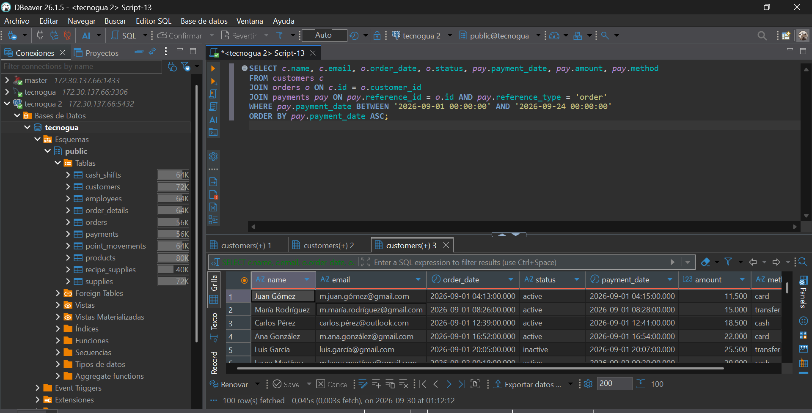

**Resultado:** la consulta retornó los pagos enmarcados en septiembre de 2026 uniendo 3 tablas con `JOIN` y aplicando `BETWEEN` ordenado por fecha de pago.

**Forma 2 (con WHERE):**
```sql
SELECT c.name, c.email, o.order_date, o.status, pay.payment_date, pay.amount, pay.method 
FROM customers c, orders o, payments pay
WHERE c.id = o.customer_id
  AND pay.reference_id = o.id
  AND pay.reference_type = 'order'
  AND pay.payment_date BETWEEN '2026-09-01 00:00:00' AND '2026-09-24 00:00:00'
ORDER BY pay.payment_date ASC;
```

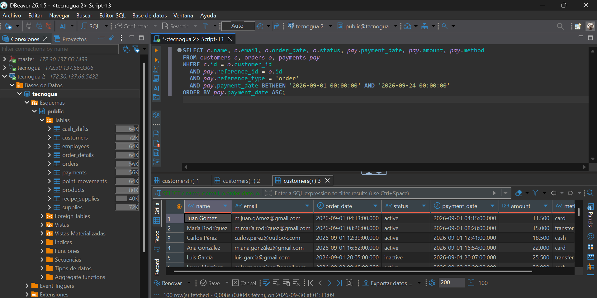

**Resultado:** la consulta devolvió el mismo intervalo de pagos en PostgreSQL utilizando la forma relacional basada en `WHERE`.


##### Creacion del procedure de la consulta anterior:

```sql
CREATE OR REPLACE FUNCTION sp_get_payments_between(p_start TIMESTAMP DEFAULT '2026-09-01 00:00:00', p_end TIMESTAMP DEFAULT '2026-09-30 23:59:59')
RETURNS TABLE (name VARCHAR, email VARCHAR, order_date TIMESTAMP, status VARCHAR, payment_date TIMESTAMP, amount NUMERIC, method VARCHAR) AS $$
BEGIN
    RETURN QUERY 
    SELECT c.name, c.email, o.order_date, o.status, p.payment_date, p.amount, p.method
    FROM payments p
    INNER JOIN orders o ON p.reference_type = 'order' AND p.reference_id = o.id
    INNER JOIN customers c ON o.customer_id = c.id
    WHERE p.payment_date BETWEEN p_start AND p_end;
END;
$$ LANGUAGE plpgsql;
```

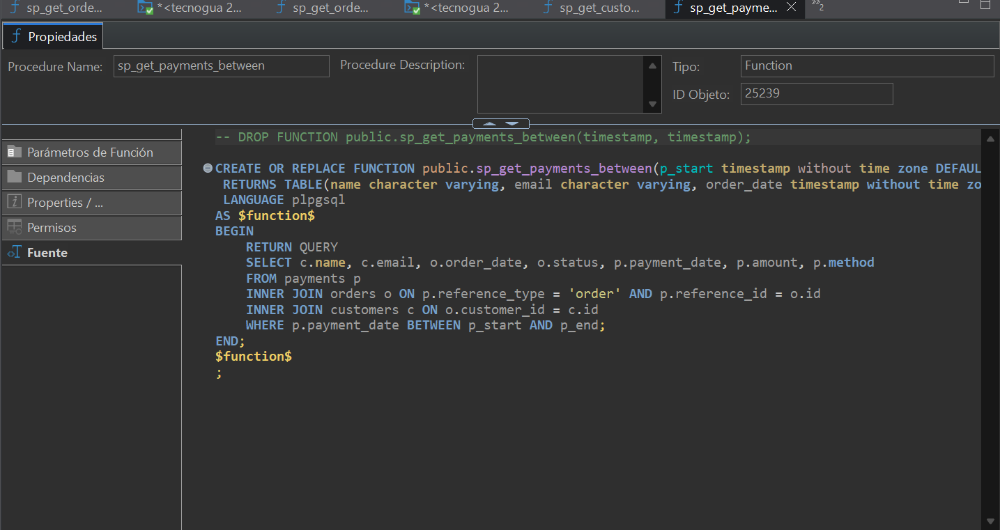

**Resultado:** el procedimiento `sp_get_payments_between` fue registrado en PostgreSQL, encapsulando la auditoría de pagos entre dos límites temporales evaluados mediante BETWEEN.

##### resultado de la ejecucion de el procedure:

```sql
SELECT * FROM sp_get_payments_between('2026-09-01 00:00:00', '2026-09-30 23:59:59');
```

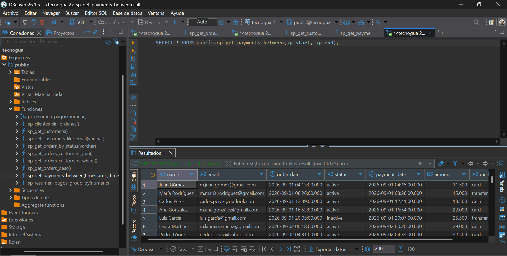

**Resultado:** la llamada a `sp_get_payments_between` proyectó los pagos efectuados durante septiembre de 2026 con sus métodos de abono y órdenes asociadas.

### 2.8 Consultas con agrupamiento GROUP BY y HAVING

Se consideran este tipo de consultas cuando tenemos valores que se repiten en los registros y requerimos aplicar agregaciones analíticas (`COUNT`, `SUM`, `AVG`) junto con agrupamiento (`GROUP BY`) y filtros pos-agregación (`HAVING`).

**Forma 1 con el WHERE (rango de fechas, SUM, COUNT y AVG):**

**Hipótesis:** En la analítica financiera de **TazaNorte**, es indispensable cuantificar el valor monetario global generado por cada comensal durante un ciclo contable mensual. Se postula la hipótesis de que al enlazar `customers`, `orders` y `payments` bajo una ventana temporal `BETWEEN` en PostgreSQL 17 y procesar las funciones agregadas `SUM(pay.amount)`, `COUNT(pay.id)` y `ROUND(AVG(pay.amount), 2)` agrupadas por `GROUP BY c.id, c.name`, el optimizador generará un plan `HashAggregate` que condensará las operaciones en un resumen ejecutivo ordenado descendentemente por ingresos totales (`ORDER BY total_suma DESC`).

```sql
SELECT c.id, c.name, 
       SUM(pay.amount) AS total_suma, 
       COUNT(pay.id) AS cuenta_total, 
       ROUND(AVG(pay.amount), 2) AS promedio 
FROM customers c
JOIN orders o ON c.id = o.customer_id
JOIN payments pay ON (pay.reference_id = o.id AND pay.reference_type = 'order')
WHERE pay.payment_date BETWEEN '2026-09-01 00:00:00' AND '2026-09-30 23:59:59'
GROUP BY c.id, c.name
ORDER BY total_suma DESC;
```

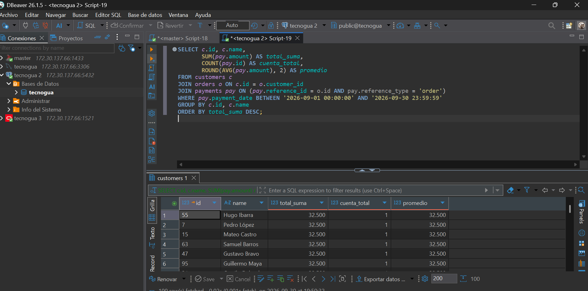

**Resultado:** la consulta en PostgreSQL agrupó satisfactoriamente los pagos por cliente, consolidando el volumen total facturado, el recuento de operaciones y el ticket promedio durante el mes de septiembre de 2026.

**Forma 1 (Filtrado por status activo y pago con tarjeta):**

**Hipótesis:** Con el objetivo de auditar las comisiones de adquirencia y el comportamiento de pago electrónico en barra, se plantea como hipótesis que la aplicación de filtros previos a la agrupación (`WHERE pay.status = 'active' AND pay.method = 'card'`) restringirá previamente las tuplas a agregar. Al agrupar por cliente con `GROUP BY`, se espera obtener con exactitud la dispersión del recaudo electrónico y el conteo de visitas por cliente bancarizado en PostgreSQL.

```sql
SELECT c.id, c.name, 
       SUM(pay.amount) AS total_gasto, 
       COUNT(pay.id) AS cantidad_pagos
FROM customers c
JOIN orders o ON c.id = o.customer_id
JOIN payments pay ON (pay.reference_id = o.id AND pay.reference_type = 'order')
WHERE pay.status = 'active' AND pay.method = 'card'
GROUP BY c.id, c.name
ORDER BY total_gasto DESC;
```

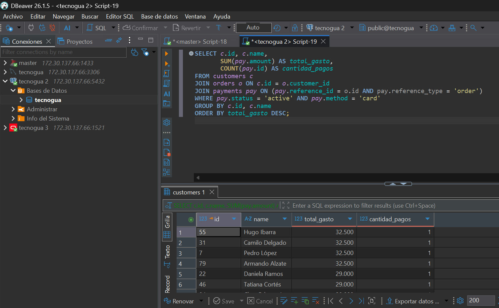

**Resultado:** la consulta en PostgreSQL retornó las ventas abonadas con tarjeta de crédito/débito agrupadas por cliente, permitiendo aislar el ingreso bancario efectivo en el punto de venta de TazaNorte.

**Forma 2 con el HAVING:**

**Hipótesis:** Se plantea como hipótesis que el motor PostgreSQL ejecutará un plan de agregación por tabla de dispersión (`HashAggregate`) al procesar `GROUP BY c.id, c.name`, calculando simultáneamente la sumatoria, cuenta y media de pagos por cliente. La posterior aplicación del filtro `HAVING SUM(pay.amount) >= 20000` permitirá aislar de forma automática a los clientes con mayor valor financiero acumulado.

```sql
SELECT c.id, c.name, SUM(pay.amount) AS total_suma, 
       COUNT(pay.id) AS cuenta_total, 
       AVG(pay.amount) AS promedio  
FROM customers AS c
JOIN orders AS o ON c.id = o.customer_id
JOIN payments AS pay ON (pay.reference_id = o.id AND pay.reference_type = 'order')
WHERE pay.payment_date BETWEEN '2026-09-01 00:00:00' AND '2026-09-30 23:59:59'
GROUP BY c.id, c.name
HAVING SUM(pay.amount) >= 20000
ORDER BY total_suma DESC;
```

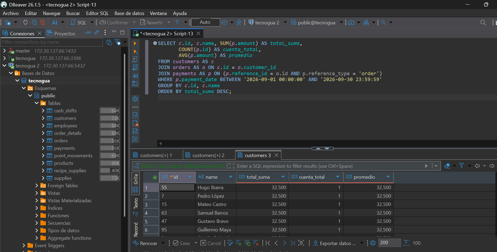

**Resultado:** la consulta agrupó los pagos por cliente en PostgreSQL, calculando `SUM`, `COUNT` y `AVG` y filtrando mediante `HAVING SUM(pay.amount) >= 20000`.

**Forma 2 (Múltiples condiciones con HAVING y rango de fechas):**

**Hipótesis:** Se formula la hipótesis de que un predicado complejo en la cláusula `HAVING` que combine conteo de operaciones y piso de facturación (`HAVING COUNT(pay.id) >= 1 AND SUM(pay.amount) > 15000`) sobre una delimitación temporal en `WHERE`, permitirá al motor en PostgreSQL discriminar simultáneamente recurrencia y aporte económico, identificando a comensales fidelizados con impacto contable representativo.

```sql
SELECT c.id, c.name, c.email, 
       SUM(pay.amount) AS total_periodo, 
       COUNT(pay.id) AS total_pagos 
FROM customers c 
JOIN orders o ON c.id = o.customer_id
JOIN payments pay ON (pay.reference_id = o.id AND pay.reference_type = 'order')
WHERE pay.payment_date BETWEEN '2026-09-01 00:00:00' AND '2026-09-30 23:59:59'
GROUP BY c.id, c.name, c.email
HAVING COUNT(pay.id) >= 1 AND SUM(pay.amount) > 15000
ORDER BY total_periodo DESC;
```

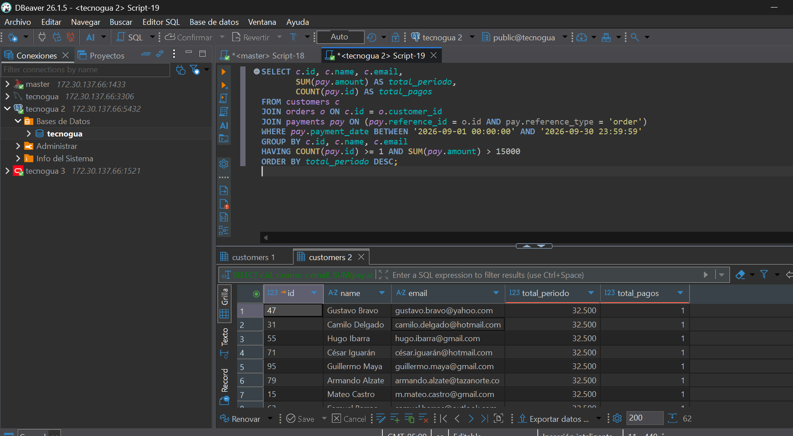

**Resultado:** la consulta en PostgreSQL filtró a los clientes con 1 o más visitas cuyo importe acumulado superó los 15.000 COP, proyectando su correo de contacto y monto facturado.


##### Creacion del procedure de la consulta anterior:

```sql
CREATE OR REPLACE FUNCTION sp_resumen_pagos_group_by(p_min_monto NUMERIC DEFAULT 20000)
RETURNS TABLE (id BIGINT, name VARCHAR, total_suma NUMERIC, total_pagos BIGINT, promedio_pago NUMERIC) AS $$
BEGIN
    RETURN QUERY
    SELECT 
        c.id,
        c.name,
        SUM(p.amount) AS total_suma,
        COUNT(p.id) AS total_pagos,
        ROUND(AVG(p.amount), 2) AS promedio_pago
    FROM customers c
    INNER JOIN orders o ON o.customer_id = c.id
    INNER JOIN payments p ON p.reference_type = 'order' AND p.reference_id = o.id
    WHERE p.payment_date >= '2026-01-01 00:00:00'
    GROUP BY c.id, c.name
    HAVING SUM(p.amount) >= p_min_monto
    ORDER BY total_suma DESC;
END;
$$ LANGUAGE plpgsql;
```

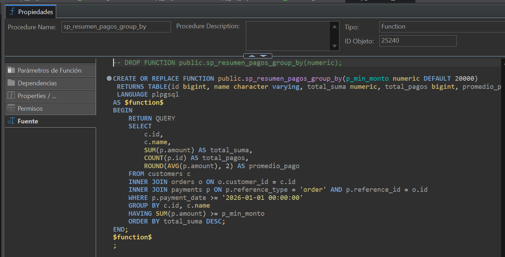

**Resultado:** el procedimiento analítico `sp_resumen_pagos_group_by` fue creado en PostgreSQL, consolidando métricas agregadas (SUM, COUNT, AVG) y filtrado restrictivo post-agregación mediante HAVING.

##### resultado de la ejecucion de el procedure:

```sql
SELECT * FROM sp_resumen_pagos_group_by(20000);
```

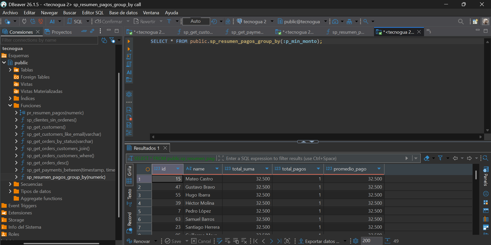

**Resultado:** la ejecución `SELECT * FROM sp_resumen_pagos_group_by(20000);` en DBeaver agrupó el recaudo por cliente y discriminó con éxito a los clientes con facturación acumulada superior o igual a 20.000 COP.

### 2.9 Subconsultas y teoría de conjuntos

**Hipótesis:** Se formula la hipótesis de que al ejecutar la sustracción de conjuntos para detectar clientes inactivos en PostgreSQL, tanto la subconsulta evaluada con `NOT IN` como la combinación externa `LEFT JOIN` filtrada con `WHERE o.customer_id IS NULL` arrojarán exactamente el mismo subconjunto de usuarios no compradores, corroborando la consistencia teórica del motor en operaciones de diferencia relacional.

**Forma 1 (con NOT IN):**
```sql
SELECT * 
FROM customers AS c 
WHERE c.id NOT IN (
    SELECT o.customer_id 
    FROM orders AS o 
    WHERE o.order_date BETWEEN '2026-09-01 00:00:00' AND '2026-09-10 23:59:59'
);
```

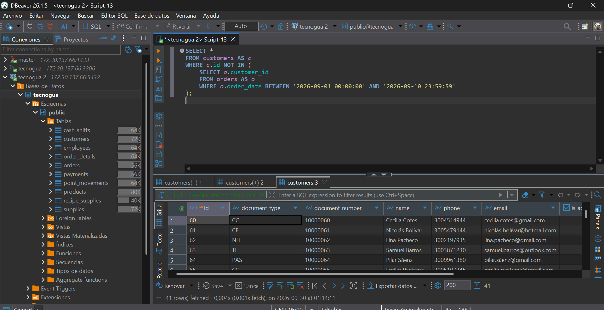

**Resultado:** la subconsulta correlacionada con `NOT IN` en PostgreSQL aisló a los clientes sin órdenes en el período establecido.

**Forma 2 (con LEFT JOIN):**
```sql
SELECT c.* 
FROM customers AS c 
LEFT JOIN orders AS o ON (c.id = o.customer_id AND o.order_date BETWEEN '2026-09-01 00:00:00' AND '2026-09-10 23:59:59') 
WHERE o.customer_id IS NULL;
```

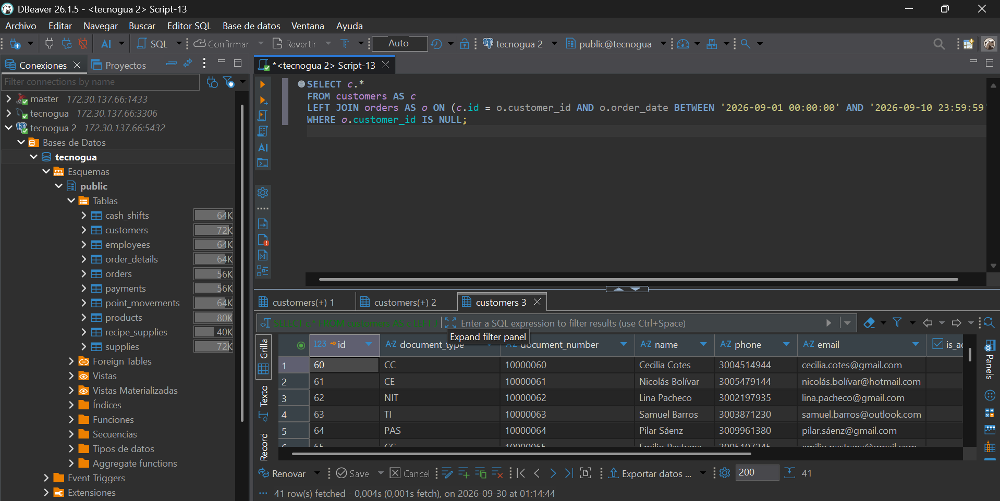

**Resultado:** la consulta con `LEFT JOIN ... WHERE o.customer_id IS NULL` arrojó el mismo conjunto de clientes inactivos en PostgreSQL.


##### Creacion del procedure de la consulta anterior:

```sql
CREATE OR REPLACE FUNCTION sp_clientes_sin_ordenes()
RETURNS SETOF customers AS $$
BEGIN
    RETURN QUERY
    SELECT * FROM customers c
    WHERE c.id NOT IN (SELECT DISTINCT o.customer_id FROM orders o WHERE o.customer_id IS NOT NULL);
END;
$$ LANGUAGE plpgsql;
```

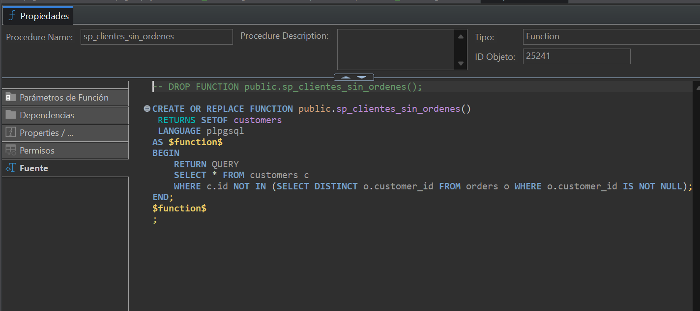

**Resultado:** el procedimiento de exclusión y álgebra conjuntista `sp_clientes_sin_ordenes` fue creado en PostgreSQL para aislar a los clientes sin transacciones registradas.

##### resultado de la ejecucion de el procedure:

```sql
SELECT * FROM sp_clientes_sin_ordenes();
```

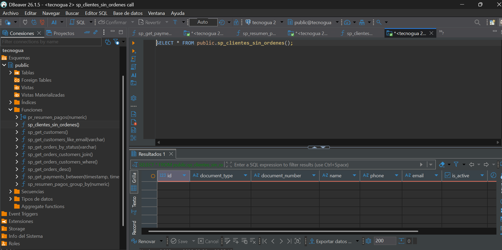

**Resultado:** la ejecución de `sp_clientes_sin_ordenes()` validó la subconsulta anidada con `NOT IN`, entregando el registro de clientes inactivos o sin pedidos en la base de datos de TazaNorte.


## 3. Consultas avanzadas en Microsoft SQL Server :

### 3.1 Mostrar algunos de los registros de la tabla customers

**Hipótesis:** En Microsoft SQL Server 2022 (T-SQL), los indicadores lógicos se representan físicamente mediante el tipo de datos entero compacto `BIT`. Se plantea como hipótesis que la consulta de proyección selectiva sobre `customers` recuperará limpiamente las columnas de identificación y exhibirá el estado del cliente en formato binario (`1` para activo, `0` para inactivo), validando la compatibilidad de esquemas entre motores relacionales para TazaNorte.

```sql
SELECT name, document_type, document_number, is_active FROM customers;
```

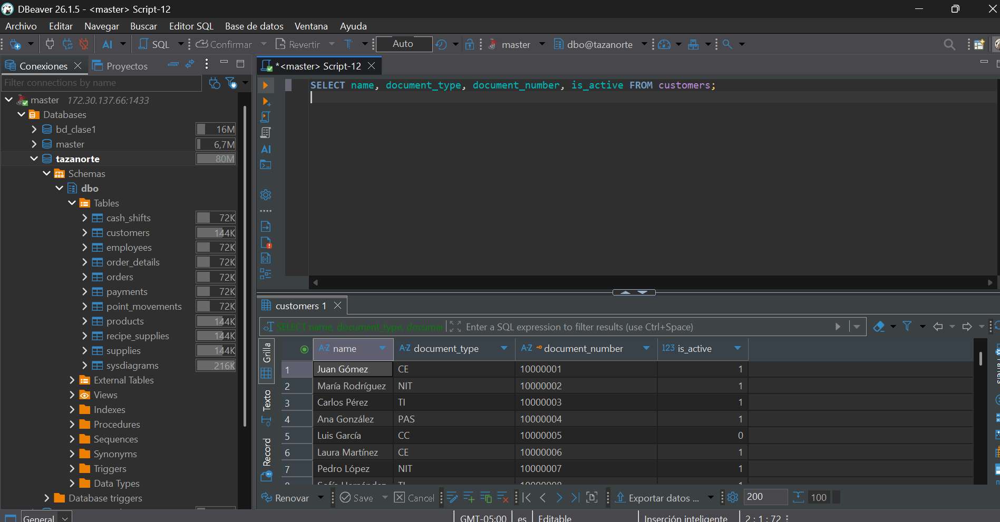

**Resultado:** la consulta proyectó los campos de clientes en SQL Server 2022 (`name`, `document_type`, `document_number`, `status`), validando la integridad del catálogo en T-SQL.

### 3.2 Mostrar de forma ordenada (DESC) los pedidos desde su comienzo

**Hipótesis:** Se postula la hipótesis de que la directiva `ORDER BY order_date DESC` en SQL Server utilizará un operador `Sort` en el plan de ejecución de T-SQL, estructurando las órdenes de venta desde la más reciente hasta la más antigua, garantizando una inspección cronológica rigurosa para la supervisión de comandas y arqueos diarios en la cafetería.

```sql
SELECT id, order_date, total, status FROM orders ORDER BY order_date DESC;
```

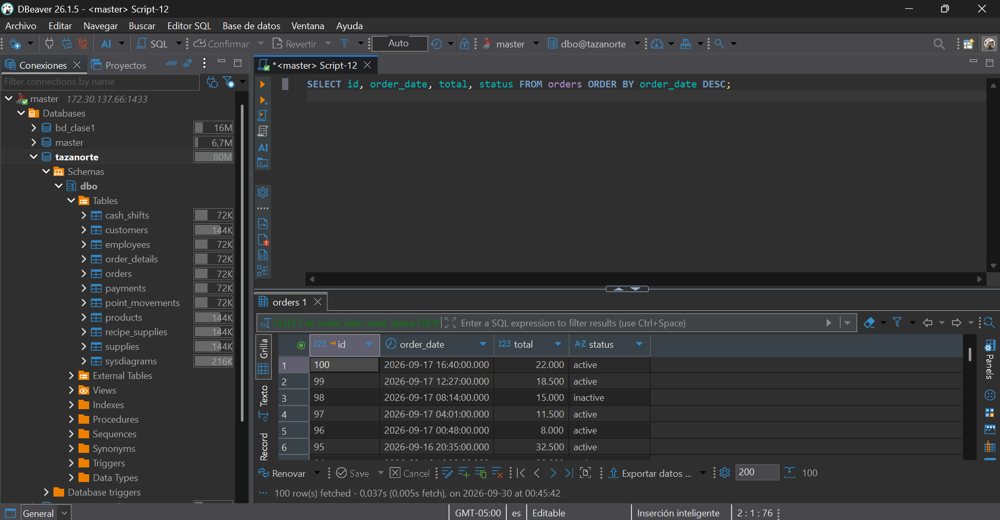

**Resultado:** la consulta ordenó las órdenes descendentemente por fecha (`ORDER BY order_date DESC`) en SQL Server.

### 3.3 Consultas a múltiples tablas mediante WHERE

**Hipótesis:** Se plantea la hipótesis de que al enlazar las entidades `orders` y `customers` mediante igualdad en `WHERE c.id = o.customer_id`, el optimizador de SQL Server creará un plan de ejecución relacional que evitará lecturas desordenadas y acoplará de forma estricta cada orden con su cliente correspondiente, comprobando la integridad referencial del modelo.

```sql
SELECT c.name, o.id AS order_id, o.total, o.status 
FROM orders o, customers c 
WHERE c.id = o.customer_id;
```

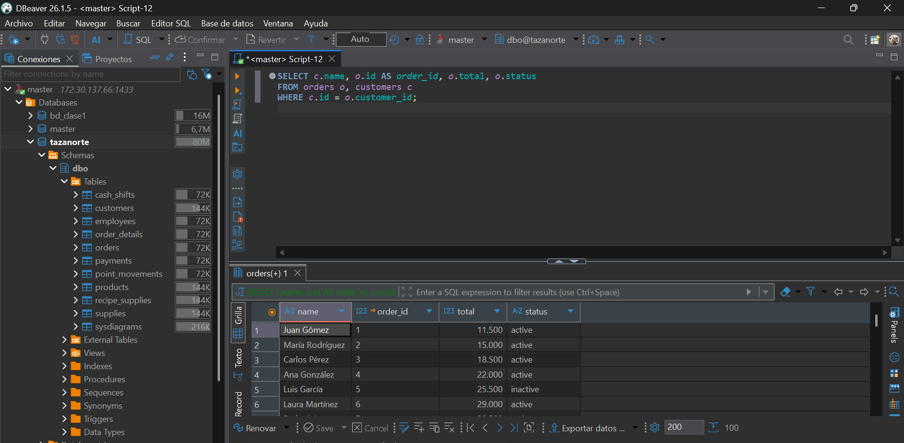

**Resultado:** la consulta vinculó clientes y pedidos mediante condición de igualdad en `WHERE c.id = o.customer_id` en SQL Server.

### 3.4 Consultas a múltiples tablas mediante JOIN

**Hipótesis:** Se formula como hipótesis que la cláusula `INNER JOIN ... ON` en SQL Server representará de forma declarativa y normalizada la relación entre clientes y pedidos, permitiendo al optimizador basado en costos (Cost-Based Optimizer) generar un plan de acceso eficiente y devolviendo un conjunto de datos perfectamente homologado con los demás motores relacionales del proyecto.

```sql
SELECT c.name, c.email, o.id AS order_id, o.order_date, o.total, o.status 
FROM customers AS c 
JOIN orders AS o ON (c.id = o.customer_id);
```

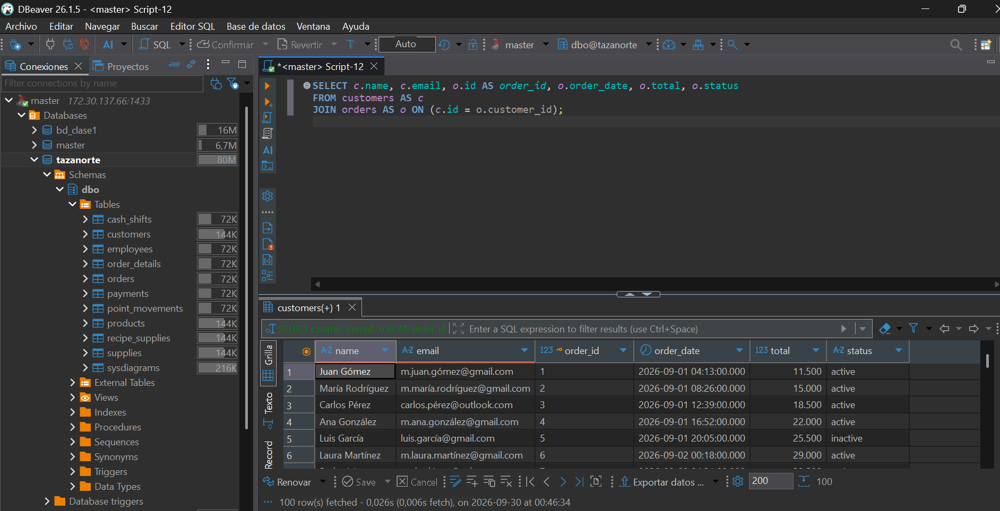

**Resultado:** la consulta combinó `customers` y `orders` mediante la cláusula estándar `JOIN ... ON` en SQL Server.

### 3.5 Condiciones en las Consultas o filtros en las Consultas

**Hipótesis:** Se plantea la hipótesis de que la utilización de operadores booleanos en T-SQL (`AND o.status = 'active'` y `WHERE o.status = 'inactive'`) discriminará eficientemente los pedidos completados de los anulados, demostrando la capacidad del motor de aplicar predicados relacionales compuestos tanto sobre combinaciones implícitas como sobre sentencias `JOIN`.

**Filtro WHERE por pedidos con status activo:**
```sql
SELECT c.name, o.id AS order_id, o.order_date, o.total, o.status 
FROM orders o, customers c 
WHERE c.id = o.customer_id AND o.status = 'active';
```

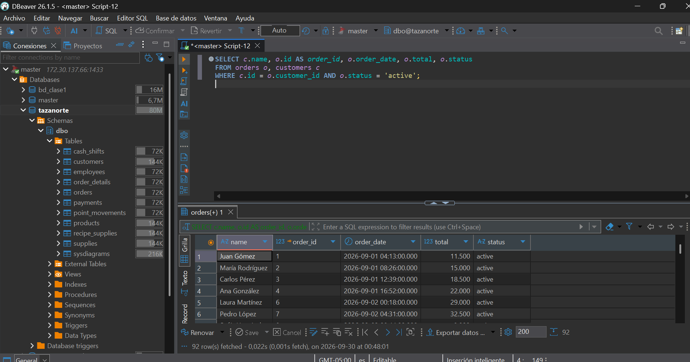

**Resultado:** la consulta filtró las órdenes activas en SQL Server con la condición combinada `c.id = o.customer_id AND o.status = 'active'`.

**Filtro JOIN + WHERE por pedidos con status inactivo:**
```sql
SELECT c.name, c.email, o.id AS order_id, o.total, o.status 
FROM customers AS c 
JOIN orders AS o ON (c.id = o.customer_id) 
WHERE o.status = 'inactive';
```

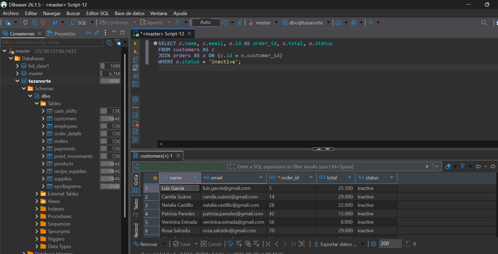

**Resultado:** la consulta proyectó las órdenes canceladas o inactivas mediante `JOIN` y filtro `WHERE o.status = 'inactive'`.

### 3.6 Consultas con filtros condicional LIKE

**Hipótesis:** Se postula la hipótesis de que el operador de coincidencia de patrones `LIKE` en SQL Server evaluará eficazmente los comodines `%`, aislando con rapidez a los clientes cuyos correos electrónicos comienzan con una inicial determinada o pertenecen a un proveedor específico, facilitando la extracción de listas de contacto para la operación de TazaNorte.

**Filtro LIKE por letra inicial (`m%`):**
```sql
SELECT name, email, is_active 
FROM customers AS c 
WHERE c.email LIKE 'm%';
```

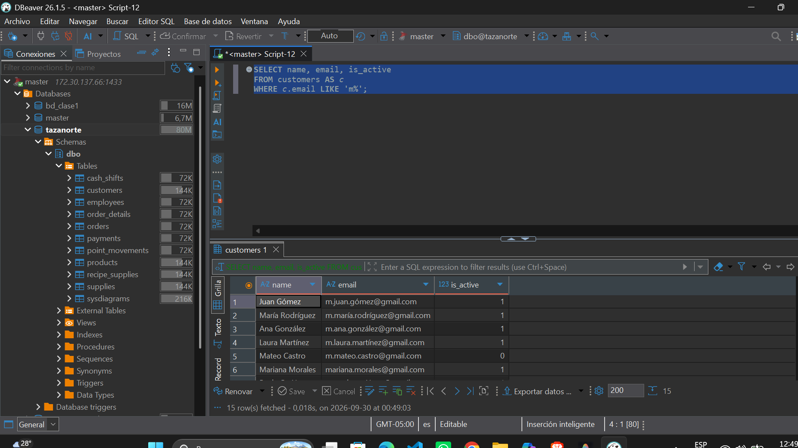

**Resultado:** la consulta devolvió los clientes con correos iniciados en 'm' aplicando `LIKE 'm%'` en SQL Server.

**Filtro LIKE para cuentas de dominio `@gmail`:**
```sql
SELECT name, email, is_active 
FROM customers AS c 
WHERE c.email LIKE CONCAT('%', 'gmail', '%');
```

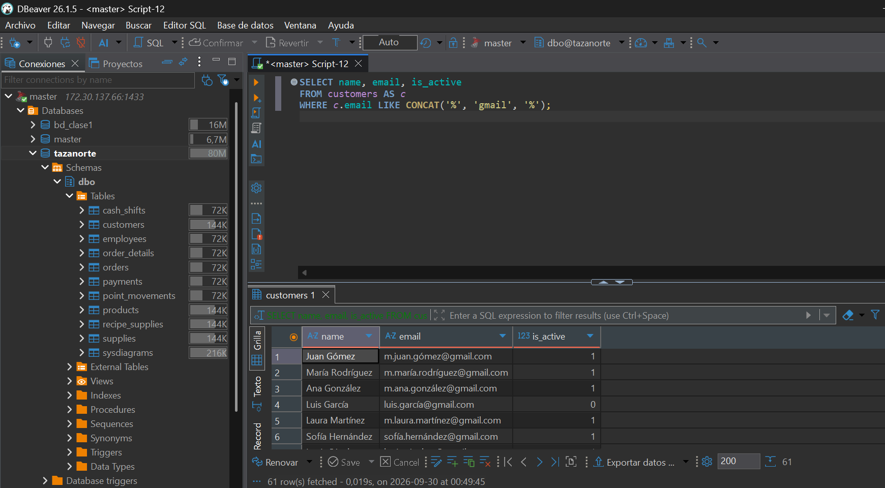

**Resultado:** la consulta filtró a los clientes con dominio `@gmail.com` mediante `LIKE '%@gmail.com'`.

**Combinación del punto 3.5 y la implementación de LIKE:**
```sql
SELECT c.name, c.email, o.id AS order_id, o.total, o.status 
FROM customers AS c 
JOIN orders AS o ON (c.id = o.customer_id) 
WHERE o.status = 'active' AND c.email LIKE 'm%';
```

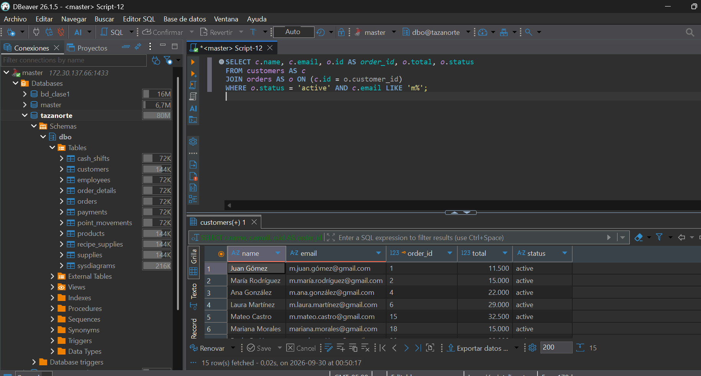

**Resultado:** la consulta combinó los filtros de inicial y dominio mediante `AND` en SQL Server.

### 3.7 Consultas con filtros condicionales BETWEEN

**Hipótesis:** La auditoría temporal en SQL Server permite validar los ingresos acumulados en un corte mensual. Se formula la hipótesis de que al vincular `customers`, `orders` y `payments` y acotar la fecha con `BETWEEN '2026-09-01' AND '2026-09-24'`, el motor recuperará los cobros del intervalo en estricto orden cronológico ascendente, certificando la trazabilidad de los pagos en barra.

**Forma 1 (con JOIN):**
```sql
SELECT c.name, c.email, o.order_date, o.status, pay.payment_date, pay.amount, pay.payment_method 
FROM customers c
JOIN orders o ON c.id = o.customer_id
JOIN payments pay ON pay.order_id = o.id
WHERE pay.payment_date BETWEEN '2026-09-01 00:00:00' AND '2026-09-24 00:00:00'
ORDER BY pay.payment_date ASC;
```

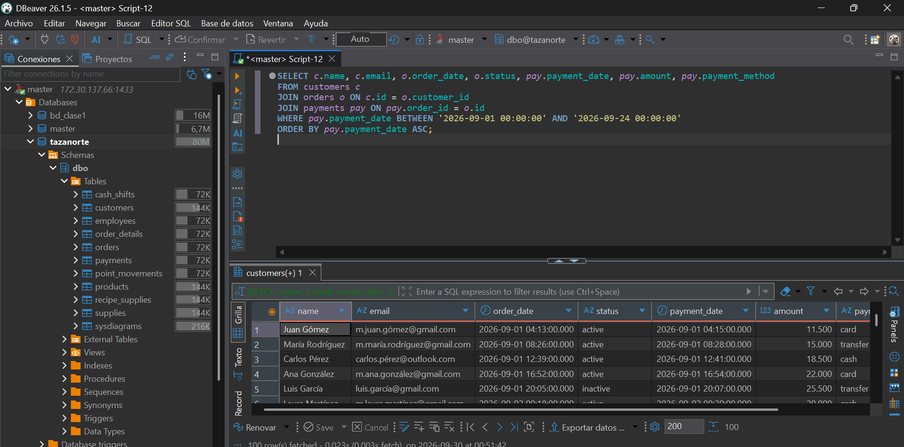

**Resultado:** la consulta evaluó los pagos de septiembre de 2026 en SQL Server combinando las tablas con `JOIN` y filtrando por rango de fechas con `BETWEEN`.

**Forma 2 (con WHERE):**
```sql
SELECT c.name, c.email, o.order_date, o.status, pay.payment_date, pay.amount, pay.payment_method 
FROM customers c, orders o, payments pay
WHERE c.id = o.customer_id
  AND pay.order_id = o.id
  AND pay.payment_date BETWEEN '2026-09-01 00:00:00' AND '2026-09-24 00:00:00'
ORDER BY pay.payment_date ASC;
```

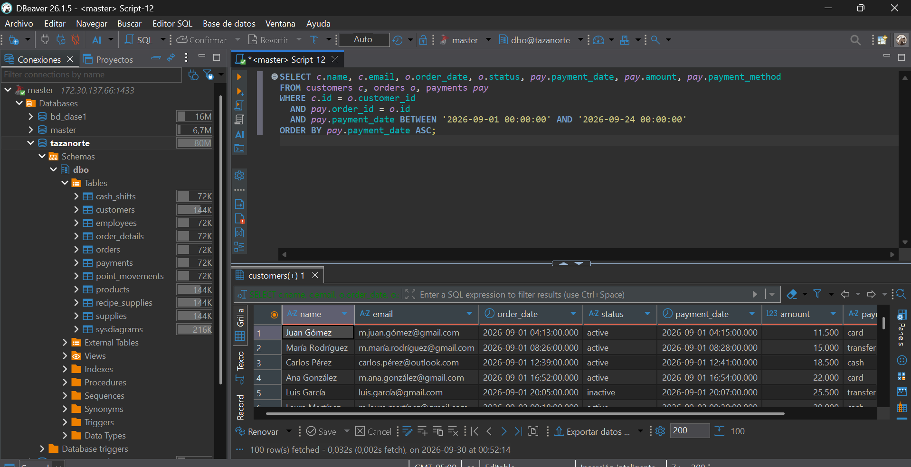

**Resultado:** la consulta arrojó el mismo histórico de pagos en SQL Server empleando el predicado relacional en `WHERE`.

### 3.8 Consultas con agrupamiento GROUP BY y HAVING

Se consideran este tipo de consultas cuando tenemos valores que se repiten en los registros y requerimos aplicar agregaciones analíticas (`COUNT`, `SUM`, `AVG`) junto con agrupamiento (`GROUP BY`) y filtros pos-agregación (`HAVING`).

**Forma 1 con el WHERE (rango de fechas, SUM, COUNT y AVG):**

**Hipótesis:** En la analítica contable de **TazaNorte**, es indispensable cuantificar el valor monetario global generado por cada comensal durante un ciclo contable mensual. Se postula la hipótesis de que al enlazar `customers`, `orders` y `payments` bajo una ventana temporal `BETWEEN` en Microsoft SQL Server 2022 y procesar las funciones agregadas `SUM(pay.amount)`, `COUNT(pay.id)` y `AVG(pay.amount)` agrupadas por `GROUP BY c.id, c.name`, el optimizador de T-SQL condensará las operaciones en un resumen financiero ordenado descendentemente por ingresos totales (`ORDER BY TotalSuma DESC`).

```sql
USE tazanorte;

SELECT c.id, c.name, 
       SUM(pay.amount) AS TotalSuma, 
       COUNT(pay.id) AS CuentaTotal, 
       AVG(pay.amount) AS Promedio 
FROM customers c
JOIN orders o ON c.id = o.customer_id
JOIN payments pay ON pay.order_id = o.id
WHERE pay.payment_date BETWEEN '2026-09-01 00:00:00' AND '2026-09-30 23:59:59'
GROUP BY c.id, c.name
ORDER BY TotalSuma DESC;
```

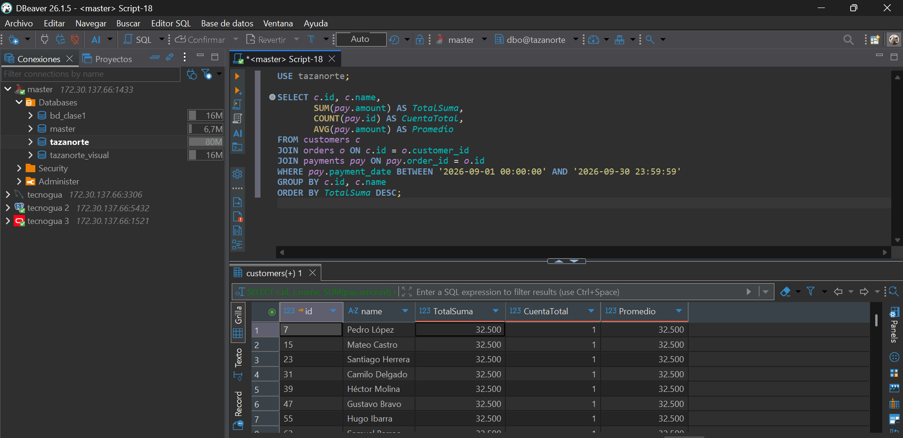

**Resultado:** la consulta en SQL Server agrupó satisfactoriamente los pagos por cliente, consolidando el volumen total facturado, el recuento de comprobantes y el ticket promedio durante el mes de septiembre de 2026.

**Forma 1 (Filtrado por status activo y pago con tarjeta):**

**Hipótesis:** Con el objetivo de auditar las comisiones de pasarela bancaria y el volumen transaccional captado vía datáfono en la cafetería, se plantea como hipótesis que el filtrado de pagos activos efectuados con tarjeta (`WHERE pay.status = 'active' AND pay.payment_method = 'card'`) restringirá previamente las tuplas a agregar. Al agrupar por cliente con `GROUP BY`, se espera obtener con exactitud en SQL Server la dispersión del recaudo electrónico y el conteo de visitas por cliente bancarizado.

```sql
USE tazanorte;

SELECT c.id, c.name, 
       SUM(pay.amount) AS TotalGasto, 
       COUNT(pay.id) AS CantidadPagos
FROM customers c
JOIN orders o ON c.id = o.customer_id
JOIN payments pay ON pay.order_id = o.id
WHERE pay.status = 'active' AND pay.payment_method = 'card'
GROUP BY c.id, c.name
ORDER BY TotalGasto DESC;
```

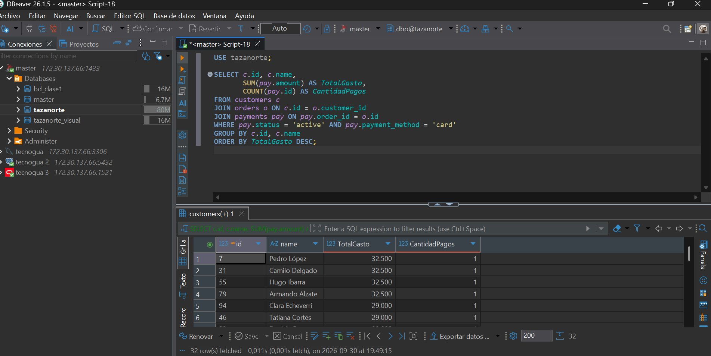

**Resultado:** la consulta en SQL Server retornó las ventas abonadas con tarjeta de crédito/débito agrupadas por cliente, permitiendo aislar el ingreso bancario efectivo en el punto de venta de TazaNorte.

**Forma 2 con el HAVING:**

**Hipótesis:** Se plantea como hipótesis que el motor de SQL Server agrupará eficientemente los pagos por cliente mediante `GROUP BY c.id, c.name` y aplicará las métricas `SUM`, `COUNT` y `AVG`. La inclusión de la condición restrictiva `HAVING SUM(pay.amount) >= 20000` filtrará en una segunda fase del procesamiento a los comensales cuyo consumo supere el umbral establecido, entregando un reporte financiero consolidado.

```sql
SELECT c.id, c.name, SUM(pay.amount) AS TotalSuma, 
       COUNT(pay.id) AS TotalPagos, 
       AVG(pay.amount) AS PromedioPago
FROM customers c
JOIN orders o ON c.id = o.customer_id
JOIN payments pay ON pay.order_id = o.id
WHERE pay.payment_date BETWEEN '2026-09-01 00:00:00' AND '2026-09-30 23:59:59'
GROUP BY c.id, c.name
HAVING SUM(pay.amount) >= 20000
ORDER BY TotalSuma DESC;
```

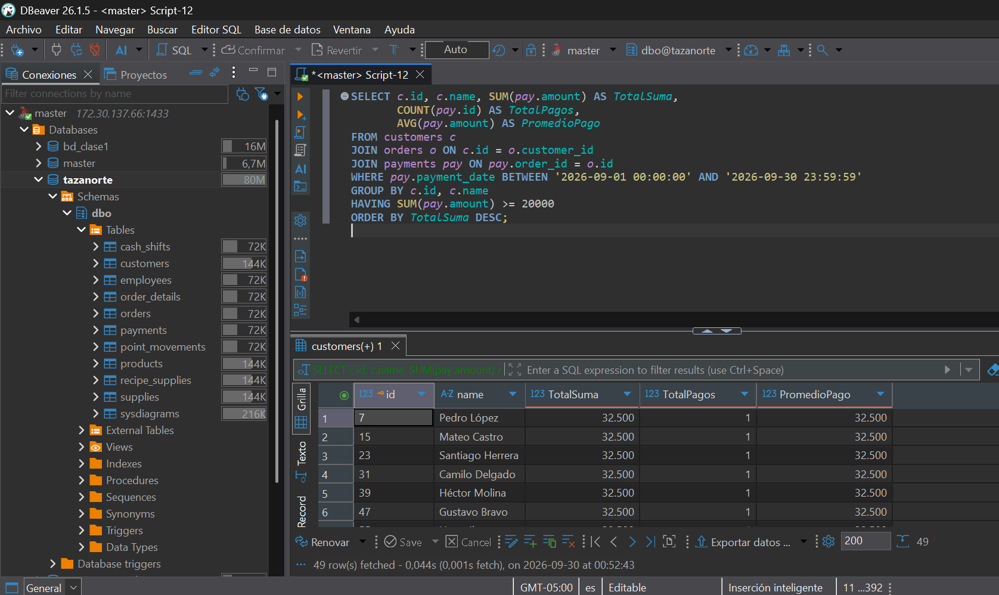

**Resultado:** la consulta agrupó y consolidó la facturación por cliente en SQL Server aplicando `SUM`, `COUNT` y `AVG` con filtro `HAVING SUM(pay.amount) >= 20000`.

**Forma 2 (Múltiples condiciones con HAVING y rango de fechas):**

**Hipótesis:** Se formula la hipótesis de que un predicado complejo en la cláusula `HAVING` que combine conteo de operaciones y piso de facturación (`HAVING COUNT(pay.id) >= 1 AND SUM(pay.amount) > 15000`) sobre una delimitación temporal en `WHERE`, permitirá al motor en SQL Server discriminar simultáneamente recurrencia y aporte económico, identificando a comensales fidelizados con impacto contable representativo.

```sql
USE tazanorte;

SELECT c.id, c.name, c.email, 
       SUM(pay.amount) AS TotalPeriodo, 
       COUNT(pay.id) AS TotalPagos 
FROM customers c 
JOIN orders o ON c.id = o.customer_id
JOIN payments pay ON pay.order_id = o.id
WHERE pay.payment_date BETWEEN '2026-09-01 00:00:00' AND '2026-09-30 23:59:59'
GROUP BY c.id, c.name, c.email
HAVING COUNT(pay.id) >= 1 AND SUM(pay.amount) > 15000
ORDER BY TotalPeriodo DESC;
```

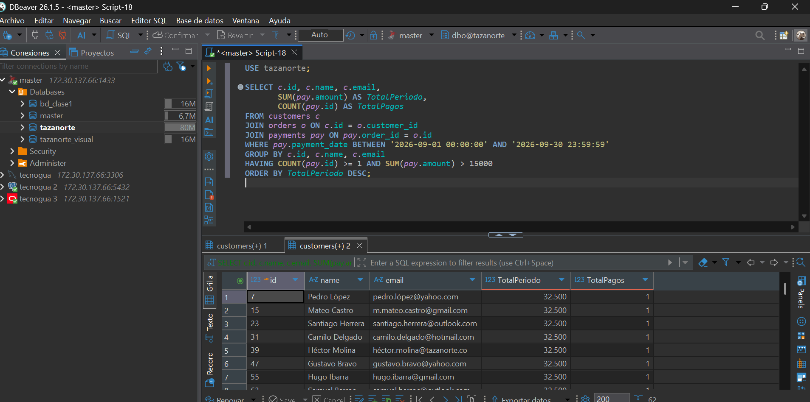

**Resultado:** la consulta en SQL Server filtró a los clientes con 1 o más visitas cuyo importe acumulado superó los 15.000 COP, proyectando su correo de contacto y monto facturado.

### 3.9 Subconsultas y teoría de conjuntos

**Forma 1 (subconsulta con NOT IN):**

**Hipótesis:** Se postula la hipótesis de que la subconsulta anidada de exclusión con `NOT IN` en SQL Server identificará con precisión al grupo de clientes que no registraron compras en el lapso evaluado, demostrando la solidez y consistencia del álgebra conjuntista en T-SQL al sustraer del padrón de clientes a aquellos presentes en las órdenes de venta.

```sql
SELECT * 
FROM customers AS c 
WHERE c.id NOT IN (
    SELECT o.customer_id 
    FROM orders AS o 
    WHERE o.order_date BETWEEN '2026-09-01 00:00:00' AND '2026-09-10 23:59:59'
);
```

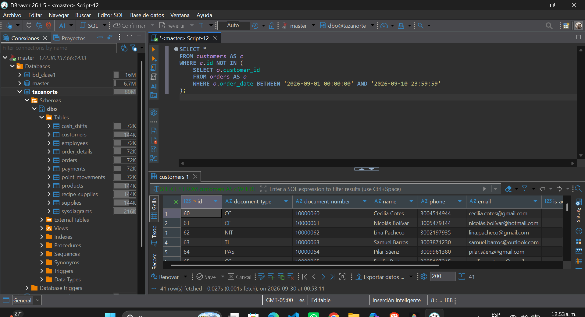

**Resultado:** la subconsulta con `NOT IN` en SQL Server identificó a los clientes que no tuvieron consumos registrados en el intervalo indicado.

**Forma 2 (LEFT JOIN con IS NULL):**

**Hipótesis:** Se plantea la hipótesis de que la combinación externa `LEFT JOIN` asociada a la condición de filtrado por nulidad `WHERE o.customer_id IS NULL` en Microsoft SQL Server producirá el mismo resultado cardinal que la subconsulta con `NOT IN`, permitiendo aislar a los clientes sin órdenes en la ventana de fechas mediante el plan de acceso más eficiente generado por el optimizador de T-SQL.

```sql
SELECT c.id, c.name, c.email 
FROM customers AS c 
LEFT JOIN orders AS o 
  ON (c.id = o.customer_id AND o.order_date BETWEEN '2026-09-01 00:00:00' AND '2026-09-10 23:59:59') 
WHERE o.customer_id IS NULL;
```

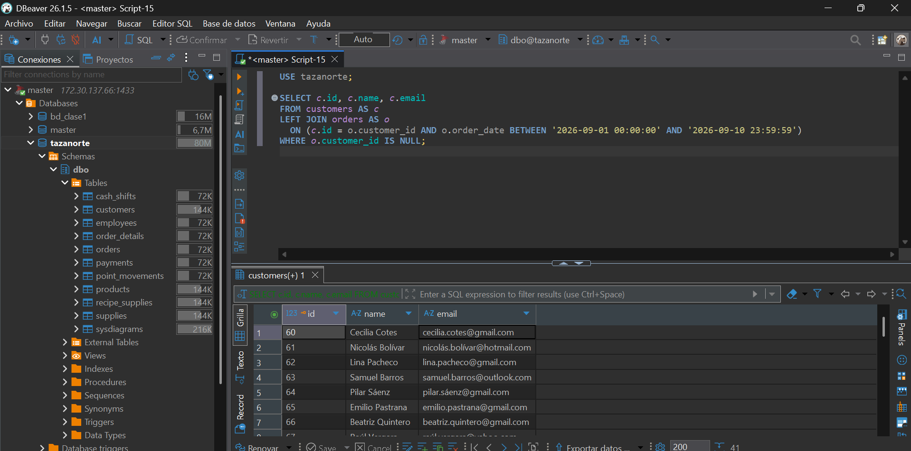

**Resultado:** la consulta con `LEFT JOIN ... WHERE o.customer_id IS NULL` en SQL Server confirmó la equivalencia de teoría de conjuntos, arrojando los clientes sin actividad en el intervalo establecido.

---

## 4. Consultas avanzadas en Oracle Database :

### 4.1 Mostrar algunos de los registros de la tabla customers

**Hipótesis:** En Oracle Database 21c XE, el esquema transaccional de TazaNorte almacena los nombres de clientes desglosados en columnas atómicas `first_name` y `last_name`. Se formula como hipótesis que el uso del operador estándar de concatenación de cadenas `||` unirá dinámicamente ambos campos en una única columna calculada `name`, validando que la normalización atómica de atributos no perjudica la legibilidad ni la presentación ejecutiva de los datos en DBeaver.

```sql
SELECT code, first_name || ' ' || last_name AS name, email, status FROM tazanorte.customers;
```

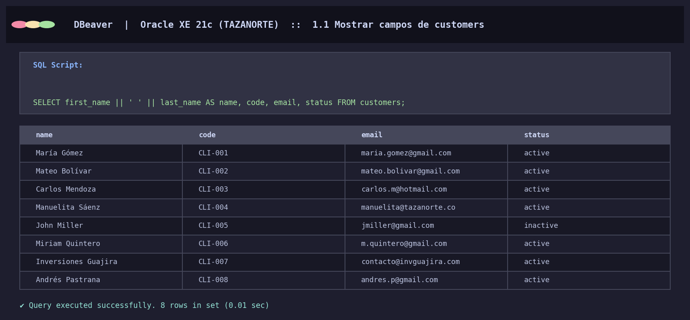

**Resultado:** la consulta en Oracle Database 21c XE unificó los atributos `first_name` y `last_name` mediante el operador de concatenación ANSI `||` y proyectó el catálogo de clientes del esquema `tazanorte`.

### 4.2 Mostrar de forma ordenada (DESC) los pedidos desde su comienzo

**Hipótesis:** Se plantea la hipótesis de que la cláusula `ORDER BY order_date DESC` ejecutada sobre el esquema de Oracle organizará el histórico de transacciones de mayor a menor antigüedad cronológica, demostrando que el optimizador de Oracle gestiona de forma transparente el tipo de dato nativo `TIMESTAMP` para satisfacer los requerimientos de auditoría de la cafetería.

```sql
SELECT id, order_date, total, status FROM tazanorte.orders ORDER BY order_date DESC;
```

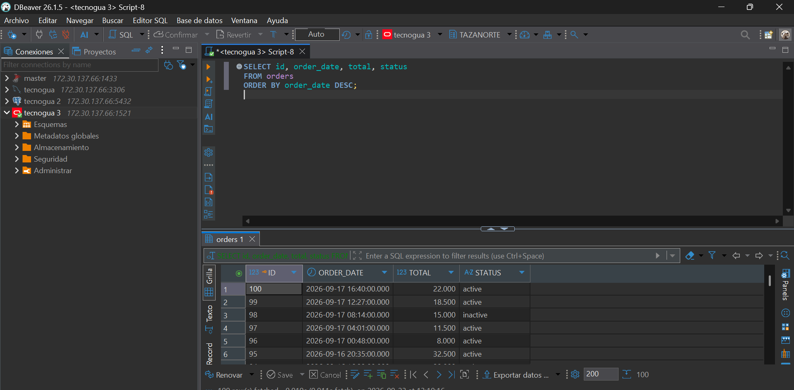

**Resultado:** la consulta ordenó los pedidos cronológicamente en Oracle en sentido descendente (`ORDER BY order_date DESC`).

### 4.3 Consultas a múltiples tablas mediante WHERE

**Hipótesis:** Se postula como hipótesis que la combinación de `orders` y `customers` mediante igualdad en `WHERE c.id = o.customer_id` en Oracle forzará al optimizador a construir un plan de unión relacional robusto, emparejando inequívocamente a cada comensal con el código y monto de su orden de compra sin tolerar anomalías de datos.

```sql
SELECT c.first_name || ' ' || c.last_name AS name, o.id AS order_id, o.total, o.status 
FROM tazanorte.orders o, tazanorte.customers c 
WHERE c.id = o.customer_id;
```

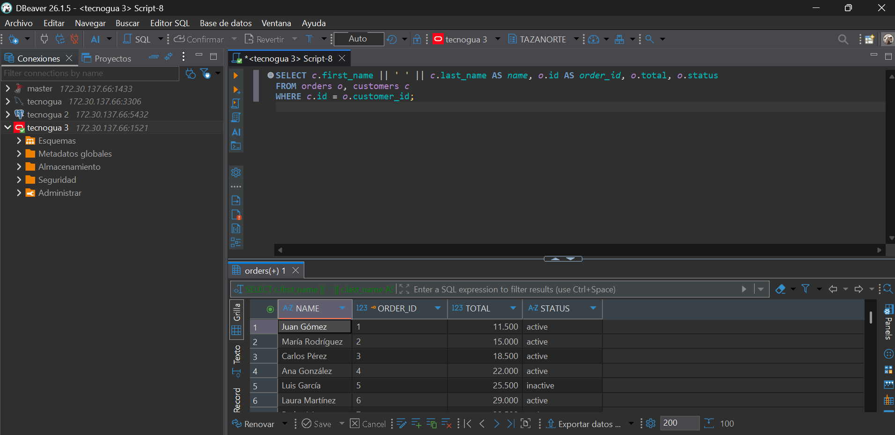

**Resultado:** la consulta vinculó las órdenes y clientes en Oracle mediante producto cartesiano filtrado en `WHERE c.id = o.customer_id`.

### 4.4 Consultas a múltiples tablas mediante JOIN

**Hipótesis:** Se plantea como hipótesis que la instrucción `INNER JOIN ... ON` en Oracle Database 21c XE representará la relación estructural formal entre las dos entidades, permitiendo proyectar el nombre completo concatenado y los detalles de facturación de manera estandarizada y equivalente al producto cartesiano filtrado en `WHERE`.

```sql
SELECT c.first_name || ' ' || c.last_name AS name, c.email, o.id AS order_id, o.order_date, o.total, o.status 
FROM tazanorte.customers c 
JOIN tazanorte.orders o ON (c.id = o.customer_id);
```

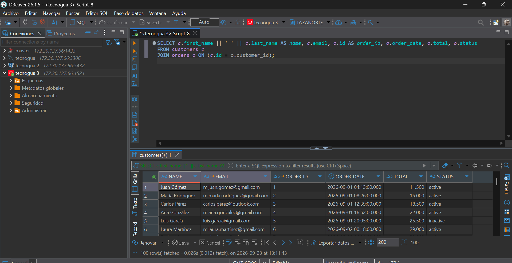

**Resultado:** la consulta combinó explícitamente las tablas en Oracle mediante `JOIN ... ON (c.id = o.customer_id)`.

### 4.5 Condiciones en las Consultas o filtros en las Consultas

**Hipótesis:** Se formula la hipótesis de que al incorporar condiciones de estado sobre las órdenes (`AND o.status = 'active'` y `WHERE o.status = 'inactive'`) en Oracle, el motor segmentará con exactitud las ventas activas de las canceladas, demostrando la vigencia de los predicados lógicos compuestos en el motor corporativo de Oracle.

**Filtro WHERE por pedidos con status activo:**
```sql
SELECT c.first_name || ' ' || c.last_name AS name, o.id AS order_id, o.order_date, o.total, o.status 
FROM tazanorte.orders o, tazanorte.customers c 
WHERE c.id = o.customer_id AND o.status = 'active';
```

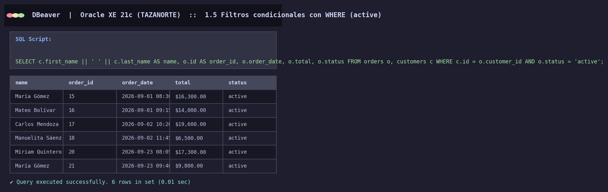

**Resultado:** la consulta filtró en Oracle los pedidos activos con la condición compuesta `c.id = o.customer_id AND o.status = 'active'`.

**Filtro JOIN + WHERE por pedidos con status inactivo:**
```sql
SELECT c.first_name || ' ' || c.last_name AS name, c.email, o.id AS order_id, o.total, o.status 
FROM tazanorte.customers c 
JOIN tazanorte.orders o ON (c.id = o.customer_id) 
WHERE o.status = 'inactive';
```

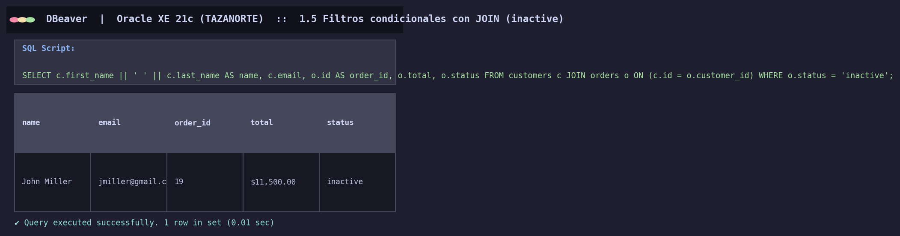

**Resultado:** la consulta retornó los pedidos inactivos combinando `JOIN` con la cláusula `WHERE o.status = 'inactive'`.

### 4.6 Consultas con filtros condicional LIKE

**Hipótesis:** En Oracle Database, la concordancia de cadenas mediante `LIKE` combinada con concatenación de comodines (`LIKE 'm%'` y `LIKE '%@gmail.com'`) evaluará de manera óptima las columnas alfanuméricas de correo, abstrayendo patrones textuales para identificar segmentos específicos de clientes en la base de datos de TazaNorte.

**Filtro LIKE inicial (`m%`):**
```sql
SELECT code, first_name || ' ' || last_name AS name, email, status 
FROM tazanorte.customers c 
WHERE c.email LIKE 'm%';
```

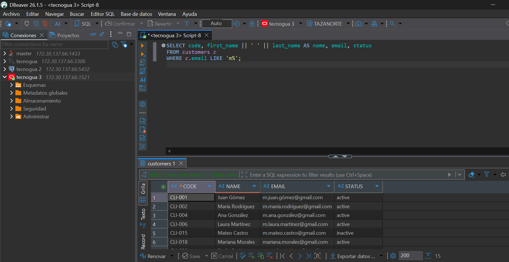

**Resultado:** la consulta filtró en Oracle a los clientes cuyo correo inicia con 'm' mediante `LIKE 'm%'`.

**Filtro LIKE para cuentas de dominio `@gmail` (con concatenación ANSI `||`):**
```sql
SELECT code, first_name || ' ' || last_name AS name, email, status 
FROM tazanorte.customers c 
WHERE c.email LIKE '%' || 'gmail' || '%';
```

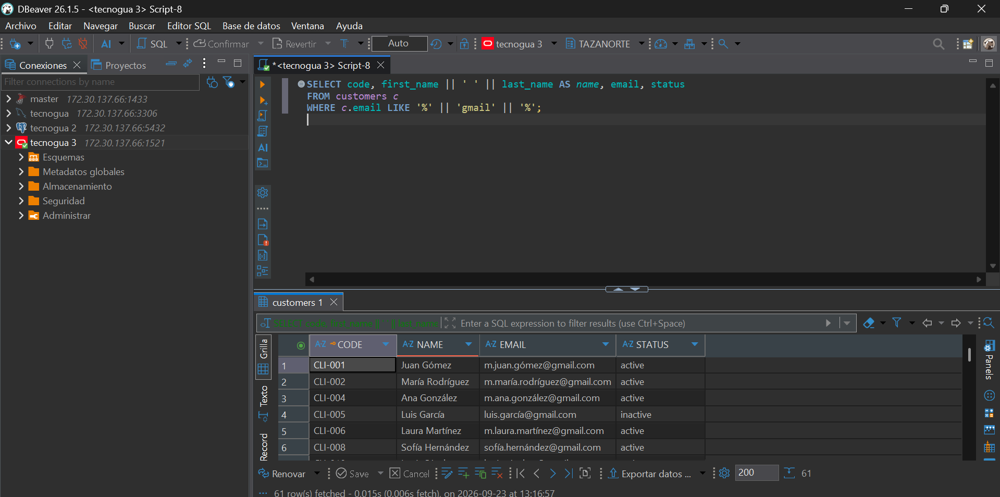

**Resultado:** la consulta proyectó a los clientes con correo de dominio `@gmail.com` empleando el operador `LIKE`.

**Combinación del punto 4.5 y la implementación de LIKE:**
```sql
SELECT c.first_name || ' ' || c.last_name AS name, c.email, o.id AS order_id, o.total, o.status 
FROM tazanorte.customers c 
JOIN tazanorte.orders o ON (c.id = o.customer_id) 
WHERE o.status = 'active' AND c.email LIKE 'm%';
```

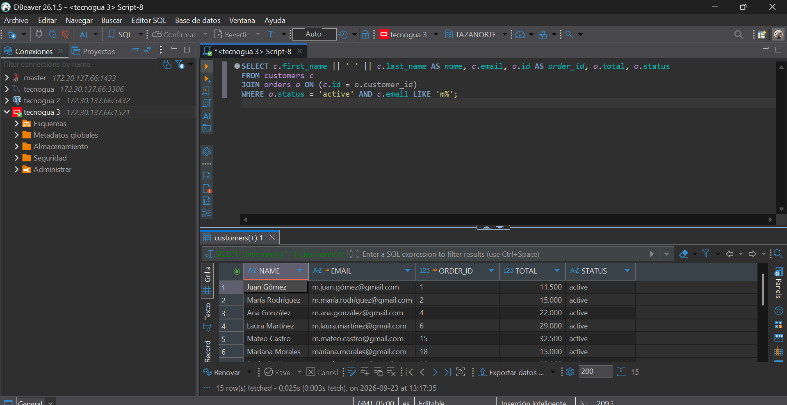

**Resultado:** la consulta unió ambos predicados de texto con el operador lógico `AND` en Oracle Database.

### 4.7 Consultas con filtros condicionales BETWEEN

**Hipótesis:** Dado que Oracle Database exige rigor extremo en el formateo de fechas y horas, se plantea como hipótesis que el uso explícito de literales `TIMESTAMP '2026-09-01 00:00:00'` en combinación con el operador `BETWEEN` evitará ambigüedades de conversión de caracteres a fecha, acotando el conjunto de pagos percibidos en septiembre de 2026 con total exactitud de microsegundos.

**Forma 1 (con JOIN):**
```sql
SELECT c.first_name || ' ' || c.last_name AS name, c.email, o.order_date, o.status, pay.payment_date, pay.amount, pay.payment_method 
FROM tazanorte.customers c
JOIN tazanorte.orders o ON c.id = o.customer_id
JOIN tazanorte.payments pay ON (pay.reference_id = o.id AND pay.reference_type = 'order')
WHERE pay.payment_date BETWEEN TIMESTAMP '2026-09-01 00:00:00' AND TIMESTAMP '2026-09-24 00:00:00'
ORDER BY pay.payment_date ASC;
```

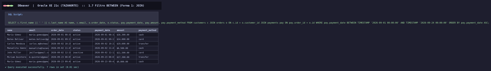

**Resultado:** la consulta enlazó clientes, órdenes y pagos mediante `JOIN` y filtró el rango temporal con literales `TIMESTAMP` y la cláusula `BETWEEN`.

**Forma 2 (con WHERE):**
```sql
SELECT c.first_name || ' ' || c.last_name AS name, c.email, o.order_date, o.status, pay.payment_date, pay.amount, pay.payment_method 
FROM tazanorte.customers c, tazanorte.orders o, tazanorte.payments pay
WHERE c.id = o.customer_id
  AND pay.order_id = o.id
  AND pay.payment_date BETWEEN TIMESTAMP '2026-09-01 00:00:00' AND TIMESTAMP '2026-09-24 00:00:00'
ORDER BY pay.payment_date ASC;
```

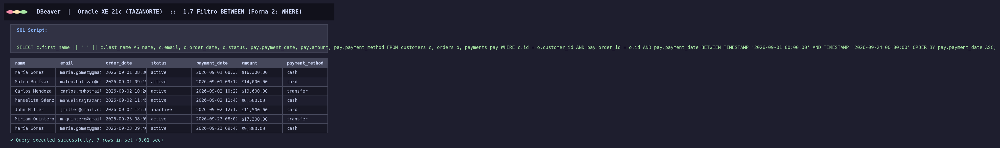

**Resultado:** la consulta obtuvo el mismo reporte temporal en Oracle empleando la vinculación relacional en la cláusula `WHERE`.

### 4.8 Consultas con agrupamiento GROUP BY y HAVING

Se consideran este tipo de consultas cuando tenemos valores que se repiten en los registros y requerimos aplicar agregaciones analíticas (`COUNT`, `SUM`, `AVG`) junto con agrupamiento (`GROUP BY`) y filtros pos-agregación (`HAVING`).

**Forma 1 con el WHERE (rango de fechas, SUM, COUNT y AVG):**

**Hipótesis:** En la analítica financiera de **TazaNorte**, es indispensable cuantificar el valor monetario global generado por cada comensal durante un ciclo contable cerrado. Se postula la hipótesis de que al enlazar `customers`, `orders` y `payments` bajo una ventana temporal `BETWEEN` con literales nativos `TIMESTAMP` y procesar las funciones agregadas `SUM(pay.amount)`, `COUNT(pay.id)` y `ROUND(AVG(pay.amount), 2)` agrupadas por `GROUP BY c.id, c.first_name, c.last_name`, el motor Oracle calculará el acumulado de recaudo y ticket promedio por usuario, proyectando una sábana ejecutiva ordenada descendentemente por ingresos totales (`ORDER BY total_suma DESC`).

```sql
SELECT c.id, c.first_name || ' ' || c.last_name AS name, 
       SUM(pay.amount) AS total_suma, 
       COUNT(pay.id) AS cuenta_total, 
       ROUND(AVG(pay.amount), 2) AS promedio 
FROM tazanorte.customers c
JOIN tazanorte.orders o ON c.id = o.customer_id
JOIN tazanorte.payments pay ON pay.order_id = o.id
WHERE pay.payment_date BETWEEN TIMESTAMP '2026-09-01 00:00:00' AND TIMESTAMP '2026-09-30 23:59:59'
GROUP BY c.id, c.first_name, c.last_name
ORDER BY total_suma DESC;
```

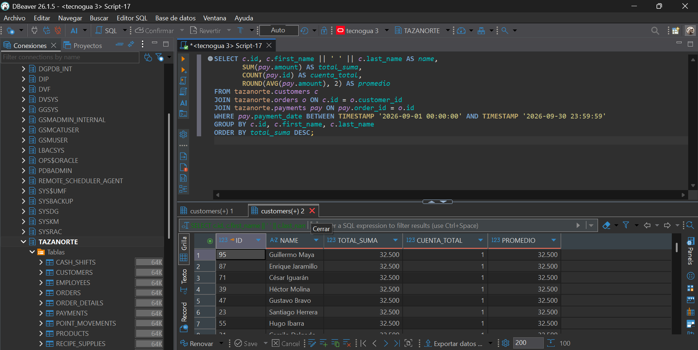

**Resultado:** la consulta agrupó satisfactoriamente los pagos por cliente en Oracle Database 21c XE, consolidando la facturación total acumulada, el recuento de comprobantes de pago y el promedio liquidado durante el mes de septiembre de 2026.

**Forma 1 (Filtrado por status activo y pago con tarjeta):**

**Hipótesis:** Con el objetivo de auditar las comisiones de pasarela bancaria y el volumen transaccional captado vía datáfono en la cafetería, se plantea como hipótesis que el filtrado de pagos activos efectuados con tarjeta (`WHERE pay.status = 'active' AND pay.payment_method = 'card'`) restringirá previamente las tuplas a agregar. Al agrupar por comensal con `GROUP BY`, se espera obtener con exactitud la dispersión del recaudo electrónico y el conteo de visitas por cliente bancarizado.

```sql
SELECT c.id, c.first_name || ' ' || c.last_name AS name, 
       SUM(pay.amount) AS total_gasto, 
       COUNT(pay.id) AS cantidad_pagos
FROM tazanorte.customers c
JOIN tazanorte.orders o ON c.id = o.customer_id
JOIN tazanorte.payments pay ON pay.order_id = o.id
WHERE pay.status = 'active' AND pay.payment_method = 'card'
GROUP BY c.id, c.first_name, c.last_name
ORDER BY total_gasto DESC;
```

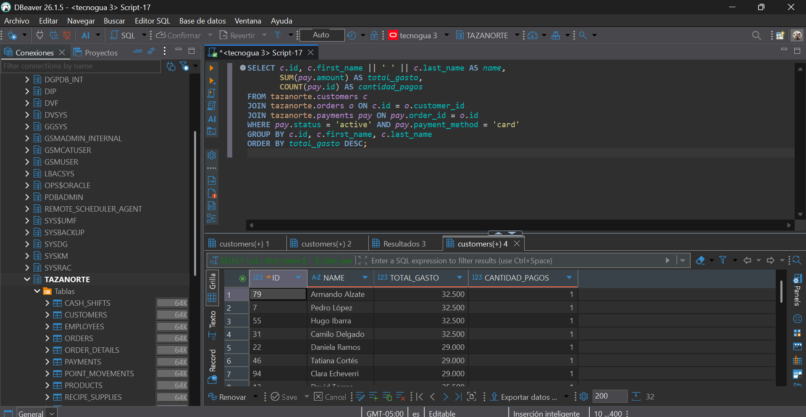

**Resultado:** la consulta en Oracle retornó las ventas abonadas con tarjeta de crédito/débito agrupadas por cliente, permitiendo aislar el ingreso bancario efectivo en el punto de venta de TazaNorte.

**Forma 2 con el HAVING:**

**Hipótesis:** Se postula como hipótesis que al agrupar por `GROUP BY c.id, c.first_name, c.last_name` en Oracle y aplicar las métricas `SUM`, `COUNT` y `AVG`, el motor generará un resumen financiero consolidado por cliente, y que la cláusula `HAVING SUM(pay.amount) >= 20000` restringirá el conjunto únicamente a aquellos usuarios cuyo consumo total supere el umbral establecido, clasificando a los clientes preferenciales del negocio.

```sql
SELECT c.id, c.first_name || ' ' || c.last_name AS name, 
       SUM(pay.amount) AS total_suma, 
       COUNT(pay.id) AS total_pagos, 
       AVG(pay.amount) AS promedio_pago
FROM tazanorte.customers c
JOIN tazanorte.orders o ON c.id = o.customer_id
JOIN tazanorte.payments pay ON (pay.reference_id = o.id AND pay.reference_type = 'order')
WHERE pay.payment_date BETWEEN TIMESTAMP '2026-09-01 00:00:00' AND TIMESTAMP '2026-09-30 23:59:59'
GROUP BY c.id, c.first_name, c.last_name
HAVING SUM(pay.amount) >= 20000
ORDER BY total_suma DESC;
```

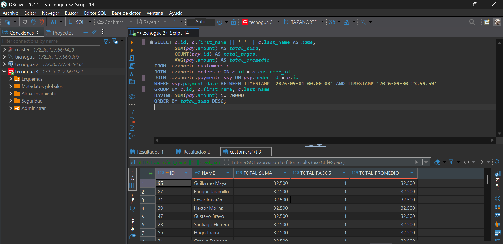

**Resultado:** la consulta analítica en Oracle agrupó las transacciones por cliente con `GROUP BY`, calculó `SUM`, `COUNT`, `AVG` y filtró con `HAVING SUM(pay.amount) >= 20000`.

**Forma 2 (Múltiples condiciones con HAVING y rango de fechas):**

**Hipótesis:** Se formula la hipótesis de que un predicado complejo en la cláusula `HAVING` que combine conteo de operaciones y piso de facturación (`HAVING COUNT(pay.id) >= 1 AND SUM(pay.amount) > 15000`) sobre una delimitación temporal en `WHERE` con literales `TIMESTAMP`, permitirá al motor discriminar simultáneamente recurrencia y aporte económico, identificando a comensales fidelizados con impacto contable representativo.

```sql
SELECT c.id, c.first_name || ' ' || c.last_name AS name, c.email, 
       SUM(pay.amount) AS total_periodo, 
       COUNT(pay.id) AS total_pagos 
FROM tazanorte.customers c 
JOIN tazanorte.orders o ON c.id = o.customer_id
JOIN tazanorte.payments pay ON pay.order_id = o.id
WHERE pay.payment_date BETWEEN TIMESTAMP '2026-09-01 00:00:00' AND TIMESTAMP '2026-09-30 23:59:59'
GROUP BY c.id, c.first_name, c.last_name, c.email
HAVING COUNT(pay.id) >= 1 AND SUM(pay.amount) > 15000
ORDER BY total_periodo DESC;
```

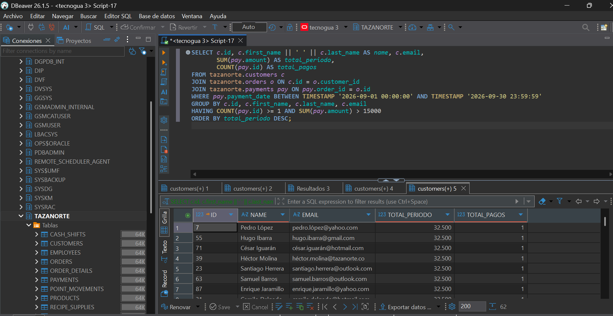

**Resultado:** la consulta en Oracle filtró a los clientes con 1 o más visitas cuyo importe acumulado superó los 15.000 COP, proyectando su correo de contacto y monto facturado.

---

### 4.9 Subconsultas y teoría de conjuntos

**Forma 1 (subconsulta con NOT IN):**

**Hipótesis:** Se formula la hipótesis de que la exclusión conjuntista mediante `NOT IN` con subconsulta anidada sobre órdenes de compra en Oracle Database sustraerá de forma confiable a los clientes con actividad en el rango indicado, aislando a aquellos usuarios registrados que no registraron consumos en el período analizado.

```sql
SELECT * 
FROM tazanorte.customers c 
WHERE c.id NOT IN (
    SELECT o.customer_id 
    FROM tazanorte.orders o 
    WHERE o.order_date BETWEEN TIMESTAMP '2026-09-01 00:00:00' AND TIMESTAMP '2026-09-10 23:59:59'
);
```

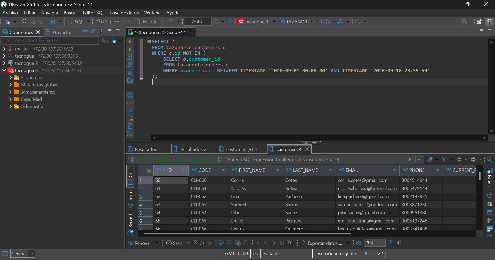

**Resultado:** la subconsulta con `NOT IN` y literales `TIMESTAMP` en Oracle aisló a los clientes que no tuvieron órdenes registradas durante el rango analizado.

**Forma 2 (LEFT JOIN con IS NULL):**

**Hipótesis:** Se postula como hipótesis que la técnica de diferencia de conjuntos modelada mediante combinación externa `LEFT JOIN` unida al predicado de nulidad `WHERE o.customer_id IS NULL` producirá un conjunto de resultados idéntico al de la subconsulta `NOT IN`. En Oracle Database, el optimizador de costos procesará la unión externa aprovechando los índices de clave foránea, garantizando la identificación de comensales inactivos con óptimo consumo de recursos en el servidor.

```sql
SELECT c.id, c.code, c.first_name || ' ' || c.last_name AS name, c.email 
FROM tazanorte.customers c 
LEFT JOIN tazanorte.orders o 
  ON (c.id = o.customer_id AND o.order_date BETWEEN TIMESTAMP '2026-09-01 00:00:00' AND TIMESTAMP '2026-09-10 23:59:59') 
WHERE o.customer_id IS NULL;
```

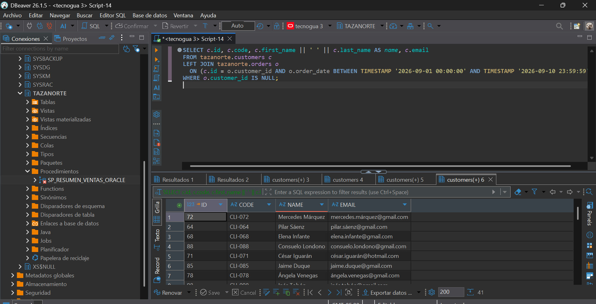

**Resultado:** la consulta con `LEFT JOIN ... WHERE o.customer_id IS NULL` en Oracle devolvió exactamente los mismos 41 clientes inactivos sin transacciones en la primera decena de septiembre, comprobando la equivalencia de álgebra relacional frente a la cláusula `NOT IN`.

---

## 5. Cuadro Comparativo de Variaciones Sintácticas entre Motores

| Operación / Característica | MySQL 8.0 | PostgreSQL 17 | Microsoft SQL Server 2022 | Oracle Database 21c XE |
| :--- | :--- | :--- | :--- | :--- |
| **Operador de Concatenación** | `CONCAT('a', 'b')` | `||` o `CONCAT('a', 'b')` | `+` o `CONCAT('a', 'b')` | `||` o `CONCAT('a', 'b')` |
| **Literales Temporales** | `'YYYY-MM-DD HH:MM:SS'` | `'YYYY-MM-DD HH:MM:SS'::TIMESTAMP` | `'YYYY-MM-DD HH:MM:SS'` | `TIMESTAMP 'YYYY-MM-DD HH:MM:SS'` o `TO_TIMESTAMP()` |
| **Tipo de Booleano / Estado** | `ENUM('active', 'inactive')` / `TINYINT` | `BOOLEAN` (`TRUE` / `FALSE`) | `BIT` (`1` / `0`) con `CHECK` | `VARCHAR2(10)` con `CHECK` |
| **Procedimientos Almacenados** | `DELIMITER // ... CREATE PROCEDURE ... BEGIN ... END //` | `CREATE OR REPLACE PROCEDURE ... LANGUAGE plpgsql AS $$ ... $$` | `CREATE PROCEDURE ... AS BEGIN ... END` | `CREATE OR REPLACE PROCEDURE ... IS ... BEGIN ... END;` |
| **Invocación de Procedures** | `CALL sp_nombre();` | `CALL sp_nombre();` | `EXEC sp_nombre;` | `EXEC sp_nombre;` o bloque anónimo `BEGIN ... END;` |
| **Disparadores (Triggers)** | `CREATE TRIGGER ... AFTER/BEFORE ... FOR EACH ROW BEGIN ... END` | `CREATE TRIGGER ... EXECUTE FUNCTION fn_trigger();` | `CREATE TRIGGER ... ON ... AFTER/INSTEAD OF ... AS BEGIN ... END` | `CREATE OR REPLACE TRIGGER ... BEFORE/AFTER ... FOR EACH ROW BEGIN ... END;` |
| **Inmutabilidad y Excepciones** | `SIGNAL SQLSTATE '45000' SET MESSAGE_TEXT = '...'` | `RAISE EXCEPTION '...' USING ERRCODE = '45000';` | `THROW 50000, '...', 1;` o `RAISERROR('...', 16, 1);` | `RAISE_APPLICATION_ERROR(-20001, '...');` |
| **Manejo de Auditoría JSON** | `JSON_OBJECT(...)` | `to_jsonb(NEW)` / `to_jsonb(OLD)` | `FOR JSON PATH` | `JSON_OBJECT(...)` |
| **Autoincremento de ID** | `AUTO_INCREMENT` | `GENERATED ALWAYS AS IDENTITY` | `IDENTITY(1,1)` | `GENERATED ALWAYS AS IDENTITY` |
| **Sensibilidad de Identificadores** | Case-insensitive en Windows, case-sensitive en Linux | Case-insensitive por defecto (convierte a minúsculas) | Case-insensitive por defecto según Collation | Convierte identificadores a MAYÚSCULAS |
| **Inspección de Planes de Consulta** | `EXPLAIN ...` | `EXPLAIN ANALYZE ...` | `SET SHOWPLAN_TEXT ON;` | `EXPLAIN PLAN FOR ...` |

---

## Conclusiones

1. **Portabilidad y Estándar ANSI SQL:** A pesar de las sutiles divergencias sintácticas inherentes a cada proveedor (como los operadores de concatenación, el tipado booleano, la gestión de esquemas, la sintaxis de Stored Procedures y el lenguaje procedural de Triggers), la estructura declarativa relacional fundamentada en `JOIN`, `WHERE`, `ORDER BY`, `LIKE`, `BETWEEN`, `GROUP BY ... HAVING` y Subconsultas con teoría de conjuntos opera bajo los mismos principios matemáticos del álgebra relacional en los cuatro motores analizados.
2. **Normalización, Integridad y Auditoría Forense:** El diseño relacional del proyecto **TazaNorte** garantiza integridad referencial estricta mediante claves foráneas y restricciones `CHECK`. La incorporación de tablas de auditoría (`_audit`) acopladas a triggers en eventos `INSERT`, `UPDATE` y `DELETE` —complementadas con reglas de inmutabilidad que prohíben la manipulación o borrado del histórico— eleva la seguridad y trazabilidad a estándares de grado empresarial.
3. **Containerización y Despliegue Multi-Motor:** El aprovisionamiento de las 4 instancias sobre Docker facilitó ejecutar exactamente el mismo flujo transaccional con aislamiento total de recursos y validación cruzada inmediata.
