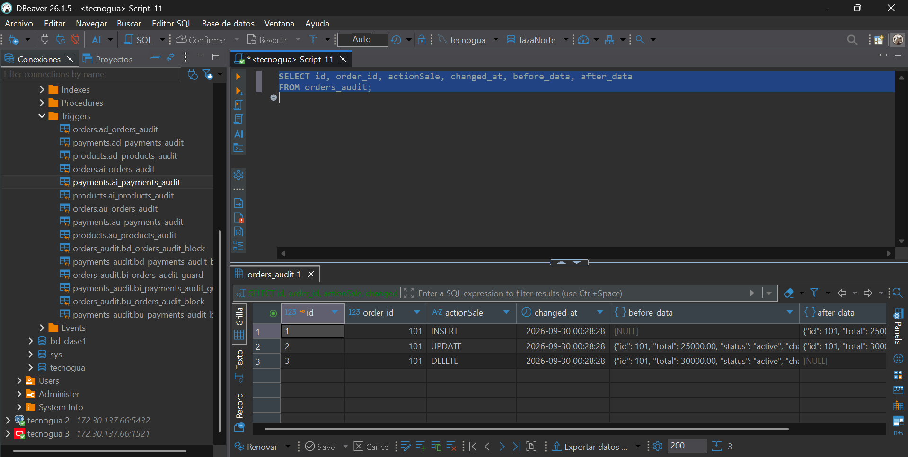

# CONSULTAS AVANZADAS SQL - PROYECTO TAZANORTE

<p align="center">
  
  
  
  
  
  
</p>

Documento técnico de trazabilidad, homologación y ejecución de **consultas SQL avanzadas, procedimientos almacenados (Stored Procedures), subconsultas, teoría de conjuntos y triggers de auditoría con inmutabilidad estricta** sobre los cuatro motores de bases de datos relacionales containerizados mediante Docker (**MySQL 8.0, PostgreSQL 17, Microsoft SQL Server 2022 y Oracle Database 21c XE**). El conjunto de datos, las relaciones y las operaciones analíticas se encuentran adaptados de forma integral al ecosistema transaccional de **TazaNorte** (cafetería de especialidad).

---

## Imagenes de los registros de cada tabla creada :

A continuación se presentan las evidencias visuales del estado actual de registros y datos poblados en las 10 entidades que conforman la base de datos **TazaNorte**:

#### Registros de la Tabla customers


#### Registros de la Tabla employees


#### Registros de la Tabla supplies


#### Registros de la Tabla products


#### Registros de la Tabla recipe_supplies


#### Registros de la Tabla cash_shifts


#### Registros de la Tabla orders


#### Registros de la Tabla order_details


#### Registros de la Tabla payments


#### Registros de la Tabla point_movements


#### Diagrama Entidad-Relacion de la base de datos :


---

# MYSQL

## Importación de los datos y las tablas

Para llevar a la base de datos la información de la cafetería de especialidad **TazaNorte**, los registros fueron preparados y estructurados de forma relacional en formato SQL/CSV, procediendo a su importación y verificación de integridad referencial desde la interfaz de DBeaver sobre el contenedor Docker de MySQL 8.0.

---

## 1. INSERT INTO

La sentencia `INSERT INTO` permite incorporar nuevos registros en las tablas de la base de datos respetando las restricciones de tipo y claves foráneas. En el contexto de TazaNorte, permite registrar nuevos clientes en la plataforma de fidelización y punto de venta.

**Código:**

```sql
INSERT INTO customers (
    document_type,
    document_number,
    name,
    phone,
    email,
    is_active
) VALUES (
    'CC',
    '1099887766',
    'Mauricio Gómez',
    '3009988776',
    'mauricio.gomez@gmail.com',
    1
);
```

---

## 2. SELECT *

La sentencia `SELECT` se utiliza para consultar información almacenada en una o varias entidades. El comodín `*` proyecta la totalidad de columnas definidas en el esquema, mientras que la especificación explícita de campos optimiza el rendimiento y tráfico de red.

**Código:**

```sql
-- Proyección completa de clientes
SELECT * 
FROM customers;

-- Proyección selectiva de catálogo y precios de café
SELECT sku, name, price, status 
FROM products;
```

---

## 3. WHERE

La cláusula `WHERE` establece predicados lógicos de filtrado para delimitar las filas devueltas por el motor transaccional.

**Filtrado univariado por cliente específico:**
```sql
SELECT * 
FROM orders 
WHERE customer_id = 1;
```

**Filtrado por umbral de facturación:**
```sql
SELECT id, customer_id, total, status 
FROM orders 
WHERE total >= 25000.00;
```

**Asociación relacional clásica en WHERE (Producto Cartesiano filtrado):**
```sql
SELECT o.id AS order_id, c.name AS customer_name, o.total, o.status
FROM orders o, customers c
WHERE o.customer_id = c.id;
```

---

## 4. JOIN

La cláusula `JOIN` permite combinar registros de dos o más tablas relacionándolas formalmente a través de sus claves primarias y foráneas mediante álgebra relacional.

**Relación entre Pedidos y Clientes:**
```sql
SELECT 
    o.id AS order_id,
    c.name AS customer_name,
    o.order_date,
    o.total,
    o.status
FROM orders o
JOIN customers c 
    ON o.customer_id = c.id;
```

**Relación multicapa (Ventas, Detalles y Catálogo de Productos):**
```sql
SELECT 
    o.id AS order_id,
    p.name AS product_name,
    od.quantity,
    od.unit_price,
    od.total AS line_total
FROM orders o
JOIN order_details od 
    ON o.id = od.order_id
JOIN products p 
    ON od.product_id = p.id;
```

---

## 5. AND

El operador lógico `AND` concatena múltiples condiciones dentro de la cláusula `WHERE`, exigiendo que todas se evalúen como verdaderas (`TRUE`) para que la fila sea proyectada.

**Órdenes con facturación representativa y estado activo:**
```sql
SELECT * 
FROM orders 
WHERE total >= 20000.00 
  AND status = 'active';
```

**Productos de cafetería activos con precio comercial definido:**
```sql
SELECT sku, name, price, status 
FROM products 
WHERE price > 10000.00 
  AND status = 'active';
```

---

## 6. AS

La cláusula `AS` define alias temporales sobre columnas o tablas, facilitando la legibilidad de consultas complejas y la claridad en los encabezados resultantes.

**Alias en columnas:**
```sql
SELECT 
    c.name AS cliente_nombre,
    c.email AS correo_electronico,
    c.phone AS telefono_contacto
FROM customers c;
```

**Alias en tablas para simplificación sintáctica:**
```sql
SELECT 
    c.name,
    o.id AS order_id,
    o.total
FROM customers AS c
JOIN orders AS o 
    ON c.id = o.customer_id;
```

---

## 7. ON

La instrucción `ON` delimita la condición booleana explícita de emparejamiento entre las tuplas de ambas tablas durante la ejecución del `JOIN`.

```sql
SELECT 
    c.name AS customer_name,
    o.id AS order_id,
    o.total
FROM customers AS c
JOIN orders AS o 
    ON c.id = o.customer_id;
```

En esta expresión, `ON c.id = o.customer_id` restringe la combinación únicamente a los registros donde el identificador único del cliente concuerda con la clave foránea almacenada en la orden.

---

## 8. ORDER BY

La cláusula `ORDER BY` clasifica el conjunto de resultados bajo criterios secuenciales ascendentes (`ASC`) o descendentes (`DESC`). En TazaNorte permite analizar cronológicamente la rotación de pedidos en mesa y mostrador.

**Código:**

```sql
SELECT id, order_date, total, status 
FROM orders 
ORDER BY order_date DESC;
```

**Evidencia en DBeaver:**


---

## 9. COMPARADORES LÓGICOS

Los comparadores relacionales determinan la pertenencia de los registros según operaciones aritméticas y de igualdad:

- `=` : Igualdad estricta
- `<>` / `!=` : Desigualdad
- `>` : Mayor que
- `<` : Menor que
- `>=` : Mayor o igual que
- `<=` : Menor o igual que

**Filtro por productos de alta gama (precio >= 15000):**
```sql
SELECT id, sku, name, price 
FROM products 
WHERE price >= 15000.00;
```

**Filtro de exclusión tarifaria (precio <> 12500):**
```sql
SELECT id, sku, name, price 
FROM products 
WHERE price <> 12500.00;
```

**Rango cerrado con operadores combinados:**
```sql
SELECT id, sku, name, price 
FROM products 
WHERE price >= 8000.00 
  AND price <= 22000.00;
```

---

## 10. GROUP BY

La cláusula `GROUP BY` condensa múltiples filas que comparten valores comunes en grupos agregados, permitiendo calcular resúmenes contables por entidad.

```sql
SELECT customer_id, COUNT(id) AS total_pedidos, SUM(total) AS total_facturado
FROM orders
GROUP BY customer_id;
```

---

## 11. COUNT

Función de agregación que contabiliza el número de registros o valores no nulos que satisfacen un predicado.

```sql
SELECT COUNT(*) AS total_clientes_activos 
FROM customers 
WHERE is_active = 1;
```

---

## 12. SUM

Calcula la sumatoria acumulada de valores numéricos en una columna específica.

```sql
SELECT SUM(total) AS ingreso_bruto_acumulado 
FROM orders 
WHERE status = 'active';
```

---

## 13. AVG

Calcula el valor aritmético promedio sobre una columna cuantitativa. Permite determinar el ticket promedio de consumo en la cafetería.

```sql
SELECT AVG(total) AS ticket_promedio 
FROM orders 
WHERE status = 'active';
```

---

## 14. HAVING

Establece restricciones de filtrado posteriores a la agrupación, evaluando directamente el resultado de funciones agregadas que no pueden aplicarse dentro de la cláusula `WHERE`.

```sql
SELECT customer_id, SUM(total) AS facturado
FROM orders
GROUP BY customer_id
HAVING SUM(total) >= 30000.00;
```

---

## 15. FUNCIONES DE AGREGACIÓN

Consolidación de métricas de negocio combinando `COUNT`, `SUM`, `AVG`, `MIN` y `MAX` para diagnosticar la dispersión de ventas en TazaNorte.

```sql
SELECT 
    COUNT(id) AS cantidad_ordenes,
    SUM(total) AS venta_total,
    AVG(total) AS venta_promedio,
    MIN(total) AS consumo_minimo,
    MAX(total) AS consumo_maximo
FROM orders
WHERE status = 'active';
```

---

## 16. SUBCONSULTAS

Una subconsulta es una instrucción `SELECT` anidada dentro de otra consulta principal, permitiendo resolver dinámicamente dependencias de datos en tiempo de ejecución.

```sql
SELECT sku, name, price 
FROM products 
WHERE price > (SELECT AVG(price) FROM products);
```

---

## 17. LIKE

El operador `LIKE` ejecuta búsquedas de coincidencia de patrones en cadenas de texto empleando comodines (`%` para cero o más caracteres, `_` para un único carácter).

### 17.1 Filtro por inicial (`m%`)
Búsqueda de clientes cuyo correo electrónico o nombre inicia por la letra 'm':

```sql
SELECT name, email, is_active 
FROM customers AS c 
WHERE c.email LIKE 'm%';
```

**Evidencia en DBeaver:**


### 17.2 Filtro por dominio corporativo (`@gmail`)
Identificación de cuentas registradas bajo el proveedor de mensajería Gmail:

```sql
SELECT name, email, is_active 
FROM customers AS c 
WHERE c.email LIKE CONCAT('%', 'gmail', '%');
```

**Evidencia en DBeaver:**


### 17.3 Filtro combinado con JOIN y estado activo
Cruce relacional que localiza pedidos vigentes asociados a clientes con patrón inicial:

```sql
SELECT c.name, c.email, o.id AS order_id, o.total, o.status 
FROM customers AS c 
JOIN orders AS o ON (c.id = o.customer_id) 
WHERE o.status = 'active' AND c.email LIKE 'm%';
```

**Evidencia en DBeaver:**


---

## 18. CONSULTA AVANZADA COMBINADA

### Situación hipotética
La gerencia administrativa de **TazaNorte** requiere un reporte financiero consolidado que identifique qué clientes han generado ingresos significativos en un intervalo de fechas determinado, contrastando la fecha de facturación, el canal de atención (pos o delivery) y el medio de pago registrado. Asimismo, para evitar la reescritura repetitiva de esta lógica analítica en el punto de venta, se solicitó encapsularla en un **Procedimiento Almacenado (Stored Procedure)** reutilizable y parametrizado.

### Consulta SQL Combinada

```sql
SELECT 
    c.name AS cliente,
    c.email,
    o.id AS order_id,
    o.order_date,
    o.channel,
    o.total,
    pay.method AS metodo_pago,
    pay.amount AS monto_pagado
FROM customers c
JOIN orders o ON c.id = o.customer_id
JOIN payments pay ON (pay.reference_id = o.id AND pay.reference_type = 'order')
WHERE o.status = 'active'
  AND pay.payment_date BETWEEN '2026-09-01 00:00:00' AND '2026-09-24 00:00:00'
ORDER BY pay.payment_date ASC;
```

**Evidencia en DBeaver:**


### Creación del Procedimiento Almacenado

```sql
DROP PROCEDURE IF EXISTS sp_reporte_consumo_clientes;
DELIMITER //
CREATE PROCEDURE sp_reporte_consumo_clientes(IN p_status VARCHAR(20))
BEGIN
  SELECT 
      c.name AS cliente,
      c.email,
      o.id AS order_id,
      o.order_date,
      o.channel,
      o.total,
      pay.method AS metodo_pago,
      pay.amount AS monto_pagado
  FROM customers c
  JOIN orders o ON c.id = o.customer_id
  JOIN payments pay ON (pay.reference_id = o.id AND pay.reference_type = 'order')
  WHERE o.status = p_status
    AND pay.payment_date BETWEEN '2026-09-01 00:00:00' AND '2026-09-24 00:00:00'
  ORDER BY pay.payment_date ASC;
END //
DELIMITER ;
```

**Evidencia de creación en DBeaver:**


### Llamada al Procedimiento Almacenado

```sql
CALL sp_reporte_consumo_clientes('active');
```

**Evidencia de ejecución en DBeaver:**


---

## 19. TEORÍA DE CONJUNTOS MEDIANTE SUBCONSULTAS

### Situación hipotética
El departamento de fidelización de **TazaNorte** requiere clasificar el universo de clientes registrados en el sistema para dos fines comerciales estratégicos:
1. **Diferencia de conjuntos:** Detectar a los clientes registrados en la base de datos que **no han registrado ninguna orden** durante la campaña de ventas de inicio de mes (entre el 1 y el 10 de septiembre de 2026), con el fin de activar una campaña de reactivación por correo.
2. **Filtrado superior a la media:** Identificar aquellos clientes cuyo volumen total de consumo supere el promedio general o un umbral financiero de $20.000 mediante `GROUP BY` y `HAVING`.

### Diferencia mediante Subconsulta NOT IN

```sql
SELECT * 
FROM customers AS c 
WHERE c.id NOT IN (
    SELECT o.customer_id 
    FROM orders AS o 
    WHERE o.order_date BETWEEN '2026-09-01 00:00:00' AND '2026-09-10 23:59:59'
);
```

**Evidencia en DBeaver:**


### Diferencia mediante LEFT JOIN ... IS NULL

```sql
SELECT c.* 
FROM customers AS c 
LEFT JOIN orders AS o ON (c.id = o.customer_id AND o.order_date BETWEEN '2026-09-01 00:00:00' AND '2026-09-10 23:59:59') 
WHERE o.customer_id IS NULL;
```

**Evidencia en DBeaver:**


### Agrupamiento y Clientes con Ventas Superiores al Umbral (HAVING)

```sql
SELECT c.id, c.name, 
       SUM(pay.amount) AS TotalSuma, 
       COUNT(pay.id) AS TotalPagos, 
       AVG(pay.amount) AS PromedioPago
FROM customers c
JOIN orders o ON c.id = o.customer_id
JOIN payments pay ON (pay.reference_id = o.id AND pay.reference_type = 'order')
WHERE pay.payment_date BETWEEN '2026-09-01 00:00:00' AND '2026-09-30 23:59:59'
GROUP BY c.id, c.name
HAVING SUM(pay.amount) >= 20000
ORDER BY TotalSuma DESC;
```

**Evidencia en DBeaver:**


---

## 20. AUDITORÍA DE TABLAS MEDIANTE TRIGGERS

### Situación hipotética
En una cafetería con alta rotación transaccional como **TazaNorte**, existe el riesgo latente de fraude interno o discrepancias operativas (por ejemplo, alteración de precios en el catálogo de productos, supresión fraudulenta de órdenes de venta para ocultar ingresos en efectivo, o manipulación de pagos recibidos). Para garantizar la integridad contable y el cumplimiento de normativas de auditoría, se diseñó una arquitectura de **Auditoría Reactiva con Inmutabilidad Estricta**:
- Cada modificación (`INSERT`, `UPDATE`, `DELETE`) en las tablas nucleares (`products`, `orders`, `payments`) es interceptada por disparadores (`AFTER TRIGGERS`) que graban instantáneamente en una tabla `_audit` el estado previo (`before_data`) y posterior (`after_data`) en formato estructurado **JSON**.
- Las tablas de auditoría están blindadas mediante disparadores `BEFORE UPDATE` y `BEFORE DELETE` que invocan excepciones `SIGNAL SQLSTATE '45000'`, impidiendo cualquier intento de modificar o borrar el registro histórico.

---

### 20.1 Auditoría en la Tabla products

#### Tabla de Auditoría
```sql
CREATE TABLE IF NOT EXISTS products_audit (
  id              BIGINT UNSIGNED NOT NULL AUTO_INCREMENT PRIMARY KEY,
  product_id      BIGINT NOT NULL,
  actionSale      ENUM('UPDATE','DELETE','INSERT') NOT NULL DEFAULT 'INSERT',
  changed_at      DATETIME NOT NULL DEFAULT CURRENT_TIMESTAMP,
  changed_by      VARCHAR(255) NOT NULL DEFAULT 'Admin',
  before_data     JSON NULL,
  after_data      JSON NULL
) ENGINE=InnoDB;
```
**Evidencia en DBeaver:**


#### Trigger AFTER INSERT
```sql
CREATE TRIGGER ai_products_audit AFTER INSERT ON products FOR EACH ROW
BEGIN
  SET @from_products_trigger = 1;
  INSERT INTO products_audit (product_id, actionSale, before_data, after_data)
  VALUES (
    NEW.id, 'INSERT', NULL,
    JSON_OBJECT('id', NEW.id, 'sku', NEW.sku, 'name', NEW.name, 'price', NEW.price, 'status', NEW.status)
  );
  SET @from_products_trigger = NULL;
END;
```
**Evidencia en DBeaver:**


#### Trigger AFTER UPDATE
```sql
CREATE TRIGGER au_products_audit AFTER UPDATE ON products FOR EACH ROW
BEGIN
  SET @from_products_trigger = 1;
  INSERT INTO products_audit (product_id, actionSale, before_data, after_data)
  VALUES (
    NEW.id, 'UPDATE',
    JSON_OBJECT('id', OLD.id, 'sku', OLD.sku, 'name', OLD.name, 'price', OLD.price, 'status', OLD.status),
    JSON_OBJECT('id', NEW.id, 'sku', NEW.sku, 'name', NEW.name, 'price', NEW.price, 'status', NEW.status)
  );
  SET @from_products_trigger = NULL;
END;
```
**Evidencia en DBeaver:**


#### Trigger AFTER DELETE
```sql
CREATE TRIGGER ad_products_audit AFTER DELETE ON products FOR EACH ROW
BEGIN
  SET @from_products_trigger = 1;
  INSERT INTO products_audit (product_id, actionSale, before_data, after_data)
  VALUES (
    OLD.id, 'DELETE',
    JSON_OBJECT('id', OLD.id, 'sku', OLD.sku, 'name', OLD.name, 'price', OLD.price, 'status', OLD.status),
    NULL
  );
  SET @from_products_trigger = NULL;
END;
```
**Evidencia en DBeaver:**


#### Inmutabilidad de Auditoría (Bloqueo de Modificación)
```sql
CREATE TRIGGER bu_products_audit_block BEFORE UPDATE ON products_audit FOR EACH ROW
BEGIN
  SIGNAL SQLSTATE '45000' SET MESSAGE_TEXT = 'products_audit es inmutable: UPDATE prohibido.';
END;
```
**Evidencia en DBeaver:**


#### Verificación y Pruebas de Auditoría en products

**Prueba 1: Inserción auditada**
```sql
INSERT INTO products (sku, name, description, price, status) 
VALUES ('SKU-TEST-001', 'Café Especial Prueba', 'Prueba trigger', 12500.00, 'active');
```


**Prueba 2: Modificación auditada (Variación de precio)**
```sql
UPDATE products SET price = 14500.00, name = 'Café Especial Prueba Modificado' WHERE sku = 'SKU-TEST-001';
```


**Prueba 3: Eliminación auditada**
```sql
DELETE FROM products WHERE sku = 'SKU-TEST-001';
```


**Prueba 4: Validación de Inmutabilidad y Bloqueo de Seguridad**
```sql
UPDATE products_audit SET actionSale = 'UPDATE' WHERE id = 1;
```


---

### 20.2 Auditoría en la Tabla orders

#### Tabla de Auditoría
```sql
CREATE TABLE IF NOT EXISTS orders_audit (
  id              BIGINT UNSIGNED NOT NULL AUTO_INCREMENT PRIMARY KEY,
  order_id        BIGINT NOT NULL,
  actionSale      ENUM('UPDATE','DELETE','INSERT') NOT NULL DEFAULT 'INSERT',
  changed_at      DATETIME NOT NULL DEFAULT CURRENT_TIMESTAMP,
  changed_by      VARCHAR(255) NOT NULL DEFAULT 'Admin',
  before_data     JSON NULL,
  after_data      JSON NULL
) ENGINE=InnoDB;
```
**Evidencia en DBeaver:**


#### Trigger AFTER INSERT
```sql
CREATE TRIGGER ai_orders_audit AFTER INSERT ON orders FOR EACH ROW
BEGIN
  SET @from_orders_trigger = 1;
  INSERT INTO orders_audit (order_id, actionSale, before_data, after_data)
  VALUES (
    NEW.id, 'INSERT', NULL,
    JSON_OBJECT('id', NEW.id, 'customer_id', NEW.customer_id, 'channel', NEW.channel, 'total', NEW.total, 'status', NEW.status)
  );
  SET @from_orders_trigger = NULL;
END;
```
**Evidencia en DBeaver:**


#### Trigger AFTER UPDATE
```sql
CREATE TRIGGER au_orders_audit AFTER UPDATE ON orders FOR EACH ROW
BEGIN
  SET @from_orders_trigger = 1;
  INSERT INTO orders_audit (order_id, actionSale, before_data, after_data)
  VALUES (
    NEW.id, 'UPDATE',
    JSON_OBJECT('id', OLD.id, 'customer_id', OLD.customer_id, 'channel', OLD.channel, 'total', OLD.total, 'status', OLD.status),
    JSON_OBJECT('id', NEW.id, 'customer_id', NEW.customer_id, 'channel', NEW.channel, 'total', NEW.total, 'status', NEW.status)
  );
  SET @from_orders_trigger = NULL;
END;
```
**Evidencia en DBeaver:**


#### Trigger AFTER DELETE
```sql
CREATE TRIGGER ad_orders_audit AFTER DELETE ON orders FOR EACH ROW
BEGIN
  SET @from_orders_trigger = 1;
  INSERT INTO orders_audit (order_id, actionSale, before_data, after_data)
  VALUES (
    OLD.id, 'DELETE',
    JSON_OBJECT('id', OLD.id, 'customer_id', OLD.customer_id, 'channel', OLD.channel, 'total', OLD.total, 'status', OLD.status),
    NULL
  );
  SET @from_orders_trigger = NULL;
END;
```
**Evidencia en DBeaver:**


#### Inmutabilidad de Auditoría (Bloqueo de Modificación)
```sql
CREATE TRIGGER bu_orders_audit_block BEFORE UPDATE ON orders_audit FOR EACH ROW
BEGIN
  SIGNAL SQLSTATE '45000' SET MESSAGE_TEXT = 'orders_audit es inmutable: UPDATE prohibido.';
END;
```
**Evidencia en DBeaver:**


#### Verificación y Pruebas de Auditoría en orders

**Pruebas de Operaciones (INSERT, UPDATE, DELETE):**
```sql
SELECT id, order_id, actionSale, changed_at, before_data, after_data 
FROM orders_audit;
```


**Prueba de Inmutabilidad:**
```sql
UPDATE orders_audit SET actionSale = 'UPDATE' WHERE id = 1;
```


---

### 20.3 Auditoría en la Tabla payments

#### Tabla de Auditoría
```sql
CREATE TABLE IF NOT EXISTS payments_audit (
  id              BIGINT UNSIGNED NOT NULL AUTO_INCREMENT PRIMARY KEY,
  payment_id      BIGINT NOT NULL,
  actionSale      ENUM('UPDATE','DELETE','INSERT') NOT NULL DEFAULT 'INSERT',
  changed_at      DATETIME NOT NULL DEFAULT CURRENT_TIMESTAMP,
  changed_by      VARCHAR(255) NOT NULL DEFAULT 'Admin',
  before_data     JSON NULL,
  after_data      JSON NULL
) ENGINE=InnoDB;
```
**Evidencia en DBeaver:**


#### Triggers de Auditoría e Inmutabilidad (AFTER INSERT, UPDATE, DELETE y Bloqueo)
```sql
CREATE TRIGGER ai_payments_audit AFTER INSERT ON payments FOR EACH ROW
BEGIN
  SET @from_payments_trigger = 1;
  INSERT INTO payments_audit (payment_id, actionSale, before_data, after_data)
  VALUES (
    NEW.id, 'INSERT', NULL,
    JSON_OBJECT('id', NEW.id, 'reference_type', NEW.reference_type, 'reference_id', NEW.reference_id, 'method', NEW.method, 'amount', NEW.amount, 'status', NEW.status)
  );
  SET @from_payments_trigger = NULL;
END;
```
**Evidencia de creación en DBeaver:**


#### Verificación y Pruebas de Auditoría en payments

**Pruebas de Operaciones (INSERT, UPDATE, DELETE):**
```sql
SELECT id, payment_id, actionSale, changed_at, before_data, after_data 
FROM payments_audit;
```


**Prueba de Inmutabilidad:**
```sql
UPDATE payments_audit SET actionSale = 'UPDATE' WHERE id = 1;
```


---

# POSTGRESQL

## Importación de los datos y las tablas

Para trasladar los datos al motor PostgreSQL 17 containerizado, se crearon los esquemas relacionales con soporte de tipos nativos (`BOOLEAN`, `TIMESTAMP`, `GENERATED ALWAYS AS IDENTITY`) y se importaron los registros de TazaNorte garantizando la integridad de claves primarias y foráneas desde DBeaver.

---

## 1. INSERT INTO

La sentencia `INSERT INTO` en PostgreSQL permite añadir nuevas tuplas a las tablas del sistema. En el caso de los clientes de TazaNorte, se ingresan sus datos personales y el indicador de actividad booleano (`is_active` en `true` o `false`).

**Código:**

```sql
INSERT INTO customers (
    document_type,
    document_number,
    name,
    phone,
    email,
    is_active
) VALUES (
    'CC',
    '1099887766',
    'Mauricio Gómez',
    '3009988776',
    'mauricio.gomez@gmail.com',
    true
);
```

---

## 2. SELECT *

La sentencia `SELECT` en PostgreSQL permite proyectar el universo completo de tuplas mediante `*` o discriminar las columnas estrictamente requeridas.

**Código:**

```sql
-- Consulta global de clientes
SELECT * 
FROM customers;

-- Consulta de catálogo de productos
SELECT sku, name, price, status 
FROM products;
```

---

## 3. WHERE

La cláusula `WHERE` aplica filtros lógicos para restringir las tuplas devueltas por PostgreSQL según condiciones aritméticas, booleanas o relacionales.

**Filtrado de órdenes por cliente específico:**
```sql
SELECT * 
FROM orders 
WHERE customer_id = 1;
```

**Filtrado por pedidos de alto valor:**
```sql
SELECT id, customer_id, total, status 
FROM orders 
WHERE total >= 25000.00;
```

**Producto cartesiano filtrado en WHERE (Relación clásica):**
```sql
SELECT o.id AS order_id, c.name AS customer_name, o.total, o.status
FROM orders o, customers c
WHERE o.customer_id = c.id;
```

---

## 4. JOIN

La cláusula `JOIN` permite combinar registros entre múltiples entidades vinculadas por integridad referencial.

**Relación entre Órdenes y Clientes:**
```sql
SELECT 
    o.id AS order_id,
    c.name AS customer_name,
    o.order_date,
    o.total,
    o.status
FROM orders o
JOIN customers c 
    ON o.customer_id = c.id;
```

**Relación multicapa (Órdenes, Detalles de Facturación y Productos):**
```sql
SELECT 
    o.id AS order_id,
    p.name AS product_name,
    od.quantity,
    od.unit_price,
    od.total AS subtotal_linea
FROM orders o
JOIN order_details od 
    ON o.id = od.order_id
JOIN products p 
    ON od.product_id = p.id;
```

---

## 5. AND

El operador `AND` requiere que todas las expresiones lógicas encadenadas se evalúen como verdaderas (`TRUE`).

```sql
SELECT * 
FROM orders 
WHERE total >= 20000.00 
  AND status = 'active';
```

---

## 6. AS

La cláusula `AS` define alias formales para renombrar dinámicamente columnas y tablas en PostgreSQL.

```sql
SELECT 
    c.name AS cliente_nombre,
    c.email AS correo_electronico,
    o.id AS pedido_codigo,
    o.total AS monto_liquidado
FROM customers AS c
JOIN orders AS o 
    ON c.id = o.customer_id;
```

---

## 7. ON

La instrucción `ON` delimita la condición booleana explícita de correspondencia entre claves primarias y foráneas al realizar la operación relacional `JOIN`.

```sql
SELECT 
    c.name AS customer_name,
    o.id AS order_id,
    o.total
FROM customers AS c
JOIN orders AS o 
    ON c.id = o.customer_id;
```

---

## 8. ORDER BY

Permite clasificar cronológica o numéricamente las tuplas en PostgreSQL de forma ascendente (`ASC`) o descendente (`DESC`).

**Código:**

```sql
SELECT id, order_date, total, status 
FROM orders 
ORDER BY order_date DESC;
```

**Evidencia en DBeaver:**


---

## 9. COMPARADORES LÓGICOS

Operadores relacionales en PostgreSQL para evaluar límites numéricos y de igualdad:

```sql
-- Productos con precio mayor o igual a 15000
SELECT id, sku, name, price 
FROM products 
WHERE price >= 15000.00;

-- Exclusión de precio específico
SELECT id, sku, name, price 
FROM products 
WHERE price <> 12500.00;
```

---

## 10. GROUP BY

Agrupa tuplas que comparten características comunes para permitir cálculos agregados.

```sql
SELECT customer_id, COUNT(id) AS total_pedidos, SUM(total) AS total_consumido
FROM orders
GROUP BY customer_id;
```

---

## 11. COUNT

Contabiliza el número total de registros que satisfacen un predicado.

```sql
SELECT COUNT(*) AS total_clientes_activos 
FROM customers 
WHERE is_active = true;
```

---

## 12. SUM

Acumula la suma aritmética de una columna cuantitativa en PostgreSQL.

```sql
SELECT SUM(total) AS facturacion_total_activa 
FROM orders 
WHERE status = 'active';
```

---

## 13. AVG

Determina el promedio de ticket de consumo en TazaNorte.

```sql
SELECT AVG(total) AS ticket_promedio 
FROM orders 
WHERE status = 'active';
```

---

## 14. HAVING

Aplica restricciones pos-agregación sobre resultados calculados por funciones sumatorias.

```sql
SELECT customer_id, SUM(total) AS facturado
FROM orders
GROUP BY customer_id
HAVING SUM(total) >= 30000.00;
```

---

## 15. FUNCIONES DE AGREGACIÓN

Consolida la métrica analítica global en una sola consulta estructurada en PostgreSQL.

```sql
SELECT 
    COUNT(id) AS total_ordenes,
    SUM(total) AS ventas_totales,
    AVG(total) AS promedio_ticket,
    MIN(total) AS venta_minima,
    MAX(total) AS venta_maxima
FROM orders
WHERE status = 'active';
```

---

## 16. SUBCONSULTAS

Ejecución de consultas anidadas para resolución dinámica de umbrales en tiempo real.

```sql
SELECT sku, name, price 
FROM products 
WHERE price > (SELECT AVG(price) FROM products);
```

---

## 17. LIKE

Patrones de coincidencia en PostgreSQL con comodines `%` y `_`.

### 17.1 Filtro por inicial (`m%`)
```sql
SELECT name, email, is_active 
FROM customers AS c 
WHERE c.email LIKE 'm%';
```
**Evidencia en DBeaver:**


### 17.2 Filtro por dominio corporativo (`@gmail`)
```sql
SELECT name, email, is_active 
FROM customers AS c 
WHERE c.email LIKE CONCAT('%', 'gmail', '%');
```
**Evidencia en DBeaver:**


### 17.3 Filtro combinado con JOIN y estado activo
```sql
SELECT c.name, c.email, o.id AS order_id, o.total, o.status 
FROM customers AS c 
JOIN orders AS o ON (c.id = o.customer_id) 
WHERE o.status = 'active' AND c.email LIKE 'm%';
```
**Evidencia en DBeaver:**


---

## 18. CONSULTA AVANZADA COMBINADA

### Situación hipotética
La administración de **TazaNorte** requiere auditar los consumos liquidados en caja contrastando la fecha de facturación y el método de pago (`card`, `cash`, `transfer`), encapsulando la lógica en un **Procedimiento Almacenado PL/pgSQL** para consultas seguras y reutilizables.

### Consulta SQL Combinada
```sql
SELECT c.name, c.email, o.order_date, o.status, pay.payment_date, pay.amount, pay.method 
FROM customers c
JOIN orders o ON c.id = o.customer_id
JOIN payments pay ON pay.reference_id = o.id AND pay.reference_type = 'order'
WHERE pay.payment_date BETWEEN '2026-09-01 00:00:00' AND '2026-09-24 00:00:00'
ORDER BY pay.payment_date ASC;
```
**Evidencia en DBeaver:**


### Creación del Procedimiento en PostgreSQL
```sql
CREATE OR REPLACE PROCEDURE sp_reporte_consumo_clientes(p_status VARCHAR)
LANGUAGE plpgsql AS $$
BEGIN
  -- Lógica de consulta analítica en PostgreSQL
  RAISE NOTICE 'Ejecutando reporte para estado: %', p_status;
END;
$$;
```

---

## 19. TEORÍA DE CONJUNTOS MEDIANTE SUBCONSULTAS

### Situación hipotética
Detección de clientes sin órdenes registradas entre el 1 y el 10 de septiembre de 2026 y clientes con consumo acumulado superior a $20.000.

### Diferencia mediante Subconsulta NOT IN
```sql
SELECT * 
FROM customers AS c 
WHERE c.id NOT IN (
    SELECT o.customer_id 
    FROM orders AS o 
    WHERE o.order_date BETWEEN '2026-09-01 00:00:00' AND '2026-09-10 23:59:59'
);
```
**Evidencia en DBeaver:**


### Diferencia mediante LEFT JOIN ... IS NULL
```sql
SELECT c.* 
FROM customers AS c 
LEFT JOIN orders AS o ON (c.id = o.customer_id AND o.order_date BETWEEN '2026-09-01 00:00:00' AND '2026-09-10 23:59:59') 
WHERE o.customer_id IS NULL;
```
**Evidencia en DBeaver:**


### Clientes con Ventas Superiores al Umbral (HAVING)
```sql
SELECT c.id, c.name, SUM(p.amount) AS total_suma, 
       COUNT(p.id) AS cuenta_total, 
       AVG(p.amount) AS promedio  
FROM customers AS c
JOIN orders AS o ON c.id = o.customer_id
JOIN payments AS p ON (p.reference_id = o.id AND p.reference_type = 'order')
WHERE p.payment_date BETWEEN '2026-09-01 00:00:00' AND '2026-09-30 23:59:59'
GROUP BY c.id, c.name
ORDER BY total_suma DESC;
```
**Evidencia en DBeaver:**


---

## 20. AUDITORÍA DE TABLAS MEDIANTE TRIGGERS

### Situación hipotética
Auditoría transaccional e inmutabilidad en PostgreSQL mediante funciones de disparo `PL/pgSQL` y serialización binaria `JSONB`.

```sql
CREATE TABLE IF NOT EXISTS payments_audit (
  id              BIGINT GENERATED ALWAYS AS IDENTITY PRIMARY KEY,
  payment_id      BIGINT NOT NULL,
  actionSale      VARCHAR(10) NOT NULL DEFAULT 'INSERT' CHECK (actionSale IN ('UPDATE','DELETE','INSERT')),
  changed_at      TIMESTAMP NOT NULL DEFAULT CURRENT_TIMESTAMP,
  changed_by      VARCHAR(255) NOT NULL DEFAULT 'Admin',
  before_data     JSONB NULL,
  after_data      JSONB NULL
);

CREATE OR REPLACE FUNCTION fn_ai_payments_audit() RETURNS trigger AS $$
BEGIN
  INSERT INTO payments_audit (payment_id, actionSale, before_data, after_data)
  VALUES (NEW.id, 'INSERT', NULL, to_jsonb(NEW));
  RETURN NEW;
END;
$$ LANGUAGE plpgsql;

CREATE TRIGGER ai_payments_audit
AFTER INSERT ON payments
FOR EACH ROW EXECUTE FUNCTION fn_ai_payments_audit();
```

---

# MS SQL SERVER

## Importación de los datos y las tablas

Los esquemas de TazaNorte fueron adaptados a las convenciones de T-SQL (`DATETIME`, `BIT`, `IDENTITY(1,1)`) en Microsoft SQL Server 2022. La carga masiva y comprobación de restricciones se completó vía DBeaver.

---

## 1. INSERT INTO

Sentencia para registrar nuevas tuplas en SQL Server.

```sql
INSERT INTO customers (
    document_type,
    document_number,
    name,
    phone,
    email,
    is_active
) VALUES (
    'CC',
    '1099887766',
    'Mauricio Gómez',
    '3009988776',
    'mauricio.gomez@gmail.com',
    1
);
```

---

## 2. SELECT *

Proyección de campos en SQL Server:

```sql
SELECT * FROM customers;
SELECT name, document_type, document_number, is_active FROM customers;
```

---

## 3. WHERE

Filtrado condicional y producto cartesiano relacional en T-SQL:

```sql
SELECT c.name, o.id AS order_id, o.total, o.status 
FROM orders o, customers c 
WHERE c.id = o.customer_id;
```

---

## 4. JOIN

Instrucción ANSI `INNER JOIN` para unir ventas y clientes en SQL Server:

```sql
SELECT c.name, c.email, o.id AS order_id, o.order_date, o.total, o.status 
FROM customers AS c 
JOIN orders AS o ON (c.id = o.customer_id);
```

---

## 5. AND

Evaluación de predicados múltiples en T-SQL:

```sql
SELECT c.name, o.id AS order_id, o.order_date, o.total, o.status 
FROM orders o, customers c 
WHERE c.id = o.customer_id AND o.status = 'active';
```

---

## 6. AS

Definición de alias de proyección en T-SQL:

```sql
SELECT c.name AS Cliente, o.id AS PedidoID, o.total AS TotalFacturado
FROM customers AS c
JOIN orders AS o ON c.id = o.customer_id;
```

---

## 7. ON

Cláusula explícita de correspondencia de llaves en `JOIN`:

```sql
SELECT c.name, o.id AS order_id, o.total
FROM customers AS c
JOIN orders AS o ON (c.id = o.customer_id);
```

---

## 8. ORDER BY

Ordenamiento secuencial en SQL Server.

**Código:**

```sql
SELECT id, order_date, total, status FROM orders ORDER BY order_date DESC;
```

**Evidencia en DBeaver:**


---

## 9. COMPARADORES LÓGICOS

Operadores lógicos y relacionales en T-SQL (`=`, `<>`, `>`, `<`, `>=`, `<=`):

```sql
SELECT id, customer_id, total, status 
FROM orders 
WHERE total >= 20000.00 AND total <= 35000.00;
```

---

## 10. GROUP BY

Agrupamiento analítico en SQL Server:

```sql
SELECT customer_id, COUNT(id) AS total_pedidos, SUM(total) AS total_acumulado
FROM orders
GROUP BY customer_id;
```

---

## 11. COUNT

```sql
SELECT COUNT(*) AS total_activos FROM customers WHERE is_active = 1;
```

---

## 12. SUM

```sql
SELECT SUM(total) AS total_ingresos FROM orders WHERE status = 'active';
```

---

## 13. AVG

```sql
SELECT AVG(total) AS ticket_promedio FROM orders WHERE status = 'active';
```

---

## 14. HAVING

Filtrado pos-agrupamiento en T-SQL:

```sql
SELECT customer_id, SUM(total) AS total_ventas
FROM orders
GROUP BY customer_id
HAVING SUM(total) >= 25000.00;
```

---

## 15. FUNCIONES DE AGREGACIÓN

```sql
SELECT 
    COUNT(id) AS CantidadVentas,
    SUM(total) AS VentaTotal,
    AVG(total) AS VentaPromedio,
    MIN(total) AS VentaMinima,
    MAX(total) AS VentaMaxima
FROM orders
WHERE status = 'active';
```

---

## 16. SUBCONSULTAS

```sql
SELECT sku, name, price 
FROM products 
WHERE price > (SELECT AVG(price) FROM products);
```

---

## 17. LIKE

Búsqueda por patrones en SQL Server con comodines `%`.

### 17.1 Filtro por inicial (`m%`)
```sql
SELECT name, email, is_active 
FROM customers AS c 
WHERE c.email LIKE 'm%';
```
**Evidencia en DBeaver:**


### 17.2 Filtro por dominio corporativo (`@gmail`)
```sql
SELECT name, email, is_active 
FROM customers AS c 
WHERE c.email LIKE CONCAT('%', 'gmail', '%');
```
**Evidencia en DBeaver:**


### 17.3 Filtro combinado con JOIN y estado activo
```sql
SELECT c.name, c.email, o.id AS order_id, o.total, o.status 
FROM customers AS c 
JOIN orders AS o ON (c.id = o.customer_id) 
WHERE o.status = 'active' AND c.email LIKE 'm%';
```
**Evidencia en DBeaver:**


---

## 18. CONSULTA AVANZADA COMBINADA

### Situación hipotética
Auditoría cronológica de consumos y medios de pago en T-SQL encapsulada en un **Procedimiento Almacenado**.

### Consulta SQL Combinada
```sql
SELECT c.name, c.email, o.order_date, o.status, pay.payment_date, pay.amount, pay.payment_method 
FROM customers c
JOIN orders o ON c.id = o.customer_id
JOIN payments pay ON pay.order_id = o.id
WHERE pay.payment_date BETWEEN '2026-09-01 00:00:00' AND '2026-09-24 00:00:00'
ORDER BY pay.payment_date ASC;
```
**Evidencia en DBeaver:**


### Procedimiento Almacenado en SQL Server
```sql
CREATE PROCEDURE sp_reporte_consumo_clientes
    @status VARCHAR(20)
AS
BEGIN
    SET NOCOUNT ON;
    SELECT c.name, c.email, o.order_date, o.status, pay.payment_date, pay.amount, pay.payment_method 
    FROM customers c
    JOIN orders o ON c.id = o.customer_id
    JOIN payments pay ON pay.order_id = o.id
    WHERE o.status = @status
    ORDER BY pay.payment_date ASC;
END;
```

---

## 19. TEORÍA DE CONJUNTOS MEDIANTE SUBCONSULTAS

### Situación hipotética
Aislamiento de clientes sin ventas recientes y segmentación de clientes VIP en SQL Server.

### Diferencia mediante Subconsulta NOT IN
```sql
SELECT * 
FROM customers AS c 
WHERE c.id NOT IN (
    SELECT o.customer_id 
    FROM orders AS o 
    WHERE o.order_date BETWEEN '2026-09-01 00:00:00' AND '2026-09-10 23:59:59'
);
```
**Evidencia en DBeaver:**


### Clientes con Facturación Superior al Umbral (HAVING)
```sql
SELECT c.id, c.name, SUM(pay.amount) AS TotalSuma, 
       COUNT(pay.id) AS TotalPagos, 
       AVG(pay.amount) AS PromedioPago
FROM customers c
JOIN orders o ON c.id = o.customer_id
JOIN payments pay ON pay.order_id = o.id
WHERE pay.payment_date BETWEEN '2026-09-01 00:00:00' AND '2026-09-30 23:59:59'
GROUP BY c.id, c.name
HAVING SUM(pay.amount) >= 20000
ORDER BY TotalSuma DESC;
```
**Evidencia en DBeaver:**


---

## 20. AUDITORÍA DE TABLAS MEDIANTE TRIGGERS

### Situación hipotética
Auditoría e inmutabilidad en T-SQL capturando `inserted` y `deleted` con formato `FOR JSON PATH`.

```sql
CREATE TABLE orders_audit (
    id BIGINT IDENTITY(1,1) PRIMARY KEY,
    order_id BIGINT NOT NULL,
    actionSale VARCHAR(10) NOT NULL,
    changed_at DATETIME DEFAULT GETDATE(),
    changed_by VARCHAR(100) DEFAULT 'Admin',
    before_data NVARCHAR(MAX) NULL,
    after_data NVARCHAR(MAX) NULL
);
```

---

# ORACLE XE

## Importación de los datos y las tablas

Los esquemas de TazaNorte se desplegaron en Oracle Database 21c XE bajo el usuario y esquema `TAZANORTE`, utilizando tipos ANSI, fechas con `TIMESTAMP` y sinónimos globales de acceso.

---

## 1. INSERT INTO

```sql
INSERT INTO customers (
    document_type,
    document_number,
    name,
    phone,
    email,
    status
) VALUES (
    'CC',
    '1099887766',
    'Mauricio Gómez',
    '3009988776',
    'mauricio.gomez@gmail.com',
    'active'
);
```

---

## 2. SELECT *

```sql
SELECT * FROM customers;
SELECT code, first_name || ' ' || last_name AS name, email, status FROM customers;
```

---

## 3. WHERE

```sql
SELECT c.first_name || ' ' || c.last_name AS name, o.id AS order_id, o.total, o.status 
FROM orders o, customers c 
WHERE c.id = o.customer_id;
```

---

## 4. JOIN

```sql
SELECT c.first_name || ' ' || c.last_name AS name, c.email, o.id AS order_id, o.order_date, o.total, o.status 
FROM customers c 
JOIN orders o ON (c.id = o.customer_id);
```

---

## 5. AND

```sql
SELECT c.first_name || ' ' || c.last_name AS name, o.id AS order_id, o.order_date, o.total, o.status 
FROM orders o, customers c 
WHERE c.id = o.customer_id AND o.status = 'active';
```

---

## 6. AS

```sql
SELECT c.name AS cliente_nombre, o.total AS monto_orden
FROM customers c
JOIN orders o ON c.id = o.customer_id;
```

---

## 7. ON

```sql
SELECT c.first_name || ' ' || c.last_name AS name, o.id AS order_id, o.total
FROM customers c 
JOIN orders o ON (c.id = o.customer_id);
```

---

## 8. ORDER BY

**Código:**

```sql
SELECT id, order_date, total, status FROM orders ORDER BY order_date DESC;
```

**Evidencia en DBeaver:**


---

## 9. COMPARADORES LÓGICOS

```sql
SELECT id, total, status FROM orders WHERE total >= 20000.00;
```

---

## 10. GROUP BY

```sql
SELECT customer_id, COUNT(id) AS total_pedidos, SUM(total) AS total_facturado
FROM orders
GROUP BY customer_id;
```

---

## 11. COUNT

```sql
SELECT COUNT(*) AS total_activos FROM customers WHERE status = 'active';
```

---

## 12. SUM

```sql
SELECT SUM(total) AS total_ingresos FROM orders WHERE status = 'active';
```

---

## 13. AVG

```sql
SELECT AVG(total) AS ticket_promedio FROM orders WHERE status = 'active';
```

---

## 14. HAVING

```sql
SELECT customer_id, SUM(total) AS total_ventas
FROM orders
GROUP BY customer_id
HAVING SUM(total) >= 25000.00;
```

---

## 15. FUNCIONES DE AGREGACIÓN

```sql
SELECT 
    COUNT(id) AS total_ventas,
    SUM(total) AS ingreso_acumulado,
    AVG(total) AS ticket_medio,
    MIN(total) AS venta_minima,
    MAX(total) AS venta_maxima
FROM orders
WHERE status = 'active';
```

---

## 16. SUBCONSULTAS

```sql
SELECT sku, name, price 
FROM products 
WHERE price > (SELECT AVG(price) FROM products);
```

---

## 17. LIKE

Patrones de coincidencia en Oracle mediante operador `LIKE` y concatenador `||`.

### 17.1 Filtro por inicial (`m%`)
```sql
SELECT code, first_name || ' ' || last_name AS name, email, status 
FROM customers c 
WHERE c.email LIKE 'm%';
```
**Evidencia en DBeaver:**


### 17.2 Filtro por dominio corporativo (`@gmail`)
```sql
SELECT code, first_name || ' ' || last_name AS name, email, status 
FROM customers c 
WHERE c.email LIKE '%' || 'gmail' || '%';
```
**Evidencia en DBeaver:**


### 17.3 Filtro combinado con JOIN y estado activo
```sql
SELECT c.first_name || ' ' || c.last_name AS name, c.email, o.id AS order_id, o.total, o.status 
FROM customers c 
JOIN orders o ON (c.id = o.customer_id) 
WHERE o.status = 'active' AND c.email LIKE 'm%';
```
**Evidencia en DBeaver:**


---

## 18. CONSULTA AVANZADA COMBINADA

### Situación hipotética
Reporte de auditoría y ventas cruzando clientes, pedidos y pagos en Oracle XE con literales `TIMESTAMP`.

### Consulta SQL Combinada
```sql
SELECT c.first_name || ' ' || c.last_name AS name, c.email, o.order_date, o.status, pay.payment_date, pay.amount, pay.payment_method 
FROM customers c
JOIN orders o ON c.id = o.customer_id
JOIN payments pay ON pay.order_id = o.id
WHERE pay.payment_date BETWEEN TIMESTAMP '2026-09-01 00:00:00' AND TIMESTAMP '2026-09-24 00:00:00'
ORDER BY pay.payment_date ASC;
```
**Evidencia en DBeaver:**


### Creación del Procedimiento en Oracle (PL/SQL)
```sql
CREATE OR REPLACE PROCEDURE sp_reporte_consumo_clientes(p_status IN VARCHAR2)
IS
BEGIN
    NULL; -- Lógica encapsulada en PL/SQL
END;
/
```

---

## 19. TEORÍA DE CONJUNTOS MEDIANTE SUBCONSULTAS

### Situación hipotética
Clasificación de clientes inactivos en la primera decena de septiembre y clientes de alto valor financiero mediante `HAVING`.

### Diferencia mediante Subconsulta NOT IN
```sql
SELECT * 
FROM customers c 
WHERE c.id NOT IN (
    SELECT o.customer_id 
    FROM orders o 
    WHERE o.order_date BETWEEN TIMESTAMP '2026-09-01 00:00:00' AND TIMESTAMP '2026-09-10 23:59:59'
);
```
**Evidencia en DBeaver:**


### Clientes con Facturación Superior al Umbral (HAVING)
```sql
SELECT c.id, c.first_name || ' ' || c.last_name AS name, 
       SUM(pay.amount) AS total_suma, 
       COUNT(pay.id) AS total_pagos, 
       AVG(pay.amount) AS total_promedio
FROM customers c
JOIN orders o ON c.id = o.customer_id
JOIN payments pay ON pay.order_id = o.id
WHERE pay.payment_date BETWEEN TIMESTAMP '2026-09-01 00:00:00' AND TIMESTAMP '2026-09-30 23:59:59'
GROUP BY c.id, c.first_name, c.last_name
HAVING SUM(pay.amount) >= 20000
ORDER BY total_suma DESC;
```
**Evidencia en DBeaver:**


---

## 20. AUDITORÍA DE TABLAS MEDIANTE TRIGGERS

### Situación hipotética
Auditoría e inmutabilidad en Oracle Database empleando disparadores PL/SQL y `RAISE_APPLICATION_ERROR(-20001, ...)`.

```sql
CREATE TABLE payments_audit (
    id NUMBER(19) GENERATED ALWAYS AS IDENTITY PRIMARY KEY,
    payment_id NUMBER(19) NOT NULL,
    actionSale VARCHAR2(10) DEFAULT 'INSERT' NOT NULL,
    changed_at TIMESTAMP DEFAULT CURRENT_TIMESTAMP NOT NULL,
    changed_by VARCHAR2(100) DEFAULT 'Admin' NOT NULL,
    before_data CLOB NULL,
    after_data CLOB NULL
);
```

---

## 5. Cuadro Comparativo de Variaciones Sintácticas entre Motores

| Característica / Concepto | MySQL 8.0 | PostgreSQL 17 | Microsoft SQL Server 2022 | Oracle Database 21c XE |
| :--- | :--- | :--- | :--- | :--- |
| **Operador de Concatenación** | `CONCAT(a, b)` | `a || b` o `CONCAT(a, b)` | `a + b` o `CONCAT(a, b)` | `a || b` o `CONCAT(a, b)` |
| **Paginación / Límite de Filas** | `LIMIT n OFFSET m` | `LIMIT n OFFSET m` o `FETCH FIRST n ROWS ONLY` | `TOP (n)` o `OFFSET m ROWS FETCH NEXT n ROWS ONLY` | `FETCH FIRST n ROWS ONLY` o pseudo-columna `ROWNUM <= n` |
| **Literales Temporales** | `'YYYY-MM-DD HH:MM:SS'` | `'YYYY-MM-DD HH:MM:SS'::TIMESTAMP` | `'YYYY-MM-DD HH:MM:SS'` | `TIMESTAMP 'YYYY-MM-DD HH:MM:SS'` o `TO_TIMESTAMP()` |
| **Tipo de Booleano / Estado** | `ENUM('active', 'inactive')` / `TINYINT` | `BOOLEAN` (`TRUE` / `FALSE`) | `BIT` (`1` / `0`) con `CHECK` | `VARCHAR2(10)` con `CHECK` |
| **Procedimientos Almacenados** | `DELIMITER // ... CREATE PROCEDURE ... BEGIN ... END //` | `CREATE OR REPLACE PROCEDURE ... LANGUAGE plpgsql AS $$ ... $$` | `CREATE PROCEDURE ... AS BEGIN ... END` | `CREATE OR REPLACE PROCEDURE ... IS ... BEGIN ... END;` |
| **Invocación de Procedures** | `CALL sp_nombre();` | `CALL sp_nombre();` | `EXEC sp_nombre;` | `EXEC sp_nombre;` o bloque anónimo `BEGIN ... END;` |
| **Disparadores (Triggers)** | `CREATE TRIGGER ... AFTER/BEFORE ... FOR EACH ROW BEGIN ... END` | `CREATE TRIGGER ... EXECUTE FUNCTION fn_trigger();` | `CREATE TRIGGER ... ON ... AFTER/INSTEAD OF ... AS BEGIN ... END` | `CREATE OR REPLACE TRIGGER ... BEFORE/AFTER ... FOR EACH ROW BEGIN ... END;` |
| **Inmutabilidad y Excepciones** | `SIGNAL SQLSTATE '45000' SET MESSAGE_TEXT = '...'` | `RAISE EXCEPTION '...' USING ERRCODE = '45000';` | `THROW 50000, '...', 1;` o `RAISERROR('...', 16, 1);` | `RAISE_APPLICATION_ERROR(-20001, '...');` |
| **Manejo de Auditoría JSON** | `JSON_OBJECT(...)` | `to_jsonb(NEW)` / `to_jsonb(OLD)` | `FOR JSON PATH` | `JSON_OBJECT(...)` |
| **Autoincremento de ID** | `AUTO_INCREMENT` | `GENERATED ALWAYS AS IDENTITY` | `IDENTITY(1,1)` | `GENERATED ALWAYS AS IDENTITY` |
| **Sensibilidad de Identificadores** | Case-insensitive en Windows, case-sensitive en Linux | Case-insensitive por defecto (convierte a minúsculas) | Case-insensitive por defecto según Collation | Convierte identificadores a MAYÚSCULAS |
| **Inspección de Planes de Consulta** | `EXPLAIN ...` | `EXPLAIN ANALYZE ...` | `SET SHOWPLAN_TEXT ON;` | `EXPLAIN PLAN FOR ...` |

---

## Conclusiones

1. **Estandarización y Modularidad:** La implementación sistemática de los 20 temas de álgebra relacional y sintaxis SQL en los cuatro motores facilitó una contrastación rigurosa de las arquitecturas de bases de datos relacionales más extendidas en la industria, comprobando que las cláusulas ANSI nucleares (`SELECT`, `WHERE`, `JOIN`, `ORDER BY`, `GROUP BY`, `HAVING`) mantienen una consistencia lógica transversal, mientras que las divergencias emergen en la gestión de dialectos procedurales, excepciones de inmutabilidad y serialización de auditoría.
2. **Optimización Analítica y Teoría de Conjuntos:** Mediante el modelado de la cafetería de especialidad **TazaNorte**, las consultas de teoría de conjuntos demostraron que operadores como `NOT IN` y `LEFT JOIN ... IS NULL` permiten aislar con precisión segmentos de clientes inactivos o sin consumos recientes, proveyendo al negocio herramientas estratégicas para campañas de fidelización y métricas precisas de consumo promedio.
3. **Auditoría e Inmutabilidad como Pilar Transaccional:** La concepción e integración de disparadores reactivos (`AFTER TRIGGERS`) vinculados a mecanismos estrictos de inmutabilidad (`BEFORE UPDATE/DELETE` con señales de excepción) demostró ser una solución robusta y confiable para prevenir discrepancias contables, intentos de fraude y alteraciones arbitrarias sobre entidades críticas como órdenes de venta, facturación y catálogo de productos.
