# ☕ Creación de Base de Datos - TazaNorte

<p align="center">
  
  
  
  
  
  
</p>

---

## 🖥️ Apertura de las bases de datos en terminal

Para la inicialización y aprovisionamiento de las bases de datos en cada motor de persistencia relacional, se estableció sesión directa a través de la terminal de **Ubuntu (WSL)** empleando las credenciales de administración previamente configuradas. A continuación, se detallan las instrucciones ejecutadas en la interfaz de línea de comandos (CLI) de cada motor:

###  MySQL

```sql
CREATE DATABASE TazaNorte;
```

###  PostgreSQL

```postgres
CREATE DATABASE tazanorte;
```

###  MSSQL Server

```sql
CREATE DATABASE tazanorte;

GO
```

###  Oracle Database

```sql
-- En Oracle la organización de datos se realiza a través de usuarios y esquemas:
CREATE USER tazanorte IDENTIFIED BY "TazaNorte2026*";
GRANT CONNECT, RESOURCE, DBA TO tazanorte;
ALTER USER tazanorte QUOTA UNLIMITED ON USERS;
```

---

### 📸 Ejecución

A continuación se documenta el proceso de invocación de los motores de bases de datos y la creación de cada instancia desde la terminal:

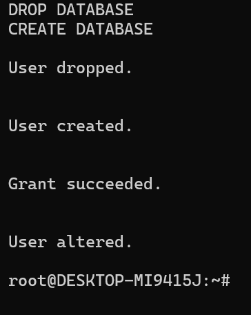

---

### 🔍 Evidencia

Confirmación visual de las bases de datos creadas y disponibles para su gestión y conexión desde herramientas de administración:

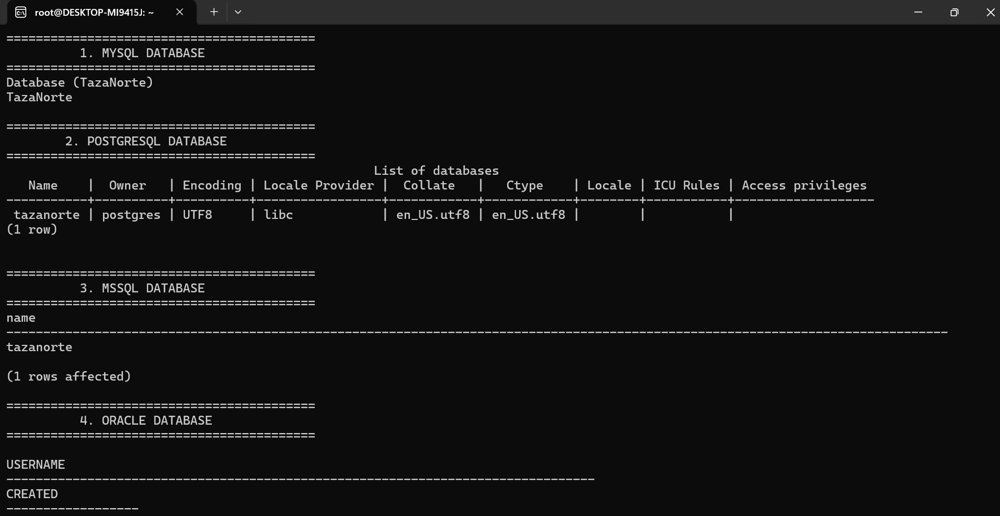

---

## 📋 Anotaciones y Convenciones de Diseño

Para garantizar uniformidad, escalabilidad y compatibilidad con arquitecturas limpias y Domain-Driven Design (DDD), se aplicaron los siguientes estándares en todas las implementaciones:

- 🏷️ **Entidades de Dominio:** Se estructuran como objetos en lenguaje **inglés**, empleando notación **PascalCase** y en formato **singular** (ejemplo: `Customer`, `Product`, `Order`, `CashShift`).
- 🗄️ **Tablas Físicas:** Se nombran en **inglés**, en **minúsculas** y en formato **plural** utilizando la convención **snake_case** (ejemplo: `customers`, `products`, `orders`, `cash_shifts`).
- 📝 **Atributos y Columnas:** Todos los campos se encuentran definidos en **inglés** bajo el formato **snake_case** (ejemplo: `document_type`, `unit_of_measure`, `created_at`).
- 🔑 **Claves Primarias:** Cada tabla cuenta con una llave primaria unificada e indexada denominada **`id`**, configurada como tipo entero de alta capacidad (**`BIGINT`** o su equivalente nativo).
- 🔗 **Claves Foráneas (FK):** Siguen la regla estricta del nombre de la entidad/tabla relacionada en **singular** acompañado del sufijo **`_id`** (ejemplo: `customer_id`, `product_id`, `employee_id`, `cash_shift_id`).
- ⏱️ **Trazabilidad y Auditoría Temporal:** Todas las tablas registran automáticamente los sellos temporales **`created_at`** y **`updated_at`**, asegurando un histórico cronológico inalterable.
- 🛡️ **Restricciones de Integridad y Unicidad:** Aquellos atributos que no admiten duplicidad (como documentos de identidad, códigos SKU e identificadores de insumos) están resguardados por restricciones **`UNIQUE`**.
- 🚦 **Gestión de Estados (Soft Control):** Se integra una columna de control de ciclo de vida (`status` o `is_active`) para permitir bajas lógicas e inhabilitaciones sin perder trazabilidad transaccional.
- 📐 **Diagramación Relacional:** Una vez completada la persistencia física en cada motor, se genera y valida el respectivo Diagrama Entidad-Relación (ER) mediante DBeaver.

---

# 📊 Tablas del Dominio

**TazaNorte** es una plataforma de software diseñada para la operación omnicanal de cafeterías y puntos de venta especializados. El sistema centraliza la gestión de pedidos tanto en caja como para llevar, capturando especificaciones personalizadas (variantes de leche, endulzantes, extras y observaciones de baristas), coordinando el envío de comandas a la zona de preparación, controlando el inventario crítico de insumos mediante recetas predefinidas y auditando la apertura y cierre de turnos de caja. Asimismo, administra un programa de fidelización por puntos que acredita saldos auditables únicamente sobre ventas liquidadas y autoriza redenciones controladas.

A continuación, se presenta la matriz de entidades y tablas físicas del dominio:

| Entidad | Tabla | Atributos / Claves sugeridos |
|---|---|---|
| **Customer** | `customers` | `id (PK)`, `document_type`, `document_number (UQ)`, `name`, `phone`, `email`, `status / is_active`, `created_at`, `updated_at` |
| **Employee** | `employees` | `id (PK)`, `name`, `description`, `status / is_active`, `created_at`, `updated_at` |
| **Supply** | `supplies` | `id (PK)`, `code (UQ)`, `name`, `unit_of_measure`, `min_stock`, `status / is_active`, `created_at`, `updated_at` |
| **Product** | `products` | `id (PK)`, `sku (UQ)`, `name`, `description`, `price`, `status / is_active`, `created_at`, `updated_at` |
| **RecipeSupply** | `recipe_supplies` | `id (PK)`, `product_id (FK)`, `supply_id (FK)`, `quantity`, `status / is_active`, `created_at`, `updated_at` |
| **CashShift** | `cash_shifts` | `id (PK)`, `employee_id (FK)`, `name`, `description`, `opened_at`, `closed_at`, `initial_balance`, `final_balance`, `status`, `created_at`, `updated_at` |
| **Order** | `orders` | `id (PK)`, `customer_id (FK)`, `cash_shift_id (FK)`, `channel`, `order_date`, `subtotal`, `total`, `status`, `created_at`, `updated_at` |
| **OrderDetail** | `order_details` | `id (PK)`, `order_id (FK)`, `product_id (FK)`, `quantity`, `unit_price`, `total`, `observations`, `created_at`, `updated_at` |
| **Payment** | `payments` | `id (PK)`, `reference_type`, `reference_id`, `method`, `amount`, `payment_date`, `status`, `created_at`, `updated_at` |
| **PointMovement** | `point_movements` | `id (PK)`, `customer_id (FK)`, `order_id (FK)`, `reference_type`, `reference_id`, `movement_type`, `points`, `movement_date`, `observations`, `status`, `created_at`, `updated_at` |

> [!NOTE]
> **Consideraciones de Modelo y Trazabilidad:**
> 1. En la guía del proyecto, el atributo `origen_id` del Pedido corresponde conceptualmente al turno de caja o punto de origen de venta (`cash_shift_id`), materializando la relación `TurnoCaja 1:N Pedido`.
> 2. La relación N:M entre `Product` e `Supply` se resuelve a través de la entidad asociativa `RecipeSupply` (`recipe_supplies`), lo que permite el descuento automático de inventario según las porciones formuladas en cada bebida.
> 3. La entidad `PointMovement` garantiza la auditoría estricta de fidelización, almacenando tanto la acumulación por compras pagadas como la redención de beneficios, preservando la integridad histórica de los balances del cliente.


---

# 🐬 Base de datos en MySQL - Scripts DBeaver

## 1. Creación de la tabla Customers

La tabla `customers` almacena la información de los clientes registrados en la cafetería para su identificación, historial de pedidos y acumulación de puntos en el programa de fidelización.

### Código SQL

```sql
CREATE TABLE customers (
    id BIGINT AUTO_INCREMENT PRIMARY KEY,
    document_type VARCHAR(30) NOT NULL,
    document_number VARCHAR(50) NOT NULL UNIQUE,
    name VARCHAR(150) NOT NULL,
    phone VARCHAR(30),
    email VARCHAR(150),
    status ENUM('active', 'inactive') DEFAULT 'active',
    created_at DATETIME NOT NULL DEFAULT CURRENT_TIMESTAMP,
    updated_at DATETIME NOT NULL DEFAULT CURRENT_TIMESTAMP ON UPDATE CURRENT_TIMESTAMP
);
```

### Evidencia en DBeaver

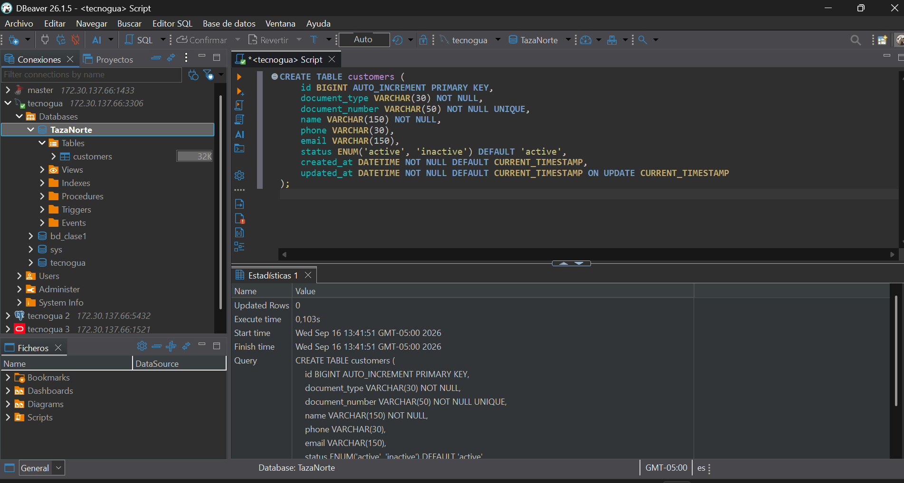

---

## 2. Creación de la tabla Employees

La tabla `employees` almacena los datos de los baristas, cajeros y supervisores encargados de los turnos y pedidos.

### Código SQL

```sql
CREATE TABLE employees (
    id BIGINT AUTO_INCREMENT PRIMARY KEY,
    name VARCHAR(150) NOT NULL,
    description TEXT,
    status ENUM('active', 'inactive') DEFAULT 'active',
    created_at DATETIME NOT NULL DEFAULT CURRENT_TIMESTAMP,
    updated_at DATETIME NOT NULL DEFAULT CURRENT_TIMESTAMP ON UPDATE CURRENT_TIMESTAMP
);
```

### Evidencia en DBeaver

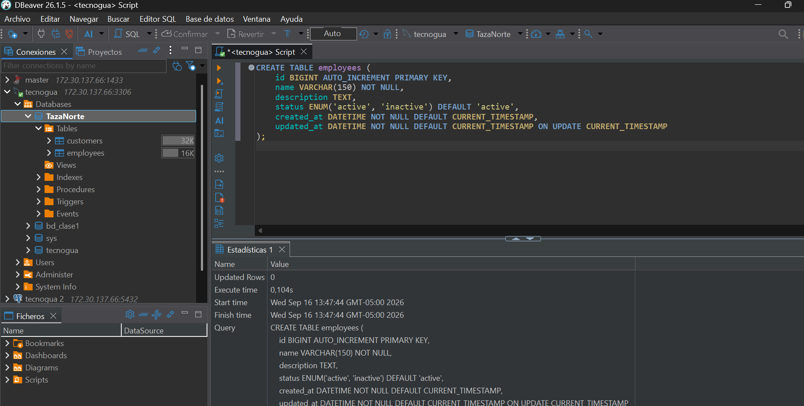

---

## 3. Base de Datos en PostgreSQL (pgAdmin - Creación Visual)

## 3.1 Preparación y contexto del entorno

En esta sección se documenta el modelado y verificación visual de las 10 tablas del dominio **TazaNorte** directamente en el entorno gráfico de **pgAdmin 4**. A través de sus ventanas de propiedades (*Table Properties*), pestañas de columnas (*Columns*) y generación automática de DDL (*CREATE Script*), se valida la estructura relacional, tipos de datos PostgreSQL, claves primarias Identity y restricciones de integridad.

---

## 3.2 Creación de la tabla customers

### Columnas de customers configuradas en pgAdmin:
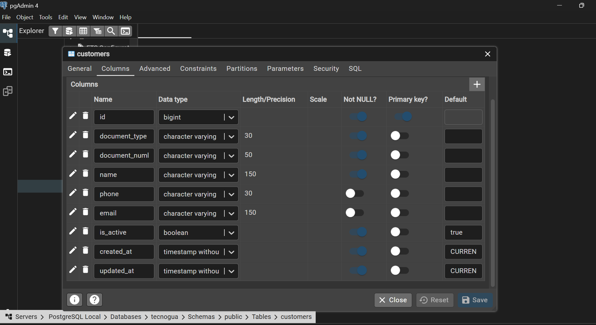

### Script SQL generado por pgAdmin:
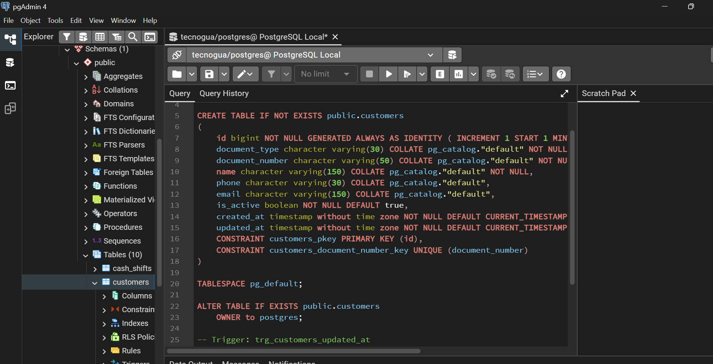

**Resultado:** Se configuró la tabla `customers` mediante la interfaz gráfica de pgAdmin, definiendo la columna autoincremental `id` (`BIGINT NOT NULL GENERATED ALWAYS AS IDENTITY`), la restricción `UNIQUE (document_number)`, indicador booleano `is_active DEFAULT true` y marcas temporales automáticas `created_at` y `updated_at`. El script DDL generado por pgAdmin confirma la correcta definición de la entidad.

---

## 3.3 Creación de la tabla employees

### Columnas de employees configuradas en pgAdmin:
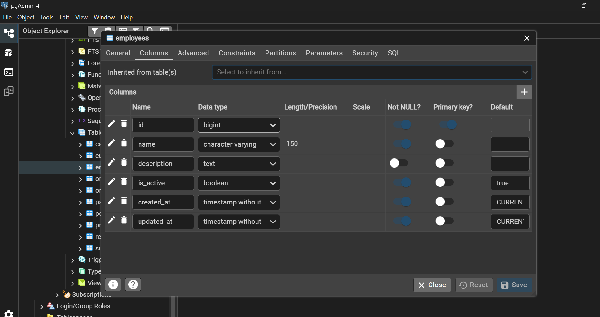

### Script SQL generado por pgAdmin:
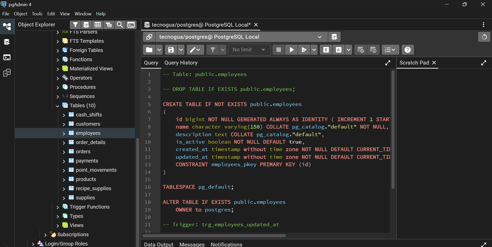

**Resultado:** Se configuró la tabla `employees` en pgAdmin con sus atributos de identificación y auditoría, asignando `name` (`character varying(150)`), `description` (`text`) y el trigger disparador `trg_employees_updated_at` para el control de actualizaciones.

---

## 3.4 Creación de la tabla supplies

### Columnas de supplies configuradas en pgAdmin:
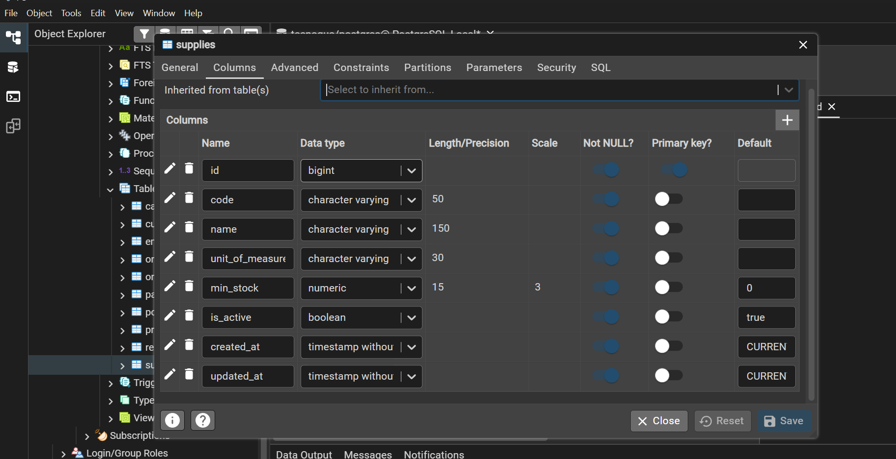

### Script SQL generado por pgAdmin:
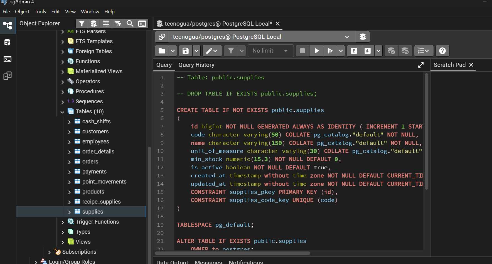

**Resultado:** Se modeló la tabla de insumos (`supplies`) con la restricción `UNIQUE (code)`, unidad de medida y stock mínimo en formato decimal `numeric(15,3)` con valor inicial `0`, verificado mediante el DDL generado en pgAdmin.

---

## 3.5 Creación de la tabla products

### Columnas de products configuradas en pgAdmin:
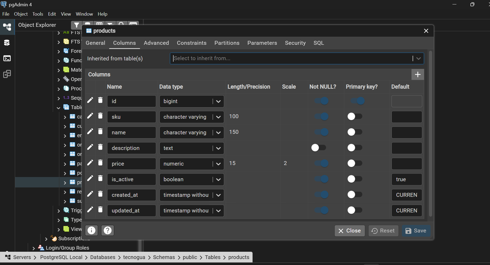

### Script SQL generado por pgAdmin:
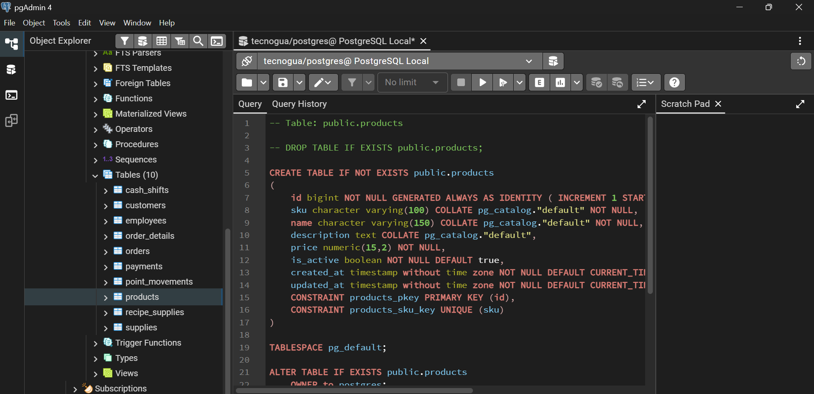

**Resultado:** Se configuró la entidad `products` con código comercial único `sku` (`character varying(100)`), descripción y precio unitario `price` con precisión monetaria `numeric(15,2)`, junto con su respectivo disparador de auditoría.

---

## 3.6 Creación de la tabla recipe_supplies

### Columnas y Foreign Keys de recipe_supplies configuradas en pgAdmin:
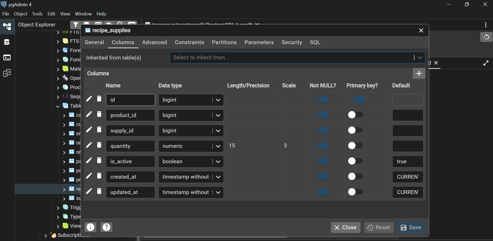

### Script SQL generado por pgAdmin:
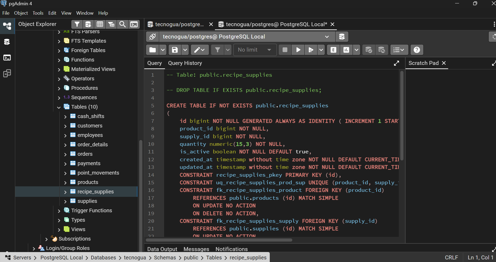

**Resultado:** Se implementó la tabla asociativa `recipe_supplies` resolviendo la relación N:M entre productos e insumos. En pgAdmin se verifican las Foreign Keys hacia `products(id)` y `supplies(id)`, la columna de dosificación `quantity` (`numeric(15,3)`) y la restricción compuesta `UNIQUE (product_id, supply_id)`.

---

## 3.7 Creación de la tabla cash_shifts

### Columnas y Foreign Key de cash_shifts configuradas en pgAdmin:
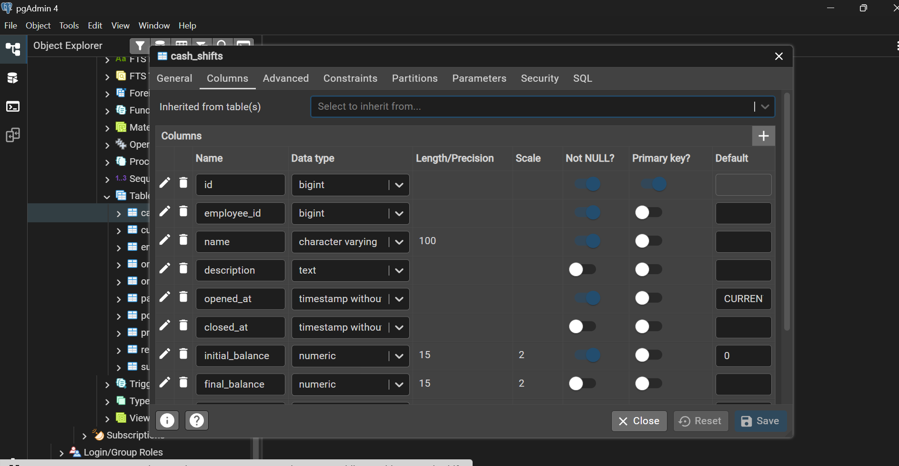

### Script SQL generado por pgAdmin:
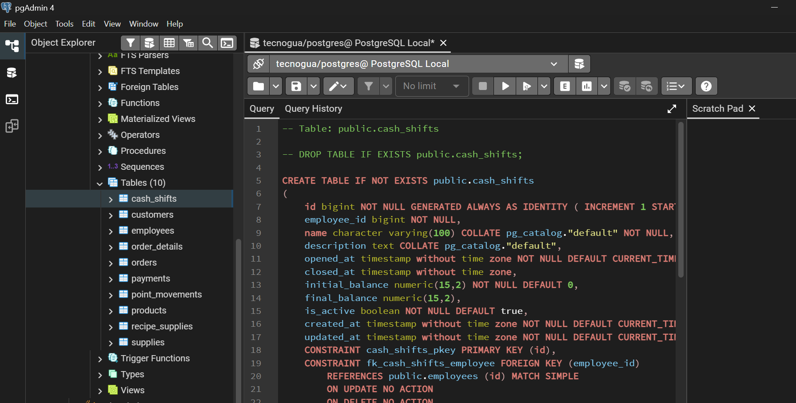

**Resultado:** Se configuró la entidad de turnos de caja (`cash_shifts`), enlazando la Foreign Key `employee_id -> employees(id)` y los balances de apertura y cierre con precisión `numeric(15,2)`.

---

## 3.8 Creación de la tabla orders

### Columnas y Foreign Keys de orders configuradas en pgAdmin:
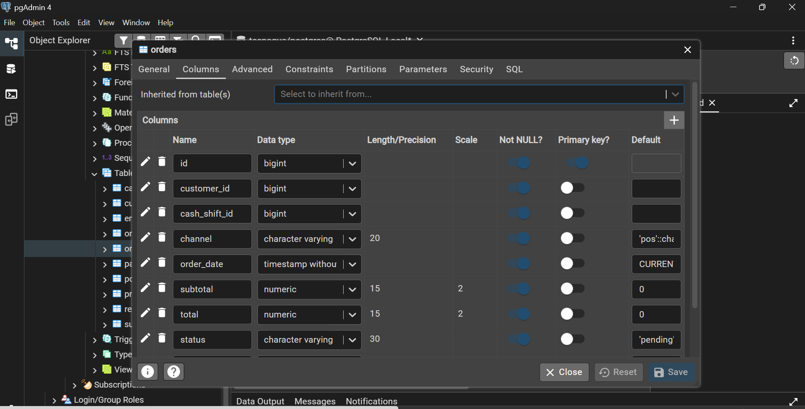

### Script SQL generado por pgAdmin:
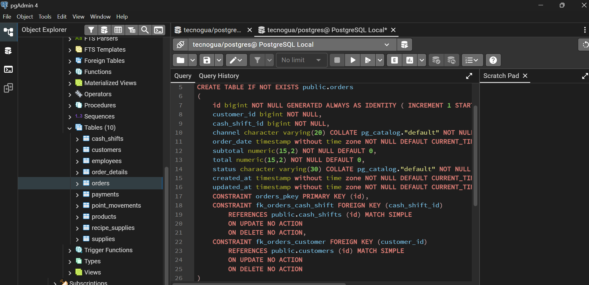

**Resultado:** Se configuró la cabecera de pedidos (`orders`), validando en pgAdmin las dos Foreign Keys: `customer_id -> customers(id)` y `cash_shift_id -> cash_shifts(id)`, montos de facturación (`subtotal`, `total`) y estado con valor por defecto `'pending'`.

---

## 3.9 Creación de la tabla order_details

### Columnas y Foreign Keys de order_details configuradas en pgAdmin:
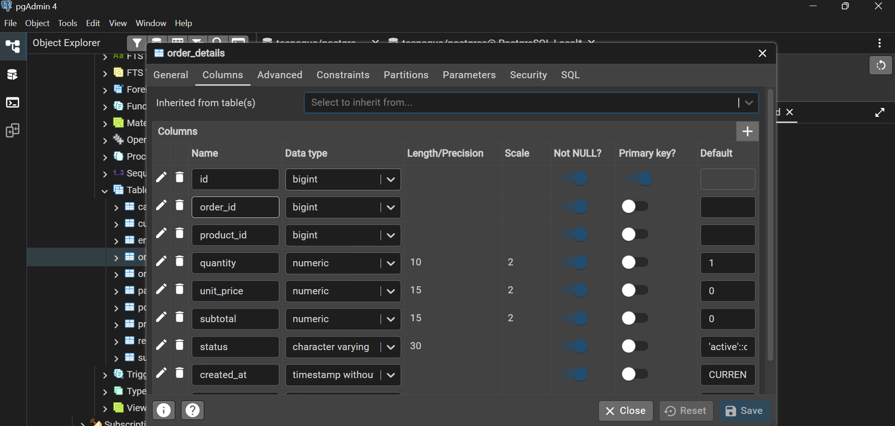

### Script SQL generado por pgAdmin:
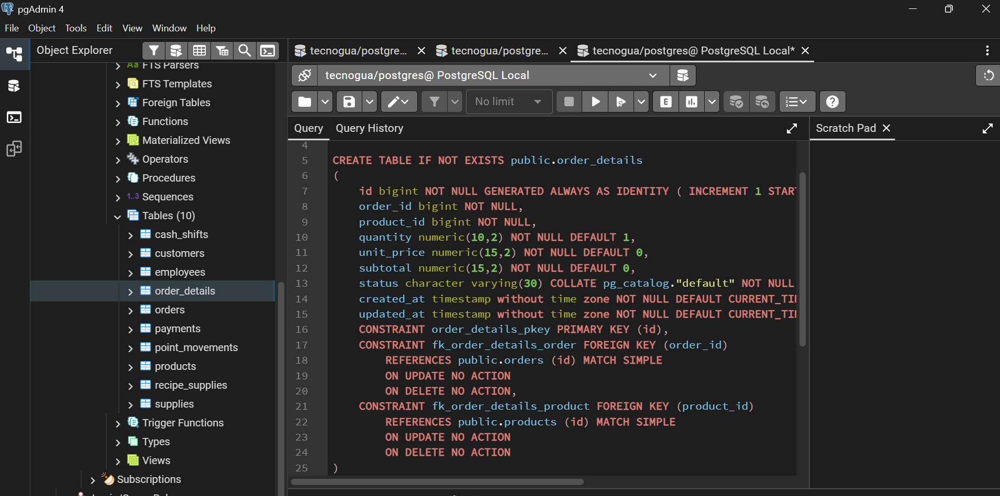

**Resultado:** Se configuró la tabla de líneas de pedido (`order_details`) con sus Foreign Keys `order_id -> orders(id)` y `product_id -> products(id)`, asegurando la precisión de cálculo entre `quantity` (`numeric(10,2)`), `unit_price` y `subtotal`.

---

## 3.10 Creación de la tabla payments

### Columnas y Foreign Key de payments configuradas en pgAdmin:
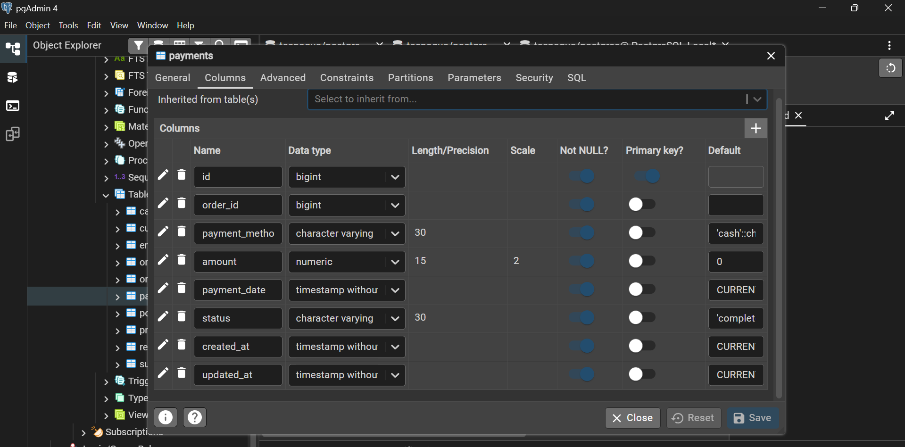

### Script SQL generado por pgAdmin:
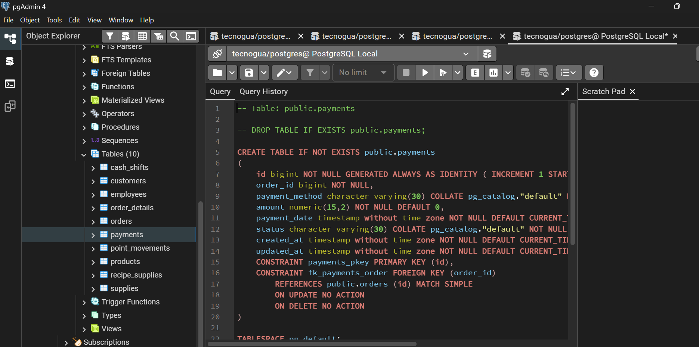

**Resultado:** Se configuró la tabla `payments` enlazada mediante Foreign Key a `orders(id)`, estableciendo métodos de pago válidos (`cash`, `card`, `transfer`, `points`) y monto con precisión `numeric(15,2)`.

---

## 3.11 Creación de la tabla point_movements

### Columnas y Foreign Keys de point_movements configuradas en pgAdmin:
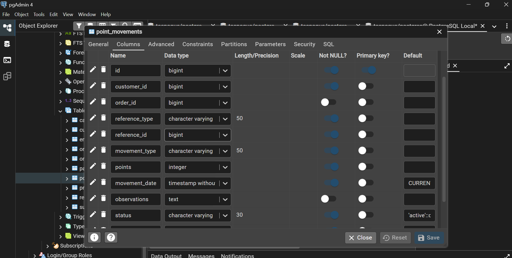

### Script SQL generado por pgAdmin:
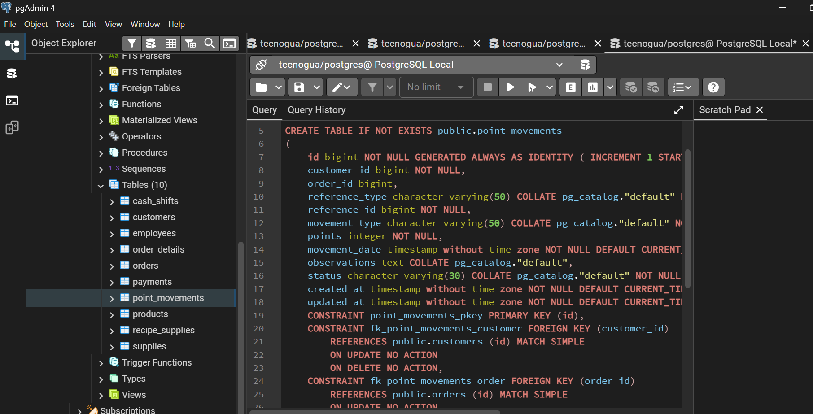

**Resultado:** Se configuró la tabla de fidelización `point_movements` en pgAdmin. Se verifican las referencias `customer_id -> customers(id)` obligatoria y `order_id -> orders(id)` nullable (permitiendo movimientos manuales o promocionales), junto con el saldo entero `points` (`integer`).

---

## 3.12 Verificación final en pgAdmin

### Diagrama ERD obtenido desde pgAdmin (ERD Tool):
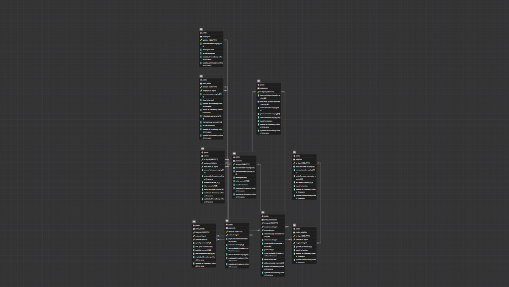

**Resultado:** Para verificar que el modelo relacional construido en PostgreSQL coincide exactamente con los requerimientos del dominio, se generó un diagrama ERD directamente desde la herramienta visual *ERD Tool* de pgAdmin sobre el esquema `public`. El resultado confirma las 10 tablas físicas y todas las líneas de relación (Foreign Keys) debidamente conectadas.

### Conclusión de la Sección 3
Se concluye exitosamente la creación y verificación de la base de datos de TazaNorte en PostgreSQL mediante el entorno visual de pgAdmin 4. Se modelaron e inspeccionaron individualmente cada una de las 10 entidades físicas, validando sus columnas, tipos de datos PostgreSQL, claves primarias autoincrementales Identity, restricciones de unicidad y claves foráneas maestro-detalle, respaldado por el script DDL generado y el diagrama ERD oficial del motor.

---

# 4. Base de Datos en SQL Server

## 4.1 Limpieza de tablas existentes

Para garantizar una ejecución limpia y reproducible en Microsoft SQL Server, se recrea la base de datos `tazanorte` asegurando el cierre inmediato de sesiones activas:

```sql
USE master;
GO

IF EXISTS (SELECT name FROM sys.databases WHERE name = 'tazanorte')
BEGIN
    ALTER DATABASE tazanorte SET SINGLE_USER WITH ROLLBACK IMMEDIATE;
    DROP DATABASE tazanorte;
END
GO

CREATE DATABASE tazanorte;
GO

USE tazanorte;
GO
```

### Evidencia (imagen):
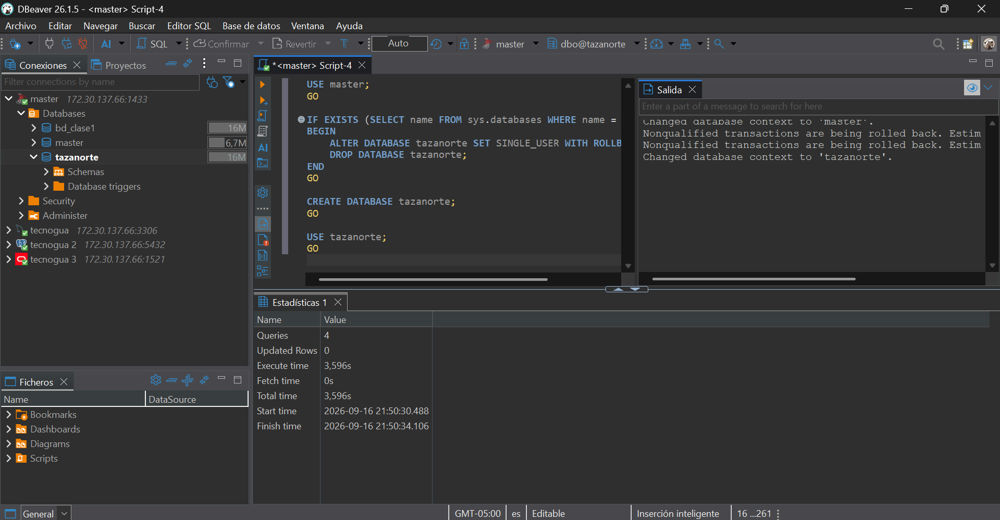

**Resultado:** Se optó por recrear la base de datos completa (`DROP DATABASE` / `CREATE DATABASE`) para limpiar cualquier residuo anterior. La sentencia `ALTER DATABASE ... SET SINGLE_USER WITH ROLLBACK IMMEDIATE` garantizó la desconexión inmediata de cualquier conexión concurrente antes del borrado.

---

## 4.2 Creación de la tabla customers

```sql
CREATE TABLE customers (
    id BIGINT IDENTITY(1,1) PRIMARY KEY,
    document_type VARCHAR(30) NOT NULL,
    document_number VARCHAR(50) NOT NULL UNIQUE,
    name VARCHAR(150) NOT NULL,
    phone VARCHAR(30),
    email VARCHAR(150),
    is_active BIT NOT NULL DEFAULT 1,
    created_at DATETIME NOT NULL DEFAULT GETDATE(),
    updated_at DATETIME NOT NULL DEFAULT GETDATE()
);
GO

CREATE TRIGGER trg_customers_updated_at
ON customers
AFTER UPDATE
AS
BEGIN
    SET NOCOUNT ON;
    UPDATE customers
    SET updated_at = GETDATE()
    FROM customers
    INNER JOIN inserted ON customers.id = inserted.id;
END;
GO
```

### Evidencia (imagen):
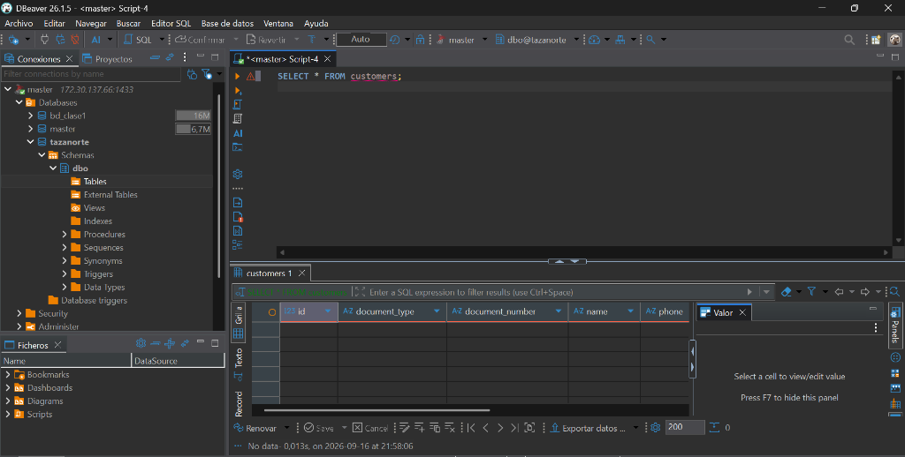

**Resultado:** Se creó la tabla `customers` con columna autoincremental `IDENTITY(1,1)`, restricción de unicidad sobre `document_number`, indicador booleano `BIT` y trigger `AFTER UPDATE` (dado que SQL Server no admite disparadores `BEFORE UPDATE`) para actualizar `updated_at` a partir de la pseudotabla `inserted`. Como evidencia de la creación física y persistencia efectiva en el motor SQL Server dentro de DBeaver, se ejecutó una consulta directa `SELECT * FROM customers;`, la cual confirma en la cuadrícula de resultados la estructura completa de columnas generadas (`id`, `document_type`, `document_number`, `name`, `phone`, `email`, `is_active`, `created_at`, `updated_at`) sobre el catálogo `dbo@tazanorte`.

---

## 4.3 Creación de la tabla employees

```sql
CREATE TABLE employees (
    id BIGINT IDENTITY(1,1) PRIMARY KEY,
    name VARCHAR(150) NOT NULL,
    description VARCHAR(MAX),
    is_active BIT NOT NULL DEFAULT 1,
    created_at DATETIME NOT NULL DEFAULT GETDATE(),
    updated_at DATETIME NOT NULL DEFAULT GETDATE()
);
GO

CREATE TRIGGER trg_employees_updated_at
ON employees
AFTER UPDATE
AS
BEGIN
    SET NOCOUNT ON;
    UPDATE employees
    SET updated_at = GETDATE()
    FROM employees
    INNER JOIN inserted ON employees.id = inserted.id;
END;
GO
```

### Evidencia (imagen):
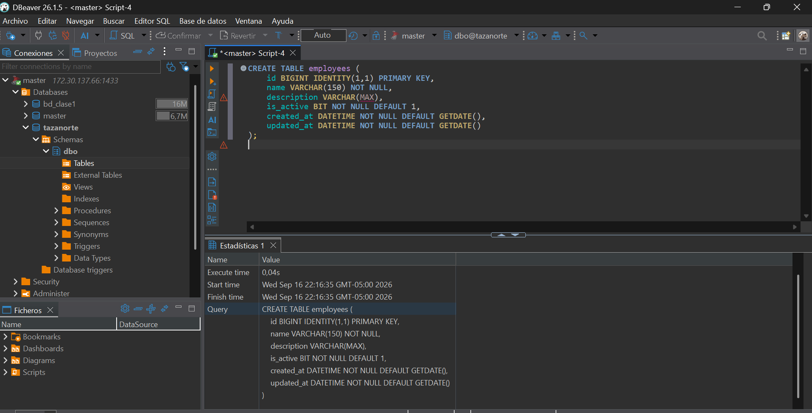

**Resultado:** Se creó la tabla `employees` utilizando `VARCHAR(MAX)` como reemplazo moderno del tipo obsoleto `TEXT` en SQL Server, junto con su trigger disparador de fecha de modificación.

---

## 4.4 Creación de la tabla supplies

```sql
CREATE TABLE supplies (
    id BIGINT IDENTITY(1,1) PRIMARY KEY,
    code VARCHAR(50) NOT NULL UNIQUE,
    name VARCHAR(150) NOT NULL,
    unit_of_measure VARCHAR(30) NOT NULL,
    min_stock DECIMAL(15,3) NOT NULL DEFAULT 0,
    is_active BIT NOT NULL DEFAULT 1,
    created_at DATETIME NOT NULL DEFAULT GETDATE(),
    updated_at DATETIME NOT NULL DEFAULT GETDATE()
);
GO

CREATE TRIGGER trg_supplies_updated_at
ON supplies
AFTER UPDATE
AS
BEGIN
    SET NOCOUNT ON;
    UPDATE supplies
    SET updated_at = GETDATE()
    FROM supplies
    INNER JOIN inserted ON supplies.id = inserted.id;
END;
GO
```

### Evidencia (imagen):
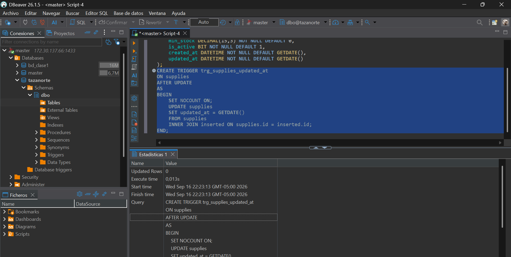

**Resultado:** Se creó la tabla `supplies` aplicando restricción UNIQUE sobre `code` y precisión decimal `DECIMAL(15,3)` para el inventario, con su correspondiente trigger `AFTER UPDATE`.

---

## 4.5 Creación de la tabla products

```sql
CREATE TABLE products (
    id BIGINT IDENTITY(1,1) PRIMARY KEY,
    sku VARCHAR(100) NOT NULL UNIQUE,
    name VARCHAR(150) NOT NULL,
    description VARCHAR(MAX),
    price DECIMAL(15,2) NOT NULL,
    is_active BIT NOT NULL DEFAULT 1,
    created_at DATETIME NOT NULL DEFAULT GETDATE(),
    updated_at DATETIME NOT NULL DEFAULT GETDATE()
);
GO

CREATE TRIGGER trg_products_updated_at
ON products
AFTER UPDATE
AS
BEGIN
    SET NOCOUNT ON;
    UPDATE products
    SET updated_at = GETDATE()
    FROM products
    INNER JOIN inserted ON products.id = inserted.id;
END;
GO
```

### Evidencia (imagen):
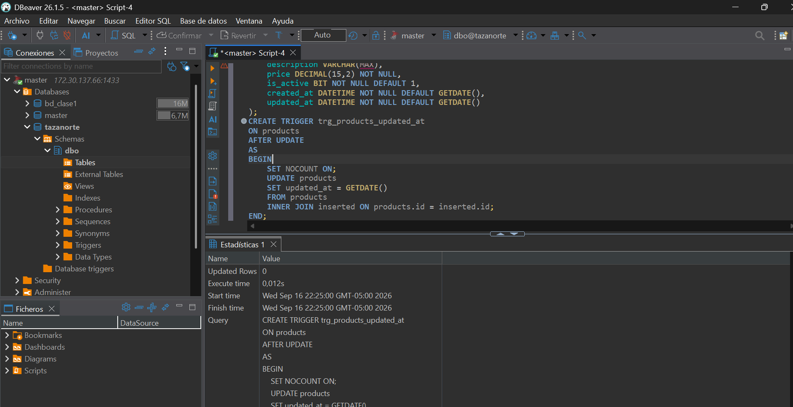

**Resultado:** Tabla `products` creada con unicidad sobre el código comercial `sku`, precio `DECIMAL(15,2)` y trigger disparador.

---

## 4.6 Creación de la tabla recipe_supplies

```sql
CREATE TABLE recipe_supplies (
    id BIGINT IDENTITY(1,1) PRIMARY KEY,
    product_id BIGINT NOT NULL REFERENCES products(id),
    supply_id BIGINT NOT NULL REFERENCES supplies(id),
    quantity DECIMAL(15,3) NOT NULL,
    is_active BIT NOT NULL DEFAULT 1,
    created_at DATETIME NOT NULL DEFAULT GETDATE(),
    updated_at DATETIME NOT NULL DEFAULT GETDATE(),
    CONSTRAINT uq_recipe_supplies_prod_sup UNIQUE (product_id, supply_id)
);
GO

CREATE TRIGGER trg_recipe_supplies_updated_at
ON recipe_supplies
AFTER UPDATE
AS
BEGIN
    SET NOCOUNT ON;
    UPDATE recipe_supplies
    SET updated_at = GETDATE()
    FROM recipe_supplies
    INNER JOIN inserted ON recipe_supplies.id = inserted.id;
END;
GO
```

### Evidencia (imagen):
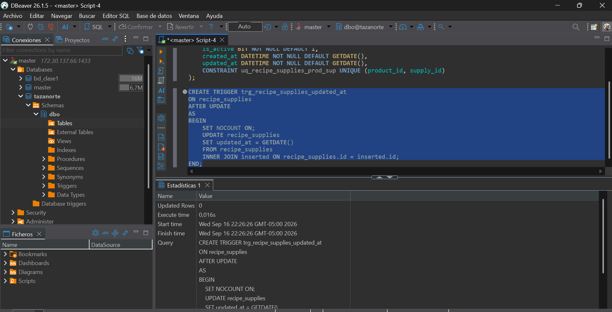

**Resultado:** Se implementó la tabla puente `recipe_supplies` con claves foráneas referenciando a `products` y `supplies`, restricción de unicidad compuesta `uq_recipe_supplies_prod_sup` y trigger de auditoría.

---

## 4.7 Creación de la tabla cash_shifts

```sql
CREATE TABLE cash_shifts (
    id BIGINT IDENTITY(1,1) PRIMARY KEY,
    employee_id BIGINT NOT NULL REFERENCES employees(id),
    name VARCHAR(100) NOT NULL,
    description VARCHAR(MAX),
    opened_at DATETIME NOT NULL DEFAULT GETDATE(),
    closed_at DATETIME NULL,
    initial_balance DECIMAL(15,2) NOT NULL DEFAULT 0,
    final_balance DECIMAL(15,2) NULL,
    is_active BIT NOT NULL DEFAULT 1,
    created_at DATETIME NOT NULL DEFAULT GETDATE(),
    updated_at DATETIME NOT NULL DEFAULT GETDATE()
);
GO

CREATE TRIGGER trg_cash_shifts_updated_at
ON cash_shifts
AFTER UPDATE
AS
BEGIN
    SET NOCOUNT ON;
    UPDATE cash_shifts
    SET updated_at = GETDATE()
    FROM cash_shifts
    INNER JOIN inserted ON cash_shifts.id = inserted.id;
END;
GO
```

### Evidencia (imagen):
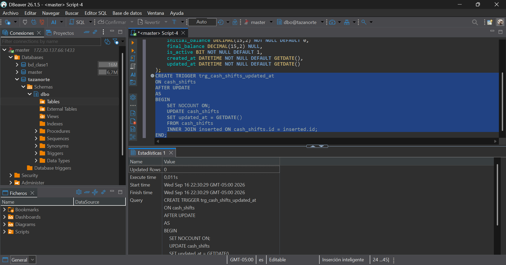

**Resultado:** Tabla `cash_shifts` creada con la Foreign Key hacia `employees(id)`, campos decimales para arqueo de caja y trigger `AFTER UPDATE`.

---

## 4.8 Creación de la tabla orders

```sql
CREATE TABLE orders (
    id BIGINT IDENTITY(1,1) PRIMARY KEY,
    customer_id BIGINT NOT NULL REFERENCES customers(id),
    cash_shift_id BIGINT NOT NULL REFERENCES cash_shifts(id),
    channel VARCHAR(20) NOT NULL DEFAULT 'pos',
    order_date DATETIME NOT NULL DEFAULT GETDATE(),
    subtotal DECIMAL(15,2) NOT NULL DEFAULT 0,
    total DECIMAL(15,2) NOT NULL DEFAULT 0,
    status VARCHAR(30) NOT NULL DEFAULT 'pending',
    created_at DATETIME NOT NULL DEFAULT GETDATE(),
    updated_at DATETIME NOT NULL DEFAULT GETDATE()
);
GO

CREATE TRIGGER trg_orders_updated_at
ON orders
AFTER UPDATE
AS
BEGIN
    SET NOCOUNT ON;
    UPDATE orders
    SET updated_at = GETDATE()
    FROM orders
    INNER JOIN inserted ON orders.id = inserted.id;
END;
GO
```

### Evidencia (imagen):
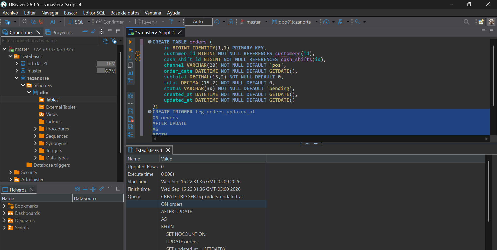

**Resultado:** Tabla `orders` creada con sus dos Foreign Keys: `customer_id -> customers(id)` y `cash_shift_id -> cash_shifts(id)`. Se añadieron valores por defecto para estados y montos, y su trigger de auditoría.

---

## 4.9 Creación de la tabla order_details

```sql
CREATE TABLE order_details (
    id BIGINT IDENTITY(1,1) PRIMARY KEY,
    order_id BIGINT NOT NULL REFERENCES orders(id),
    product_id BIGINT NOT NULL REFERENCES products(id),
    quantity DECIMAL(10,2) NOT NULL DEFAULT 1,
    unit_price DECIMAL(15,2) NOT NULL DEFAULT 0,
    subtotal DECIMAL(15,2) NOT NULL DEFAULT 0,
    status VARCHAR(30) NOT NULL DEFAULT 'active',
    created_at DATETIME NOT NULL DEFAULT GETDATE(),
    updated_at DATETIME NOT NULL DEFAULT GETDATE()
);
GO

CREATE TRIGGER trg_order_details_updated_at
ON order_details
AFTER UPDATE
AS
BEGIN
    SET NOCOUNT ON;
    UPDATE order_details
    SET updated_at = GETDATE()
    FROM order_details
    INNER JOIN inserted ON order_details.id = inserted.id;
END;
GO
```

### Evidencia (imagen):
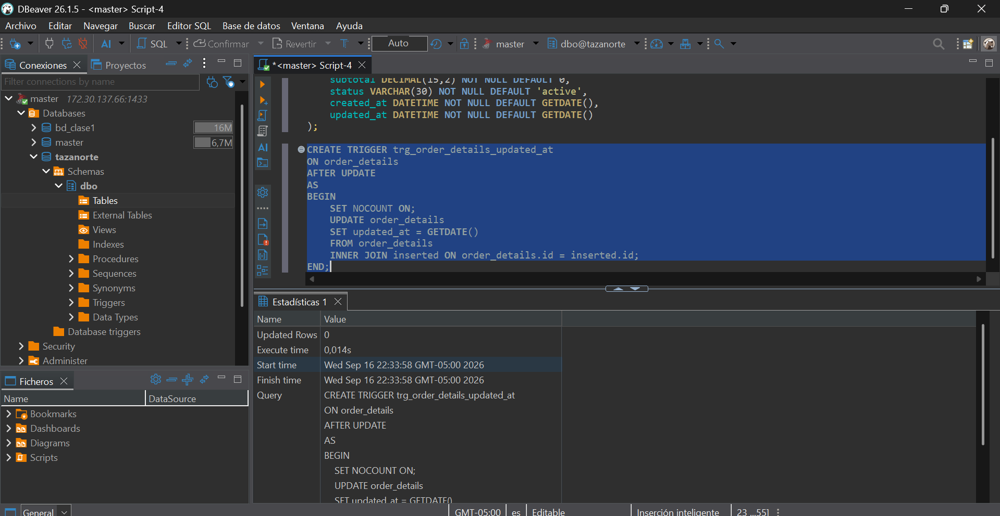

**Resultado:** Tabla `order_details` creada resolviendo el detalle de cada pedido con Foreign Keys hacia `orders` y `products`, con su correspondiente trigger de auditoría.

---

## 4.10 Creación de la tabla payments

```sql
CREATE TABLE payments (
    id BIGINT IDENTITY(1,1) PRIMARY KEY,
    order_id BIGINT NOT NULL REFERENCES orders(id),
    payment_method VARCHAR(30) NOT NULL DEFAULT 'cash',
    amount DECIMAL(15,2) NOT NULL DEFAULT 0,
    payment_date DATETIME NOT NULL DEFAULT GETDATE(),
    status VARCHAR(30) NOT NULL DEFAULT 'completed',
    created_at DATETIME NOT NULL DEFAULT GETDATE(),
    updated_at DATETIME NOT NULL DEFAULT GETDATE()
);
GO

CREATE TRIGGER trg_payments_updated_at
ON payments
AFTER UPDATE
AS
BEGIN
    SET NOCOUNT ON;
    UPDATE payments
    SET updated_at = GETDATE()
    FROM payments
    INNER JOIN inserted ON payments.id = inserted.id;
END;
GO
```

### Evidencia (imagen):
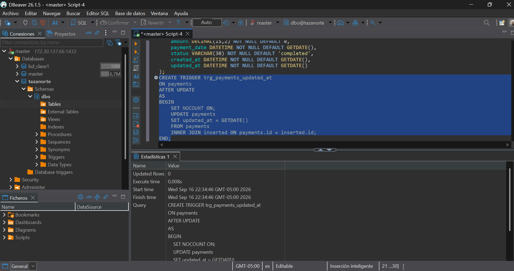

**Resultado:** Tabla `payments` creada con referencia foránea `order_id -> orders(id)`, precisión monetaria en `amount` y trigger disparador.

---

## 4.11 Creación de la tabla point_movements

```sql
CREATE TABLE point_movements (
    id BIGINT IDENTITY(1,1) PRIMARY KEY,
    customer_id BIGINT NOT NULL REFERENCES customers(id),
    order_id BIGINT NULL REFERENCES orders(id),
    reference_type VARCHAR(50) NOT NULL,
    reference_id BIGINT NOT NULL,
    movement_type VARCHAR(50) NOT NULL,
    points INT NOT NULL,
    movement_date DATETIME NOT NULL DEFAULT GETDATE(),
    observations VARCHAR(MAX),
    status VARCHAR(30) NOT NULL DEFAULT 'active',
    created_at DATETIME NOT NULL DEFAULT GETDATE(),
    updated_at DATETIME NOT NULL DEFAULT GETDATE()
);
GO

CREATE TRIGGER trg_point_movements_updated_at
ON point_movements
AFTER UPDATE
AS
BEGIN
    SET NOCOUNT ON;
    UPDATE point_movements
    SET updated_at = GETDATE()
    FROM point_movements
    INNER JOIN inserted ON point_movements.id = inserted.id;
END;
GO
```

### Evidencia (imagen):
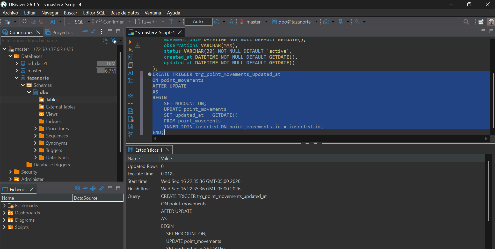

**Resultado:** Se creó la tabla `point_movements` en SQL Server. Se definió `customer_id` obligatorio y `order_id` nullable (permitiendo movimientos manuales de fidelización no atados a órdenes de compra). Se configuró el trigger disparador.

---

## 4.12 Verificación final en SQL Server

```sql
SELECT name FROM sys.tables ORDER BY name;
```

### Evidencia (imagen):
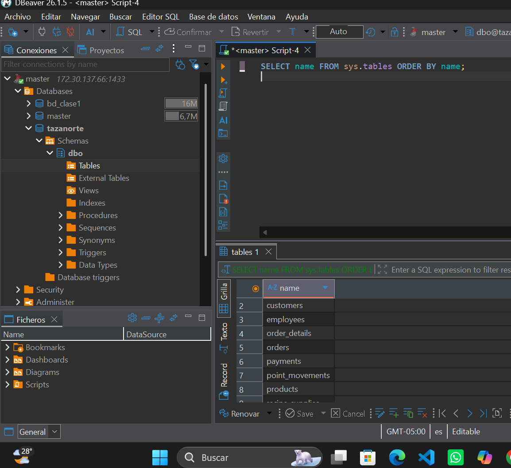

**Resultado:** La consulta sobre la vista de catálogo del sistema `sys.tables` devuelve las 10 tablas esperadas en orden alfabético (`cash_shifts`, `customers`, `employees`, `order_details`, `orders`, `payments`, `point_movements`, `products`, `recipe_supplies`, `supplies`), confirmando la integridad y completitud del modelo relacional en Microsoft SQL Server.

### Conclusión de la Sección 4
Con esto se finaliza con éxito la implementación de la base de datos `tazanorte` en Microsoft SQL Server. A diferencia de MySQL y PostgreSQL, fue necesario implementar triggers `AFTER UPDATE` (ya que SQL Server no soporta disparadores `BEFORE UPDATE`) utilizando la pseudotabla `inserted` para replicar el comportamiento automático de `ON UPDATE CURRENT_TIMESTAMP` en las marcas temporales `updated_at`. Todas las restricciones de integridad y tipos de datos se adaptaron a los estándares óptimos de T-SQL.


---

# 5. Base de Datos SQL Server — Parte Visual (SQL Server Management Studio)

## 5.1 Conexión y configuración en SSMS
Se utilizó **Microsoft SQL Server Management Studio 22 (SSMS)** como la herramienta cliente gráfica oficial de Microsoft para la administración y modelado visual sobre el motor SQL Server 2022. La conexión se estableció mediante autenticación nativa de SQL Server (*SQL Server Authentication*) con el usuario administrador `sa` sobre el puerto TCP 1433 y certificado de servidor de confianza habilitado.

### Evidencia (imagen):
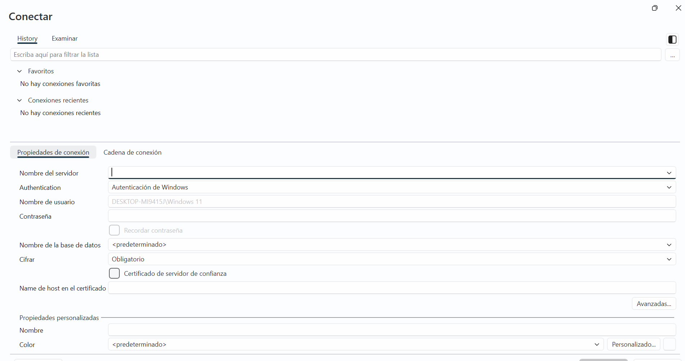

**Nota metodológica:** Al igual que en MySQL Workbench y pgAdmin 4, se utiliza la interfaz oficial recomendada por el fabricante del motor de base de datos para la definición de esquemas, diseño visual de tablas, configuración de restricciones de integridad relacional (Primary Keys, Foreign Keys, Unique Constraints) y generación del diagrama entidad-relación oficial mediante el componente nativo *Database Diagrams*.

---

## 5.2 Creación de la base de datos tazanorte_visual
Se procedió con la creación de la base de datos `tazanorte_visual` mediante el asistente visual *"Nueva base de datos..."* (*New Database*) de SSMS, sin requerir la ejecución de comandos SQL directos por consola, fungiendo como esquema visual independiente al creado previamente por script en la Sección 4.

### Evidencia (imagen):
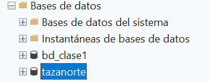

**Resultado:** Se creó la base de datos `tazanorte_visual` con sus archivos de datos primarios (`.mdf`) y de registro de transacciones (`.ldf`) administrados por el entorno gráfico de SSMS.

---

## 5.3 Creación de la tabla customers
Configuración visual de la entidad en el Diseñador de tablas (*Table Designer*) de SSMS:
- Clave primaria `id` de tipo `BIGINT` con propiedad `Identity Specification` habilitada (`Is Identity = Yes`).
- Restricciones de unicidad `UNIQUE` sobre `code` y `email` configuradas a través del diálogo visual *"Índices o claves..."* (*Indexes/Keys*).
- Valores predeterminados en `current_points`, `is_active` y marcas temporales `created_at` / `updated_at`.

### Evidencias (imágenes):
1. **Diseño de columnas en SSMS:**
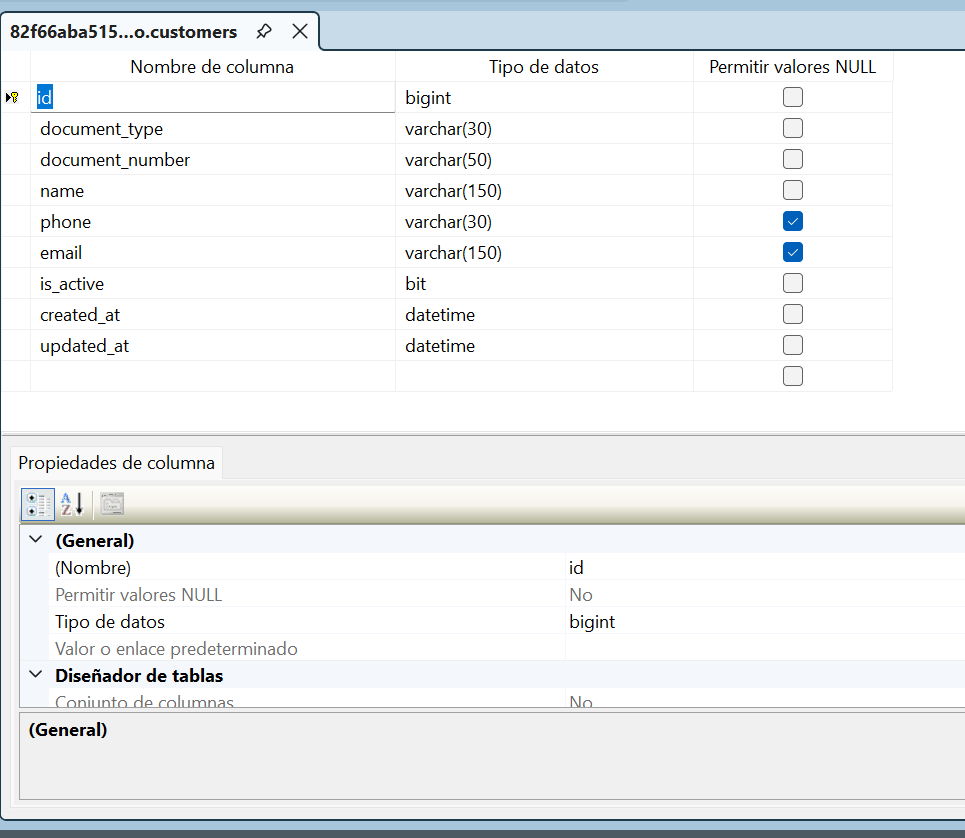

2. **Script SQL generado por SSMS (Generar script de tabla como → CREATE To):**
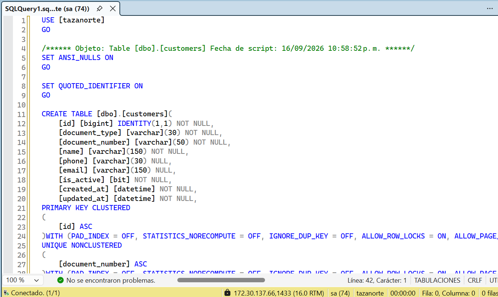

**Nota metodológica — trigger updated_at:** SSMS no dispone de un asistente gráfico interactivo para la definición de disparadores (*triggers*), a diferencia de MySQL Workbench y pgAdmin. Por tal motivo, y como excepción documentada dentro de esta sección visual, el disparador `trg_customers_updated_at` se implementa mediante ventana de consulta sobre `tazanorte_visual`, mientras que la definición estructural de columnas, tipos, nulos y llaves se elabora 100% en el diseñador visual.

```sql
CREATE TRIGGER trg_customers_updated_at
ON customers
AFTER UPDATE
AS
BEGIN
    SET NOCOUNT ON;
    UPDATE customers
    SET updated_at = GETDATE()
    FROM customers
    INNER JOIN inserted ON customers.id = inserted.id;
END;
```

**Resultado:** Tabla `customers` diseñada visualmente en SSMS y script DDL oficial generado.

---

## 5.4 Creación de la tabla employees
Configuración de la entidad de empleados y personal operativo mediante el diseñador gráfico:
- Clave primaria `id` (`BIGINT`, `IDENTITY(1,1)`).
- Restricciones `UNIQUE` en `code` y `email` definidas en el diálogo *Índices o claves*.
- Valores por defecto: `is_active = 1`, `created_at = (getdate())`, `updated_at = (getdate())`.

### Evidencias (imágenes):
1. **Diseño de columnas en SSMS:**
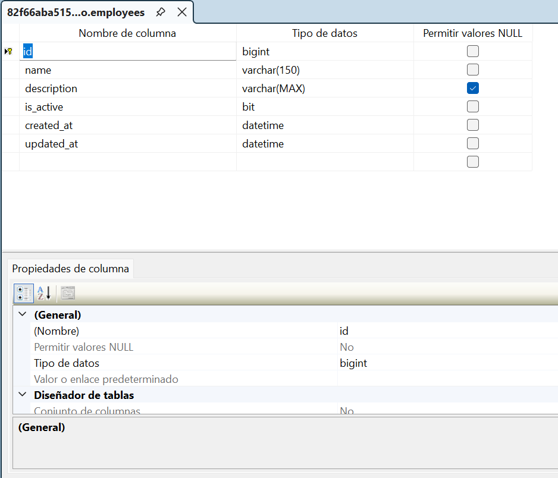

2. **Script SQL generado por SSMS (Generar script de tabla como → CREATE To):**
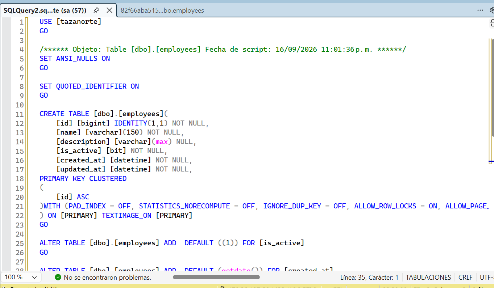

```sql
CREATE TRIGGER trg_employees_updated_at
ON employees
AFTER UPDATE
AS
BEGIN
    SET NOCOUNT ON;
    UPDATE employees
    SET updated_at = GETDATE()
    FROM employees
    INNER JOIN inserted ON employees.id = inserted.id;
END;
```

**Resultado:** Tabla `employees` creada con el diseñador de SSMS y script DDL oficial verificado.

---

## 5.5 Creación de la tabla supplies
Configuración en el diseñador de tablas de insumos y materia prima:
- Clave primaria `id` (`BIGINT`, `IDENTITY(1,1)`).
- Restricción `UNIQUE` sobre `code` configurada en el diálogo de índices.
- Precisión numérica: `min_stock` de tipo `DECIMAL(15,3)` con valor por defecto `0`.
- Valores por defecto: `is_active = 1`, marcas temporales con `(getdate())`.

### Evidencias (imágenes):
1. **Diseño de columnas en SSMS:**
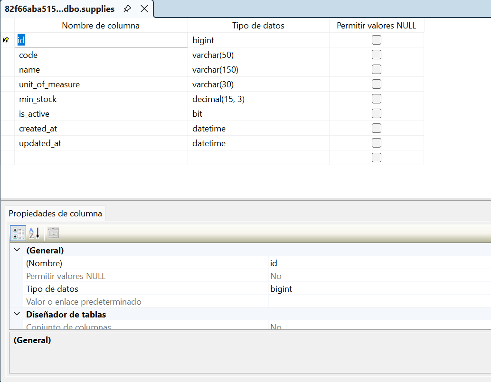

2. **Script SQL generado por SSMS (Generar script de tabla como → CREATE To):**
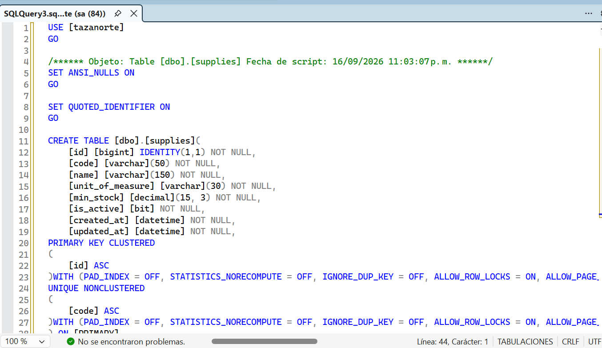

```sql
CREATE TRIGGER trg_supplies_updated_at
ON supplies
AFTER UPDATE
AS
BEGIN
    SET NOCOUNT ON;
    UPDATE supplies
    SET updated_at = GETDATE()
    FROM supplies
    INNER JOIN inserted ON supplies.id = inserted.id;
END;
```

**Resultado:** Tabla `supplies` creada en SSMS sin escribir sentencias DDL manuales.

---

## 5.6 Creación de la tabla products
Configuración visual del catálogo de productos y bebidas de cafetería:
- Clave primaria `id` (`BIGINT`, `IDENTITY(1,1)`).
- Índice único `UNIQUE` sobre `sku`.
- Campo de descripción extendida `description` de tipo `VARCHAR(MAX)`.
- Precio monetario `price` de tipo `DECIMAL(15,2)` y `is_active` con valor por defecto `1`.

### Evidencias (imágenes):
1. **Diseño de columnas en SSMS:**
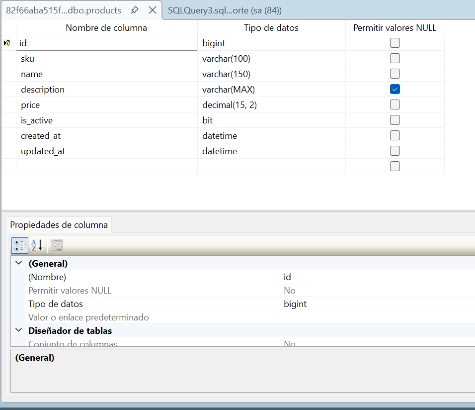

2. **Script SQL generado por SSMS (Generar script de tabla como → CREATE To):**
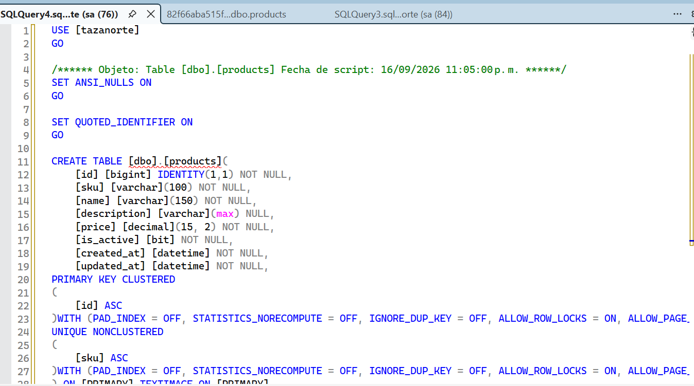

```sql
CREATE TRIGGER trg_products_updated_at
ON products
AFTER UPDATE
AS
BEGIN
    SET NOCOUNT ON;
    UPDATE products
    SET updated_at = GETDATE()
    FROM products
    INNER JOIN inserted ON products.id = inserted.id;
END;
```

**Resultado:** Tabla `products` diseñada visualmente en SSMS.

---

## 5.7 Creación de la tabla recipe_supplies
Configuración visual de la entidad intermedia de recetas y escandallos (relación N:M entre `products` y `supplies`):
- Clave primaria `id` (`BIGINT`, `IDENTITY(1,1)`).
- Configuración de dos Foreign Keys mediante el diálogo visual *"Relaciones de clave externa..."* (*Foreign Key Relationships*):
  - `FK_recipe_supplies_products`: `product_id` -> `products(id)`
  - `FK_recipe_supplies_supplies`: `supply_id` -> `supplies(id)`
- Restricción compuesta `UNIQUE (product_id, supply_id)` en el diálogo de índices.
- Campo de dosificación `quantity` de tipo `DECIMAL(15,3)`.

### Evidencias (imágenes):
1. **Diseño de columnas en SSMS:**
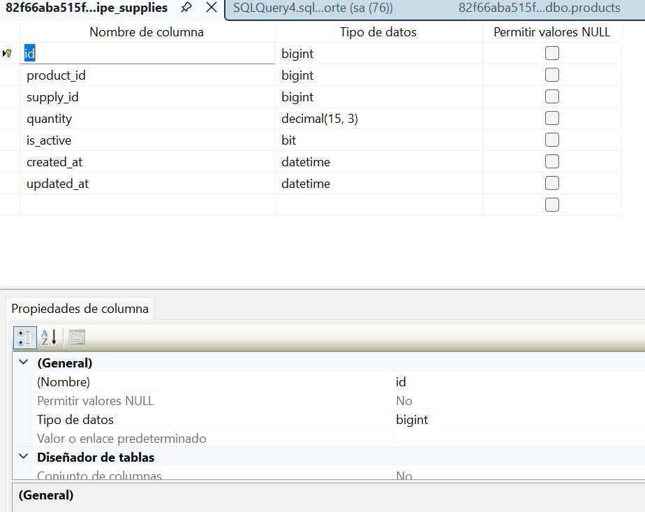

2. **Script SQL generado por SSMS (Generar script de tabla como → CREATE To):**
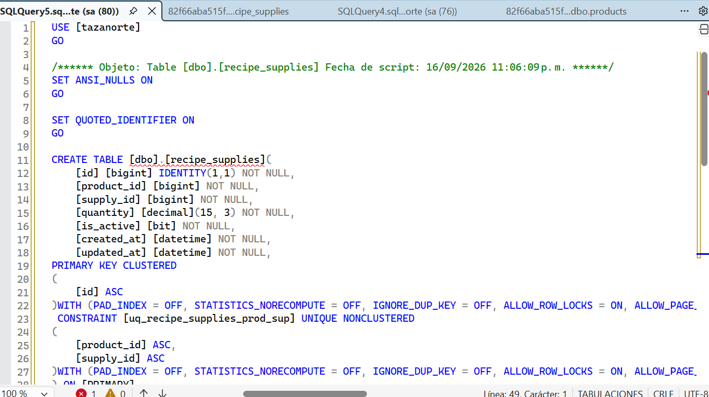

```sql
CREATE TRIGGER trg_recipe_supplies_updated_at
ON recipe_supplies
AFTER UPDATE
AS
BEGIN
    SET NOCOUNT ON;
    UPDATE recipe_supplies
    SET updated_at = GETDATE()
    FROM recipe_supplies
    INNER JOIN inserted ON recipe_supplies.id = inserted.id;
END;
```

**Resultado:** Tabla intermedia `recipe_supplies` con sus dos relaciones foráneas configuradas por diálogo visual en SSMS.

---

## 5.8 Creación de la tabla cash_shifts
Configuración visual del control de turnos de caja en cafetería:
- Clave primaria `id` (`BIGINT`, `IDENTITY(1,1)`).
- Configuración de Foreign Key mediante el diálogo *Relaciones*: `FK_cash_shifts_employees` (`employee_id` -> `employees(id)`).
- Balances monetarios: `initial_balance` y `final_balance` de tipo `DECIMAL(15,2)`.
- Marcas de apertura y cierre: `opened_at` (predeterminado `(getdate())`) y `closed_at` (admite nulos).

### Evidencias (imágenes):
1. **Diseño de columnas en SSMS:**
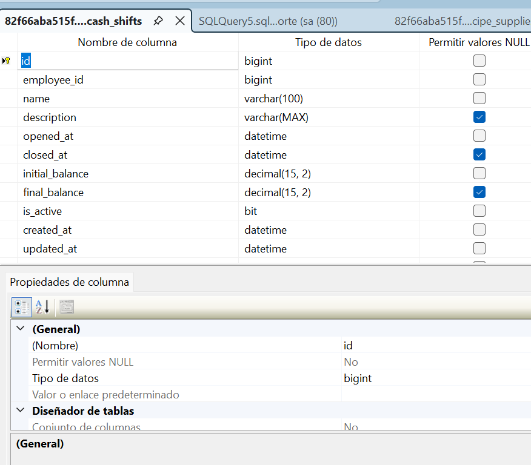

2. **Script SQL generado por SSMS (Generar script de tabla como → CREATE To):**
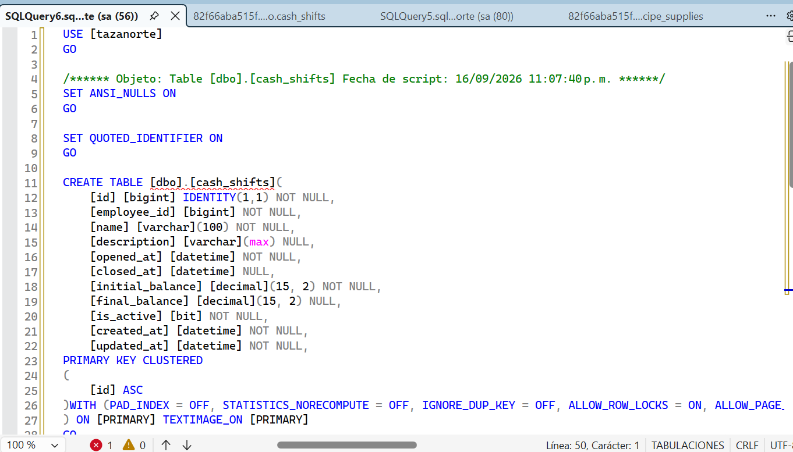

```sql
CREATE TRIGGER trg_cash_shifts_updated_at
ON cash_shifts
AFTER UPDATE
AS
BEGIN
    SET NOCOUNT ON;
    UPDATE cash_shifts
    SET updated_at = GETDATE()
    FROM cash_shifts
    INNER JOIN inserted ON cash_shifts.id = inserted.id;
END;
```

**Resultado:** Tabla `cash_shifts` creada y vinculada visualmente a `employees`.

---

## 5.9 Creación de la tabla orders
Configuración visual de la entidad de comandas y órdenes de venta:
- Clave primaria `id` (`BIGINT`, `IDENTITY(1,1)`).
- Configuración de dos Foreign Keys en el diálogo *Relaciones*:
  - `FK_orders_customers`: `customer_id` -> `customers(id)`
  - `FK_orders_cash_shifts`: `cash_shift_id` -> `cash_shifts(id)`
- Atributos comerciales: `channel` con valor predeterminado `'pos'`, `subtotal` y `total` (`DECIMAL(15,2)`), y `status` con predeterminado `'pending'`.

### Evidencias (imágenes):
1. **Diseño de columnas en SSMS:**
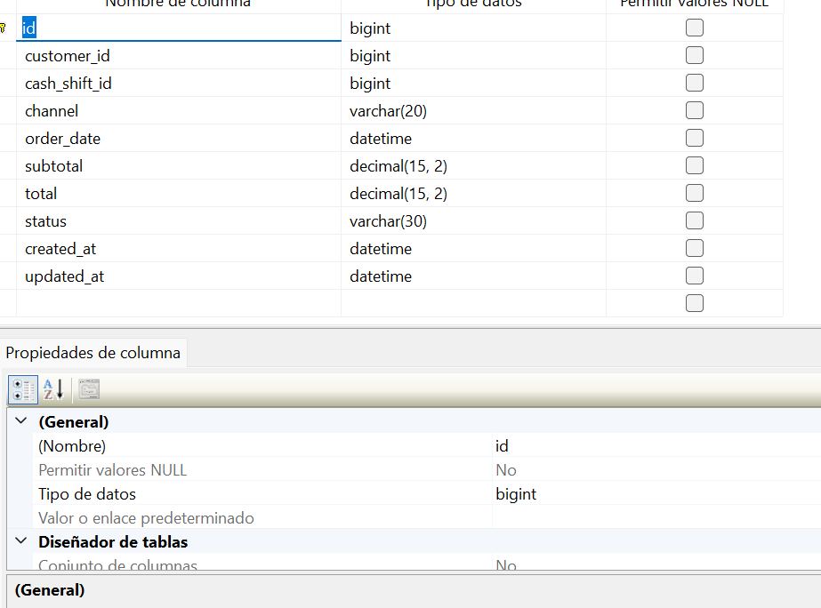

2. **Script SQL generado por SSMS (Generar script de tabla como → CREATE To):**
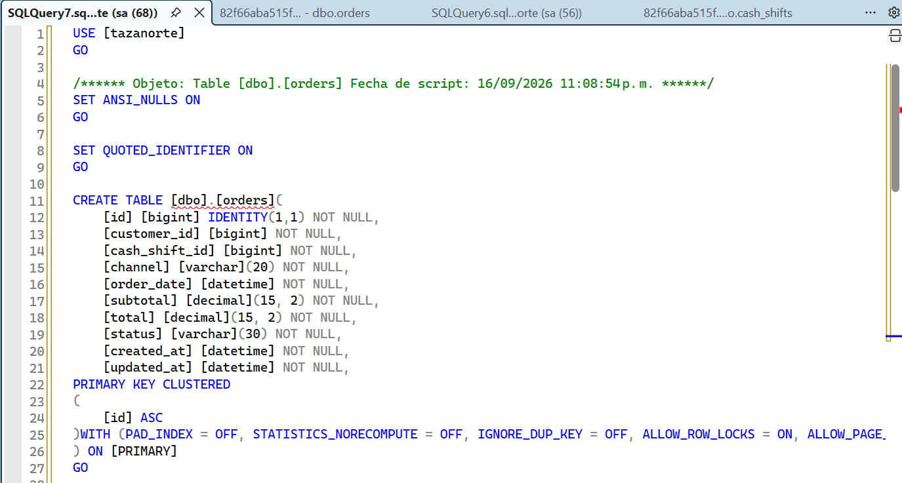

```sql
CREATE TRIGGER trg_orders_updated_at
ON orders
AFTER UPDATE
AS
BEGIN
    SET NOCOUNT ON;
    UPDATE orders
    SET updated_at = GETDATE()
    FROM orders
    INNER JOIN inserted ON orders.id = inserted.id;
END;
```

**Resultado:** Tabla `orders` modelada con sus dos claves foráneas visuales en SSMS.

---

## 5.10 Creación de la tabla order_details
Configuración visual del detalle de comanda (ítems por orden):
- Clave primaria `id` (`BIGINT`, `IDENTITY(1,1)`).
- Configuración de dos Foreign Keys en el diálogo *Relaciones*:
  - `FK_order_details_orders`: `order_id` -> `orders(id)`
  - `FK_order_details_products`: `product_id` -> `products(id)`
- Cantidad `quantity` (`DECIMAL(10,2)`), precio unitario `unit_price` y `subtotal` (`DECIMAL(15,2)`).

### Evidencias (imágenes):
1. **Diseño de columnas en SSMS:**
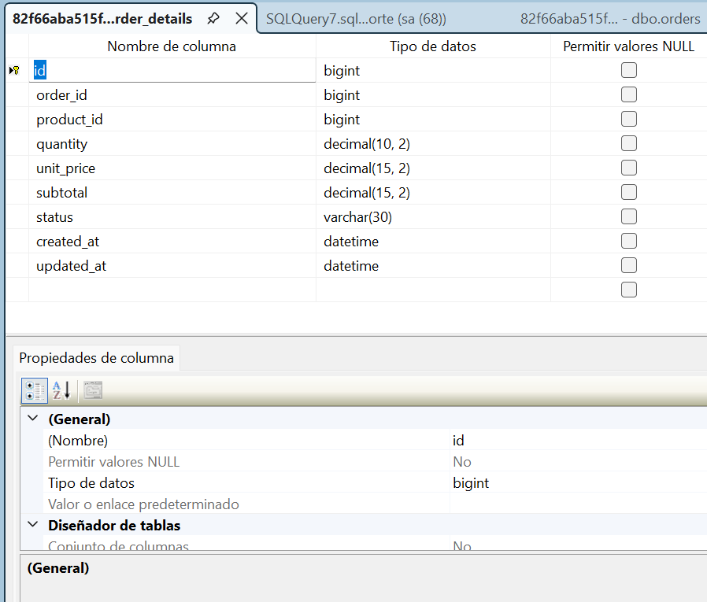

2. **Script SQL generado por SSMS (Generar script de tabla como → CREATE To):**
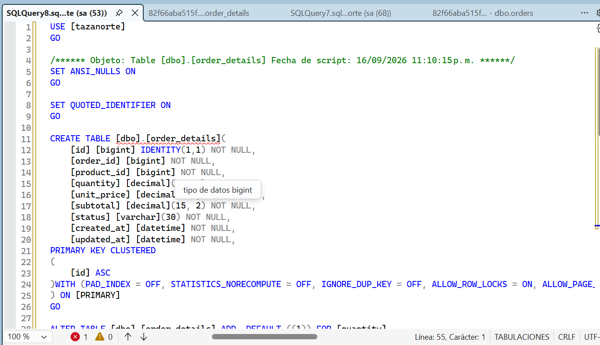

```sql
CREATE TRIGGER trg_order_details_updated_at
ON order_details
AFTER UPDATE
AS
BEGIN
    SET NOCOUNT ON;
    UPDATE order_details
    SET updated_at = GETDATE()
    FROM order_details
    INNER JOIN inserted ON order_details.id = inserted.id;
END;
```

**Resultado:** Tabla de detalle `order_details` vinculada con integridad referencial a órdenes y productos.

---

## 5.11 Creación de la tabla payments
Configuración visual de transacciones y pagos de comanda:
- Clave primaria `id` (`BIGINT`, `IDENTITY(1,1)`).
- Configuración de Foreign Key: `FK_payments_orders` (`order_id` -> `orders(id)`).
- Atributos: `payment_method` con valor predeterminado `'cash'`, `amount` (`DECIMAL(15,2)`), `status` con predeterminado `'completed'`.

### Evidencias (imágenes):
1. **Diseño de columnas en SSMS:**
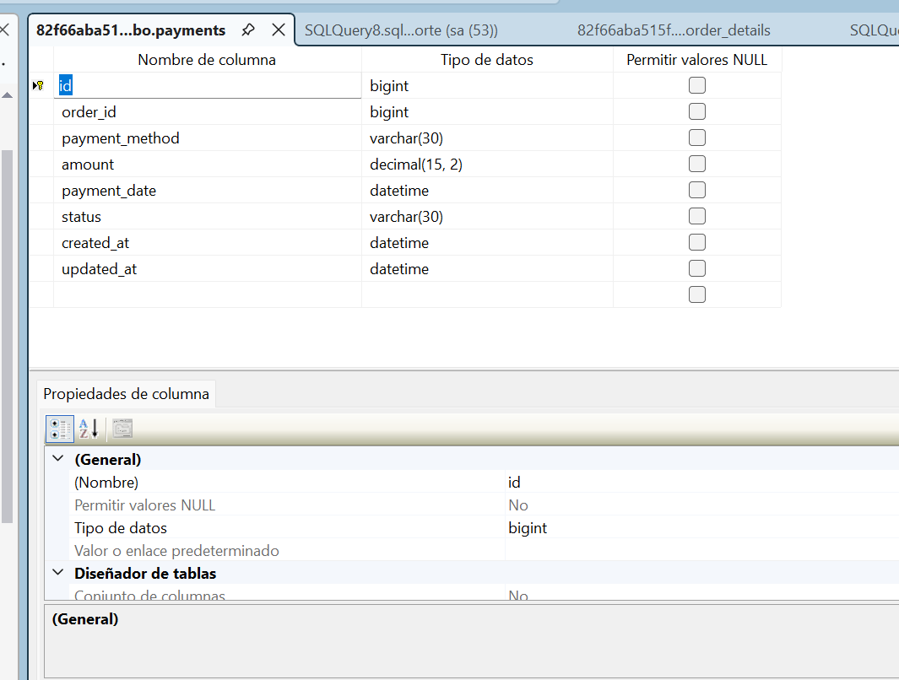

2. **Script SQL generado por SSMS (Generar script de tabla como → CREATE To):**
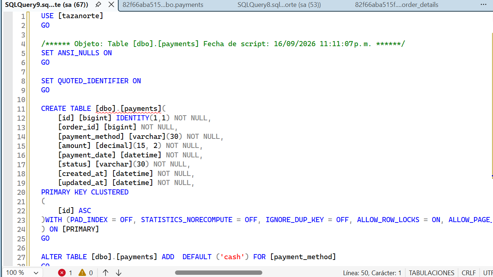

```sql
CREATE TRIGGER trg_payments_updated_at
ON payments
AFTER UPDATE
AS
BEGIN
    SET NOCOUNT ON;
    UPDATE payments
    SET updated_at = GETDATE()
    FROM payments
    INNER JOIN inserted ON payments.id = inserted.id;
END;
```

**Resultado:** Tabla `payments` creada en SSMS.

---

## 5.12 Creación de la tabla point_movements
Configuración visual de transacciones del programa de fidelización:
- Clave primaria `id` (`BIGINT`, `IDENTITY(1,1)`).
- Configuración de Foreign Keys:
  - `FK_point_movements_customers`: `customer_id` -> `customers(id)` (obligatorio).
  - `FK_point_movements_orders`: `order_id` -> `orders(id)` (admite nulos para bonificaciones directas sin comanda asociada).
- Atributos de puntos: `points` de tipo `INT`, `movement_type` y `reference_type`.

### Evidencias (imágenes):
1. **Diseño de columnas en SSMS:**
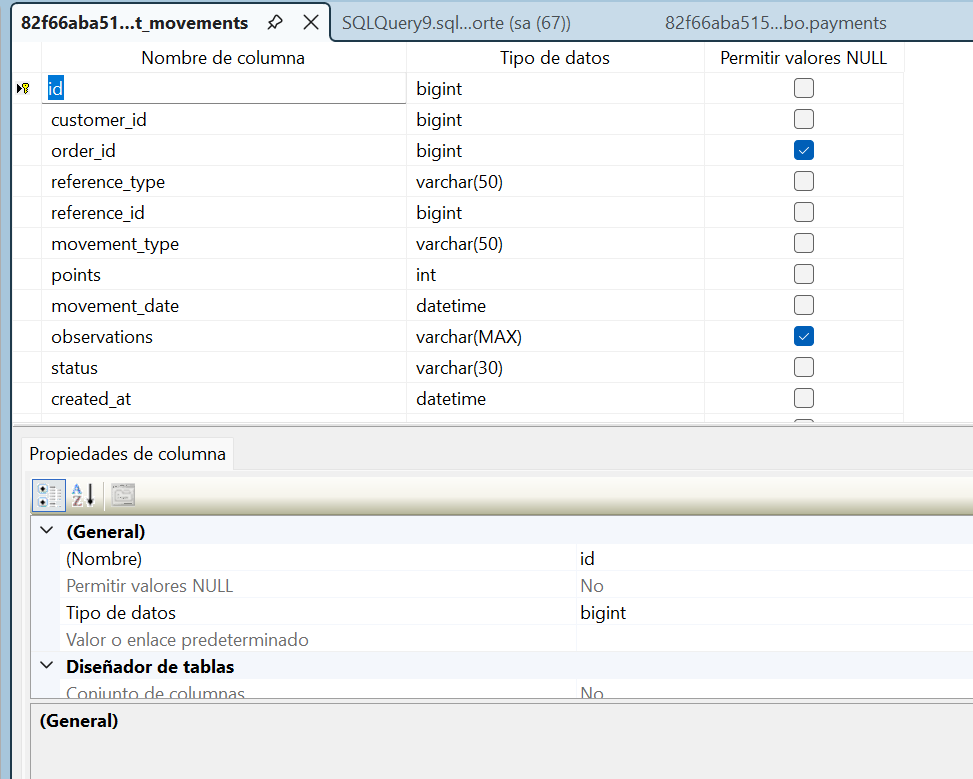

2. **Script SQL generado por SSMS (Generar script de tabla como → CREATE To):**
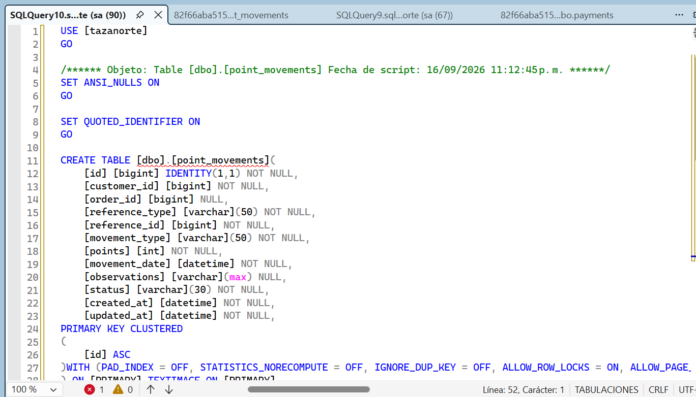

```sql
CREATE TRIGGER trg_point_movements_updated_at
ON point_movements
AFTER UPDATE
AS
BEGIN
    SET NOCOUNT ON;
    UPDATE point_movements
    SET updated_at = GETDATE()
    FROM point_movements
    INNER JOIN inserted ON point_movements.id = inserted.id;
END;
```

**Resultado:** Tabla `point_movements` creada mediante diseñador gráfico en SSMS.

---

## 5.13 Diagrama Relacional ER en SSMS (Database Diagrams)
A través de la funcionalidad nativa *Database Diagrams* de SSMS, se generó el diagrama de entidad-relación que consolida las 10 entidades y la totalidad de sus relaciones de clave foránea.

### Evidencia (imagen):
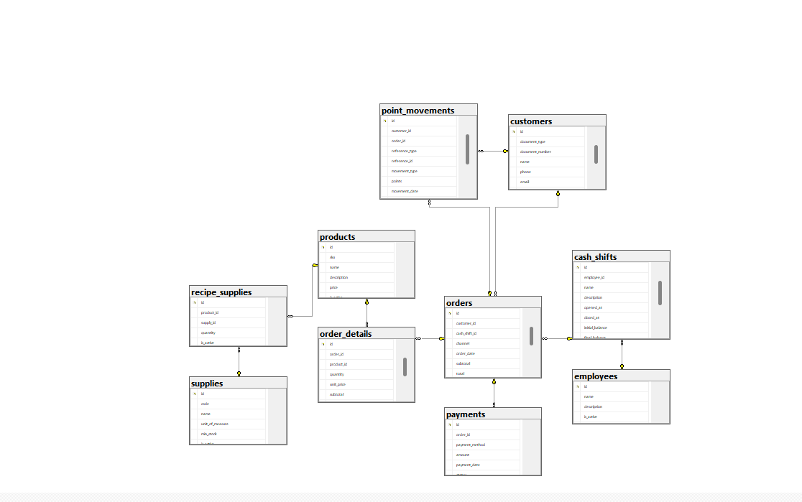

**Resultado:** Diagrama relacional visual generado directamente por SQL Server Management Studio, verificando que la totalidad de relaciones 1:N y N:M se encuentran debidamente construidas y validadas por el motor.

### Conclusión de la Sección 5
La implementación visual en Microsoft SQL Server Management Studio (SSMS) evidenció la capacidad del entorno gráfico de Microsoft para estructurar modelos relacionales complejos sin necesidad de codificar sentencias DDL manuales. Al igual que se constató en MySQL Workbench y pgAdmin 4, las restricciones de integridad y tipos de datos se corresponden fielmente con la arquitectura diseñada, con la excepción técnica documentada de los triggers que requieren ventana de consulta por diseño de la propia herramienta SSMS.
